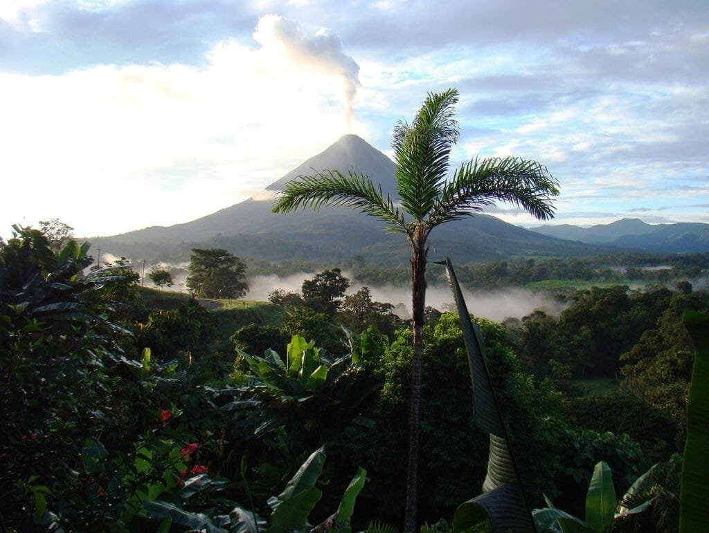
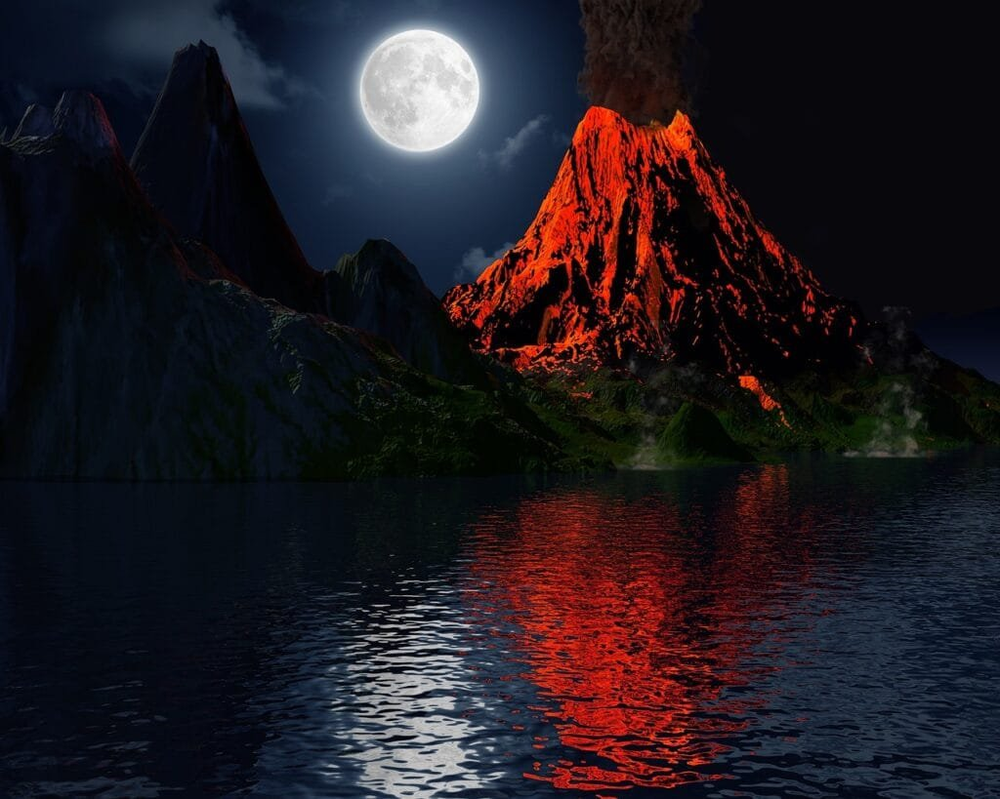

Imagine standing before a volcanic eruption, witnessing the raw power and beauty of nature in its most primal form. As fiery lava flows and billows of ash fill the sky, an awe-inspiring display unfolds before your eyes. But have you ever wondered what causes these awe-inspiring events? In this article, we will delve into the scientific mechanism behind volcanic eruptions, exploring the formation of volcanoes, their geographical distribution, and the factors that influence their eruption patterns. By understanding the inner workings of these fiery giants, we can not only predict future volcanic activity but also take measures to safeguard the communities living in their shadow. So, let's embark on a journey of discovery as we unravel the secrets of volcanic eruptions.

This image is property of pixabay.com.

## Formation of Volcanoes

[Volcanoes are geological](https://magmamatters.com/geothermal-energy-and-its-volcanic-origins/ "Geothermal Energy and Its Volcanic Origins") features that are formed when molten rock, gases, and debris escape to the earth's surface, resulting in eruptions of lava and ash. This process is known as volcanic activity. Molten rock, also known as magma, is formed deep within the earth's mantle. When the pressure within the earth's crust becomes too great, the magma rises towards the surface, causing volcanic eruptions.

Volcanic activity can occur at various locations, including plate boundaries, hotspots, and rift zones. Plate boundaries are areas where the earth's tectonic plates meet or interact with each other. These interactions can result in the formation of volcanoes. Hotspots are areas beneath the earth's crust where the mantle is hotter than usual, causing the magma to rise and form volcanoes. Rift zones, on the other hand, are areas where the earth's tectonic plates are moving apart, creating gaps where magma can flow up and form volcanoes.

## Geographic Distribution of Volcanoes

The 'Ring of Fire' is a prominent area where a significant number of volcanoes are located. This region encircles the Pacific Ocean and is characterized by intense volcanic activity. The 'Ring of Fire' is so named because it is where tectonic plates meet and collide, resulting in frequent volcanic eruptions. Countries such as Japan, the Philippines, and Chile are located in this volcanic zone.

Another notable example of volcanic activity is found in Hawaii. The Hawaiian Islands are formed by shield volcanoes that have developed over hotspots beneath the earth's surface. These volcanoes have a distinctive shape, resembling a shield with gentle slopes. The Hawaiian Islands are famous for their volcanic landscapes and attract numerous visitors each year.

  

## Types of Volcanoes

Volcanoes can be classified into different types based on their characteristics and eruption behavior. One common type is stratovolcanoes, also known as composite volcanoes. These volcanoes are known for their explosive eruptions characterized by the release of ash, gas, and pyroclastic materials. Stratovolcanoes are typically tall and have steep sides. Famous examples of stratovolcanoes include Mount Fuji in Japan and Mount St. Helens in the United States.

Another [type of volcano is the shield](https://magmamatters.com/understanding-volcanic-formation-a-comprehensive-guide/ "Understanding Volcanic Formation: A Comprehensive Guide") volcano. Shield volcanoes have a more gradual slope compared to stratovolcanoes. They are formed by the accumulation of successive lava flows over time, resulting in a shield-like shape. Shield volcanoes are known for their relatively less explosive eruptions and are often found in areas with hotspot activity, such as the Hawaiian Islands.

## Eruption Patterns of Volcanoes

The eruption pattern of a volcano is influenced by several factors, including the viscosity of the lava and the gas content within the magma. Lava viscosity refers to the resistance of lava to flow. If the lava has high viscosity, it is thicker and flows slower, resulting in more explosive eruptions. On the other hand, low-viscosity lava flows more easily and leads to less explosive eruptions.

Gas content within the magma can also impact the eruption pattern. When there is a high concentration of gases dissolved in the magma, the pressure builds up, leading to more explosive eruptions. Gas-rich magma tends to produce violent eruptions with a significant release of ash and pyroclastic materials. In contrast, magma with lower gas content may result in less explosive eruptions, with lava flowing more freely.

This image is property of pixabay.com.

## Causes of Volcanic Eruptions

Volcanic eruptions are primarily caused by two main factors: the movement of tectonic plates and the melting of mantle material into magma. The earth's crust is divided into several large tectonic plates that are constantly moving. When these plates interact, they can create areas of weakness, allowing magma to rise to the surface and causing volcanic eruptions. This is commonly observed at plate boundaries, where tectonic plates collide or separate.

The melting of material in the earth's mantle can also contribute to volcanic eruptions. The earth's mantle is a layer beneath the crust that consists of hot and semi-fluid rock. When this material melts, it forms magma, which can rise to the surface through cracks and fissures in the crust, resulting in volcanic activity.

## Hazards of Volcanic Eruptions

Volcanic eruptions can pose various hazards to both the environment and human populations. One significant hazard is the release of poisonous gases during eruptions. These gases, such as sulfur dioxide and hydrogen sulfide, can be harmful to both humans and animals, causing respiratory problems and other health issues.

Fires are also a common hazard associated with volcanic eruptions. The hot lava and ash expelled during eruptions can ignite vegetation and other flammable materials, leading to wildfires. These fires can spread rapidly and cause extensive damage to surrounding areas.

In some cases, undersea volcanic eruptions can trigger tsunamis. When an eruption occurs beneath the ocean's surface, it can displace a large volume of water, resulting in a series of powerful waves that can cause widespread devastation along coastlines.

This image is property of pixabay.com.

## Benefits of Volcanic Eruptions

While volcanic eruptions can be destructive, they also play an essential role in contributing to the Earth's ecosystem. One of the benefits of volcanic eruptions is the provision of nutrients to the soil. When volcanoes erupt, they release minerals and nutrients that enrich the surrounding land, making it highly fertile. This can lead to the growth of lush vegetation and support diverse ecosystems.

Volcanic eruptions also contribute to the creation of new land. When lava flows during eruptions, it cools and solidifies, forming new land masses. Over time, these volcanic landforms can become habitats for various plant and animal species, contributing to biodiversity.

## Monitoring and Predicting Volcanic Activity

Monitoring and predicting volcanic activity are crucial for understanding and mitigating the risks associated with volcanic eruptions. Scientists employ various techniques to monitor volcanoes and gather data on their behavior.

[Seismic activity](https://magmamatters.com/the-art-and-science-of-volcano-monitoring/ "The Art and Science of Volcano Monitoring") monitoring involves the use of seismometers to detect and record earthquakes that occur beneath volcanoes. This data provides valuable information about magma movement and the potential for volcanic eruptions.

Gas emissions tracking involves analyzing the composition of gases released by volcanoes. By studying the types and quantities of gases emitted, scientists can gain insights into the behavior and activity of the volcano.

Ground deformation measurements are another method used to monitor volcanoes. This technique involves using instruments such as GPS receivers or satellite imagery to detect changes in the shape or elevation of the volcano. These measurements can indicate the presence of magma movement beneath the surface and help predict possible eruption scenarios.

## Mitigation of Volcanic Risks

To mitigate the risks associated with volcanic eruptions, communities living near active volcanoes must have well-designed evacuation plans in place. These plans ensure that residents can be safely evacuated in the event of an eruption, minimizing the potential loss of life.

Risk assessment and communication strategies are also essential in mitigating volcanic risks. Scientists and government authorities work together to assess the potential hazards posed by a volcanic eruption and develop strategies to communicate these risks to the public effectively. This includes educating communities about the signs and signals of volcanic activity and establishing early warning systems to alert residents in a timely manner.

## Future Research on Volcanoes

As scientists continue to study volcanoes, there are several areas of future research that hold great importance. One such area is the study of ancient volcanic eruptions. By analyzing the geological record, scientists can gain insights into past eruptions and better understand their characteristics and impact. This knowledge can contribute to more accurate predictions of future volcanic behavior.

Another area of research is focused on predicting long-term volcanic behavior. Volcanoes exhibit a range of eruptive patterns, from quiet periods to more active phases. Understanding the underlying mechanisms that drive these patterns can help scientists predict how volcanoes will behave in the future and provide valuable information for risk assessment and mitigation strategies.

In conclusion, decoding the scientific mechanism of volcanic eruptions is essential for understanding the formation, geographic distribution, eruption patterns, causes, hazards, and benefits associated with volcanoes. Through ongoing research, monitoring, and risk assessment, scientists can work towards predicting volcanic activity and developing strategies to mitigate the risks posed by these powerful natural phenomena.

Related Posts: [Mitigating Risks: Forecasting Volcanic Activity in Prone Areas](https://magmamatters.com/mitigating-risks-forecasting-volcanic-activity-in-prone-areas/), [The Formation and Eruption Patterns of Volcanoes](https://magmamatters.com/the-formation-and-eruption-patterns-of-volcanoes-4/), [The Pyroclastic Phenomena of Pompeii: 7 Insights to Explore](https://magmamatters.com/the-pyroclastic-phenomena-of-pompeii-7-insights-to-explore/), [Tips for Capturing Volcano Pyroclastic Flow Photos](https://magmamatters.com/tips-for-capturing-volcano-pyroclastic-flow-photos/), [Understanding Volcanoes and Their Eruption Patterns](https://magmamatters.com/understanding-volcanoes-and-their-eruption-patterns/)

Related Posts: [Mitigating Risks: Forecasting Volcanic Activity in Prone Areas](https://magmamatters.com/mitigating-risks-forecasting-volcanic-activity-in-prone-areas/), [The Formation and Eruption Patterns of Volcanoes](https://magmamatters.com/the-formation-and-eruption-patterns-of-volcanoes-4/), [The Pyroclastic Phenomena of Pompeii: 7 Insights to Explore](https://magmamatters.com/the-pyroclastic-phenomena-of-pompeii-7-insights-to-explore/), [Tips for Capturing Volcano Pyroclastic Flow Photos](https://magmamatters.com/tips-for-capturing-volcano-pyroclastic-flow-photos/), [Understanding Volcanoes and Their Eruption Patterns](https://magmamatters.com/understanding-volcanoes-and-their-eruption-patterns/)
