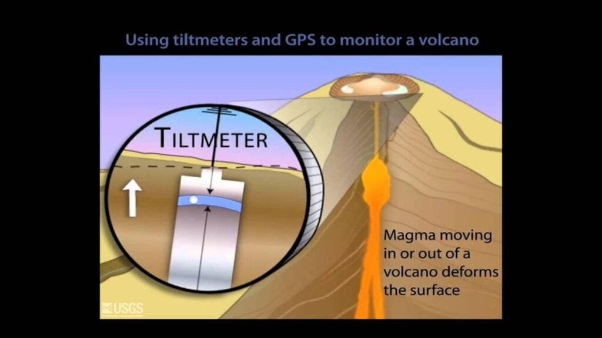

Imagine standing at the edge of a vast landscape, the air thick with anticipation. Before you lies a majestic and unpredictable force of nature - a volcano. Volcanoes, with their fiery eruptions and towering plumes of ash, have long captivated our imaginations. But beyond their awe-inspiring beauty, these geological wonders can also pose serious risks to human life and the surrounding environment. That is why understanding the techniques of volcano monitoring is crucial. By closely observing and analyzing volcanic activity, scientists can not only better predict potential eruptions but also work towards mitigating the devastating effects they can have on communities. This article aims to explore the various methods used in volcano monitoring, shedding light on the fascinating world of volcanic research and the invaluable insights it provides.

This image is property of d9-wret.s3.us-west-2.amazonaws.com.

## Basics of Volcano Monitoring

### Definition of volcano monitoring

Volcano monitoring refers to the systematic observation and analysis of volcanic activity in order to understand and predict volcanic behavior. It involves the collection of data using various techniques and instruments to [monitor changes in seismic activity](https://magmamatters.com/the-art-and-science-of-volcano-monitoring/ "The Art and Science of Volcano Monitoring"), gas emissions, ground deformation, and other parameters associated with volcanic activity.

### Importance of volcano monitoring

Volcano monitoring plays a crucial role in mitigating the risks associated with volcanic eruptions. By monitoring changes in volcanic activity, scientists can provide early warnings, allowing for the evacuation and safety of nearby communities. Additionally, monitoring helps in understanding the underlying processes of volcanic eruptions, enabling scientists to make predictions about future eruptions and their potential impacts. This knowledge is vital for developing effective volcano hazard maps, evacuation plans, and emergency response strategies.

### Challenges in volcano monitoring

Monitoring volcanoes can be a complex task due to various challenges. Volcanoes are often located in remote or inaccessible areas, making it difficult to install and maintain monitoring equipment. Additionally, different types of volcanoes exhibit unique behaviors, requiring specialized monitoring techniques. Volcanic eruptions can also be sporadic and unpredictable, making it challenging to capture and interpret data accurately. Despite these challenges, advancements in technology and the collaboration of volcanic monitoring networks worldwide have significantly improved our ability to monitor and understand volcanic activity.

## Geographic Distribution of Volcanoes and Monitoring Techniques

### Global distribution of volcanoes

Volcanoes are not uniformly distributed around the world but are concentrated in specific regions. The "Ring of Fire" in the Pacific Ocean is one of the most volcanically active areas, characterized by a series of volcanic arcs and oceanic trenches. Other volcanic regions include rift zones, such as the East African Rift, and hotspot regions, like the Hawaiian Islands. Monitoring techniques employed in these regions vary depending on the specific volcanic hazards and the resources available.

### Localizing monitoring efforts

While global volcano monitoring networks exist, it is essential to focus monitoring efforts on specific regions to gather more detailed data. Localizing monitoring efforts allows scientists to understand the unique characteristics and behavior of individual volcanoes. This includes deploying various monitoring techniques specific to the [type of volcano](https://magmamatters.com/understanding-volcanic-formation-a-comprehensive-guide/ "Understanding Volcanic Formation: A Comprehensive Guide") present and tailoring data collection to the local volcanic hazards and risk assessments.

### Case studies of specific regions

Case studies of specific regions highlight the importance of localized volcano monitoring. For example, the monitoring efforts at Mount St. Helens in the United States utilized a combination of seismic monitoring, gas monitoring, and ground deformation measurements to predict the volcano's eruption in 1980. Similarly, in the Philippines, the monitoring network surrounding Mount Mayon relies on remote sensing techniques and real-time monitoring to assess the volcano's hazards and inform evacuation plans.

<iframe width="560" height="315" src="https://www.youtube.com/embed/t3Bm_xUgFms" frameborder="0" allow="accelerometer; autoplay; encrypted-media; gyroscope; picture-in-picture" allowfullscreen></iframe>

  

## Types of Volcanoes and Appropriate Monitoring

### Stratovolcanoes

Stratovolcanoes, also known as composite volcanoes, are characterized by steep slopes and layers of hardened lava, ash, and pyroclastic materials. Monitoring stratovolcanoes requires a combination of techniques to assess seismic activity, gas emissions, and ground deformation. Seismic monitoring plays a crucial role in detecting volcanic tremors and earthquakes associated with magma movement within the volcano.

### Shield volcanoes

Shield volcanoes have broad, gently sloping sides and are formed by the effusion of highly fluid lava. Monitoring shield volcanoes focuses on detecting changes in volcanic gas emissions, as these volcanoes tend to have lower levels of explosive activity compared to stratovolcanoes. Gas monitoring techniques, such as gas sampling and remote sensing, are used to measure the composition and volume of gases being released.

### Cinder cone volcanoes

[Cinder cone](https://magmamatters.com/the-birth-of-new-land-understanding-cinder-cones/) volcanoes are small, steep-sided volcanoes formed by the accumulation of volcanic fragments ejected during explosive eruptions. Monitoring cinder cone volcanoes primarily involves visual observations, satellite imagery, and thermal monitoring to detect changes in eruptive activity and identify potential hazards.

### Lava domes

Lava domes are formed by the slow extrusion of highly viscous lava. Monitoring lava domes requires a combination of ground deformation measurements, gas monitoring, and thermal imaging. These techniques help scientists track the growth of the dome, detect potential gas emissions, and assess the risk of dome collapse and associated pyroclastic flows.

### Monitoring requirements for different types

Each type of volcano requires a tailored monitoring approach based on its specific characteristics and eruptive behavior. By understanding the unique requirements of different volcano types, scientists can effectively monitor and interpret volcanic activity, providing valuable insights into potential hazards and risks.

## Seismic Monitoring

### Purpose of seismic monitoring

Seismic monitoring is one of the most commonly used techniques in volcano monitoring. It involves measuring and analyzing the vibrations caused by volcanic activity, such as volcanic tremors and earthquakes. Seismic data provides essential information about the movement of magma beneath the volcano and can help in predicting eruptions.

### Methods and equipment used in seismic monitoring

Seismic monitoring relies on a network of seismometers strategically placed around a volcano. These seismometers record ground vibrations and transmit the data to monitoring centers for analysis. Common seismic monitoring techniques include earthquake detection, volcanic tremor analysis, and the measurement of ground vibrations using various types of seismometers.

### Interpreting seismic data

Interpreting seismic data involves analyzing the frequency, amplitude, and duration of recorded ground vibrations. Volcanic tremors and earthquakes often exhibit distinct patterns that can provide insights into volcanic activity. Changes in seismic activity, such as an increase in the frequency and intensity of earthquakes or the occurrence of harmonic tremors, may indicate an impending eruption.

This image is property of www.nps.gov.

## Gas Monitoring

### Types of volcanic gases

Volcanoes release various gases during eruptions, including water vapor, carbon dioxide, sulfur dioxide, hydrogen sulfide, and hydrogen chloride. These gases provide important clues about volcanic activity and can pose significant hazards to human health and the environment. Gas monitoring aims to measure, analyze, and interpret the composition and volume of volcanic gases.

### Methods and equipment used in gas monitoring

Gas monitoring techniques include direct sampling of volcanic gases, remote sensing using spectroscopic instruments, and in situ measurements using gas analyzers. Direct sampling involves capturing gases emitted from volcanic vents and analyzing their chemical composition in the lab. Remote sensing techniques, such as Fourier Transform Infrared Spectroscopy (FTIR), measure the absorption of infrared radiation by volcanic gases to determine their concentrations.

### Interpreting gas data

Interpreting gas data requires understanding the relationship between gas emissions and volcanic activity. Changes in gas composition or an increase in gas emissions can indicate an increase in volcanic unrest. For example, an increase in sulfur dioxide emissions may signal the rise of magma towards the surface. Gas monitoring data, combined with other monitoring techniques, helps scientists assess the ongoing volcanic activity and make predictions about potential eruptions.

## Ground Deformation Monitoring

### Methods and equipment used in ground deformation monitoring

Ground deformation monitoring involves measuring changes in the shape and elevation of the ground surface around a volcano. Techniques include Global Navigation Satellite System (GNSS) surveys, Interferometric Synthetic Aperture Radar (InSAR) imaging, and ground-based surveying methods. These methods allow scientists to detect subtle changes in the volcano's shape and understand the movement of magma beneath the surface.

### Relevance of ground deformation to volcanic activity

Ground deformation provides critical insights into the dynamics of a volcano, as it reflects the movement and accumulation of magma in subterranean reservoirs. By monitoring changes in ground deformation, scientists can infer the behavior of magma beneath the volcano and assess the likelihood of an eruption. Ground deformation data, combined with other monitoring data, helps to refine eruption forecasting models and inform risk assessments.

### Interpreting ground deformation data

Interpreting ground deformation data involves analyzing changes in the volcano's shape, including inflation, deflation, or lateral displacement of specific areas. These changes can be indicative of magma movement and the formation of magma reservoirs underground. By monitoring ground deformation over time, scientists can track the evolution of volcanic activity and better understand the associated hazards.

This image is property of d9-wret.s3.us-west-2.amazonaws.com.

## Satellite Monitoring

### Utilization of satellites in volcano monitoring

Satellite monitoring provides a valuable tool for monitoring volcanoes from space. Satellites equipped with different sensors and imaging capabilities enable scientists to observe and measure various parameters associated with volcanic activity, including gas emissions, thermal anomalies, and changes in ground deformation. Satellite monitoring helps in obtaining broader coverage and monitoring remote or inaccessible volcanic regions.

### Advantages and limitations of satellite monitoring

Satellite monitoring offers several advantages in volcano monitoring. It allows for the continuous and remote monitoring of volcanoes, providing near-real-time data. Satellites can capture large-scale changes in volcanic activity, such as the detection of thermal anomalies indicative of the onset of an eruption. However, satellite monitoring has limitations, including limited spatial and temporal resolutions, susceptibility to atmospheric interference, and dependence on clear weather conditions.

### Case studies of satellite monitoring

Satellite monitoring has been instrumental in studying and monitoring volcanoes worldwide. For example, the eruption of Mount Pinatubo in 1991 was closely monitored using satellite imagery, which helped in predicting the eruption. Similarly, satellites have been used to monitor volcanic activity in Iceland, providing valuable data on ash plumes, ground deformation, and lava flow movements.

## Hydrologic Monitoring

### Understanding the interaction between volcanoes and water systems

Hydrologic monitoring focuses on studying the interactions between volcanoes and water systems, including surface water, groundwater, and hydrothermal systems. Volcanoes can influence the hydrological cycle by changing surface water flows, causing groundwater contamination, and generating geothermal features such as hot springs. Understanding these interactions is crucial for assessing volcanic hazards and managing water resources in volcanic regions.

### Methods and equipment used in hydrologic monitoring

Hydrologic monitoring techniques include measuring water chemistry, temperature, flow rates, and pressure in rivers, streams, wells, and springs. Instruments such as water samplers, flow meters, and dataloggers are used to collect data. Remote sensing, including thermal imaging, can also provide insights into the distribution of thermal anomalies associated with volcanic activity.

### Interpreting hydrologic data

Interpreting hydrologic data involves analyzing changes in water chemistry, flow rates, and temperature in relation to volcanic activity. Increases in temperature or changes in water chemistry can indicate the presence of volcanic gases or hydrothermal activity. Hydrologic data, combined with other monitoring techniques, helps scientists understand the hydrological changes induced by volcanic activity and assess associated hazards, such as lahars (mudflows) and flooding.

This image is property of www.frontiersin.org.

## Implementing Comprehensive Monitoring Systems

### Combining multiple monitoring techniques

Comprehensive volcano monitoring systems employ multiple techniques to gather a wide range of data. By combining seismic, gas, ground deformation, satellite, and hydrologic monitoring techniques, scientists can obtain a more complete understanding of volcanic activity. This multi-parameter approach allows for better predictions of eruptions, as each technique provides unique insights into different aspects of volcanic behavior.

### Optimization of comprehensive system

Optimizing a comprehensive volcano monitoring system involves selecting the most appropriate techniques and instruments based on the specific characteristics of a volcano. Factors such as the volcano's type, location, eruption history, and associated hazards influence the choice of monitoring techniques. Additionally, the integration of real-time data transmission, data analysis algorithms, and decision support systems enhances the effectiveness of comprehensive monitoring systems.

### Case studies of comprehensive monitoring systems

Several volcanoes around the world are monitored using comprehensive monitoring systems. For instance, the monitoring system at Mount Etna in Italy integrates seismic, gas, ground deformation, and satellite monitoring to provide early warnings and improve eruption forecasting. The monitoring system at Mount Merapi in Indonesia combines multiple techniques and has proven successful in predicting eruptions and ensuring timely evacuations.

## Role of Monitoring in Volcano Risk Management

### Predicting eruptions through monitoring

The primary goal of volcano monitoring is to predict and forecast volcanic eruptions to minimize the risks to human lives and infrastructure. By continuously monitoring volcanic activity and analyzing data from multiple sources, scientists can identify patterns, precursors, and indicators of imminent eruptions. Timely predictions enable authorities to issue alerts and implement evacuation plans, saving lives and mitigating the impact of eruptions.

### Evacuation and disaster management

Volcano monitoring plays a crucial role in evacuation and disaster management efforts. Early warnings based on monitoring data allow for the safe evacuation of populations residing in areas at high risk of volcanic hazards, such as pyroclastic flows, lahars, and ashfall. Monitoring also provides valuable information for emergency responders, enabling them to allocate resources, plan for post-eruption recovery, and mitigate the social and economic impacts of volcanic eruptions.

### Role of monitoring in long-term risk reduction strategies

Monitoring volcanoes helps in developing long-term risk reduction strategies. By analyzing historical data, monitoring ongoing volcanic activity, and improving eruption forecasting models, scientists can refine hazard assessments and develop more accurate volcano hazard maps. This information is vital for land-use planning, infrastructure development, and the implementation of risk reduction measures in volcanic areas. Volcano monitoring also plays a crucial role in scientific research and the advancement of our understanding of volcanic processes.

In conclusion, volcano monitoring is a multidisciplinary and comprehensive approach aimed at understanding, predicting, and managing volcanic activity. By combining various techniques such as seismic monitoring, gas monitoring, ground deformation monitoring, satellite monitoring, hydrologic monitoring, and integrating data from these techniques, scientists can gain valuable insights into volcanic behavior. Volcano monitoring plays a critical role in volcano risk management, enabling early warnings, evacuation planning, and long-term mitigation strategies. Continued advancements in monitoring technology and international collaboration will further improve our ability to monitor and reduce the risks associated with volcanic eruptions.

