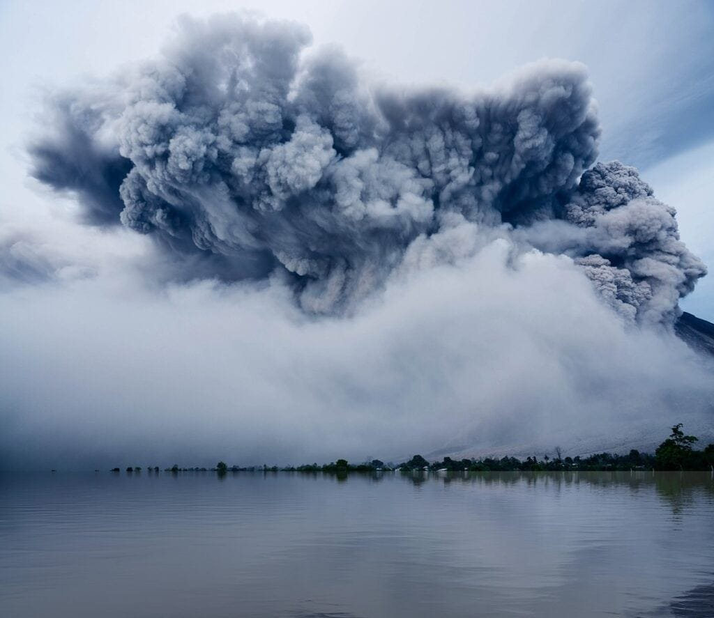
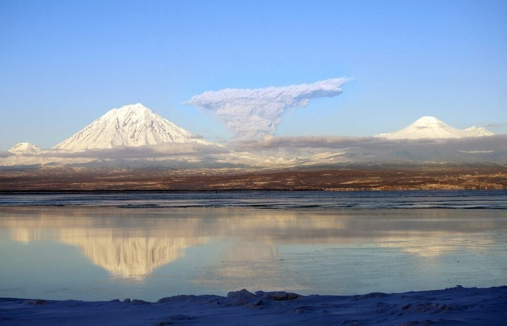

Have you ever wondered about the types and patterns of volcanic eruptions? Volcanoes are intriguing natural phenomena that can have both destructive and beneficial impacts on our planet. From the explosive eruptions in the "Ring of Fire" to the gradual formation of shield volcanoes in Hawaii, volcanoes offer a diverse range of eruption patterns. By understanding the causes and hazards associated with volcanic activity, we can better predict future eruptions and safeguard communities. In this article, we will explore the different types of volcanoes, their geographic distribution, eruption causes, hazards, and benefits. So, get ready to delve into the fascinating world of volcanic eruptions and gain a deeper understanding of these powerful forces of nature.

This image is property of pixabay.com.

## Types of Volcanoes

### Cinder Cone Volcanoes

[Cinder cone](https://magmamatters.com/the-birth-of-new-land-understanding-cinder-cones/) volcanoes are small, steep-sided volcanoes that are often characterized by their symmetrical shape. They are formed from explosive eruptions that eject fragments of lava, called cinders, into the air. These cinders then fall back to the ground and pile up around the vent, creating the cone-shaped structure. Cinder cone [volcanoes](https://magmamatters.com/understanding-volcanic-formation-a-comprehensive-guide/ "Understanding Volcanic Formation: A Comprehensive Guide") are typically found in clusters and are relatively short-lived compared to other types of volcanoes.

### Composite Volcanoes

Composite volcanoes, also known as stratovolcanoes, are tall, cone-shaped mountains that are built up over time by alternating eruptions of lava and ash. They are formed when sticky, viscous lava flows slowly down the sides of the volcano, allowing for the accumulation of layers of lava and pyroclastic material. These volcanoes are known for their explosive eruptions and can have steep slopes. Some examples of composite volcanoes include Mount Fuji in Japan and Mount St. Helens in the United States.

### Shield Volcanoes

Shield volcanoes are large, broad volcanoes with gentle slopes that resemble a warrior's shield lying on the ground. They are formed by eruptions of low-viscosity lava that flows easily and spreads out in thin layers over a large area. These lava flows can travel long distances before cooling and solidifying, creating the gradual, shield-like shape. Shield volcanoes are often associated with hotspot activity, such as the volcanoes in the Hawaiian Islands.

### Lava Dome Volcanoes

Lava dome volcanoes, also known as volcanic domes, are formed when thick, sticky lava is erupted from a volcano and piles up around the vent. Unlike other types of volcanoes, lava dome volcanoes do not have a distinct cone shape. Instead, they often form bulbous or mound-like structures. These volcanoes are known for their slow and steady eruptions, which can result in the buildup of a solid dome of lava. Lava dome volcanoes can be found in various volcanic regions around the world.

## Geographic Distribution of Volcanoes

### Volcanoes along Tectonic Plate Boundaries

Many volcanoes are located along tectonic plate boundaries, where the earth's lithospheric plates meet. There are three main types of plate boundaries: divergent boundaries, convergent boundaries, and transform boundaries. Divergent boundaries, such as the Mid-Atlantic Ridge, are where plates are moving apart, creating rift zones and volcanic activity. Convergent boundaries, such as the subduction zones around the Pacific Ocean, are where plates are colliding, leading to the formation of composite volcanoes. Transform boundaries, such as the San Andreas Fault in California, are where plates are sliding past each other, and while they don't typically produce volcanoes, they can still experience volcanic activity.

### Volcanoes in the 'Ring of Fire'

The "Ring of Fire" is a major area in the basin of the Pacific Ocean where a large number of earthquakes and volcanic eruptions occur. It is called the "Ring of Fire" because it forms a horseshoe shape around the Pacific Ocean. This region is characterized by the presence of several tectonic plate boundaries and subduction zones, making it highly prone to volcanic activity. The "Ring of Fire" includes countries such as Japan, the Philippines, Indonesia, Chile, and the western coast of the United States.

### Volcanoes atop Hotspots under Earth's Crust

Hotspots are areas of intense volcanic activity that are not located along tectonic plate boundaries. Instead, they are believed to be caused by plumes of hot mantle material that rise from deep within the Earth. As the mantle material reaches the Earth's crust, it creates a hotspot where magma can erupt to the surface, forming volcanoes. One well-known example of a hotspot is the Hawaiian Islands, which are formed by a hotspot beneath the Pacific Ocean.

### Volcanoes in Rift Zones

Rift zones are regions where the Earth's lithospheric plates are moving apart, creating a gap or rift in the Earth's crust. These rift zones can be associated with volcanic activity, as the separation of the plates allows magma from the mantle to rise to the surface and form volcanoes. One example of a rift zone is the East African Rift, which stretches from Mozambique to the Red Sea and is home to several volcanoes, including Mount Kilimanjaro and Mount Nyiragongo.

This image is property of pixabay.com.

## Formation of Volcanoes

### Molten Rock Movement

Volcanoes are formed when molten rock, called magma, rises to the Earth's surface. The movement of magma is driven by factors such as heat, pressure, and the presence of volatile gases. As the magma rises, it can accumulate in chambers beneath the Earth's surface, eventually making its way to the surface through vents and cracks in the Earth's crust. The exact mechanisms of magma movement are complex and can vary depending on the type of volcano and the tectonic setting.

### Escape of Gases and Debris

When a volcano erupts, not only does magma reach the surface, but gases and debris are also released. These gases, such as water vapor, carbon dioxide, and sulfur dioxide, are dissolved in the magma at high pressures and temperatures. As the magma rises and reaches lower pressures near the surface, the gases come out of solution and expand rapidly, causing explosive eruptions. The debris, which includes rock fragments, ash, and pumice, is also ejected during eruptions and can travel great distances.

### Plate Convergence and Divergence

Plate convergence and divergence play a significant role in the formation of volcanoes. When two tectonic plates collide at a convergent boundary, one plate can be forced beneath the other in a process called subduction. This subduction of one plate beneath another can create conditions for the formation of composite volcanoes, as the subducting plate carries water and other volatiles down into the mantle, triggering melting and volcanic activity. On the other hand, when plates diverge at a divergent boundary, such as in a rift zone, magma can rise to the surface and form volcanoes as the plates move apart.

## Eruption Triggers

### Seismic Activity

Seismic activity, which refers to the shaking and movement of the Earth's crust, can be an important trigger for volcanic eruptions. Volcanoes are often located in seismically active regions, where tectonic movements and pressure changes can cause the release of magma. Earthquakes, which result from the movement of tectonic plates, can induce stress changes in the Earth's crust, potentially leading to the movement of magma and volcanic eruptions. [Monitoring seismic activity around volcanoes](https://magmamatters.com/the-art-and-science-of-volcano-monitoring/ "The Art and Science of Volcano Monitoring") can provide valuable insights into their behavior and help predict future eruptions.

### Pressure Build-up

Pressure build-up within a volcano is another trigger for eruptions. As magma accumulates in a magma chamber beneath the surface, the pressure within the chamber increases. This pressure can eventually overcome the confining strength of the surrounding rocks, causing an explosive release of magma, gases, and volcanic debris. The factors that contribute to pressure build-up include the rate of magma supply, the viscosity of the magma, and the presence of volatile gases. Changes in these factors can lead to variations in eruption style and intensity.

### Tectonic Movements

Tectonic movements, such as plate convergence and divergence, can also trigger volcanic eruptions. These movements can create conditions that allow magma to rise to the surface, either through subduction zones or by creating rift zones. When tectonic forces cause plates to collide, the subduction of one plate beneath another can lead to the formation of composite volcanoes. Conversely, when plates move apart, magma can rise to the surface and form volcanoes in rift zones. The timing and intensity of volcanic eruptions can be influenced by the ongoing tectonic movements in a given region.

This image is property of pixabay.com.

## Patterns of Eruptions

### Effusive Eruptions

Effusive eruptions are characterized by the relatively gentle flow of lava from a volcano. This type of eruption occurs when low-viscosity magma, such as basaltic lava, reaches the surface and flows downhill. Effusive eruptions are often associated with shield volcanoes and can result in the gradual expansion of the volcano's cone over time. The lava flows during effusive eruptions can extend for many kilometers and can be relatively slow-moving, allowing people to evacuate and minimize the risk of harm.

### Explosive Eruptions

Explosive eruptions are characterized by the violent ejection of volcanic debris and gases from a volcano. This type of eruption occurs when high-viscosity magma, such as andesitic or rhyolitic lava, traps gases within it, creating pressure that eventually leads to explosive release. The explosion can propel ash, rock fragments, and pyroclastic flows into the air, reaching high altitudes and potentially covering large areas with ash fallout. Explosive eruptions can be highly dangerous, posing risks to human health, infrastructure, and the environment.

### Phreatomagmatic Eruptions

Phreatomagmatic eruptions occur when magma interacts with water, either from groundwater or bodies of water, producing explosive activity. The water rapidly heats up and turns into steam, creating pressure that causes the eruption. These eruptions can be particularly violent and are often associated with volcanic features such as maar craters and tuff rings. Phreatomagmatic eruptions can result in the formation of ash clouds, pyroclastic flows, and lahars (mudflows) that can pose significant hazards to nearby communities.

### Phreatic Eruptions

Phreatic eruptions, also known as steam-driven eruptions, occur when groundwater or surface water comes into contact with hot volcanic materials, such as lava or pyroclastic deposits. The intense heat causes the water to flash into steam, resulting in explosive activity. Phreatic eruptions can produce ash clouds, steam explosions, and volcanic mudflows known as lahars. These eruptions can be sudden and unpredictable, posing risks to people in the vicinity of the volcano. Monitoring for signs of increased steam and water activity can help detect and prepare for potential phreatic eruptions.

## Characteristics of Lava in Different Eruptions

### Mafic Lava

Mafic lava, also known as basaltic lava, is characterized by its low viscosity and high fluidity. It is rich in iron and magnesium, giving it a dark color. Mafic lava tends to flow easily and can travel long distances before cooling and solidifying. This type of lava is associated with effusive eruptions and shield volcanoes, which have gentle slopes and gradually expand over time. Mafic lava flows can create new land and contribute to the fertility of the surrounding soil.

### Intermediate Lava

Intermediate lava, also known as andesitic lava, has a moderate viscosity and flows less easily than mafic lava. It is intermediate in composition between mafic lava and felsic lava, containing a balance of silica, iron, and magnesium. Intermediate lava is associated with both effusive and explosive eruptions, depending on the specific conditions and gas content. Composite volcanoes, known for their explosive eruptions, often erupt intermediate lava. These eruptions can be highly dangerous and result in the ejection of [volcanic debris and pyroclastic flows](https://magmamatters.com/the-environmental-impact-of-volcanic-eruptions-2/ "The Environmental Impact of Volcanic Eruptions").

### Felsic Lava

Felsic lava, also known as rhyolitic lava, is characterized by its high viscosity and low fluidity. It is rich in silica and has a high gas content, making it highly explosive. Felsic lava flows are thick and do not travel far from the vent before solidifying. This type of lava is associated with explosive eruptions and can create volcanic features such as volcanic domes and coulees. The explosive nature of felsic lava eruptions can result in ash fallout, pyroclastic flows, and lahars that pose significant hazards to nearby communities.

## Hazards of Volcanic Eruptions

### Direct Impact of Lava Flow

One of the most immediate and visible hazards of volcanic eruptions is the direct impact of lava flow. Lava can flow down the sides of a volcano, destroying everything in its path, including buildings, vegetation, and infrastructure. The speed and temperature of the lava flow can vary depending on the type of lava and the slope of the terrain. In some cases, lava flows can reach speeds of several kilometers per hour, making it difficult for people to escape in time. The destruction caused by lava flows can have long-lasting effects on affected communities.

### Ash Fallout and Respiratory Problems

Volcanic eruptions can release massive amounts of ash into the atmosphere, which can be carried by wind and deposited over large areas. Ash fallout can lead to a range of problems, including reduced visibility, damage to crops, and respiratory problems. The fine particles in volcanic ash can irritate the eyes, nose, and throat, making it difficult to breathe. In severe cases, ash fallout can even cause respiratory illnesses and exacerbate pre-existing conditions. It is crucial for people in ash-affected areas to wear protective masks and take measures to minimize their exposure.

### Climate Impact

Volcanic eruptions can have a significant impact on climate, both on a regional and global scale. When volcanic gases and ash are ejected into the atmosphere, they can reflect sunlight back into space, causing a temporary cooling effect on the Earth's surface. Large volcanic eruptions, such as the 1815 eruption of Mount Tambora in Indonesia, can release so much material into the atmosphere that it affects global temperatures. The resulting cooling can have effects on weather patterns, including changes in rainfall patterns and the potential for long-lasting climatic effects.

### Tsunami Generation

Volcanic eruptions occurring underwater or near coastlines can trigger the generation of tsunamis. When a volcano erupts underwater, the explosive release of volcanic gases and debris can displace a large volume of water, generating a tsunami wave. These waves can travel quickly across the ocean and cause widespread destruction along coastlines. Tsunamis generated by volcanic eruptions can be particularly dangerous because they can occur with little to no warning, making it challenging for people to evacuate in time. Monitoring for signs of volcanic activity and maintaining robust early warning systems are essential for mitigating the risks of volcanic tsunamis.

## Benefits of Volcanic Eruptions

### Soil Fertility

Volcanic eruptions can enrich the soil with nutrients that are essential for plant growth. The lava and ash deposited during eruptions release minerals such as potassium, phosphorous, and nitrogen, which can enhance the fertility of the surrounding soil. This, in turn, can promote the growth of vegetation and support agricultural activities. Volcanic soils, known as volcanic ash soils or Andisols, are highly productive and have been used for centuries for farming purposes. The fertile soils created by volcanic eruptions contribute to the sustainability and productivity of natural ecosystems and agricultural landscapes.

### Creation of New Land

Volcanic eruptions can create new land where none existed before. When lava flows from a volcano and reaches the ocean, it can cool and solidify, eventually forming new coastlines or even new islands. This process, known as volcanic island-building, has played a significant role in shaping the Earth's geography over millions of years. Some of the world's most iconic locations, such as the Hawaiian Islands and the Galapagos Islands, were formed through volcanic activity. The creation of new land through volcanic eruptions can provide opportunities for colonization, tourism, and scientific research.

### Geothermal Energy

Volcanic eruptions release a vast amount of heat from the Earth's interior. This heat can be harnessed and utilized as a source of geothermal energy. Geothermal energy relies on tapping into the natural heat stored in rocks and fluids beneath the Earth's surface, typically near volcanically active regions. By drilling deep wells into geothermal reservoirs, hot water and steam can be extracted and used to generate electricity or provide heat for various purposes, such as heating buildings or powering industrial processes. Geothermal energy is a renewable and sustainable energy source that can help reduce dependence on fossil fuels and mitigate [climate change](https://magmamatters.com/geothermal-energy-and-its-volcanic-origins/ "Geothermal Energy and Its Volcanic Origins").

## Predicting Volcanic Behavior

### Seismic Monitoring

Seismic monitoring plays a crucial role in predicting volcanic behavior. By tracking and analyzing seismic activity, scientists can detect and interpret the movements and vibrations of the Earth's crust associated with the movement of magma. Seismic monitoring networks consist of seismometers that record ground motion and earthquakes. Changes in the frequency, intensity, and location of seismic events can provide valuable information about the movement of magma and the potential for volcanic eruptions. Continuous monitoring of seismic activity around volcanoes is essential for early warning systems and ensuring the safety of nearby communities.

### Gas Emissions Tracking

Monitoring and tracking volcanic gas emissions are important tools for predicting volcanic behavior. Volcanoes release various gases during eruptions, including water vapor, carbon dioxide, sulfur dioxide, and hydrogen sulfide. Changes in the composition and quantity of these gases can indicate the movement of magma and the potential for an impending eruption. Gas monitoring techniques, such as remote sensing and gas sampling, can help scientists measure and analyze volcanic gas emissions. Combining gas monitoring with other monitoring methods, such as seismic monitoring and ground deformation monitoring, can provide a more comprehensive understanding of volcanic activity.

### Ground Deformation Monitoring

Monitoring ground deformation around volcanoes can provide valuable insights into volcanic behavior. As magma rises to the surface, it can cause the Earth's crust to deform or swell, creating changes in the shape and elevation of the land. Ground deformation monitoring involves techniques such as GPS (Global Positioning System) and satellite radar, which can measure tiny changes in the position and altitude of the land surface. These measurements can help scientists understand the movement of magma and identify areas of increased volcanic activity. Ground deformation data, when combined with other monitoring methods, can contribute to more accurate volcano forecasting and hazard assessment.

## Volcanic Periods Through Geological Time

### Archean Eon

The Archean Eon, which spanned from approximately 4 to 2.5 billion years ago, is the earliest eon in Earth's history. During this time, volcanic activity played a crucial role in shaping the Earth's surface and atmosphere. Large-scale volcanic eruptions occurred, releasing massive amounts of volcanic gases, such as water vapor and carbon dioxide, which contributed to the formation of Earth's early oceans and atmosphere. The formation of volcanic rocks during the Archean Eon provided a foundation for the development of life on Earth, as these rocks contained essential nutrients and minerals.

### Proterozoic Eon

The Proterozoic Eon, which lasted from approximately 2.5 billion to 541 million years ago, was a period of significant geological and biological change. Volcanic activity during this eon contributed to the development of the Earth's continents and the evolution of complex life forms. Large volcanic eruptions produced extensive lava flows and volcanic rocks, which helped build up the continental crust. The release of volcanic gases, such as oxygen, also had a profound impact on the Earth's atmosphere, leading to the emergence of oxygen-based life forms.

### Phanerozoic Eon

The Phanerozoic Eon, which began approximately 541 million years ago and continues to the present day, is the current eon in Earth's history. This eon is marked by significant biodiversity and the rise of complex life forms. Volcanic activity during the Phanerozoic Eon has played a significant role in shaping the Earth's surface and ecosystems. Large-scale volcanic eruptions have contributed to the formation of new landmasses, such as the Hawaiian Islands and the Indonesian archipelago. Volcanic activity has also influenced climate patterns, provided fertile soils for agriculture, and created geothermal energy resources. Throughout the Phanerozoic Eon, volcanic eruptions have been both destructive and beneficial, highlighting the complex relationship between volcanoes and the environment.

In conclusion, understanding the types and patterns of volcanic eruptions is crucial for predicting volcanic behavior, mitigating hazards, and harnessing the benefits of volcanic activity. Different types of volcanoes, such as cinder cone volcanoes, composite volcanoes, shield volcanoes, and lava dome volcanoes, exhibit unique characteristics and eruption patterns. The geographic distribution of volcanoes is influenced by tectonic plate boundaries, the "Ring of Fire," hotspots, and rift zones. Volcanic eruptions are triggered by factors such as seismic activity, pressure build-up, and tectonic movements. The patterns of eruptions, including effusive eruptions, explosive eruptions, phreatomagmatic eruptions, and phreatic eruptions, depend on the viscosity of the lava and the presence of gases. Lava in different eruptions, whether mafic, intermediate, or felsic, has distinct characteristics. Volcanic eruptions pose hazards such as direct lava impact, ash fallout, climate impact, and tsunami generation, but they also have benefits such as creating fertile soil, forming new land, and providing geothermal energy. Predicting volcanic behavior involves monitoring seismic activity, tracking gas emissions, and monitoring ground deformation. Finally, throughout geological time, volcanic periods in the Archean, Proterozoic, and Phanerozoic eons have shaped the Earth's surface, influenced the development of life, and left traces in the geological record.

