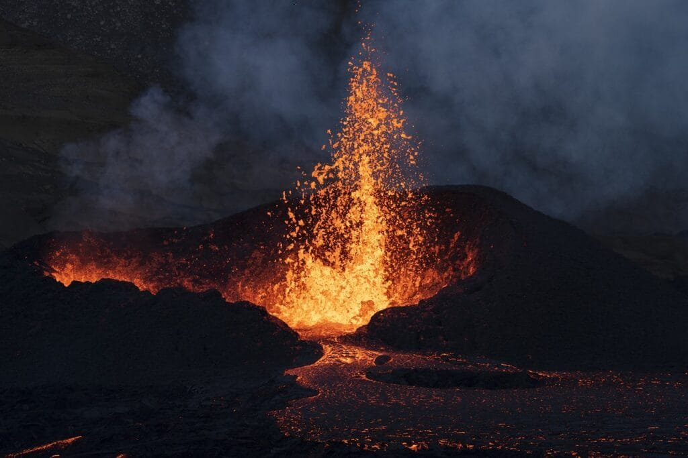

Volcanic eruptions, a breathtaking and powerful natural phenomenon, have a significant impact on the Earth's lithosphere. From the formation of volcanoes at plate boundaries, hotspots, and rift zones to the different eruption patterns and resulting hazards, understanding these volcanic processes is crucial. Volcanoes, such as those in the Pacific's "Ring of Fire," are prone to explosive eruptions due to the meeting of tectonic plates, while shield volcanoes in Hawaii erupt less violently over time. While volcanoes provide vital nutrients to the soil, they can also cause devastating disasters. By comprehending the intricacies of volcanic activity, scientists can predict future eruptions and minimize risks for communities living near these majestic natural wonders.

  

## Volcano Formation and Types

Volcanoes are fascinating geological features that are formed when molten rock, gases, and debris escape to the Earth's surface, resulting in eruptions of lava and ash. The science behind volcanoes involves a complex interplay of tectonic plates and the movement of the Earth's lithosphere. [Understanding the different types of volcanoes](https://magmamatters.com/understanding-volcanic-formation-a-comprehensive-guide/ "Understanding Volcanic Formation: A Comprehensive Guide") and their identifying features is crucial in comprehending the formation processes.

### The science behind volcanoes

Volcanoes are primarily formed at sites along plate boundaries, hotspots under the Earth's crust, or rift zones where the Earth's tectonic plates are moving apart. The movement of these tectonic plates creates intense pressure and heat underneath the surface, causing the rock to melt and form magma. As the magma collects in a chamber deep within the Earth's crust, it eventually rises to the surface, leading to volcanic eruptions.

### Different types of volcanoes: Shield, Cinder Cone, Stratovolcano

Volcanoes come in various shapes and sizes, each with its own set of characteristics and eruption patterns. Three common types of volcanoes include shield volcanoes, [cinder cones](https://magmamatters.com/the-birth-of-new-land-understanding-cinder-cones/), and stratovolcanoes.

Shield volcanoes have a broad, gently sloping shape resembling a warrior's shield, hence the name. They are formed by the accumulation of fluid lava flows that spread out in all directions. Shield volcanoes typically have mild eruptions, with lava easily flowing out from the central vent.

Cinder cones, on the other hand, are smaller and more conical in shape. They are formed from pyroclastic material, such as tephra and volcanic ash, that is ejected into the air during volcanic eruptions. These materials then fall back to the ground, building up and creating the characteristic cone shape.

Stratovolcanoes, also known as composite volcanoes, are tall and steep-sided. They are built up by alternating layers of lava flows, ash, and pyroclastic material. Stratovolcanoes are known for their explosive eruptions, which are caused by the buildup of pressure from thick, viscous magma.

### Identifying features and characteristics of different types

Each type of volcano possesses unique identifying features and characteristics that allow experts to differentiate between them. Shield volcanoes, for instance, have gently sloping sides and often exhibit numerous vents where lava flows out. Cinder cones are characterized by their symmetrical cone shape and are commonly found in clusters. Stratovolcanoes, on the other hand, have a steep profile, with alternating layers of different materials visible on their sides.

Understanding these identifying features and characteristics is essential in studying volcanoes and predicting their future activity.

## Geographic Distribution of Volcanoes

The geographic distribution of volcanoes is closely tied to the movement of tectonic plates and their interaction with one another. Tectonic plates play a crucial role in the formation of volcanoes and determine the locations where volcanic activity is most likely to occur.

### Importance of tectonic plates in volcano formation

Volcanoes are predominantly formed at plate boundaries where tectonic plates meet. These boundaries can be classified into three main types: convergent boundaries, divergent boundaries, and transform boundaries. Convergent boundaries occur when two tectonic plates collide, leading to powerful volcanic activity. Divergent boundaries, on the other hand, happen when two plates move away from each other, resulting in the formation of volcanic rift zones. Transform boundaries occur when two plates slide past each other horizontally, and while they do not create volcanic eruptions directly, they can cause volcanic activity indirectly by affecting nearby plate boundaries.

### Volcanic hotspots

In addition to plate boundaries, volcanic activity is also commonly observed at certain spots known as volcanic hotspots. These hotspots are believed to be caused by the presence of unusually hot magma beneath the Earth's crust. As the tectonic plate moves over the hotspot, a series of volcanic eruptions occur, leading to the formation of volcanic islands or mountain chains. One prominent example of a volcanic hotspot is the Hawaiian Islands, which were formed by the movement of the Pacific Plate over the Hawaii hotspot.

### Ring of Fire and its volcanoes

The Ring of Fire is a major area in the Pacific Ocean basin where a large number of earthquakes and volcanic eruptions occur. It is a direct result of the tectonic activity along the boundaries of several plates, including the Pacific Plate, the Juan de Fuca Plate, and the Nazca Plate. The Ring of Fire is known for its numerous volcanoes, ranging from the explosive stratovolcanoes of the Aleutian Islands to the more gentle shield volcanoes of Hawaii.

Understanding the geographic distribution of volcanoes is crucial in assessing the risks associated with volcanic activity in different regions and implementing necessary measures to mitigate potential hazards.

This image is property of pixabay.com.

## How Volcanoes Shape the Earth's Lithosphere

The Earth's lithosphere, which includes the crust and the uppermost part of the mantle, is constantly shaped and altered by volcanic activity. Volcanoes play a significant role in forming and altering the Earth's crust, influencing tectonic plate movement, and changing the topography and geography of the planet.

### Role of eruptions in forming and altering the Earth's Crust

Volcanic eruptions are powerful natural events that can cause the formation of new landmasses. When magma reaches the Earth's surface, it cools and solidifies, forming new rock layers that gradually build up over time. This process, known as volcanic deposition, can create expansive volcanic fields and even entire islands, as evidenced by the formation of the Hawaiian Islands.

Volcanic eruptions also contribute to the alteration of the Earth's crust. When magma is injected into existing rock layers, it can cause fractures and faults, leading to the creation of new geological structures. Additionally, volcanic activity can result in the release of gases and heat that can significantly affect the surrounding rock formations.

### Impact on tectonic plate movement and formation

Volcanic activity has a direct influence on the movement of tectonic plates. As magma rises to the surface, it exerts pressure on the overlying rocks, creating uplift and deformation in the Earth's crust. These forces can either aid or hinder the movement of tectonic plates, depending on the specific circumstances.

Volcanoes also contribute to the formation of new plate boundaries. When two plates interact at a convergent boundary, the melting of rock due to the intense heat and pressure can lead to the formation of magma chambers. This magma can then rise through the crust, forming volcanoes and ultimately establishing a new plate boundary.

### Changes in topography and geography due to volcanic activity

Volcanic eruptions can dramatically alter the topography and geography of affected regions. Lava flows, which are the result of volcanic eruptions, can cover vast areas of land, creating new landforms and modifying existing ones. These lava flows can bury forests, destroy buildings, and reshape entire landscapes.

Volcanic ash and tephra, which are ejected during explosive eruptions, can travel long distances and settle on the surrounding land and water. This ash fall can smother vegetation, disrupt ecosystems, and even impact climate patterns.

Understanding how [volcanoes](https://magmamatters.com/the-environmental-impact-of-volcanic-eruptions-2/ "The Environmental Impact of Volcanic Eruptions") shape the Earth's lithosphere is crucial in assessing the long-term impacts of volcanic eruptions and studying the dynamic nature of our planet's geology.

## Cause of Volcanic Eruptions

Volcanic eruptions are the result of several key factors, including the presence of a magma chamber, pressure buildup, gas content, and the movements and interactions of tectonic plates. Understanding these causes is fundamental in predicting volcanic activity and assessing the associated risks.

### The role of magma chamber in eruptions

Magma chambers are reservoirs of molten rock located beneath the Earth's surface. These chambers form as a result of the melting of rocks in the mantle and crust due to high temperatures and pressure. The magma within these chambers serves as the primary driving force behind volcanic eruptions.

When the pressure within the magma chamber becomes too great, the magma is forced to move upward towards the surface. As it rises, it melts through the overlying rock and eventually reaches the surface, resulting in a volcanic eruption.

### Significance of pressure and gas content

Pressure plays a crucial role in volcanic eruptions. As magma rises to the surface, the decrease in pressure allows dissolved gases within the magma to expand rapidly. This rapid expansion of gases creates enormous pressure that ultimately leads to explosive eruptions.

The gas content of magma also greatly influences the explosiveness of volcanic eruptions. Magma that is rich in dissolved gases, such as water vapor, carbon dioxide, and sulfur dioxide, is more likely to produce explosive eruptions. This is because when the pressure is released, the gases rapidly expand, fragmenting the magma and propelling it explosively into the air.

### Impact of tectonic plate movements and interactions

The movements and interactions of tectonic plates greatly contribute to volcanic eruptions. At convergent plate boundaries, where two plates collide, the subduction of one plate beneath another can result in the formation of magma chambers and subsequent volcanic activity. The intense heat and pressure generated by the subduction process cause the melting of rocks, leading to the formation of magma.

At divergent boundaries, where two plates move apart, volcanic eruptions can occur due to the upwelling of magma from the mantle. As the plates separate, the decrease in pressure allows the mantle to partially melt, forming magma. This magma then rises to the surface, creating volcanic activity along the divergent boundary.

Understanding the causes of volcanic eruptions is crucial in monitoring and predicting volcanic activity, enabling scientists to better mitigate the associated hazards.

This image is property of pixabay.com.

## Different Eruption Patterns

Volcanic eruptions can display various patterns depending on factors such as the viscosity of lava, gas content, and the characteristics of the volcano itself. By categorizing volcanic eruptions into different patterns, scientists can better understand and predict the behavior of volcanoes.

### Types of volcanic eruptions: Explosive, Effusive

Volcanic eruptions can be broadly categorized into two types: explosive eruptions and effusive eruptions.

Explosive eruptions occur when highly viscous magma with a high gas content is forcibly ejected from the volcano. The rapid expansion of gases within the magma creates explosive bursts, propelling volcanic ash, lava fragments, and gases high into the atmosphere. These eruptions are often accompanied by loud explosions, pyroclastic flows, and the formation of volcanic ash clouds.

Effusive eruptions, on the other hand, involve the relatively slow and steady outpouring of lava from the volcano. The magma in effusive eruptions tends to have low gas content and low viscosity, allowing it to flow more easily. Lava streams and flows slowly move away from the volcanic vent, gradually spreading over the surrounding area.

### Factors influencing eruption patterns

Several factors can influence the eruption pattern of a volcano. The viscosity of the magma, which is determined by its composition and temperature, plays a significant role. More viscous magma tends to produce explosive eruptions due to the buildup of gas pressure, while less viscous magma leads to effusive eruptions.

The gas content of the magma is also an important factor. Magma with a high gas content is more likely to produce explosive eruptions, as the rapid expansion of gases propels the magma forcefully into the air. In contrast, magma with a lower gas content is more likely to result in effusive eruptions, where the lava flows more freely.

Finally, the characteristics of the volcano itself, such as the size of the volcanic vent and the presence of fissures and fractures, can also influence the eruption pattern. Larger volcanic vents and extensive fractures can facilitate the release of magma and gases, potentially leading to more explosive eruptions.

### Examples and case studies of different eruption types

Throughout history, various types of eruptions have been observed and studied, providing valuable insights into volcanic behavior. One notable example of an explosive eruption is the 1815 eruption of Mount Tambora in Indonesia. This colossal eruption released massive amounts of volcanic ash and gas into the atmosphere, causing widespread climate abnormalities and leading to a significant decrease in global temperatures the following year, earning 1816 the nickname "The Year Without a Summer."

An example of an effusive eruption is the ongoing volcanic activity in Hawaii's Kilauea volcano. Kilauea has been continuously erupting since 1983, producing lava flows that slowly and steadily advance across the land, gradually reshaping the landscape and creating new land.

By studying these examples and case studies, scientists gain a better understanding of the different eruption patterns and can refine their predictive models, aiding in the mitigation of volcanic hazards.

## Hazards Posed by Volcanic Eruptions

Volcanic eruptions can pose significant hazards to both humans and the environment. The destructive forces of lava flows, ash fall, and pyroclastic flows can cause physical damage, while the [environmental impact can lead to air pollution and climate change](https://magmamatters.com/geothermal-energy-and-its-volcanic-origins/ "Geothermal Energy and Its Volcanic Origins"). Additionally, volcanic eruptions can have socio-economic implications, damaging infrastructure and impacting agriculture and livelihoods.

### Physical damage due to lava flow, ash fall, and pyroclastic flows

Lava flows are a primary hazard associated with volcanic eruptions. These rivers of molten rock can destroy anything in their path, including buildings, vegetation, and infrastructure. The speed and intensity of the lava flow determine the extent of the damage it can cause.

Ash fall is another hazard posed by volcanic eruptions. Volcanic ash, which consists of fine particles of pulverized rock and glass, can blanket vast areas, smothering vegetation and contaminating water supplies. The weight of the ash can also cause roofs to collapse, leading to structural damage.

Pyroclastic flows are particularly dangerous phenomena associated with explosive volcanic eruptions. These fast-moving clouds of hot gas, ash, and other volcanic materials can race down the sides of a volcano at speeds of over 100 kilometers per hour. Pyroclastic flows incinerate everything in their path, making them highly lethal to living organisms.

### Environmental impact: Air pollution, Climate change

Volcanic eruptions can have a significant environmental impact, primarily through the release of gases and particles into the atmosphere. Volcanic gases, such as sulfur dioxide, can react with other compounds in the atmosphere to form aerosols, which can contribute to air pollution and impact air quality both locally and globally.

The release of large amounts of volcanic ash into the atmosphere can also have widespread environmental consequences. Ash particles can reflect sunlight back into space, leading to a cooling effect on the Earth's surface. This cooling effect can temporarily disrupt weather patterns and even have global climatic implications if the eruption is large enough.

### Socio-economic implications: damage to infrastructure, impact on agriculture and livelihoods

Volcanic eruptions can have severe socio-economic implications. The physical damage caused by lava flows and ash fall can lead to the destruction or disruption of critical infrastructure such as roads, buildings, and utilities. This, in turn, can hinder transportation, communication, and access to essential services.

The impact of volcanic eruptions on agriculture can be devastating. Lava flows and ash fall can bury fertile soil, making it unsuitable for farming. Additionally, the release of toxic gases and the deposition of volcanic ash can contaminate water sources, making irrigation and crop cultivation impossible.

Volcanic eruptions can also have long-lasting effects on local economies, particularly those heavily reliant on tourism. Volcanic landscapes, such as those found in Hawaii or Iceland, are often popular tourist destinations. Eruptions can disrupt tourism activities, causing economic losses for local communities.

Understanding the hazards posed by volcanic eruptions is essential in developing strategies to minimize their impacts and ensure the safety and well-being of affected populations.

This image is property of pixabay.com.

## Benefits of Volcanoes and Volcanic Eruptions

While volcanic eruptions can cause devastation and pose significant risks, they also have several benefits that contribute to the Earth's natural processes and human societies.

### Fertility of volcanic soil

Volcanic eruptions contribute to the formation of fertile soil that is rich in minerals and nutrients. The ash and other volcanic materials deposited during eruptions decompose over time, releasing essential elements for plant growth and nourishing the surrounding land. As a result, volcanic soil is often highly fertile and ideal for agriculture. Many regions with active or dormant volcanoes, such as the Mount Vesuvius region in Italy and the fertile slopes of Mount Etna in Sicily, have a long history of intensive agricultural practices.

### Natural resources: Geothermal energy, precious minerals

Volcanic activity can provide access to valuable natural resources. Geothermal energy, for instance, is harnessed from areas where the Earth's internal heat is close to the surface due to volcanic activity. Geothermal power plants utilize this heat to generate electricity, providing a sustainable and renewable energy source.

Volcanic activity can also lead to the formation of valuable mineral deposits. Volcanic processes can concentrate minerals and metals in specific areas, making them economically feasible to extract. Examples of volcanic-related mineral deposits include copper and gold mines found in the Andes Mountains and the rich sulfur deposits formed near volcanic vents.

### Impact on landscapes and tourism

Volcanic eruptions shape landscapes and create unique geological features that attract tourists from around the world. Volcanic landforms such as calderas, lava tubes, and volcanic islands offer breathtaking scenery and provide opportunities for outdoor recreation and exploration. Famous tourist destinations like Yellowstone National Park in the United States or Santorini in Greece owe much of their appeal to their volcanic origins.

The benefits provided by volcanoes and volcanic eruptions, such as fertile soil, natural resources, and tourism opportunities, contribute positively to the environment and local economies, offering both practical and aesthetic value.

## Understanding Volcanic Activity and Predicting Eruptions

The study of volcanic activity plays a crucial role in predicting eruptions and mitigating the risks associated with volcanic hazards. Monitoring techniques and technologies, along with the identification of signs of imminent volcanic activity, enable scientists to make informed predictions and take necessary precautions.

### Monitoring techniques and technologies

Scientists use various monitoring techniques and technologies to track and analyze volcanic activity. Seismometers help detect and measure ground vibrations caused by magma movement or volcanic explosions. Gas analyzers are used to measure the composition and quantity of gases emitted by volcanoes, providing insights into the state of the magma and the potential for eruptions. Ground deformation monitoring utilizes tools such as GPS systems and satellite imaging to detect changes in the shape and elevation of the volcano, indicating magma movement beneath the surface.

Remote sensing instruments, such as thermal cameras and radar satellite imagery, allow scientists to monitor changes in heat patterns and surface deformation from a safe distance. These technologies provide crucial data for determining the state of volcanic activity and aid in the prediction of eruptions.

### Signs of imminent volcanic activity

Changes in volcanic activity often precede eruptions, and recognizing these signs is vital in predicting and responding to imminent volcanic events. Increased seismic activity, such as a rise in the number and intensity of earthquakes, is a common sign of volcanic unrest. Changes in gas emissions, such as an increase in [volcanic gases like sulfur dioxide](https://magmamatters.com/the-art-and-science-of-volcano-monitoring/ "The Art and Science of Volcano Monitoring"), can also indicate an impending eruption.

Ground deformation, including uplift, subsidence, or the formation of cracks, may occur as magma rises within the volcano. Changes in the thermal behavior of the volcano, such as the emergence of new hotspots or alterations in heat patterns, can also be indicative of volcanic unrest.

By closely monitoring these signs, scientists can gain a better understanding of volcanic behavior and make informed predictions about future eruptions.

### Predicting eruptions and mitigating risks

Predicting volcanic eruptions accurately is a complex task due to the numerous factors involved. However, with advancements in monitoring techniques and technologies, along with a better understanding of volcanic processes, scientists can make increasingly accurate predictions about volcanic behavior.

The ability to predict eruptions is essential in mitigating the risks posed by volcanic hazards. Timely evacuation plans can be implemented, ensuring the safety of vulnerable populations. The establishment of exclusion zones and the development of early warning systems can help minimize casualties and facilitate effective emergency response.

Public education and awareness also play a critical role in mitigating the impact of volcanic eruptions. By providing communities with information and resources, individuals can better understand the potential hazards and take appropriate measures to protect themselves and their properties.

## Mitigating the Impact of Volcanic Eruptions

Efforts to mitigate the impact of volcanic eruptions involve comprehensive planning and response strategies that aim to minimize the risks to human lives, infrastructure, and the environment. Emergency planning, community education and awareness, and infrastructure and land-use planning are essential components of mitigating volcanic hazards.

### Emergency planning and response

Preparing for volcanic eruptions requires the development of comprehensive emergency plans at the local, regional, and national levels. These plans should include evacuation routes, safe locations, and designated shelters for affected populations. It is crucial to ensure that the infrastructure necessary for emergency response, such as emergency management centers, communication systems, and medical facilities, is in place and ready to be utilized.

In addition to the establishment of emergency plans, regular drills and exercises should be conducted to test the readiness of response teams and enhance coordination among relevant stakeholders. Being well-prepared and having clear protocols in place can significantly improve the response to volcanic emergencies.

### Community education and awareness

Informing and educating communities about volcanic hazards is vital in ensuring their safety and well-being. Public awareness campaigns, community workshops, and educational programs can provide individuals with the knowledge and skills to respond appropriately during volcanic emergencies.

Community members should be made aware of the signs of volcanic unrest and the potential hazards associated with eruptions. They should also be familiar with evacuation routes, safety protocols, and the use of emergency supplies. By empowering individuals with the necessary information, they can make informed decisions and take swift action to protect themselves and their communities.

### Infrastructure and land-use planning

Accounting for volcanic hazards in infrastructure and land-use planning is crucial in minimizing the risks associated with volcanic eruptions. Buildings, roads, and other critical infrastructure should be designed and constructed to withstand potential volcanic hazards such as lava flows, ash fall, and pyroclastic flows. Proper land-use zoning can help prevent the construction of essential facilities in high-risk areas.

Effective land-use planning also includes the implementation of buffer zones around volcanoes, limiting human habitation and development in hazardous areas. Strict building codes and regulations can ensure that new constructions adhere to safety standards and are resilient to volcanic hazards.

By incorporating volcanic hazards into infrastructure and land-use planning, the impact of volcanic eruptions can be minimized, protecting both lives and property.

## Case Studies of Major Volcanic Eruptions and Their Impacts

Throughout history, major volcanic eruptions have had significant impacts on the Earth's lithosphere, the environment, and societies. Examining case studies helps scientists and researchers gain insights into the long-term effects of volcanic activity and develop strategies to mitigate potential risks.

### Historic volcanic eruptions and their aftermaths

The 1815 eruption of Mount Tambora in Indonesia is one of the most devastating volcanic events in recorded history. The eruption released enormous amounts of volcanic ash and gas into the atmosphere, resulting in global climate abnormalities and leading to crop failures and famine in various parts of the world. The year 1816, which followed the eruption, became known as "The Year Without a Summer" due to the cooling effect caused by the volcanic particles in the atmosphere.

Another notable historic eruption is the 79 AD eruption of Mount Vesuvius in Italy, which buried the Roman cities of Pompeii and Herculaneum under a thick layer of ash and debris. This catastrophic eruption preserved a remarkable snapshot of Roman life at the time, giving archaeologists and historians invaluable insights into ancient civilizations.

### Volcanic activities in the 21st century

In more recent times, the eruption of Eyjafjallajökull in Iceland in 2010 caused significant disruptions to air travel in Europe. The volcanic ash cloud released during the eruption led to the closure of airspace, affecting millions of travelers and resulting in substantial economic losses. This event highlighted the need for improved volcano monitoring and the development of effective strategies to mitigate the impact of volcanic ash on aviation.

The eruption of Taal Volcano in the Philippines in 2020 showcased the dangers of volcanic eruptions to densely populated areas. The eruption generated ash plumes and pyroclastic flows, forcing the evacuation of thousands of people and causing significant damage to infrastructure and agricultural lands.

### Long term impacts on Earth's lithosphere, Environment, and societies

The long-term impacts of volcanic eruptions are fundamental in understanding the dynamic nature of the Earth's lithosphere, as well as the environmental and societal consequences. Volcanic eruptions contribute to the natural geological processes that shape our planet, forming new landmasses, altering topography, and providing fertile soil.

However, the effects of volcanic eruptions extend beyond the geological realm. Significant volcanic events can result in environmental changes, such as the release of gases and ash particles into the atmosphere. These changes can lead to short-term climate abnormalities and impact global weather patterns. Volcanic eruptions can also have severe socio-economic implications, causing damage to infrastructure, disrupting livelihoods, and affecting local economies.

By studying and analyzing case studies of major volcanic eruptions, scientists can develop a deeper understanding of the long-term impacts of volcanic activity. This knowledge is crucial in formulating strategies and policies that aim to mitigate the risks associated with volcanic hazards and ensure the safety and well-being of affected communities.

In conclusion, understanding the formation, types, and behavior of volcanoes is essential in comprehending their impact on the Earth's lithosphere, environment, and societies. Volcanic eruptions can be highly destructive, causing physical damage, environmental consequences, and socio-economic disruptions. However, volcanoes also provide fertile soil, valuable natural resources, and unique geological landscapes that contribute positively to the planet. By closely monitoring volcanic activity, predicting eruptions, and implementing effective mitigation strategies, we can better protect lives and minimize the risks associated with volcanic eruptions.

Related Posts: [Mitigating Risks: Forecasting Volcanic Activity in Prone Areas](https://magmamatters.com/mitigating-risks-forecasting-volcanic-activity-in-prone-areas/), [The Formation and Eruption Patterns of Volcanoes](https://magmamatters.com/the-formation-and-eruption-patterns-of-volcanoes-4/), [The Pyroclastic Phenomena of Pompeii: 7 Insights to Explore](https://magmamatters.com/the-pyroclastic-phenomena-of-pompeii-7-insights-to-explore/), [Tips for Capturing Volcano Pyroclastic Flow Photos](https://magmamatters.com/tips-for-capturing-volcano-pyroclastic-flow-photos/), [Understanding Volcanoes and Their Eruption Patterns](https://magmamatters.com/understanding-volcanoes-and-their-eruption-patterns/)
