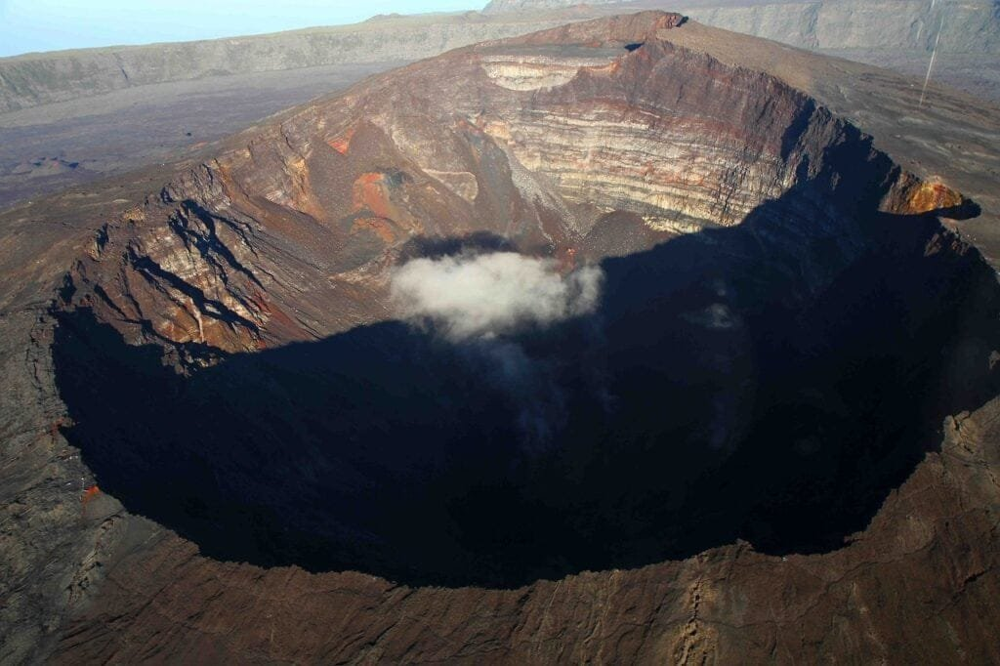

If you've ever been captivated by the sheer power and beauty of a volcano, then understanding their different types, distribution, and eruption causes is sure to pique your interest. Volcanoes, with their molten rock, gases, and debris, create a spectacle of erupting lava and ash. They can be found at specific locations along plate boundaries, hotspots beneath the Earth's crust, or in rift zones where tectonic plates separate. The "Ring of Fire," encircling the Pacific Ocean, is home to many volcanoes that sit atop plate boundaries, resulting in frequent eruptions. On the other hand, shield volcanoes in Hawaii form gradually over hot spots, erupting less explosively. By further exploring the [types of volcanoes](https://magmamatters.com/understanding-volcanic-formation-a-comprehensive-guide/ "Understanding Volcanic Formation: A Comprehensive Guide"), their distribution, and the causes of eruptions, we can not only understand the hazards and benefits they present but also predict future activity and safeguard vulnerable communities.

This image is property of pixabay.com.

## Definition and Forming of Volcanoes

Volcanoes are natural landforms that are formed when molten rock, gases, and debris escape to the earth's surface, resulting in eruptions of lava and ash. The formation of volcanoes is a fascinating result of the complex workings of the Earth's interior. The science behind the formation of volcanoes involves the movement of tectonic plates, which are large sections of the Earth's crust that float on the semi-fluid mantle. When these plates collide or separate, they create weak points in the crust where magma, which is molten rock underground, can rise to the surface. This process is known as volcanic activity.

The elements that constitute volcanoes include molten rock, gases, and debris. The molten rock, also known as magma when it is beneath the Earth's surface, is the primary component of volcanoes. It is a mixture of molten minerals and dissolved gases that are under high pressure and temperature. Gases, such as water vapor, carbon dioxide, sulfur dioxide, and hydrogen sulfide, are also present in volcanoes. These gases play a crucial role in determining the behavior and explosiveness of volcanic eruptions. Lastly, debris, which includes solid fragments of rock and lava, is ejected from volcanoes during eruptions.

Understanding the process of eruptions of lava and ash is essential in comprehending the behavior of volcanoes. When magma rises to the surface, it can create various types of volcanic eruptions. Eruptions involving lava occur when the magma is relatively low in gas content and viscosity, allowing it to flow freely. These eruptions often result in the formation of lava flows, which can cover vast areas and cause damage to surrounding environments. On the other hand, eruptions involving ash occur when the magma is highly explosive due to its high gas content and viscosity. These explosive eruptions can generate volcanic ash, which can be carried long distances by wind and pose significant hazards to human health and aviation.

## Types of Volcanoes

There are several types of volcanoes, each with its own unique characteristics and eruption patterns. One type of volcano is the Strombolian volcano. Strombolian volcanoes are known for their frequent and relatively mild eruptions. They release bursts of gas, ash, and lava fragments, which are propelled into the air in a characteristic "Strombolian" style. These eruptions are typically not very explosive and do not pose significant risks to human populations.

Another type of volcano is the Vulcanian volcano. Vulcanian volcanoes are named after the Roman god Vulcan, who was associated with fire and metalwork. These volcanoes are known for their explosive eruptions, which are characterized by the ejection of large volumes of volcanic ash and pyroclastic material. The eruptions of Vulcanian volcanoes can be highly destructive and often result in the formation of volcanic domes.

Other types of volcanoes include shield volcanoes, composite volcanoes, and [cinder cone](https://magmamatters.com/the-birth-of-new-land-understanding-cinder-cones/) volcanoes. Shield volcanoes, like those found in Hawaii, have a broad, gently sloping shape resembling a warrior's shield. They are formed by the accumulation of numerous layers of relatively low-viscosity lava flows. Composite volcanoes, also known as stratovolcanoes, are tall and steep-sided volcanoes formed by alternating layers of lava and ash. They often exhibit explosive eruptions due to the high viscosity of their magma. Lastly, cinder cone volcanoes are small, cone-shaped mountains formed by the accumulation of volcanic ash and cinders. They are typically associated with short-lived eruptions.

  

## Key Differences in Volcano Eruption Types

Strombolian and Vulcanian eruptions are two distinct types of volcanic eruptions, each with its own unique characteristics. The key differences between these eruption types lie in factors such as eruption frequency, explosivity, and eruption style.

Strombolian eruptions are characterized by frequent and relatively mild eruptions. These eruptions occur at regular intervals, typically ranging from a few minutes to a few hours. During a Strombolian eruption, bursts of gas, ash, and lava fragments are ejected into the air in a rhythmic manner. The eruptive activity is often accompanied by loud explosions and the formation of lava fountains. Strombolian eruptions are generally not very explosive and do not pose significant risks to nearby communities.

In contrast, Vulcanian eruptions are highly explosive and characterized by large volumes of ash and pyroclastic material being ejected into the atmosphere. These eruptions are usually infrequent and can occur after long periods of volcanic dormancy. Vulcanian eruptions are often preceded by a buildup of gas and pressure within the magma chamber. When the pressure becomes too great, the magma is forcefully expelled, resulting in a violent explosion. The explosive nature of Vulcanian eruptions can lead to the formation of volcanic domes and the release of [pyroclastic flows](https://magmamatters.com/the-environmental-impact-of-volcanic-eruptions-2/ "The Environmental Impact of Volcanic Eruptions"), which are dense, fast-moving currents of hot gas, ash, and rock fragments.

The viscosity of the magma plays a crucial role in determining the type of eruption. The viscosity refers to the resistance of a substance, in this case, magma, to flow. High-viscosity magma, such as that found in Vulcanian eruptions, is thick and sticky, making it difficult for gases to escape. This results in the buildup of pressure within the magma chamber, leading to explosive eruptions. In contrast, low-viscosity magma, such as that found in Strombolian eruptions, is more fluid and allows gases to escape more easily, resulting in less explosive eruptions.

The gas content of the magma also plays a significant role in determining the behavior of volcanic eruptions. Higher gas content, often associated with Vulcanian eruptions, leads to increased explosivity. The gas bubbles within the magma expand rapidly during an eruption, propelling volcanic ash and pyroclastic material into the air. In contrast, lower gas content in the magma, such as in Strombolian eruptions, leads to more effusive eruptions, where lava flows freely without significant explosive activity.

Understanding these key differences in eruption types is crucial for predicting volcanic behavior and assessing potential hazards to surrounding communities.

## Geographic Distribution of Volcanoes

Volcanoes are not evenly distributed across the Earth's surface but are concentrated in specific regions. One of the most well-known volcanic regions is the "Ring of Fire," which encircles the Pacific Ocean. This region is characterized by intense tectonic activity and is home to a large number of active volcanoes. The "Ring of Fire" stretches from the west coast of the Americas, through the Aleutian Islands, Japan, the Philippines, Indonesia, and down to New Zealand. The high concentration of volcanoes in this region is due to the subduction of oceanic plates beneath continental plates, creating highly explosive volcanic environments.

Volcanoes are also commonly found along plate boundaries, where tectonic plates interact and collide. Subduction zones, where one plate is forced beneath another, are particularly prone to volcanic activity. As the subducting oceanic plate sinks beneath the overriding continental plate, the intense heat and pressure cause the release of magma, leading to volcanic eruptions. These types of volcanic regions can be found in several locations, such as the Andes in South America, the Cascade Range in North America, and the Kamchatka Peninsula in Russia.

Hotspots are another type of volcanic region. Hotspots are areas where plumes of hot mantle material rise from deep within the Earth, creating a hotspot of volcanic activity at the surface. The Hawaiian Islands are a prime example of a hotspot volcanic region. The islands were formed by the movement of the Pacific Plate over a stationary hotspot, resulting in a chain of shield volcanoes. Hotspot volcanism is often characterized by the formation of volcanic islands or seamounts, which gradually become inactive as the tectonic plate continues to move away from the hotspot.

Rift zones are another important volcanic feature. Rift zones occur where tectonic plates are moving apart, creating a gap or rift in the Earth's crust. These rift zones are often associated with volcanic activity as magma rises to fill the void created by the separation of the plates. The East African Rift System is a famous example of a rift zone, where the African Plate is splitting apart, resulting in the formation of volcanic peaks and lakes.

Understanding the geographic distribution of volcanoes is critical for monitoring volcanic activity and assessing the risks to populated areas. By identifying these volcanic regions, scientists can focus their efforts on predicting and monitoring eruptions, thereby reducing the potential impact on local communities.

This image is property of pixabay.com.

## Violent and Gentle Eruptions

Volcanic eruptions can vary significantly in their intensity, from gentle and non-explosive eruptions to highly violent and explosive events. Understanding the differences between these eruption types is crucial for assessing the potential hazards associated with volcanic activity.

Explosive eruptions, also known as magmatic eruptions, are characterized by violent explosions and the ejection of large volumes of volcanic ash, gas, and rock fragments into the atmosphere. These eruptions are often associated with stratovolcanoes, which are tall and steep-sided volcanoes composed of layers of lava and ash. The explosive nature of these eruptions is primarily due to the high viscosity of the magma and the presence of significant amounts of gas. As the magma rises to the surface, gas bubbles within the magma expand rapidly, leading to explosive fragmentation. This fragmentation produces volcanic ash, which can pose significant hazards to human health, crop productivity, and air travel.

In contrast, non-explosive eruptions, also known as effusive eruptions, are characterized by the relatively gentle flow of lava from the volcano. Effusive eruptions occur when the magma is low in viscosity and gas content, allowing it to flow freely from the vent. This type of eruption is often associated with shield volcanoes, which have a broad, shield-like shape due to the accumulation of multiple layers of low-viscosity lava. Effusive eruptions can result in the formation of extensive lava flows, which can cover large areas and potentially threaten nearby communities. However, they are generally less destructive than explosive eruptions.

The intensity of volcanic eruptions can also be influenced by the [geologic context of the volcano](https://magmamatters.com/geothermal-energy-and-its-volcanic-origins/ "Geothermal Energy and Its Volcanic Origins"). Factors such as the composition of the magma, the presence of water, and the shape of the volcano can all play a role in determining eruption intensity. For example, the presence of water, such as in the form of groundwater or a crater lake, can lead to highly explosive eruptions as the magma interacts with the water and rapidly generates steam. Additionally, the shape of the volcano can influence eruption intensity. Tall, steep-sided volcanoes, like stratovolcanoes, can trap gas and magma within their conical shape, leading to more explosive eruptions. In contrast, broad, shield-like volcanoes allow for the more gentle flow of lava due to their lower gas content and lower viscosity magma.

The characteristics of the magma itself also play a significant role in determining eruption type and intensity. Factors such as magma composition, temperature, and gas content can all influence the behavior of volcanic eruptions. For example, magma that is rich in silica tends to have higher viscosity, making it more prone to explosive eruptions. The gas content of the magma can also affect eruption behavior, as the presence of gas bubbles can increase the explosivity of the eruption. High gas content, combined with high viscosity magma, can lead to highly explosive eruptions, whereas low gas content and low viscosity magma result in more effusive eruptions.

Understanding the differences between violent and gentle eruptions is vital for assessing the potential risks associated with volcanic activity. By studying the geologic context and characteristics of volcanoes, scientists can provide valuable information for predicting eruption behavior and developing appropriate response plans to mitigate the impact on surrounding communities.

## The Aftermath of Volcanic Eruptions

Volcanic eruptions can have significant short-term and long-term effects on the environment. While eruptions can be destructive and pose hazards to human populations, they also have some benefits and play a vital role in shaping the Earth's surface.

In the short-term, volcanic eruptions can cause various environmental hazards. One of the most immediate and visible hazards is the formation of ash clouds. During explosive eruptions, volcanic ash, which consists of tiny rock and glass particles, can be ejected high into the atmosphere. These ash clouds can be carried by wind over vast distances, posing risks to human health, as inhalation of ash particles can cause respiratory problems. Volcanic ash can also damage crops, contaminate water sources, and disrupt transportation systems, including aviation.

Another hazardous phenomenon associated with volcanic eruptions is pyroclastic flows. Pyroclastic flows are dense, fast-moving currents of hot gas, ash, and rock fragments that can travel down the slopes of a volcano at high speeds. These flows can reach temperatures of several hundred degrees Celsius and can cause significant damage to anything in their path. Pyroclastic flows pose a severe threat to human populations living near volcanoes, as they can bury entire communities and destroy infrastructure.

Lava flows are another hazard associated with volcanic eruptions. Lava flows are streams of molten rock that flow downslope from the volcano. Although they move relatively slowly compared to pyroclastic flows, lava flows can still cause damage to buildings, infrastructure, and agricultural land. The high temperatures of the lava can ignite fires and destroy vegetation, further contributing to environmental damage. However, it is worth noting that slow-moving lava flows often provide an opportunity for evacuation and can be easier to divert or control compared to other volcanic hazards.

While volcanic eruptions can be devastating, they also have some benefits. One of the positive impacts of volcanic eruptions is the enrichment of soil. Volcanic ash contains essential nutrients, such as phosphorus and potassium, which can replenish the soil and promote plant growth. The newly deposited ash can also act as a natural fertilizer, leading to increased agricultural productivity in the surrounding areas. Additionally, volcanic eruptions can create new landforms, such as islands and mountains, which contribute to the geological diversity of the Earth's surface.

Understanding the short-term and long-term effects of volcanic eruptions is crucial for assessing the potential risks and implementing measures to mitigate their impact. By studying past eruptions and monitoring ongoing volcanic activity, scientists can develop strategies to protect human populations and minimize the environmental consequences of volcanic events.

This image is property of pixabay.com.

## Predicting and Monitoring Volcanic Activity

Predicting volcanic eruptions is a challenging task that requires careful monitoring of volcanic activity and the use of various scientific methods and technologies. While scientists cannot predict with complete certainty when and where a volcanic eruption will occur, they have made significant progress in understanding the precursors and indicators of volcanic activity.

One of the primary methods used in predicting volcanic eruptions is the monitoring of ground deformation. As magma rises to the surface, it can cause the ground to swell or deform. By using instruments such as GPS and satellite-based radar, scientists can detect even small changes in the shape of a volcano. Monitoring ground deformation provides valuable information about the movement and accumulation of magma, which can be used to determine the likelihood of an eruption.

Another important tool in volcanic monitoring is the analysis of [volcanic gases](https://magmamatters.com/the-art-and-science-of-volcano-monitoring/ "The Art and Science of Volcano Monitoring"). Magma contains various gases, including water vapor, carbon dioxide, sulfur dioxide, and hydrogen sulfide. By measuring the composition and concentration of these gases, scientists can gain insights into the behavior of the magma and the likelihood of an eruption. Sudden changes in gas emissions, such as an increase in sulfur dioxide, can indicate an imminent eruption.

Seismic monitoring is also a crucial method for predicting volcanic eruptions. As magma moves beneath the surface, it creates seismic waves that can be detected by seismometers. By analyzing the frequency, intensity, and location of seismic activity, scientists can infer the movement of magma and the potential for an eruption. Seismic monitoring can also provide information about the type of eruption, such as whether it will be explosive or effusive.

Remote sensing techniques, such as satellite imagery and thermal cameras, are also valuable tools in monitoring volcanic activity. Satellite imagery can provide high-resolution images of volcanic plumes and lava flows, allowing scientists to assess the magnitude and direction of an eruption. Thermal cameras can detect changes in temperature on the surface of a volcano, indicating the presence of magma and potential eruptive activity.

Monitoring active and dormant volcanoes is an ongoing process that requires dedicated efforts and collaboration between scientists, government agencies, and local communities. By combining various monitoring techniques and analyzing data in real-time, scientists can provide timely warnings and ensure the safety of those living near volcanoes.

## Mitigating Risks of Volcanic Hazards

Communities living near volcanoes face unique risks and challenges due to the potential hazards associated with volcanic activity. To mitigate these risks, various strategies for risk reduction and preparedness are implemented.

One crucial strategy is the establishment of exclusion zones around active volcanoes. Exclusion zones are areas deemed too dangerous for human habitation due to the potential hazards, such as pyroclastic flows and lava flows. These zones are determined based on scientific assessments of volcanic activity and eruption potential. Restricting access to these areas helps prevent casualties and ensures the safety of nearby communities.

Another important step in risk mitigation is the development of evacuation plans and warning systems. Evacuation plans outline the procedures and routes for safely evacuating populations living near active volcanoes in the event of an eruption. These plans take into account factors such as population density, transportation infrastructure, and the local topography. Warning systems, which often include sirens, loudspeakers, and mobile phone alerts, are used to notify residents of the need for evacuation or other protective actions. Rapid and effective communication is crucial during volcanic emergencies to ensure a timely response and minimize the risk to human life.

Building resilient infrastructure can also help mitigate the risks associated with volcanic eruptions. Designing structures to withstand volcanic ashfall, volcanic gases, and ground deformation can help reduce damage and potential loss of life. Additionally, incorporating volcanic risk awareness into land-use planning can help prevent the development of high-risk areas near volcanoes.

Education and public awareness are vital components of risk reduction. Educating the public about the hazards associated with volcanic activity, including the signs of an impending eruption, can help communities better prepare and respond to volcanic emergencies. Public education campaigns can help raise awareness about evacuation procedures, emergency kits, and the importance of heeding warnings from authorities.

Investing in scientific research and monitoring is crucial for continuously improving our understanding of volcanic activity and enhancing the accuracy of eruption predictions. The development and deployment of advanced technologies, such as satellite-based monitoring systems and real-time data analysis, can enable more accurate and timely warnings.

Mitigating risks associated with volcanic hazards requires a comprehensive and coordinated approach involving governments, scientists, and local communities. By implementing strategies for risk reduction, preparedness, and response, it is possible to minimize the impact of volcanic eruptions and ensure the safety of those living in volcanic-prone areas.

## Societal Impact of Volcanoes

Volcanoes have a significant impact on society, not only in terms of their direct hazards but also through their influence on climate, weather, and cultural significance. Understanding the societal impact of volcanoes is crucial for developing strategies to minimize risks and maximize the benefits associated with these natural phenomena.

Volcanic eruptions can have significant effects on climate and weather patterns. During large volcanic eruptions, massive amounts of volcanic ash and gases can be injected high into the atmosphere. These aerosols can remain in the atmosphere for months or even years, reflecting sunlight back into space and causing a temporary cooling effect on the Earth's climate. This cooling effect can lead to changes in weather patterns, such as altered precipitation patterns and decreased global temperatures. Furthermore, volcanic eruptions can also release greenhouse gases, such as carbon dioxide, into the atmosphere, contributing to the long-term warming of the Earth's climate.

Volcanoes also hold cultural significance in many societies around the world. Throughout history, volcanoes have been revered and sometimes even worshipped as manifestations of divine power. They have played a role in shaping local legends, folklore, and religious beliefs. In some cultures, volcanoes are seen as symbols of national identity and pride. Additionally, volcanic landscapes can attract tourism, contributing to local economies and providing opportunities for cultural exchange and education.

Historic volcanic eruptions have had significant societal effects. For example, the eruption of Mount Vesuvius in 79 AD famously buried the cities of Pompeii and Herculaneum under a thick layer of volcanic ash, preserving them for future generations to study. The eruption of Mount Tambora in 1815 resulted in the "Year Without a Summer," causing widespread crop failures and famine in many parts of the world. The eruption of Mount Pinatubo in 1991 in the Philippines led to the displacement of thousands of people and caused significant economic losses.

Studying historic volcanic eruptions and their societal impacts provides valuable insights for hazard assessment and risk mitigation. By understanding the consequences of past eruptions, scientists and policymakers can develop strategies to minimize the impact of future volcanic events on human populations.

## Volcano Case Studies

Analyzing specific volcanic eruptions and their impacts provides valuable insights into the behavior and consequences of volcanic activity. Three notable case studies provide a deeper understanding of volcanic eruptions and their aftermath: the eruption of Mount Vesuvius in 79 AD, the ongoing activity of Kilauea volcano in Hawaii, and the 1980 eruption of Mount St. Helens in the United States.

The eruption of Mount Vesuvius in 79 AD was one of the most famous and consequential volcanic events in history. The eruption buried the ancient Roman cities of Pompeii and Herculaneum under several meters of volcanic ash and debris. The preservation of these cities has provided unparalleled insights into daily life in ancient Rome. The eruption also had a profound impact on the cultural and artistic history of the region, inspiring countless works of literature, art, and scientific inquiry.

Kilauea volcano in Hawaii is one of the most active volcanoes in the world. It has been erupting continuously since 1983, making it an ideal case study for understanding effusive eruptions and their impacts. The ongoing volcanic activity has resulted in the formation of new land and the destruction of several communities. The lava flows from Kilauea have reshaped the landscape and threatened infrastructure, leading to the relocation of residents and the implementation of risk reduction measures.

The 1980 eruption of Mount St. Helens in Washington State, USA, was a highly destructive and significant volcanic event. The eruption began with a massive lateral blast, which triggered the collapse of the volcano's north flank. The subsequent eruption column sent volcanic ash into the atmosphere, spreading it over a large area and disrupting air traffic. The eruption caused the loss of numerous lives, destroyed miles of forests, and significantly impacted local communities. The recovery and subsequent scientific studies of Mount St. Helens have provided valuable insights into volcanic processes and the potential risks associated with volcanic eruptions.

By examining these case studies, scientists and policymakers can gain a deeper understanding of volcanic behavior and devise strategies to reduce risks and mitigate the impact of future eruptions. Case studies provide valuable lessons that can inform hazard assessment, emergency response planning, and community preparedness.

In conclusion, understanding volcanoes is crucial for predicting and mitigating the risks associated with volcanic eruptions. The formation of volcanoes involves the movement of tectonic plates and the ascent of magma to the Earth's surface. Different types of volcanoes exhibit unique characteristics, eruption styles, and hazards. The geographic distribution of volcanoes is not uniform and is concentrated in regions such as the "Ring of Fire." Volcanic eruptions can be violent or gentle, depending on factors like magma viscosity and gas content. The aftermath of volcanic eruptions can have both short-term hazards and long-term benefits. Predicting volcanic activity requires monitoring and analyzing various indicators, such as ground deformation, seismic activity, and gas emissions. Mitigating the risks of volcanic hazards involves strategies such as exclusion zones, evacuation plans, and resilient infrastructure. Volcanoes have significant societal impacts, including influences on climate, weather, and cultural beliefs. By studying case studies, such as Mount Vesuvius, Kilauea, and Mount St. Helens, scientists can gain valuable insights into the behavior and consequences of volcanic eruptions, informing future volcano research and risk reduction efforts.

Related Posts: [Mitigating Risks: Forecasting Volcanic Activity in Prone Areas](https://magmamatters.com/mitigating-risks-forecasting-volcanic-activity-in-prone-areas/), [The Formation and Eruption Patterns of Volcanoes](https://magmamatters.com/the-formation-and-eruption-patterns-of-volcanoes-4/), [The Pyroclastic Phenomena of Pompeii: 7 Insights to Explore](https://magmamatters.com/the-pyroclastic-phenomena-of-pompeii-7-insights-to-explore/), [Tips for Capturing Volcano Pyroclastic Flow Photos](https://magmamatters.com/tips-for-capturing-volcano-pyroclastic-flow-photos/), [Understanding Volcanoes and Their Eruption Patterns](https://magmamatters.com/understanding-volcanoes-and-their-eruption-patterns/)

Related Posts: [Mitigating Risks: Forecasting Volcanic Activity in Prone Areas](https://magmamatters.com/mitigating-risks-forecasting-volcanic-activity-in-prone-areas/), [The Formation and Eruption Patterns of Volcanoes](https://magmamatters.com/the-formation-and-eruption-patterns-of-volcanoes-4/), [The Pyroclastic Phenomena of Pompeii: 7 Insights to Explore](https://magmamatters.com/the-pyroclastic-phenomena-of-pompeii-7-insights-to-explore/), [Tips for Capturing Volcano Pyroclastic Flow Photos](https://magmamatters.com/tips-for-capturing-volcano-pyroclastic-flow-photos/), [Understanding Volcanoes and Their Eruption Patterns](https://magmamatters.com/understanding-volcanoes-and-their-eruption-patterns/)
