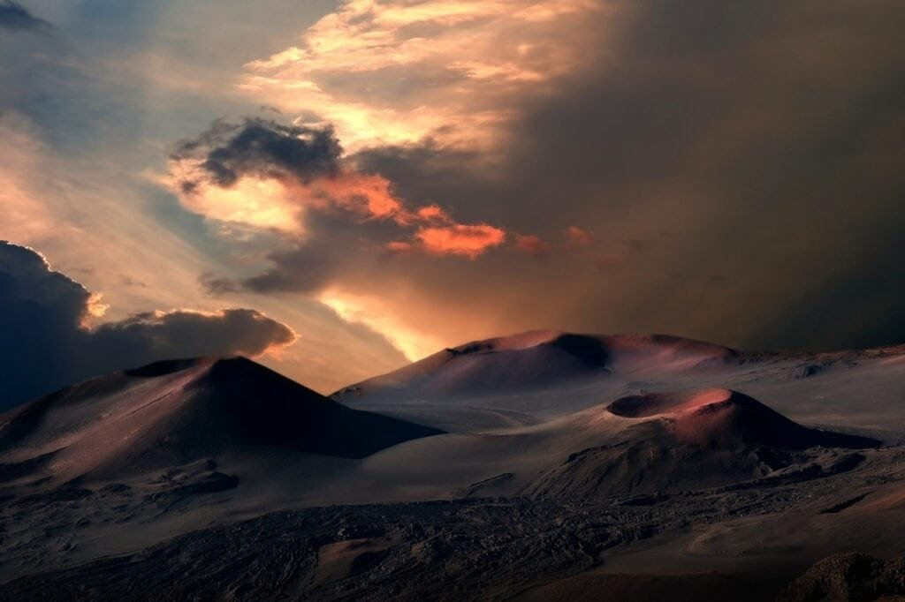
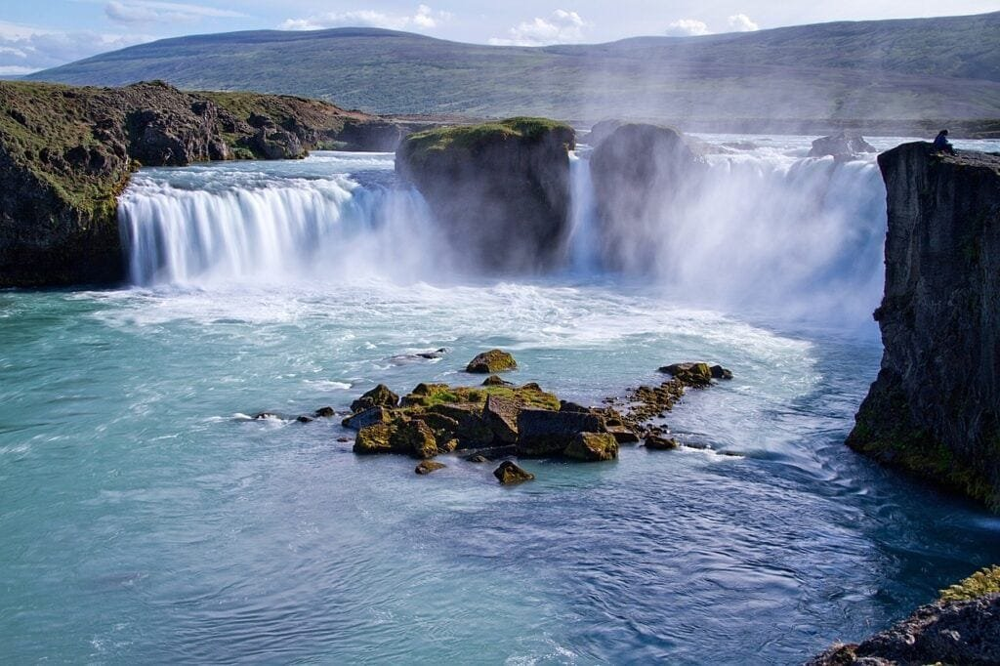

Volcanoes have long captured our fascination and awe with their explosive eruptions, billowing smoke, and fiery lava flows. But beyond their dramatic appearances, volcanoes hold a wealth of scientific importance and potential hazards. Understanding the different types of volcanoes, their geographic distribution, eruption causes, hazards, and benefits is essential for comprehending the intricate dynamics of these influential players in climate change. From the towering stratovolcanoes of the Ring of Fire to the quiet shield volcanoes of Hawaii, each volcano offers valuable insights into our planet's history and future. By examining the intricate workings of these natural wonders, we gain the knowledge needed to predict and mitigate the risks they pose to surrounding communities. So, let us embark on a journey of discovery as we unravel the mysteries of volcanoes and uncover their profound impact on our world.

This image is property of pixabay.com.

## Overview of Volcanoes

Volcanoes are fascinating natural features that capture the imagination of people around the world. But what exactly is a volcano? A volcano is a vent or opening in the Earth's crust through which molten rock, known as magma, along with gases and debris, reaches the surface. This eruption of magma and volcanic materials leads to the formation of new land and the release of gases into the atmosphere.

## Definition of a Volcano

A volcano can be defined as a geological landform created by the accumulation of erupted materials. It is a result of the movement of the Earth's tectonic plates, which can cause the crust to crack and release magma. This magma, composed of molten rock and other substances, is expelled through the volcanic vent during an eruption.

<iframe width="560" height="315" src="https://www.youtube.com/embed/VNGUdObDoLk" frameborder="0" allow="accelerometer; autoplay; encrypted-media; gyroscope; picture-in-picture" allowfullscreen></iframe>

  

## How Volcanoes are Formed

The formation of volcanoes is a complex process that involves the interaction of various geological factors. The primary cause of volcanic activity is the movement of tectonic plates, which make up the Earth's outer shell. When these plates converge, diverge, or slide past each other, they create areas of instability in the Earth's crust. These areas of weakness allow magma to rise towards the surface, resulting in volcanic eruptions.

## Key Components of a Volcano: Magma, Gas, Debris

A volcano consists of three key components: magma, gas, and debris. Magma is the molten rock that forms beneath the Earth's surface. It is created when rocks in the Earth's mantle melt due to the high temperatures and pressures found in these deep regions. As the magma rises towards the surface, it begins to cool and solidify, forming different types of rocks.

Gas is another crucial component of volcanic eruptions. It is released from the magma as it moves towards the surface. The gas content and composition can vary from one volcano to another, but common volcanic gases include water vapor, carbon dioxide, sulfur dioxide, and hydrogen sulfide. The release of these gases can have significant effects on the Earth's atmosphere and climate.

Debris, such as ash and rock fragments, is also expelled during volcanic eruptions. This material can range in size from small ash particles to large boulders. These volcanic materials pose hazards to nearby communities and can cause damage to infrastructure.

This image is property of pixabay.com.

## Types of Volcanoes

Volcanoes come in several different types, each with its own distinct features and eruption patterns. [Understanding these types of volcanoes](https://magmamatters.com/understanding-volcanic-formation-a-comprehensive-guide/ "Understanding Volcanic Formation: A Comprehensive Guide") can help us better comprehend their behavior and associated risks. Here are four commonly recognized types of volcanoes:

### Stratovolcano

Stratovolcanoes, also known as composite volcanoes, are tall and steep-sided mountains formed by alternating layers of lava and volcanic debris. These volcanoes are usually found at convergent plate boundaries, where one tectonic plate is forced beneath another. They are characterized by explosive eruptions due to the high viscosity of the magma, which traps gases and causes pressure to build up.

### Shield Volcano

Shield volcanoes, named for their shape resembling a warrior's shield lying on the ground, are broad and gently sloping. They are formed by low viscosity lava that flows easily and covers a large area. Shield volcanoes are typically found at hotspots, where hot molten rock rises from deep within the Earth's mantle. These volcanoes have less explosive eruptions, with lava flowing slowly down their flanks.

### Cinder Cone Volcano

[Cinder cone](https://magmamatters.com/the-birth-of-new-land-understanding-cinder-cones/) volcanoes are small, steep-sided cones made up of loose, pyroclastic material, such as cinders and volcanic ash. They are formed when volcanic eruptions expel fragments of lava into the air, which then fall back to the ground and accumulate around the vent. Cinder cones are often short-lived and are associated with relatively minor eruptions.

### Composite Volcano

Composite volcanoes, also known as stratovolcanoes, are a combination of the characteristics seen in both shield volcanoes and cinder cone volcanoes. They have moderate slopes and are often made up of layers of both lava and pyroclastic material. Composite volcanoes can produce both explosive eruptions and lava flows, making them some of the most dangerous and famous volcanoes in the world.

## Distribution of Volcanoes

Volcanoes are not evenly distributed across the globe but are instead concentrated in specific regions. Understanding the distribution of volcanoes can provide insights into the underlying geological processes and help identify areas at risk of volcanic activity. Here are some key points regarding the distribution of volcanoes:

### Understanding Plate Tectonics and Volcanoes

To understand the distribution of volcanoes, it is essential to grasp the concept of plate tectonics. The Earth's crust is divided into several large and small plates that float and move on the semi-fluid layer known as the asthenosphere. These plates interact with each other, leading to various geological phenomena, including the formation of volcanoes.

### Distribution Along Plate Boundaries

The majority of volcanoes are found along plate boundaries, where tectonic plates are either colliding, separating, or sliding past each other. These volcanic zones occur at convergent plate boundaries, divergent plate boundaries, and transform plate boundaries. The Pacific Ring of Fire, for example, encircles the Pacific Ocean and is home to many of the world's most active volcanoes.

### Volcanoes in Rift Zones

Rift zones are another common location for volcanoes. These zones occur where tectonic plates are moving apart, creating a gap or rift. Magma can rise and fill these gaps, leading to the formation of volcanic activity. The East African Rift, stretching from Mozambique to the Red Sea, is an example of a rift zone with several active volcanoes.

### Hotspot Volcanoes like Hawaii

Hotspot volcanoes are a unique type of volcano that is not directly associated with plate boundaries. Instead, they occur over stationary hotspots deep beneath the Earth's crust. These hotspots create a steady supply of magma that can eventually reach the surface, forming volcanic islands or seamounts. The Hawaiian Islands, located in the middle of the Pacific Plate, are a famous example of hotspot volcanism.

This image is property of pixabay.com.

## Causes of Volcano Eruptions

Volcanic eruptions are the result of a combination of factors, including triggers, magma viscosity, and gas build-up. Understanding these causes can help scientists predict volcanic activity and mitigate potential hazards. Here are some key factors contributing to volcano eruptions:

### Trigger Mechanisms for Eruptions

Volcanic eruptions can be triggered by several mechanisms. One common trigger is the injection of new magma into a pre-existing magma chamber, which leads to an increase in pressure and eventually causes an eruption. Earthquakes, which often accompany volcanic activity, can also serve as triggers by creating stress and fracturing the surrounding rocks.

### Effect of Magma Viscosity on Eruptions

The viscosity of magma plays a crucial role in determining the eruptive behavior of a volcano. Viscosity refers to the resistance of a fluid to flow. High viscosity magma is sticky and does not flow easily, whereas low viscosity magma is more fluid and flows readily. Volcanoes with high viscosity magma, such as stratovolcanoes, tend to have explosive eruptions as the gas bubbles are unable to escape easily.

### Role of Gas Build-up in Eruptions

Gases, primarily water vapor, carbon dioxide, and sulfur dioxide, are released during volcanic eruptions. The presence of these gases can significantly impact the eruptive behavior of a volcano. As magma rises towards the surface, the decreasing pressure allows gas bubbles to expand and rise. If the gas cannot escape quickly enough, it can create tremendous pressure and result in explosive eruptions.

## Hazards of Volcanoes

Volcanic eruptions can have significant impacts on the environment, human life, and infrastructure. They produce a wide range of hazards that can cause widespread devastation. Understanding these hazards is crucial for communities living near volcanoes to effectively mitigate risks. Here are some key volcanic hazards:

### Types of Volcanic Hazards: Lava Flows, Ashfall, Pyroclastic Flows

Lava flows are one of the most recognizable volcanic hazards. They occur when molten rock, or lava, moves downslope, consuming everything in its path. Lava flows can cause the destruction of homes, agriculture, and infrastructure.

Ashfall is another hazardous consequence of volcanic eruptions. Volcanic ash consists of tiny particles of fragmented volcanic rock and glass. Ashfall can blanket vast areas, causing respiratory problems, damaging crops, and disrupting transportation and infrastructure.

Pyroclastic flows are fast-moving currents of hot gases, ash, and rock fragments that surge down the slopes of a volcano during an eruption. These flows can reach speeds of hundreds of kilometers per hour and can devastate everything in their path.

### Effects on Human Life and Infrastructure

The effects of volcanic eruptions on human life and infrastructure can be devastating. Communities living near volcanoes are at risk of being directly impacted by lava flows, ashfall, and pyroclastic flows. These hazards can destroy homes, disrupt transportation networks, contaminate water sources, and cause significant loss of life.

### Impact on Aviation

Volcanic ash can pose a severe threat to aviation. The presence of ash particles in the atmosphere can damage aircraft engines, leading to engine failure. The fine particles can also reduce visibility, making it challenging for pilots to navigate safely. Consequently, volcanic eruptions can cause temporary closures of airspace to ensure the safety of air travel.

## Benefits of Volcanoes

While volcanic eruptions can be catastrophic, volcanoes also provide several benefits to the environment and humanity. Here are some notable benefits of volcanic activity:

### Creation of Fertile Soil

Volcanic eruptions contribute to the creation of fertile soil. The ash and volcanic rock fragments released during eruptions contain essential minerals and nutrients that enrich the soil. Volcanic soils, such as the fertile soils of Mount Etna in Italy, are highly productive and support robust agricultural systems, providing food security for communities living in volcanic regions.

### Mining of Valuable Minerals

Volcanic regions often contain valuable mineral deposits that can be economically significant. Minerals such as gold, silver, copper, and sulfur can be found in volcanic environments. Mining activities in volcanic regions can contribute to economic growth and provide employment opportunities for local communities.

### Tourism and Economic Benefits

Volcanoes attract tourists from around the world who are fascinated by their beauty and natural wonder. Volcanic landscapes, such as the volcanic archipelago of Hawaii, offer unique opportunities for hiking, sightseeing, and experiencing the power of nature up close. Tourism related to volcanoes can stimulate local economies, create jobs, and support the preservation of natural and cultural heritage.

## Volcanoes and Climate Change

Volcanic eruptions can have significant impacts on the Earth's climate, both on a regional and global scale. Here are some key points regarding the relationship between [volcanoes and climate change](https://magmamatters.com/geothermal-energy-and-its-volcanic-origins/ "Geothermal Energy and Its Volcanic Origins"):

### How Volcanic Eruptions Impact Climate

Volcanic eruptions can release large amounts of gases and particles into the atmosphere. These materials can have a cooling effect on the climate by reflecting sunlight back into space. Volcanic aerosols, consisting of tiny particles of sulfur dioxide and ash, can remain in the atmosphere for an extended period, reducing the amount of sunlight reaching the Earth's surface.

### Understanding Volcanic Aerosols

Volcanic aerosols, particularly those containing sulfur dioxide, can form sulfuric acid droplets in the atmosphere. These droplets can act as cloud condensation nuclei, leading to the formation of more reflective clouds. The increased reflectivity of these clouds can further contribute to the cooling effect caused by volcanic eruptions.

### Historical Climatic Events and Volcanic Activity

Throughout history, there have been significant climatic events caused by volcanic activity. The eruption of Mount Tambora in 1815, for example, led to the "Year Without a Summer" in 1816, resulting in extreme weather anomalies and crop failures across the globe. By studying the impacts of past volcanic eruptions, scientists can improve their understanding of the potential climate effects of future eruptions.

## Predicting Volcano Eruptions

Predicting volcanic eruptions with precision remains a significant challenge for scientists. However, advancements in monitoring techniques and increased understanding of volcano behavior have improved our ability to forecast volcanic activity. Here are some methods used for predicting volcano eruptions:

### Monitoring Seismic Activity

Monitoring seismic activity is one of the primary methods for predicting volcanic eruptions. [Volcanoes are often accompanied by increased seismic activity](https://magmamatters.com/the-art-and-science-of-volcano-monitoring/ "The Art and Science of Volcano Monitoring"), such as small earthquakes and ground vibrations. Scientists use seismometers to measure these seismic waves and analyze their patterns to determine if an eruption is imminent.

### Chemical Analysis of Gases and Rocks

Chemical analysis of gases and rocks can provide valuable information about the state of a volcano's magma chamber. By measuring the composition and quantity of gases emitted by a volcano, scientists can gain insights into the movement of magma and the potential for an eruption. Additionally, studying the chemistry of rocks and their mineralogy can help determine the history and behavior of a volcano.

## Volcano Mitigation Strategies

Mitigating the risks associated with volcanic eruptions requires careful planning, preparation, and effective communication. Here are some key strategies for volcano mitigation:

### Planning and Preparation

Communities at risk of volcanic activity must have robust emergency response plans in place. This includes developing evacuation routes, establishing designated safe zones, and creating communication networks to ensure the prompt dissemination of information in the event of an eruption. Preparedness measures, such as regular drills and public education campaigns, also play a crucial role in reducing vulnerability.

### Volcano Monitoring Systems

Investing in volcano monitoring systems is essential for early detection of signs of volcanic unrest. This includes deploying seismometers, GPS instruments, gas analyzers, and thermal cameras to continuously monitor volcanic activity. Rapid data collection and analysis can help identify precursory signals of an impending eruption and provide timely warnings to authorities and communities.

### Risk Communication and Education

Effective risk communication and education are vital components of volcano mitigation strategies. Governments, along with scientists and local authorities, need to disseminate accurate and timely information about volcanic hazards, emergency procedures, and evacuation plans. Educating residents about volcanic activity and the measures they can take to protect themselves and their communities is crucial for minimizing the impact of future eruptions.

## Case Studies of Significant Volcanoes

Throughout history, several significant volcanic eruptions have had far-reaching impacts on society and the environment. Here are three notable case studies:

### Mount Vesuvius and the Destruction of Pompeii

One of the most famous volcanic eruptions occurred in 79 AD when Mount Vesuvius erupted, burying the ancient Roman cities of Pompeii and Herculaneum under a thick layer of ash and debris. The well-preserved remains of these cities provide valuable insights into ancient Roman life and have greatly contributed to our understanding of the past.

### The 1980 Eruption of Mount St. Helens

In 1980, Mount St. Helens in Washington State, USA, experienced a catastrophic eruption that resulted in the largest debris avalanche in recorded history. The eruption caused the collapse of the volcano's north face, and a lateral blast, pyroclastic flows, and lahars devastated the surrounding area. This event highlighted the need for improved volcano monitoring and emergency response protocols.

### The Ongoing Kilauea Eruptions

Kilauea, one of the active shield volcanoes in Hawaii, has been erupting continuously since 1983. This ongoing volcanic activity has produced vast lava flows, destroyed homes and infrastructure, and reshaped the landscape of the Big Island. The eruption of Kilauea serves as a reminder of the dynamic nature of volcanoes and the challenges faced by communities living in their proximity.

In conclusion, volcanoes are powerful forces of nature that shape our planet in various ways. From the formation of new land to the creation of fertile soil, they have both positive and negative impacts on our environment and society. Understanding the types, distribution, causes, hazards, and benefits of volcanoes is essential for predicting eruptions, mitigating risks, and ensuring the safety and well-being of communities living in volcanic regions. Through scientific research, monitoring systems, and effective communication, we can continue to learn from and coexist with these influential players in our ever-changing world.

