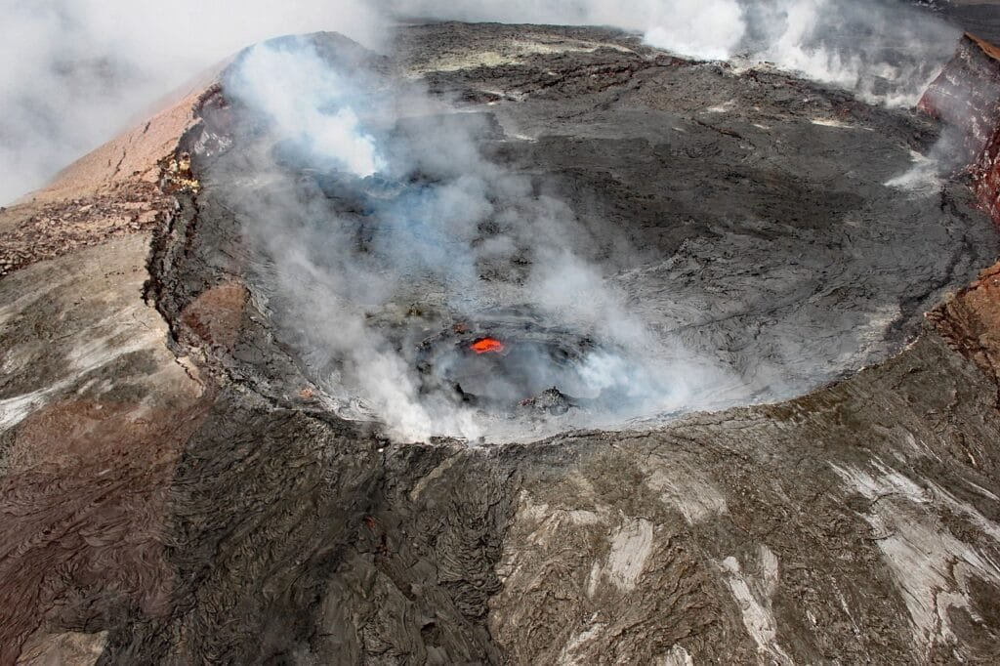
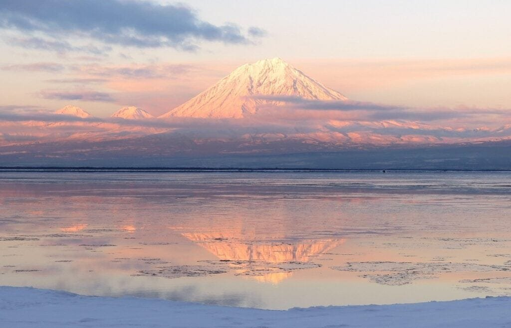

Volcanoes have long captured the imagination and curiosity of people around the world. These powerful forces of nature can bring about both destruction and creation, and understanding them is crucial for predicting and mitigating their risks. From the fiery eruptions of lava and ash to the rich soil they leave in their wake, volcanoes hold a complex and fascinating place in the natural world. In this article, we will explore the different types of volcanoes, their hazards, and the benefits they bring. By delving into the intricacies of these geological wonders, we can gain a deeper understanding of their impact on the world around us.

This image is property of pixabay.com.

## Understanding Volcanoes

Volcanoes are fascinating natural phenomena that have captured the curiosity and awe of humankind for centuries. In order to truly appreciate and grasp the significance of these geological wonders, it is important to first establish a basic understanding of what they are, how they are formed, and the intricate processes involved in their eruption.

### Defining volcanoes

A volcano can be defined as an opening in the Earth's crust through which molten rock, gases, and debris are expelled, resulting in the eruption of lava and ash. These eruptions can manifest in various forms and intensities, ranging from gentle lava flows to explosive pyroclastic blasts. Volcanoes can be found on land or submerged beneath the ocean's surface, and they exist in diverse shapes and sizes.

### How volcanoes are formed

Volcanoes are primarily formed by the movement and interaction of the Earth's tectonic plates. When two plates collide, one plate can be forced beneath the other, creating a subduction zone. The subduction of the oceanic crust into the mantle generates intense heat and pressure, causing the melting of rock, which then rises to the surface through volcanic vents. Volcanoes can also form at hotspots, which are areas of the Earth's mantle where molten rock, or magma, is consistently produced. The magma pushes its way through the Earth's crust, eventually reaching the surface and creating a volcano.

### Understanding the process of volcanic eruption

The eruption of a volcano is a complex and dynamic event that involves a combination of physical processes and factors. It begins when the pressure of the magma within the volcano exceeds the strength of the surrounding rocks, leading to the rupture of the volcanic vent. The eruption can occur in various ways, depending on the viscosity of the magma and the presence of gases.

When magma has low viscosity, meaning it flows easily, it can erupt as lava flows. These eruptions are typically non-explosive and relatively harmless. However, when magma is highly viscous, it tends to trap gases within it. As the magma rises to the surface, the decrease in pressure causes the gases to expand rapidly and violently, resulting in explosive eruptions that eject ash, debris, and pyroclastic material.

## Types of Volcanoes

Volcanoes come in different shapes and sizes, each with its own distinctive features and formation processes. By understanding these various types, we can gain insight into the underlying geological processes that give rise to them.

### Cinder cone volcanoes

[Cinder cone](https://magmamatters.com/the-birth-of-new-land-understanding-cinder-cones/) volcanoes, sometimes referred to as scoria cones, are the simplest and most common type of volcano. They are typically small and steep-sided with a bowl-shaped crater at the summit. Cinder cone volcanoes form from the ejection of fragmented lava, called cinders or scoria, during explosive eruptions. These eruptions are often short-lived and produce lava flows that tend to be relatively small in scale.

### Composite volcanoes

Composite volcanoes, also known as stratovolcanoes, are large and imposing structures characterized by their steep slopes and symmetrical shape. They are composed of layers of lava, ash, and other volcanic materials that have built up over time. Composite volcanoes are associated with explosive eruptions, which eject pyroclastic material and form ash clouds that can travel great distances.

### Shield volcanoes

Shield volcanoes are broad, low-profile volcanoes characterized by gentle slopes and a shape reminiscent of a warrior's shield. They are formed by the accumulation of highly fluid lava flows that travel long distances before solidifying. Shield volcanoes are typically associated with effusive eruptions, meaning the lava flows easily and does not explode out violently. The eruptions of shield volcanoes are generally non-explosive but can still produce impressive lava flows.

### Lava domes

Lava domes, as the name suggests, are volcanic formations that consist of viscous lava that piles up around the volcanic vent. Unlike other types of volcanoes that erupt explosively, lava domes are the result of slow and continuous extrusion of lava. The lava is often too thick to flow far from the vent, causing it to pile up and form a steep-sided dome-shaped structure.

Understanding the distinct features and formation processes of different types [of volcanoes](https://magmamatters.com/understanding-volcanic-formation-a-comprehensive-guide/ "Understanding Volcanic Formation: A Comprehensive Guide") is crucial in unraveling the mysteries of these natural wonders. It allows scientists to analyze the underlying geological processes and predict the potential hazards associated with each type.

<iframe width="560" height="315" src="https://www.youtube.com/embed/BCm6xTZj-vk" frameborder="0" allow="accelerometer; autoplay; encrypted-media; gyroscope; picture-in-picture" allowfullscreen></iframe>

  

## Geographic Distribution of Volcanoes

Volcanoes are not evenly distributed across the Earth's surface. They tend to occur in specific regions, offering us insights into the dynamic nature of the Earth's crust and the mechanisms behind their formation. Exploring their geographic distribution is key in gaining a deeper understanding of the forces at play.

### Volcanoes in the Ring of Fire

One of the most prominent volcanic regions on Earth is the "Ring of Fire," a vast area encircling the Pacific Ocean. This region is home to approximately 75% of the world's active volcanoes and is known for its intense volcanic and seismic activity. The Ring of Fire is the result of the convergent boundaries of several tectonic plates, including the Pacific Plate, the North American Plate, and the Eurasian Plate. These boundaries create subduction zones where oceanic crust is forced beneath continental crust, leading to the formation of volcanic arcs.

### Volcanoes in Hawaii and other island chains

Hawaii, located in the central Pacific Ocean, is renowned for its beautiful volcanic landscapes. The islands of Hawaii are formed by shield volcanoes, which are the result of a hot spot in the Earth's mantle. A hot spot is an area of magma upwelling that remains stationary relative to moving tectonic plates. As the Pacific Plate moves over the hot spot, a chain of volcanoes is formed, with each island representing a different stage of volcanic activity.

Other island chains, such as the Galapagos Islands and the Canary Islands, also exemplify volcanic activity associated with hot spots. These volcanic islands are formed as the tectonic plate moves over a stationary mantle plume, resulting in a chain of volcanic eruptions.

### Volcanoes along divergent plate boundaries

Divergent plate boundaries are areas where tectonic plates are moving apart, creating spaces where magma from the mantle can rise to the Earth's surface. These boundaries are often associated with volcanic activity, as the upward movement of magma generates volcanic eruptions. The Mid-Atlantic Ridge, for example, is a divergent plate boundary where volcanic activity occurs as new oceanic crust is formed.

Understanding the geographic distribution of volcanoes helps us comprehend the interaction between tectonic plates and the underlying mantle. It highlights the dynamic nature of our planet and provides valuable insights into areas prone to volcanic activity.

## Eruption Patterns and Causes

Volcanic eruptions are complex events influenced by a range of factors, including the composition and viscosity of the magma, the presence of gases, and the structure of the volcano itself. Analyzing these factors and understanding the patterns of volcanic eruptions can provide crucial information for predicting and mitigating volcanic hazards.

### Analyzing factors that influence eruption patterns

Several factors can influence the eruption patterns of volcanoes. The composition of the magma plays a significant role, with silica content determining the viscosity of the magma. Magma with high silica content is more viscous and can lead to explosive eruptions due to the trapped gases.

The gas content of the magma is another important factor. Volcanic gases, particularly water vapor, carbon dioxide, and sulfur dioxide, can dissolve in magma and accumulate to high pressures. When the magma reaches the surface, the sudden release of pressure can cause explosive eruptions.

The size and shape of the volcanic vent also play a role in eruption patterns. Narrow vents can help to focus the force of an eruption, leading to more explosive eruptions. Additionally, the presence of secondary volcanic vents can influence the direction and intensity of an eruption.

### Looking at different types of volcanic eruptions

Volcanic eruptions can be classified into several types, each characterized by different eruption styles and intensities. Some of the most common types include effusive eruptions, explosive eruptions, phreatomagmatic eruptions, and volcanic fissure eruptions.

Effusive eruptions occur when magma flows steadily and gently from the volcanic vent. These eruptions typically result in the formation of lava flows, which can advance slowly and cover vast areas with molten rock. Effusive eruptions are often associated with shield volcanoes and hotspots.

Explosive eruptions, on the other hand, are characterized by violent and forceful ejections of magma, gases, and pyroclastic material. These eruptions can produce towering ash clouds, pyroclastic flows, and even volcanic bombs that are propelled far from the volcano.

Phreatomagmatic eruptions occur when magma comes into contact with water, either from groundwater or bodies of water. The sudden interaction between the magma and water results in a highly explosive eruption, as the water rapidly vaporizes and expands. These eruptions can produce ash clouds, volcanic ash fall, and even lahars, which are volcanic mudflows.

Volcanic fissure eruptions are characterized by the eruption of magma from elongated fractures, or fissures, in the Earth's crust. These eruptions can produce extensive lava flows that can cover large areas with molten rock. Fissure eruptions often occur in volcanic areas with significant tectonic activity.

Understanding the different types of volcanic eruptions and the factors that influence their patterns is crucial in assessing their potential hazards and developing effective mitigation strategies.

This image is property of pixabay.com.

## Volcanic Hazards

Volcanic eruptions can pose significant hazards to both human populations and the environment. The destructive power of volcanic activity can manifest in various forms, including lava flows, volcanic ash and gas, pyroclastic flows and surges, as well as lahars and jökulhlaups.

### Lava flows

One of the most easily recognizable and awe-inspiring volcanic hazards is the effusion of lava flows. Lava flows can travel at varying speeds, depending on the viscosity of the magma, and have the potential to engulf and destroy everything in their path. Structures, vegetation, and even entire communities can be consumed by the relentless advance of molten rock.

### Volcanic ash and gas

Volcanic eruptions can release massive amounts of ash and gases into the atmosphere. Volcanic ash is made up of fine particles of pulverized rock and glass, which can cause respiratory problems and pose a threat to agricultural crops and livestock. The gases released during eruptions, such as sulfur dioxide, can contribute to air pollution and have detrimental effects on human health.

### Pyroclastic flows and surges

Pyroclastic flows are turbulent mixtures of hot gas, ash, and volcanic debris that can travel at high speeds down the slopes of a volcano. These flows can reach temperatures of several hundred degrees Celsius and can be devastating, instantly incinerating everything in their path. Pyroclastic surges, which are similar to [pyroclastic flows but travel](https://magmamatters.com/the-environmental-impact-of-volcanic-eruptions-2/ "The Environmental Impact of Volcanic Eruptions") across the ground rather than down slopes, can also pose significant hazards.

### Lahars and jökulhlaups

Lahars are volcanic mudflows formed when volcanic ash, debris, and water mix. These fast-moving flows can travel down river valleys, sweeping away anything in their path. Lahars can be triggered by heavy rainfall or the melting of snow and ice during an eruption, and they pose a significant threat to populated areas downstream from volcanoes.

Jökulhlaups, also known as glacial outburst floods, occur when a volcano erupts beneath a glacier or ice cap. The intense heat melts the surrounding ice, generating a sudden release of water that can cause catastrophic flooding downstream.

Understanding and being aware of these volcanic hazards is crucial in developing effective mitigation strategies and ensuring the safety of those living in volcanic regions.

## Understanding the Impact of Volcanic Eruptions

Volcanic eruptions can have profound and lasting effects on both human populations and the environment. These impacts can be short-term or long-term, immediate or delayed, and can vary greatly depending on the magnitude and type of eruption.

### Effects on human populations

The impact of volcanic eruptions on human populations can be catastrophic. Entire communities can be displaced or destroyed by lava flows, pyroclastic flows, or lahars. The release of volcanic gases, such as sulfur dioxide, can cause respiratory problems and other health issues, particularly for those with pre-existing conditions.

In addition to immediate physical dangers, volcanic eruptions can also have long-term effects on livelihoods and economies. Ashfall can damage agricultural crops, contaminate water sources, and disrupt transportation and infrastructure. Tourism, a vital economic sector for many volcanic regions, can be severely impacted by the closure of popular tourist sites and the negative perception of volcanic hazards.

### Impact on the environment

Volcanic eruptions can have far-reaching environmental consequences. Ash and gas ejected during eruptions can alter atmospheric conditions, leading to changes in weather patterns and climate. Volcanic ash, which contains a mixture of minerals and nutrients, can enrich and fertilize the soil, providing long-term benefits for agriculture and plant growth.

However, the deposition of large amounts of volcanic ash can also have negative effects. Ash can cover and smother vegetation, disrupt ecosystems, and pose a threat to wildlife. The destruction of forests and other habitats can result in the loss of biodiversity and have long-lasting ecological impacts.

### Long-term and short-term effects

The effects of volcanic eruptions can span both short-term and long-term timeframes. Short-term effects, such as immediate damage to infrastructure and the loss of lives, can be devastating and require immediate response and recovery efforts.

Long-term effects, on the other hand, can persist for years or even decades after an eruption. These effects may include the erosion of volcanic ash, which can lead to increased sedimentation in rivers and lakes. The deposition of volcanic ash on glaciers and ice caps can also accelerate their melting, contributing to rising sea levels and altering regional water resources.

### Significant incidents of volcanic eruptions

Throughout history, there have been numerous significant incidents of volcanic eruptions that have left lasting impacts on societies and the environment. Mount Vesuvius, located near the modern-day city of Naples in Italy, famously erupted in 79 AD, burying the cities of Pompeii and Herculaneum under layers of ash and preserving them for centuries. The eruption of Mount Vesuvius serves as a reminder of the destructive power of volcanic activity and the importance of being prepared.

Another notable eruption is the 1980 eruption of Mount St. Helens in the United States. This explosive eruption resulted in the collapse of the volcano's north slope, triggering a massive landslide and lateral blast that devastated the surrounding area. The eruption of Mount St. Helens demonstrated the need for effective monitoring and early warning systems to mitigate the impacts of volcanic hazards.

The eruption of Mount Pinatubo in the Philippines in 1991 is another significant case study. This eruption was one of the largest volcanic eruptions of the 20th century and led to the temporary cooling of global temperatures due to the release of ash and gases into the atmosphere. The eruption of Mount Pinatubo highlighted the global implications of volcanic activity and the importance of international cooperation in monitoring and studying volcanic phenomena.

This image is property of pixabay.com.

## Safety Measures and Risk Mitigation

Given the potential hazards associated with volcanic eruptions, it is crucial to develop and implement safety measures and risk mitigation strategies. This involves monitoring volcanic activity, predicting eruptions, and engaging with communities at risk.

### Techniques of monitoring and predicting volcanic activity

Monitoring volcanic activity is essential for understanding the behavior and potential hazards of a volcano. Techniques such as seismology, ground deformation measurements, and gas monitoring can provide valuable data on the internal dynamics of a volcano. Remote sensing technologies, such as satellite imagery and aerial surveys, can also contribute to monitoring efforts.

Predicting volcanic eruptions with precision remains a formidable challenge. However, advances in technology and our understanding of volcanic processes have improved the ability to forecast volcanic activity. Monitoring networks and early warning systems can provide crucial information and give communities at risk a chance to evacuate and prepare.

### Creating disaster management plans

Effective disaster management plans are vital for reducing the impacts of volcanic eruptions on human populations. These plans involve the coordination of various stakeholders, including government agencies, emergency services, and community organizations.

Disaster management plans should include clear protocols for evacuation, emergency response, and the provision of essential services. They should also outline strategies for communication and public education, ensuring that affected communities are well-informed about volcanic hazards and know how to respond in the event of an eruption.

### Role of community engagement in risk mitigation

Community engagement plays a critical role in risk mitigation efforts. Preparing communities for volcanic hazards involves raising awareness, providing education, and fostering a sense of resilience and preparedness.

Engaging with local communities allows for the sharing of traditional knowledge and localized information that can complement scientific data. It also helps to build trust, foster cooperation, and ensure that the unique needs and vulnerabilities of the community are addressed in disaster management plans.

## Volcanic Benefits

While volcanic eruptions can have devastating consequences, they also bring about certain benefits to the natural environment and human societies. Recognizing these benefits can contribute to a more comprehensive understanding of volcanoes and their role in shaping our world.

### Fertility of volcanic soil

One of the most significant benefits of volcanic eruptions is the fertility of the soil they leave behind. Volcanic ash contains a range of minerals and nutrients that can enrich the soil, making it highly fertile for agricultural purposes. Many volcanic regions, such as the fertile slopes of Mount Etna in Sicily, have been harnessed for agriculture for centuries, producing abundant crops and supporting local economies.

### Geothermal energy

Volcanic activity can also contribute to the generation of geothermal energy. [Geothermal energy](https://magmamatters.com/geothermal-energy-and-its-volcanic-origins/ "Geothermal Energy and Its Volcanic Origins") is harnessed by tapping into the heat stored beneath the Earth's surface and using it to generate electricity or for direct use in heating and cooling systems. Areas with active volcanoes or geothermal hotspots can provide a sustainable and renewable source of energy, reducing reliance on fossil fuels and mitigating the impact of climate change.

### Volcanic materials in industry

Volcanic materials, such as pumice and volcanic ash, have various industrial applications. Pumice, a lightweight, porous volcanic rock, is widely used in the manufacturing of construction materials, abrasives, and beauty products. Volcanic ash can be utilized for soil stabilization, road construction, and as an ingredient in cement and concrete production.

### Tourism and recreation

Volcanic landscapes often attract tourists and nature enthusiasts from around the world. The unique geological features, such as craters, lava tubes, and lava lakes, offer opportunities for exploration and adventure. Active volcanoes, when safely accessible, can provide visitors with an up-close experience of the power and beauty of nature.

## Studying Volcanology

The field of volcanology plays a crucial role in deepening our understanding of volcanic processes, hazards, and the impacts of volcanic eruptions. Volcanologists are scientists who study volcanoes, their behavior, and the underlying geological processes that drive them. Through their research, they contribute to the development of effective monitoring, prediction, and risk mitigation strategies.

### Understanding the role of volcanologists

Volcanologists employ a wide range of scientific disciplines, including geology, seismology, geochemistry, and remote sensing, to study the complex dynamics of volcanic systems. Their research involves fieldwork, laboratory analysis, and the interpretation of data collected from monitoring networks.

Volcanologists also play a crucial role in communicating scientific findings to policymakers, emergency managers, and the public. They help to assess volcanic hazards, develop hazard maps, and provide recommendations for mitigating risks associated with volcanic activity.

### Tools and techniques in volcanology

Volcanologists utilize a variety of tools and techniques to study volcanoes. Seismic monitoring networks help to detect and analyze the seismicity associated with volcanic activity, providing information on magma movement and potential eruption dynamics. Ground deformation measurements, such as GPS and satellite observations, can reveal changes in the shape of a volcano, indicating the accumulation or withdrawal of magma.

Gas monitoring stations are installed near active [volcanoes to measure the composition and flux of volcanic gases](https://magmamatters.com/the-art-and-science-of-volcano-monitoring/ "The Art and Science of Volcano Monitoring"). These measurements can provide insights into ongoing volcanic processes and can help in the prediction of eruptions. Remote sensing technologies, such as satellite imagery and aerial surveys, allow for the monitoring and mapping of volcanic activity from a distance.

### Importance of research in predicting and mitigating volcanic hazards

Research in volcanology is vital for improving our ability to predict and mitigate volcanic hazards. Through the study of past eruptions, ongoing monitoring efforts, and the development of sophisticated models, scientists can gain a deeper understanding of volcanic processes. This understanding enables them to make more accurate predictions about future eruptions and to develop strategies for minimizing the impacts on human populations and the environment.

Research also plays a crucial role in improving early warning systems, hazard mapping, and response protocols. By continually advancing our knowledge of volcanoes, we can enhance our ability to protect vulnerable communities, reduce the loss of lives and property, and foster sustainable development in volcanic regions.

## Case Studies

Exploring specific case studies of volcanic eruptions can provide valuable insights into the unique characteristics and impacts of different volcanic events. These case studies offer opportunities to analyze the eruption dynamics, societal responses, and long-term effects of volcanic activity.

### Study of the eruption of Mount Vesuvius

The eruption of Mount Vesuvius in 79 AD remains one of the most well-known and studied volcanic events in history. The cities of Pompeii and Herculaneum were buried under a thick layer of ash, preserving their buildings, artifacts, and even the remains of their inhabitants. Through excavations and scientific analysis, researchers have gained valuable insights into the daily life, culture, and destruction caused by the eruption. The study of Mount Vesuvius has not only contributed to our understanding of volcanic hazards but also provided a unique window into the past.

### Observations from the eruption of Mount St. Helens

The 1980 eruption of Mount St. Helens in the state of Washington, USA, had a profound impact on the field of volcanology. The lateral blast and subsequent eruption resulted in the loss of lives, the destruction of vast areas of forest, and significant changes to the local landscape. The eruption of Mount St. Helens provided scientists with a wealth of data on volcanic processes, eruption dynamics, and the recovery of ecosystems. The insights gained from this case study have informed our understanding of volcanic hazards and the development of monitoring and response systems.

### Analyzing the long-term effects of the eruption of Mount Pinatubo

The 1991 eruption of Mount Pinatubo in the Philippines was one of the most powerful volcanic eruptions of the 20th century. The eruption released vast amounts of ash and gases into the atmosphere, resulting in global cooling and changes in weather patterns. The case study of Mount Pinatubo has helped scientists to better understand the impacts of volcanic eruptions on global climate and atmospheric chemistry. The eruption also demonstrated the importance of international collaboration in monitoring and mitigating volcanic hazards.

By examining these and other case studies, scientists can gain valuable insights into the complex nature of volcanic eruptions and develop more effective strategies for predicting and mitigating volcanic hazards.

In conclusion, understanding volcanoes is crucial for comprehending the dynamic nature of our planet and mitigating the risks associated with volcanic activity. By defining what volcanoes are and how they are formed, exploring the various types and their distinctive features, and examining their geographic distribution, eruption patterns, and associated hazards, we can gain valuable insights into the fascinating world of volcanoes. Additionally, recognizing the benefits that volcanoes bring, such as the fertility of volcanic soil, geothermal energy, and their importance to tourism and recreation, allows us to appreciate their positive aspects. Lastly, the study of volcanology, case studies of significant eruptions, and research endeavors in predicting and mitigating volcanic hazards contribute to our understanding of these natural wonders and our ability to safeguard communities living in volcanic regions.

