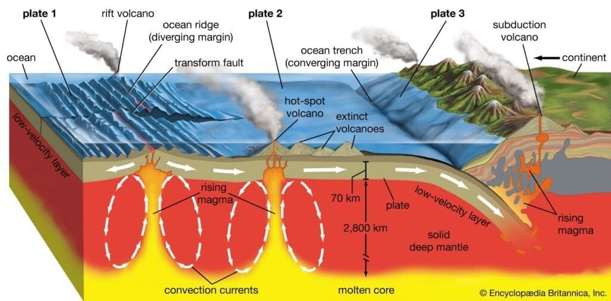
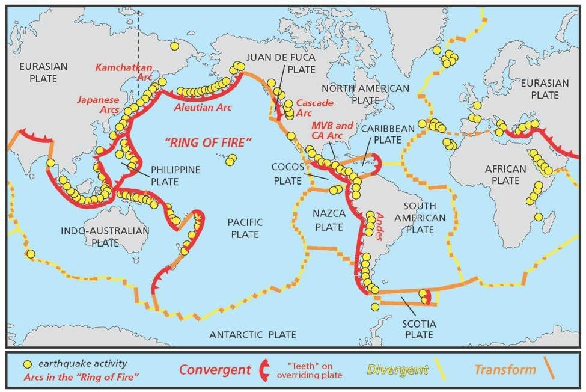
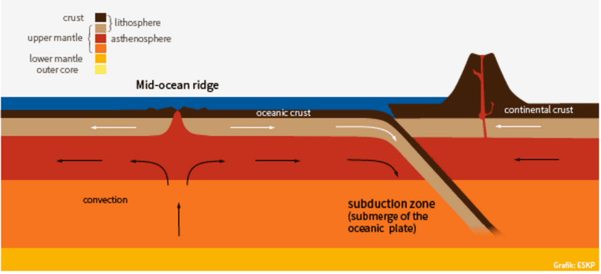

Volcanic eruptions at plate boundaries are a fascinating and powerful force of nature. These eruptions occur when molten rock, gases, and debris escape to the earth's surface, causing the eruption of lava and ash. This phenomenon is commonly observed at sites along plate boundaries, hotspots under the earth's crust, or rift zones where the tectonic plates are moving apart. The locations where tectonic plates meet, such as the renowned "Ring of Fire" encircling the Pacific Ocean, are particularly prone to volcanic activity. On the other hand, shield volcanoes in Hawaii form gradually over hot spots deep underground and erupt with less explosive force. Understanding the different types of volcanoes, their geographic distribution, eruption causes, hazards, and benefits can provide valuable insights for predicting future volcanic activity and mitigating risks to surrounding communities. Let's explore the intriguing world of volcanic eruptions at plate boundaries and uncover the mysteries lying beneath the Earth's surface.

This image is property of www.bgs.ac.uk.

## Understanding Plate Tectonics

Plate tectonics is the scientific theory that explains the movement of the Earth's lithosphere, which is divided into several large plates. These plates float on the semi-fluid asthenosphere below, and their movement is driven by convection currents in the mantle. This concept of plate tectonics helps us understand how and why volcanoes are formed at plate boundaries.

## Types of Tectonic Plates

There are three main types of tectonic plates: convergent, divergent, and transform plates.

1. Convergent Plates: When two plates collide, it creates a convergent plate boundary. There are three subtypes of convergent boundaries: oceanic-oceanic, oceanic-continental, and continental-continental. At these boundaries, one plate is usually forced beneath the other in a process called subduction. This subduction zone is a common site for volcanic activity.
    
2. Divergent Plates: Divergent plate boundaries occur when two plates move away from each other. This process allows magma from the asthenosphere to rise and fill the gap, creating new crust. The volcanic activity at these boundaries is usually characterized by gentle eruptions that produce basaltic lava.
    
3. Transform Plates: Transform plate boundaries occur when two plates slide past each other horizontally. Unlike convergent and divergent boundaries, volcanic activity is not common at these boundaries. Instead, transform boundaries are known for their earthquakes.
    

This image is property of cdn.britannica.com.

## Movement of Tectonic Plates

The movement of tectonic plates is driven by convection currents in the mantle. These currents occur due to the heat generated by the radioactive decay of elements within the Earth. As the hot mantle material rises, it creates convection cells that push the plates apart at divergent boundaries and pull them together at convergent boundaries. The speed at which plates move can vary, ranging from a few millimeters to several centimeters per year.

## Formation of Volcanoes at Plate Boundaries

Volcanoes are often formed at plate boundaries due to the movement of tectonic plates. The interaction between these plates can lead to the release of molten rock, gases, and debris, resulting in volcanic eruptions. There are three main types of plate boundaries where volcanoes can form: convergent plate boundaries, divergent plate boundaries, and transform plate boundaries.

### Convergent Plate Boundaries

Convergent plate boundaries occur when two tectonic plates collide. This collision can result in subduction, where one plate is forced beneath the other. The subduction zone is often characterized by intense volcanic activity. As the subducting plate sinks into the mantle, it undergoes partial melting, creating a magma chamber. This magma eventually rises to the surface, erupting as a volcano.

### Divergent Plate Boundaries

Divergent plate boundaries occur when two tectonic plates move away from each other. This movement allows magma from the asthenosphere to rise and fill the gap, creating new crust. The volcanic activity at divergent boundaries is usually less explosive and more characterized by gentle eruptions that produce basaltic lava.

### Transform Plate Boundaries

Transform plate boundaries occur when two tectonic plates slide past each other horizontally. Unlike convergent and divergent boundaries, volcanic activity is not common at transform boundaries. Instead, transform boundaries are characterized by frequent earthquakes caused by the friction between the plates.

This image is property of www.nps.gov.

## Examples of Volcanoes at Plate Boundaries

Volcanoes can be found all over the world, but there are certain areas that are particularly known for their volcanic activity. Here are some examples of volcanic regions that are located at plate boundaries.

### Ring of Fire

The Ring of Fire is a major area in the basin of the Pacific Ocean where a large number of earthquakes and volcanic eruptions occur. It is a result of the movement and interactions of several tectonic plates, including the Pacific Plate, the Nazca Plate, and the Philippine Sea Plate. The volcanoes in the Ring of Fire are often explosive and produce ash clouds, pyroclastic flows, and lahars.

### Mid-Atlantic Ridge

The Mid-Mid-Atlantic Ridge is a divergent plate boundary that runs down the center of the Atlantic Ocean. Along this ridge, volcanic activity occurs as new crust is formed. The volcanic eruptions at the Mid-Atlantic Ridge tend to be relatively gentle, creating underwater mountains and seafloor spreading.

### East African Rift Valley

The East African Rift Valley is a divergent plate boundary that extends for thousands of kilometers from the Red Sea through Ethiopia, Kenya, Tanzania, and Mozambique. This region is known for its volcanic activity, with volcanoes such as Mount Kilimanjaro and Mount Nyiragongo being located along the Rift Valley. These volcanoes can produce both effusive and explosive eruptions.

## Types of Volcanic Eruptions

Volcanic eruptions can vary in their intensity and the type of materials they release. The following are three main types of volcanic eruptions.

### Explosive Eruptions

Explosive eruptions are characterized by violent, high-pressure eruptions that produce ash clouds, pyroclastic flows, and volcanic bombs. These eruptions are caused by the buildup of gas and pressure in the magma chamber. When the pressure becomes too great, the magma explosively ejects from the volcano. Examples of volcanoes known for their explosive eruptions include Mount St. Helens in the United States and Mount Pinatubo in the Philippines.

### Effusive Eruptions

Effusive eruptions are more gentle and characterized by the slow and steady flow of lava from the volcano. These eruptions occur when the magma has a low viscosity, allowing it to flow easily. Effusive eruptions often create shield volcanoes, such as those found in Hawaii. The lava flows from these eruptions can travel long distances before solidifying.

### Phreatomagmatic Eruptions

Phreatomagmatic eruptions occur when magma comes into contact with water, resulting in explosive eruptions. The water can be from a nearby body of water, a glacier, or groundwater. When the magma interacts with the water, it rapidly turns into steam, causing a sudden increase in pressure and resulting in a violent explosion. The interaction between the magma and water can also create ash clouds, volcanic bombs, and pyroclastic flows.

This image is property of images.nationalgeographic.org.

## Factors Influencing Eruption Patterns

Various factors can influence the eruption patterns of volcanoes. Understanding these factors helps scientists predict volcanic activity and assess the potential hazard level. The three main factors that influence eruption patterns are lava viscosity, gas content, and the amount of magma and pressure buildup.

### Lava Viscosity

Lava viscosity refers to how easily lava flows. Lava can range from very runny (low viscosity) to sticky and thick (high viscosity). The viscosity of the lava is determined by its composition and temperature. High viscosity lava tends to trap gases, leading to more explosive eruptions. In contrast, low viscosity lava can flow more easily, resulting in gentler eruptions.

### Gas Content

Volcanic eruptions are driven by the release of gases from the magma. The gas content of the magma can vary depending on the composition and depth. High gas content in the magma can result in explosive eruptions, as the pressure builds up until it is released with tremendous force. On the other hand, low gas content can lead to more effusive eruptions with slower lava flows.

### Amount of Magma and Pressure Build-up

The amount of magma and the pressure build-up in the magma chamber also play a significant role in eruption patterns. As the magma chamber fills with molten rock, the pressure increases. When the pressure becomes too great, the magma can explosively erupt from the volcano. The volume of magma and the rate of its ascent can determine the intensity and duration of the eruption.

## Hazards of Volcanic Eruptions

Volcanic eruptions can pose various hazards to both the environment and human populations. Understanding and preparing for these hazards is crucial for mitigating their impact. Here are some of the hazards associated with volcanic eruptions.

### Pyroclastic Flows

Pyroclastic flows are dense, fast-moving mixtures of hot gases, ash, and volcanic rocks. These flows can travel down the slopes of a volcano at high speeds, reaching temperatures of several hundred degrees Celsius. Pyroclastic flows can devastate everything in their path, destroying buildings, vegetation, and causing severe burns to those caught in their way.

### Volcanic Ash Fall

Volcanic ash is small particles of rock and glass produced during volcanic eruptions. Ash can be carried by the wind and fall over large areas, sometimes thousands of kilometers away from the volcano. Volcanic ash can disrupt transportation systems, contaminate water supplies, and cause respiratory problems in humans and animals.

### Lahars and Mudflows

Lahars and mudflows are mixtures of water, volcanic debris, and ash that flow down the slopes of a volcano during or after an eruption. These flows can be triggered by heavy rainfall or the melting of snow and ice on the volcano. Lahars and mudflows can travel at high speeds, burying anything in their path and causing significant damage to infrastructure and communities.

This image is property of www.eskp.de.

## Beneficial Aspects of Volcanic Eruptions

While volcanic eruptions can be devastating, they also bring some beneficial aspects to the Earth and its ecosystems. These positive effects highlight the dynamic nature of our planet and its ability to shape the environment in both destructive and constructive ways. Here are some beneficial aspects of volcanic eruptions.

### Creation of New Land

Volcanic eruptions can create new landforms, such as islands and mountains. When lava flows and cools, it solidifies and forms new land. Over time, this new land can become habitat for various plant and animal species, contributing to biodiversity. The Hawaiian Islands, for example, were formed through volcanic activity and are home to unique and diverse ecosystems.

### Enrichment of Soil Nutrients

Volcanic eruptions can enrich the soil with nutrients necessary for plant growth. When lava breaks down and weathers, it releases minerals and elements like potassium, phosphorus, and nitrogen into the soil. These nutrients can enhance the fertility of the soil, making it suitable for agriculture. Volcanic soils, or "volcanic ash soils," are known for their high fertility and are often used for farming.

### Generation of Geothermal Energy

Volcanic activity can also lead to the generation of geothermal energy. Geothermal energy is the heat that comes from the Earth's interior, and it can be harnessed for electricity generation and heating. Volcanic regions often have high geothermal potential due to the presence of hot fluids and magma chambers. Geothermal power plants harness this heat, converting it into usable energy without the emission of greenhouse gases.

## Role of Volcanoes in Climate Change

Volcanic eruptions can have a significant impact on the Earth's climate and contribute to both short-term and long-term changes. Understanding the role of [volcanoes in climate change](https://magmamatters.com/geothermal-energy-and-its-volcanic-origins/ "Geothermal Energy and Its Volcanic Origins") is crucial for predicting future climate patterns and assessing the overall impact of volcanic activity on the environment.

### Release of Greenhouse Gases

Volcanic eruptions release large amounts of greenhouse gases into the atmosphere. The most common greenhouse gas released during volcanic eruptions is carbon dioxide (CO2). While volcanic emissions of CO2 are significantly smaller than human-caused emissions, they can still contribute to the greenhouse effect and global warming. Volcanic eruptions can also release other greenhouse gases like methane and sulfur dioxide, which can have additional impacts on climate.

### Creation of Volcanic Winters

Volcanic eruptions can cause temporary cooling of the Earth's climate by releasing large amounts of sulfur dioxide into the stratosphere. The sulfur dioxide forms tiny particles called aerosols, which reflect sunlight back into space. This phenomenon can lead to a decrease in global temperatures for a period of time, known as a volcanic winter. Famous examples of volcanic winters include the eruption of Mount Pinatubo in 1991 and the eruption of Mount Tambora in 1815, which led to the "Year Without a Summer."

### Impact on Global Temperatures

Volcanic eruptions can have both short-term and long-term impacts on global temperatures. In the short term, the release of sulfur dioxide and aerosols can cause a cooling effect, as mentioned earlier. However, in the long term, the greenhouse gases emitted during volcanic eruptions can contribute to warming the atmosphere. The overall impact of volcanic activity on global temperatures depends on the magnitude and frequency of eruptions.

## Monitoring and Predicting Volcanic Activity

Monitoring and predicting volcanic activity is crucial for saving lives, protecting property, and mitigating the impact of volcanic eruptions. Scientists use various tools and techniques to monitor volcanic activity and gather data for eruption prediction. Here are some common methods used in monitoring and predicting volcanic activity.

### Seismic Activity Monitoring

Seismic activity monitoring involves the continuous recording of earthquakes near a volcano. Volcanic earthquakes are often caused by the movement of magma and fluids beneath the surface. By analyzing the frequency, magnitude, and location of these earthquakes, scientists can detect any changes indicating an impending eruption.

### Gas Emission Measurements

Measuring gas emissions from a volcano can provide valuable information about its internal activity. Volcanic gases, such as [sulfur dioxide and carbon](https://magmamatters.com/the-art-and-science-of-volcano-monitoring/ "The Art and Science of Volcano Monitoring") dioxide, can be sampled and analyzed to determine the amount and composition of gases being released. Changes in gas emissions can indicate an increase in volcanic activity and help in eruption prediction.

### Satellite Imagery

Satellite imagery allows scientists to monitor volcanoes from space. Satellites equipped with specialized sensors can detect changes in temperature, gases, and topography on the Earth's surface. This data helps scientists monitor volcanic activity, track lava flows, and identify potential hazards. Satellite imagery is particularly useful for remote volcanoes or those located in inaccessible areas.

## Mitigation Measures and Emergency Preparedness

To minimize the impact of volcanic eruptions, it is essential to have mitigation measures and emergency preparedness plans in place. These measures can help protect people, infrastructure, and the environment from the hazards associated with volcanic activity. Here are some key strategies for mitigation and emergency preparedness.

### Community Education and Awareness

Community education and awareness play a crucial role in preparing for volcanic eruptions. Educating the public about the signs and risks of volcanic activity can help them make informed decisions during an eruption. This can include providing information on evacuation routes, emergency shelters, and communication channels. Community education also involves raising awareness about volcanic hazards and promoting preparedness measures, such as creating emergency supply kits and developing family emergency plans.

### Evacuation Plans and Drills

Developing evacuation plans and conducting drills are essential for preparing communities living near volcanoes. These plans outline evacuation routes, safe areas, and protocols for emergency response. Regular drills allow residents to familiarize themselves with evacuation procedures and practice the necessary actions to stay safe during an eruption. It is crucial for local authorities to coordinate with the community and ensure that evacuation plans are well-communicated and accessible to everyone.

### Infrastructure Design and Building Codes

Designing infrastructure and establishing building codes that consider volcanic hazards are crucial for reducing the impact of eruptions. Buildings and structures located in volcanic hazard zones should be constructed to withstand potential ash fall, pyroclastic flows, and lahars. Proper infrastructure design can minimize the risk of building collapse and protect essential services such as water supply and transportation networks. Building codes should also take into account volcanic events and provide guidelines for construction in high-risk areas.

In conclusion, understanding plate tectonics is key to comprehending the formation of volcanoes at plate boundaries. Volcanic eruptions occur at convergent, divergent, and transform plate boundaries, each with its distinct characteristics. The types of volcanic eruptions, such as explosive, effusive, and phreatomagmatic, are influenced by factors like lava viscosity, gas content, and pressure build-up. While volcanic eruptions can be hazardous, they also have beneficial aspects such as the creation of new land, enrichment of soil nutrients, and the generation of geothermal energy. Volcanic activity also plays a role in climate change, releasing greenhouse gases and causing temporary cooling effects. Monitoring and predicting volcanic activity through seismic activity monitoring, gas emission measurements, and satellite imagery are crucial for preparedness and mitigation measures. Through community education, evacuation plans, and proper infrastructure design, the impact of volcanic eruptions can be minimized, ensuring the safety of surrounding communities.

