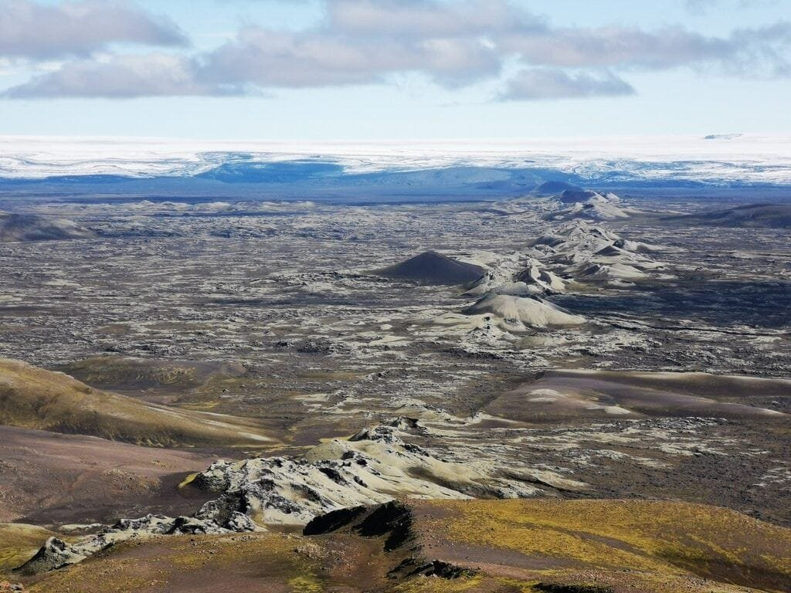

Are you ready to put your knowledge of volcanoes and plate tectonics to the test? In this quiz, you'll be challenged to answer questions about the formation of volcanoes, their eruption patterns, and the impact they have on surrounding communities. From the fiery eruptions in the "Ring of Fire" to the gradual formation of shield volcanoes in Hawaii, this quiz will cover a range of topics related to the fascinating world of volcanoes. So, get ready to show off your expertise and see how well you know these powerful natural phenomena!

This image is property of pixabay.com.

## Concept of Volcanoes

Volcanoes are fascinating natural phenomena that have captivated humans for centuries. These majestic structures form when molten rock, gases, and debris, collectively known as magma, escape to the Earth's surface through vents and fissures. This process, known as volcanic eruption, results in the release of lava, ash, and volcanic gases into the atmosphere.

### Formation of volcanoes

Volcanoes can form in various ways, but the most common mechanism is through the movement and interaction of tectonic plates. The Earth's lithosphere is divided into several large pieces called tectonic plates, and when these plates collide or separate, tremendous forces are exerted, creating pathways for magma to rise.

When two plates converge, one plate may be forced beneath the other in a process called subduction. As the subducting plate sinks deep into the Earth's mantle, it begins to melt due to the intense heat and pressure. The molten rock, now less dense than its surroundings, rises towards the surface, forming a volcanic arc or mountain range.

In other cases, volcanic activity can occur at rift zones, where tectonic plates are moving apart. As the plates separate, magma from the mantle can rise to fill the gap, creating new crust and forming volcanic features like mid-ocean ridges.

### Eruptions and its causes

Volcanic eruptions can occur due to a variety of factors, all of which are related to the movement and behavior of magma beneath the Earth's surface. The primary cause of volcanic eruptions is the buildup of pressure within a magma chamber. As magma accumulates over time, the pressure exerted on the chamber's walls increases, eventually leading to a rupture and the expulsion of magma.

However, the viscosity, or thickness, of the magma also plays a significant role in eruption dynamics. Magma with low viscosity, like basaltic lava, is relatively fluid and can flow easily, resulting in less explosive eruptions. In contrast, magma with high viscosity, such as andesitic or rhyolitic lava, is more sticky and tends to trap gases, leading to more explosive eruptions.

Volcanic eruptions can also be triggered by external factors, such as earthquakes or the collapse of volcanic structures, which can create avalanches of hot debris known as pyroclastic flows. These factors add complexity to the study of volcanoes and make their behavior difficult to predict.

### Types of volcanoes

Volcanoes come in various shapes and sizes, each with its own unique characteristics. Some of the most common types of volcanoes include shield volcanoes, [cinder cones](https://magmamatters.com/the-birth-of-new-land-understanding-cinder-cones/), and composite volcanoes.

Shield volcanoes are characterized by their broad, gently sloping sides and large, flat summits. They form from the accumulation of low-viscosity lava, which flows easily and spreads out over a wide area. The Hawaiian Islands are prime examples of shield volcanoes, with Mauna Loa and Kilauea being two of the most active and well-known shield volcanoes in the world.

Cinder cones, on the other hand, are small, steep-sided volcanoes that typically form from the eruption of gas-rich magma. As the magma is ejected into the air, it breaks apart into small fragments called cinders, which fall back to the ground and accumulate around the vent. Cinder cones are relatively short-lived compared to other types of volcanoes and often have a single vent.

Composite volcanoes, also known as stratovolcanoes, are the most recognizable and potentially dangerous type of volcano. These volcanoes have steep sides and are composed of alternating layers of lava, ash, and other volcanic materials. Composite volcanoes are known for their explosive eruptions, which can result in pyroclastic flows, ash clouds, and lahars. Mount St. Helens and Mount Fuji are famous examples of composite volcanoes.

Understanding the different types of volcanoes and their unique characteristics is crucial for studying and predicting their behavior. By analyzing the formation, eruptions, and types of volcanoes, scientists can gain valuable insights into the inner workings of these incredible natural wonders.

## Volcano Locations and Tectonic Plates

Volcanoes are not randomly distributed across the Earth's surface but are concentrated in specific regions. The distribution of volcanoes is closely tied to the movements and interactions of tectonic plates, the large pieces of the Earth's lithosphere that float on the semi-fluid asthenosphere below.

### Hotspots in Earth's crust and rift zones

Hotspots are areas within the Earth's crust where mantle plumes, or columns of hot material, rise towards the surface. These plumes originate deep within the mantle and can remain fixed while the tectonic plates move above them. As the mantle plume reaches the base of the lithosphere, it can melt the surrounding rock, giving rise to a hotspot volcano.

Hawaii is a prime example of a hotspot volcano chain. The Hawaiian Islands, including the famous islands of Oahu, Maui, and Kauai, were formed by a single hotspot over millions of years. As the Pacific tectonic plate moved northwestward, new islands formed one after another, with the oldest being the island of Kauai and the youngest being the Big Island of Hawaii.

Rift zones, on the other hand, are regions where tectonic plates are pulling apart, creating space for magma to rise and form new crust. The East African Rift Valley is an excellent example of a rift zone, with the African tectonic plate slowly splitting apart. This ongoing process has given rise to several volcanoes, including Mount Kilimanjaro, Mount Nyiragongo, and Mount Meru.

### Volcanoes in the 'Ring of Fire'

The 'Ring of Fire' is a major area in the basin of the Pacific Ocean where a large number of earthquakes and volcanic eruptions occur. This region is known for its high concentration of active volcanoes, accounting for approximately 75% of the world's volcanoes. The 'Ring of Fire' stretches along the coasts of several countries, including Chile, Japan, Indonesia, and the United States.

The 'Ring of Fire' is associated with the presence of subduction zones, where one tectonic plate is forced beneath another. As the subducting plate sinks into the Earth's mantle, it melts, generating magma that rises to the surface and forms volcanoes. The subduction of the Pacific plate beneath the North American plate is responsible for the formation of the Cascade Range in western North America, which includes famous volcanoes such as Mount St. Helens and Mount Rainier.

### Tectonic plates and volcano formation

The movement and interactions of tectonic plates play a critical role in the formation of volcanoes. When two plates collide or separate, the Earth's crust is subjected to intense forces, leading to the formation of volcanic features.

At convergent plate boundaries, where two plates are moving towards each other, volcanic activity is prevalent due to subduction or the collision of continental crust. Along subduction zones, the subducting plate sinks into the mantle, creating a chain of volcanoes known as a volcanic arc. The Andes in South America, the Aleutian Islands in Alaska, and the Japanese archipelago are all examples of volcanic arcs formed at convergent plate boundaries.

In contrast, at divergent plate boundaries, where two plates are moving away from each other, volcanic activity occurs due to the upwelling of magma from the mantle. As the plates separate, magma rises to fill the gap, creating new crust and forming volcanoes. The Mid-Atlantic Ridge, an underwater mountain range stretching through the Atlantic Ocean, is a prominent example of volcanic activity at a divergent plate boundary.

Understanding the connection between tectonic plates and volcano formation is crucial for studying and predicting volcanic activity. By monitoring plate movements and assessing the geological characteristics of specific regions, scientists can gain insights into the potential eruption risks and help mitigate the hazards associated with volcanoes.

This image is property of pixabay.com.

## Characteristics of Eruptions

Volcanic eruptions are mesmerizing natural events that can range from peaceful lava flows to explosive outbursts of ash and pyroclastic flows. The characteristics of eruptions can vary widely depending on several factors, including the viscosity of the magma, the gas content, and the level of pressure buildup within the volcano.

### Factors influencing eruption patterns

The viscosity of the magma is a crucial factor in determining the eruptive behavior of a volcano. Magma viscosity refers to the resistance of the molten rock to flow. Magma with low viscosity, such as basaltic lava, is relatively fluid and can flow easily, leading to gentle, effusive eruptions. In contrast, magma with high viscosity, such as andesitic or rhyolitic lava, is more sticky and has difficulty flowing, resulting in explosive eruptions that can produce pyroclastic flows and volcanic ash clouds.

The gas content in magma also plays a significant role in eruption patterns. As magma rises towards the surface, the decrease in pressure allows dissolved gases, such as water vapor, carbon dioxide, and sulfur dioxide, to form bubbles. When the magma reaches a critical point, these gas bubbles can expand rapidly, leading to a sudden and explosive release of gas and volcanic materials.

The rate of pressure buildup within the volcano is another crucial factor. If magma is supplied continuously to the magma chamber, the pressure buildup can be gradual, leading to relatively stable eruptions. However, if the magma supply is intermittent or if the magma chamber becomes blocked, the pressure can increase rapidly, resulting in explosive eruptions.

### Different eruption patterns

Volcanic eruptions can manifest in various ways, each displaying distinct characteristics and effects. The three main types of volcanic eruptions are effusive, explosive, and phreatomagmatic eruptions.

Effusive eruptions occur when low-viscosity magma, such as basaltic lava, flows out of the volcano and spreads over a large area. These eruptions are typically characterized by lava fountains and the formation of lava flows that advance slowly, allowing people to safely observe and study them from a distance. Effusive eruptions are more common in shield volcanoes, where magma is relatively fluid.

Explosive eruptions, on the other hand, are the most dramatic and hazardous type of volcanic eruption. They occur when viscous magma, such as andesitic or rhyolitic lava, traps gases, leading to a buildup of pressure within the volcano. When the pressure is released, the eruption can produce immense ash clouds, pyroclastic flows, and volcanic bombs. Composite volcanoes are known for their explosive eruptions due to the high viscosity of their magma.

Phreatomagmatic eruptions are unique in that they involve the interaction between magma and water. These eruptions occur when magma comes into contact with groundwater or surface water, leading to a sudden and violent release of steam. The rapid expansion of steam can fragment the magma, resulting in explosive eruptions with the formation of volcanic ash and tephra. Crater Lake in Oregon, USA, is a famous example of a volcanic caldera formed by a phreatomagmatic eruption.

### Eruption intensity and its measurement

The intensity of a volcanic eruption refers to the amount of volcanic materials, such as lava, ash, gases, and pyroclastic flows, that are ejected from the volcano during the eruption. Determining the intensity of an eruption is crucial for assessing its potential impact on the surrounding environment and human communities.

Volcanologists use several methods to measure and categorize eruption intensity. One commonly used scale is the Volcanic Explosivity Index (VEI), which measures the volume of erupted tephra, the height of the eruption column, and the duration of the eruption. The VEI scale ranges from 0 to 8, with 0 representing non-explosive eruptions and 8 representing colossal volcanic events.

Another method of measuring eruption intensity is by monitoring the volcanic plume height, which can be done using ground-based instruments, satellites, or aircraft. This information is crucial for predicting the dispersal of volcanic ash and determining the potential hazards to aviation.

Understanding the characteristics of volcanic eruptions and the factors that influence their intensity is essential for volcano monitoring and hazard assessment. By studying eruption patterns and measuring eruption intensity, scientists can develop strategies to predict and mitigate the risks associated with volcanic activity.

## Hazards and Risks of Volcanoes

While volcanoes are awe-inspiring natural phenomena, their eruptions can pose significant hazards to both the environment and human communities living in their vicinity. The hazards associated with volcanic eruptions can vary depending on factors such as eruption type, proximity to populated areas, and the size of the eruption.

### Physical hazards from eruptions

One of the most immediate physical hazards from volcanic eruptions is the release of pyroclastic flows. These fast-moving avalanches of hot gas, ash, and volcanic debris can reach speeds of over 100 kilometers per hour and are responsible for the majority of volcanic fatalities. Pyroclastic flows can destroy everything in their path, including buildings, vegetation, and infrastructure, making them a significant threat to nearby communities.

Volcanic ash is another hazardous material that is ejected during eruptions. Ash can travel long distances from the volcano, causing respiratory problems, damaging crops, and disrupting transportation systems. Ashfall can also lead to the collapse of buildings and infrastructure if it accumulates to a significant extent. The 2010 eruption of Eyjafjallajökull in Iceland caused widespread disruption to air travel in Europe due to the large amount of ash released into the atmosphere.

Lahars, or volcanic mudflows, are another dangerous hazard associated with many volcanoes. Lahars occur when heavy rainfall or the melting of snow and ice mixes with volcanic ash and debris, creating a fast-moving slurry that can engulf and destroy anything in its path. Mount Rainier in Washington state, USA, is known for its lahars, which pose a significant risk to nearby communities.

### Implications for human communities near volcanoes

The presence of volcanoes near human communities poses unique challenges and risks. Communities situated in volcanic hazard zones need to be prepared for potential eruptions and have plans in place to mitigate the risks. These plans may include evacuation routes, shelters, and communication systems to ensure the safety of residents.

Economic implications are also a consideration for communities near volcanoes. Volcanic eruptions can devastate local economies by damaging infrastructure, disrupting agriculture, and impacting tourism. The closure of airports and the loss of tourist attractions can have substantial financial consequences, highlighting the need for diversification and resilience in local economies.

However, it's important to note that some communities have chosen to live near volcanoes due to the benefits they provide. Volcanic soils are rich in nutrients, making them highly productive for agriculture. Additionally, volcanoes can contribute to tourism and cultural heritage, attracting visitors from around the world.

### Volcanic disasters in history

Throughout history, volcanic eruptions have caused numerous catastrophic disasters, leaving a lasting impact on communities and the environment. One of the most famous volcanic disasters is the eruption of Mount Vesuvius in 79 AD, which buried the Roman cities of Pompeii and Herculaneum under layers of ash and pyroclastic flows, preserving their remains for centuries.

In more recent times, the eruption of Mount St. Helens in 1980 in the state of Washington, USA, led to the tragic loss of lives and significant destruction. The eruption produced a massive landslide, followed by a powerful lateral blast that devastated an area of over 600 square kilometers. The eruption of Mount Pinatubo in the Philippines in 1991 also had severe consequences, causing the displacement of thousands of people and affecting global climate patterns.

These historical volcanic disasters serve as reminders of the immense power and potential dangers associated with volcanic eruptions. By learning from past events and implementing robust monitoring and preparedness measures, communities can reduce the risks and mitigate the impacts of future volcanic disasters.

This image is property of pixabay.com.

## Benefits of Volcanoes

While the hazards associated with volcanic eruptions cannot be overlooked, volcanoes also play a crucial role in shaping the natural environment and providing various benefits to the Earth and its inhabitants.

### Enriching the soil

Volcanic eruptions release minerals and nutrients into the environment, enriching the surrounding soil. The volcanic ash, composed of fine particles, contains essential elements such as potassium, phosphorus, and trace minerals that are beneficial to plant growth. Volcanic soils, known as andisols, have excellent moisture retention and fertility, making them highly suitable for agriculture. Regions with volcanic activity, such as the volcanic islands of Hawaii and Iceland, have productive agricultural sectors due to their fertile volcanic soils.

### Formation of islands and land masses

Volcanic activity contributes to the formation of islands and new land masses. As lava flows out of a volcano and cools, it solidifies, eventually forming new land. Over time, repeated volcanic eruptions can build up large landmasses, such as the Hawaiian Islands and the Galapagos Islands. Volcanoes can also shape the physical landscape by creating valleys, mountains, and other geological features.

### Importance for scientific studies

Volcanoes provide scientists with valuable opportunities for research and scientific discovery. From studying the behavior of volcanic eruptions to understanding the dynamics of magma chambers, volcanoes offer insights into the Earth's internal processes. Scientists can use volcanic activity as an indicator of the movement and interaction of tectonic plates, helping to refine our understanding of plate tectonics and Earth's geology. Furthermore, studying volcanoes can contribute to our understanding of other bodies in the solar system, such as the volcanic activity on Mars and the moon Io.

By recognizing the benefits of volcanoes, we can appreciate their significance beyond their potential hazards. Volcanoes have shaped our planet's landscape, enriched our soils, and provided invaluable opportunities for scientific exploration.

## Volcano Monitoring and Prediction

The ability to monitor and predict volcanic activity is crucial for understanding the behavior of volcanoes and mitigating the risks they pose to human communities. Scientists use a combination of methods and technologies to detect and monitor volcanic activity, providing valuable information for hazard assessment and eruption forecasting.

### Methods of detecting upcoming eruptions

One of the primary methods of detecting upcoming eruptions is through the monitoring of volcanic gases. Volcanic gases, such as [sulfur dioxide and carbon](https://magmamatters.com/the-art-and-science-of-volcano-monitoring/ "The Art and Science of Volcano Monitoring") dioxide, are released from the magma and can be measured using ground-based instruments or satellite-based remote sensing. Changes in gas emissions can indicate increasing volcanic activity or the movement of magma beneath the surface.

Monitoring ground deformation is another essential technique for eruption prediction. Scientists use satellite-based radar interferometry and ground-based GPS stations to measure even subtle changes in the shape of a volcano. Inflating or deflating magma chambers can cause the ground to bulge or subside, providing insights into the movement and behavior of magma.

Seismic monitoring is a key component of volcano monitoring systems. Scientists analyze the frequency, amplitude, and duration of earthquakes near a volcano to understand the movement of magma and the potential for an eruption. By monitoring earthquake swarms or increased seismicity, scientists can alert nearby communities of potential hazards.

### The role of seismology

Seismology, the study of earthquakes and seismic waves, plays a crucial role in volcano monitoring and eruption prediction. Seismic activity is closely linked to volcanic activity, as the movement of magma generates vibrations and seismic waves within the Earth. By analyzing the characteristics of earthquakes near a volcano, scientists can gain insights into the movement and behavior of magma beneath the surface.

Seismometers, which are instruments that measure ground motion, are strategically deployed around volcanoes to detect and record seismic activity. These instruments can pick up the smallest vibrations and provide valuable data on the frequency, intensity, and location of earthquakes. Seismic data, along with other monitoring techniques, can help scientists assess the likelihood and timing of an eruption.

### Challenges in prediction

Despite significant advancements in volcano monitoring techniques, accurately predicting volcanic eruptions remains a complex challenge. Volcanic systems are inherently dynamic and exhibit a wide range of behaviors, making it difficult to identify precursors to eruptions with certainty.

Volcanoes can display periods of increased activity without resulting in an eruption, making it challenging to distinguish between significant volcanic unrest and an imminent eruption. Additionally, volcanic eruptions can occur with little or no warning, leaving little time for evacuation and preparation.

Furthermore, each volcano behaves uniquely, and there is no one-size-fits-all approach to eruption prediction. Factors such as the type of volcano, the characteristics of the magma, and the local geological conditions all influence eruption behavior and complicate predictions.

Despite these challenges, ongoing research and technological advancements continue to improve our understanding of volcanic processes and enhance eruption forecasting capabilities. By combining multiple monitoring techniques and increasing our knowledge of specific volcanic systems, scientists can work towards more accurate and timely eruption predictions, ultimately saving lives and mitigating the impact on communities.

## Famous Volcanoes and Their Eruptions

Throughout history, several famous volcanoes have captured the world's attention with their spectacular eruptions and profound impact on surrounding areas. Let's explore three notable volcanoes and the eruptions that made them famous.

### Mount St. Helens

Mount St. Helens is a stratovolcano located in the state of Washington, USA. It gained worldwide attention with its catastrophic eruption on May 18, 1980. Prior to the eruption, Mount St. Helens had been exhibiting signs of increased volcanic activity, including a bulge on its northern side and numerous small earthquakes.

The eruption of Mount St. Helens involved a massive landslide triggered by the collapse of the volcano's north face. The landslide released pent-up pressure, allowing the volcano's magma to explode violently. The eruption produced a lateral blast that flattened trees and structures within a radius of approximately 30 kilometers. A towering eruption column rose into the sky, releasing volcanic ash that traveled as far as Montana.

The eruption of Mount St. Helens claimed the lives of 57 people and caused extensive damage to the surrounding landscape. It also resulted in widespread ashfall, which affected air travel and had long-lasting ecological impacts on the region.

### Mount Vesuvius

Mount Vesuvius is perhaps one of the most famous volcanoes in history, thanks to its devastating eruption in 79 AD. Located near the city of Naples, Italy, Mount Vesuvius is best known for its catastrophic eruption that buried the ancient Roman cities of Pompeii and Herculaneum.

The eruption of Mount Vesuvius was both a pyroclastic and plinian eruption. It produced a massive column of ash and pumice, which rained down on the cities, burying them under several meters of volcanic debris. The intense heat and ash flows preserved the cities in a remarkable state, offering a fascinating glimpse into ancient Roman life.

The eruption of Mount Vesuvius in 79 AD resulted in the loss of an estimated 16,000 lives and caused widespread destruction of the surrounding area. It was a tragic event but has provided invaluable insights into the past and contributed to our understanding of volcanic activity.

### Krakatoa

Krakatoa, also known as Krakatau, is an island volcano located between the islands of Sumatra and Java in Indonesia. It became infamous for its cataclysmic eruption in 1883, one of the most violent volcanic eruptions in recorded history.

The eruption of Krakatoa began on August 26, 1883, with a series of moderate explosive eruptions. On August 27, the volcano unleashed a cataclysmic blast that generated a series of tsunamis and released a shockwave that was heard as far as 4,800 kilometers away. The explosion was so powerful that it caused the entire island of Krakatoa to collapse into the sea, creating a massive caldera.

The eruption of Krakatoa had far-reaching effects, causing a massive death toll and significant destruction. It killed approximately 36,000 people, mostly from the resulting tsunamis, and generated an ash cloud that circled the Earth for several years, dramatically affecting global climate.

These famous volcanoes and their eruptions serve as poignant reminders of the immense power and potential dangers associated with volcanic activity. By studying and learning from these events, we can better understand the behavior of volcanoes and improve our ability to predict and mitigate the risks they pose.

## Plate Tectonics Theory

Plate tectonics is a fundamental theory in geology that provides an explanation for the movement and interactions of Earth's tectonic plates. It forms the basis for understanding the distribution of volcanoes and other geological phenomena across the planet.

### Understanding how tectonic plates move

The theory of plate tectonics proposes that the Earth's lithosphere is divided into several large, rigid plates that float on the semi-fluid asthenosphere below. These plates are in constant motion, driven by the convective movement of the underlying mantle.

There are three main types of plate boundaries where different types of plate interactions occur:

1. Convergent boundaries: Here, two plates are moving towards each other. Depending on the type of plates involved, convergence can result in subduction, where one plate is forced beneath the other, or continental collision, where two continental plates collide and push upwards, creating mountain ranges.
    
2. Divergent boundaries: These boundaries occur when two plates are moving away from each other, creating space for magma to rise and form new crust. Divergent boundaries are often associated with the formation of mid-ocean ridges, such as the Mid-Atlantic Ridge, where new crust is continually being created.
    
3. Transform boundaries: At transform boundaries, two plates are sliding past each other horizontally. These boundaries can result in tectonic activity, such as earthquakes, as the plates grind against each other.
    

### Role of tectonic plates in Earth's geography

The movement and interactions of tectonic plates have shaped Earth's geography over millions of years. Convergent plate boundaries give rise to volcanic arcs, mountain ranges, and deep-sea trenches. The collision of tectonic plates can result in the formation of major mountain chains, such as the Himalayas and the Alps.

Divergent plate boundaries create new oceanic crust, leading to the formation of mid-ocean ridges and rift zones. These regions can experience volcanic activity, as magma rises to fill the gap created by the separating plates. In some cases, divergent boundaries can lead to the opening of new oceans, such as the Red Sea and the Gulf of California.

Transform boundaries, although not associated with volcanic activity, can generate significant seismic activity due to the grinding and slipping of plates past each other. These boundaries are responsible for the creation of earthquake-prone regions, such as the San Andreas Fault in California.

Understanding the role of tectonic plates in Earth's geography is essential for comprehending the distribution of volcanoes, mountains, and other geological features. Plate tectonics provides a framework for studying and explaining the dynamic processes that have shaped our planet.

### Famous tectonic plate boundaries

Several plate boundaries have gained fame due to their dramatic geological features and the potential hazards they pose. Some of the most well-known plate boundaries include:

1. The Pacific Ring of Fire: This boundary encircles the Pacific Ocean and is known for its high volcanic and seismic activity. It is the result of the subduction of several tectonic plates, including the Pacific plate, beneath other plates, such as the North American, South American, and Eurasian plates. The Ring of Fire is home to over 75% of the world's active volcanoes, including Mount Rainier, Mount Fuji, and Mount Taal.
    
2. The San Andreas Fault: Located in California, USA, the San Andreas Fault is a transform plate boundary where the Pacific Plate and the North American Plate are sliding past each other. It is responsible for numerous earthquakes and is a prominent feature of California's landscape. The cities of San Francisco and Los Angeles are located along the San Andreas Fault, making them particularly susceptible to seismic activity.
    
3. The East African Rift: This rift zone stretches across eastern Africa and is characterized by the splitting and separating of tectonic plates. It is one of the few places on Earth where an active rift zone can be observed on land. The region has seen the formation of several volcanoes, including Mount Kilimanjaro, Mount Nyiragongo, and Mount Longonot.
    

These famous plate boundaries highlight the dynamic nature of the Earth's tectonic plates and their role in shaping the planet's surface. The study of plate tectonics continues to provide valuable insights into the mechanisms driving Earth's geological processes.

## Shield vs Composite Volcanoes

Volcanoes come in different shapes and sizes, with shield volcanoes and composite volcanoes being two common types that display distinct characteristics and eruption patterns.

### Comparative overview

Shield volcanoes are named for their broad, gently sloping sides that resemble a warrior's shield lying on the ground. These volcanoes have a low profile and gradually taper towards their summits. Shield volcanoes are primarily composed of basaltic lava, a type of magma with low viscosity. The low viscosity allows the lava to flow easily and spread outwards, resulting in broad, shallow slopes.

In contrast, composite volcanoes, also known as stratovolcanoes, are more conical in shape and have steep sides. They are composed of alternating layers of lava, ash, and volcanic debris. Composite volcanoes are associated with magma of intermediate to high viscosity, which can result in explosive eruptions. These volcanoes are often characterized by a distinct central vent or crater at their summit.

### Geographic distribution

Shield volcanoes are typically found in areas with hotspot activity, where hot, upwelling mantle material generates volcanic activity. The Hawaiian Islands are a prime example of shield volcanoes formed over a hotspot. The archipelago is composed of several shield volcanoes, including Mauna Loa and Kilauea, known for their frequent and effusive eruptions.

Composite volcanoes, on the other hand, are more commonly found at convergent plate boundaries, where subduction occurs. Regions such as the Pacific Northwest of the United States, the Andes in South America, and the Japanese archipelago are known for their composite volcanoes. Mount St. Helens, Mount Rainier, and Mount Fuji are iconic examples of composite volcanoes.

### Eruption patterns

Shield volcanoes tend to have relatively gentle and effusive eruptions due to the low viscosity of the magma. Lava flows from shield volcanoes can advance slowly and cover large areas, creating broad, flat lava fields. Eruptions are often characterized by lava fountains and the gradual expansion of the volcano's summit. However, shield volcanoes can also experience more explosive eruptions if the magma interacts with water or becomes more viscous.

Composite volcanoes, with their intermediate to high viscosity magma, are more prone to explosive eruptions. These eruptions can result in the release of volcanic ash, pyroclastic flows, and volcanic bombs. The explosive behavior of composite volcanoes is due to the buildup of pressure caused by the trapped gases within the magma. Despite their potential for violent eruptions, composite volcanoes can also exhibit quieter periods of effusive eruptions.

Understanding the differences between shield volcanoes and composite volcanoes is essential for studying and predicting their eruptions. By monitoring the characteristics, eruption patterns, and geographical distribution of these volcanoes, scientists can gain valuable insights into the behavior and hazards associated with specific volcanic systems.

## Quiz Time: Test Your Knowledge

Congratulations on making it this far! Now it's time to put your knowledge of volcanoes and plate tectonics to the test. Take this quiz to assess your understanding and reinforce the concepts covered in this article. Good luck!

### Multiple choice questions:

1. What is the primary cause of volcanic eruptions? a. Earthquakes b. Plate collisions c. Gas buildup within the volcano d. Climate change
    
2. Which type of lava is associated with shield volcanoes? a. Rhyolitic lava b. Andesitic lava c. Basaltic lava d. Obsidian lava
    
3. Which region is known for its high concentration of active volcanoes? a. The Sahara Desert b. The Amazon Rainforest c. The Ring of Fire d. The Arctic Circle
    

### True or false:

1. Volcanic ash is composed of fine particles that can travel long distances. (True/False)
2. The movement of magma within a volcano can cause the ground to deform. (True/False)
3. Composite volcanoes are formed by the accumulation of low-viscosity lava. (True/False)

### Fill in the blanks:

1. The theory of \_\_\_\_\_\_\_\_\_\_\_ explains the movement and interactions of Earth's tectonic plates.
2. \_\_\_\_\_\_\_\_ is an example of a famous shield volcano.
3. The \_\_\_\_\_\_\_\_\_ the magma, the more explosive the eruption.

### Explaining basic terminologies:

1. Define pyroclastic flow:
2. What is the Volcanic Explosivity Index (VEI)?
3. What is a tectonic plate?

### Identifying types of volcanoes from descriptions:

1. This type of volcano has broad, gently sloping sides and is composed of basaltic lava.
2. This type of volcano has steep sides and is composed of alternating layers of lava, ash, and volcanic debris.

Great job completing the quiz! Hopefully, it helped reinforce your understanding of volcanoes and plate tectonics. If you're unsure about any of the answers, go back and review the corresponding sections in this article. Keep learning and exploring the fascinating world of geology!

