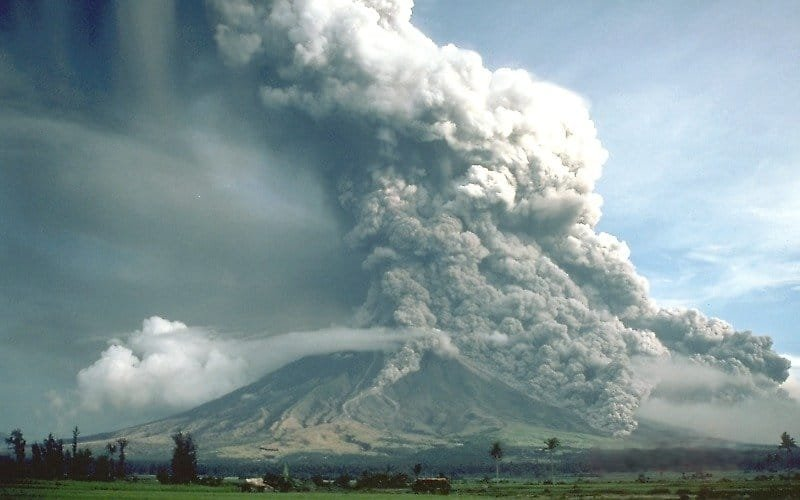
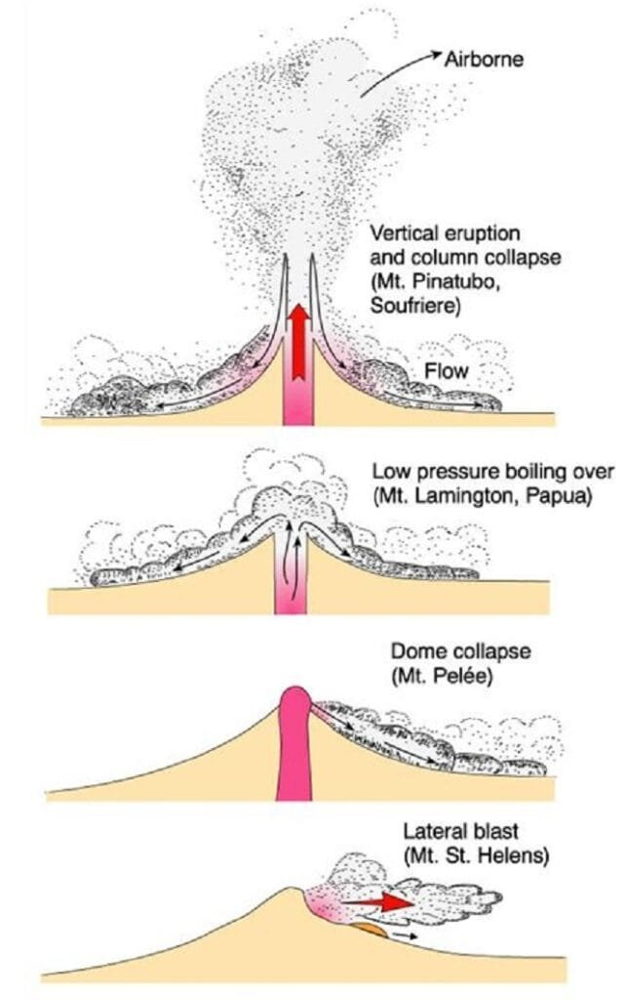

Volcanoes are fascinating geological formations that have captured the intrigue of scientists and explorers for centuries. One of the most awe-inspiring aspects of volcanoes is the intense heat of pyroclastic flows, the fiery torrents of gas and volcanic material that cascade down their slopes during eruptions. These pyroclastic flows can reach temperatures of up to 1,000 degrees Celsius, and their scorching heat can incinerate everything in their path, leaving behind a trail of destruction. But why are pyroclastic flows in volcanoes so incredibly hot? In this article, we will explore the scientific explanations behind the extreme heat of these volcanic phenomena and delve into the fascinating world of volcanic eruptions.

## Defining Pyroclastic Flows

Pyroclastic flows are incredibly dangerous and powerful volcanic phenomena that consist of a mixture of hot gases, rock fragments, and ash racing down the slopes of a volcano. These flows can reach incredibly high temperatures, often exceeding 1,000 degrees Celsius (1,832 degrees Fahrenheit). Pyroclastic flows are known for their devastating speed and ability to burn, bury, and destroy everything in their path.

This image is property of upload.wikimedia.org.

### Origins and components of pyroclastic flows

Pyroclastic flows [originate from explosive volcanic](https://magmamatters.com/geothermal-energy-and-its-volcanic-origins/ "Geothermal Energy and Its Volcanic Origins") eruptions, typically caused by the buildup of pressure within a volcano's magma chamber. When the pressure becomes too great, the volcano erupts, resulting in the ejection of a massive column of ash, gas, and volcanic material into the atmosphere. This eruption column can collapse under its weight, generating [pyroclastic flows that cascade down the volcano's](https://magmamatters.com/the-environmental-impact-of-volcanic-eruptions-2/ "The Environmental Impact of Volcanic Eruptions") slopes.

The components of pyroclastic flows are primarily composed of three elements: gas, ash, and rock fragments. The gas component consists of superheated steam and volcanic gases, such as [sulfur dioxide and carbon](https://magmamatters.com/the-art-and-science-of-volcano-monitoring/ "The Art and Science of Volcano Monitoring") dioxide. These gases not only contribute to the extreme temperatures of pyroclastic flows but also make them highly toxic. The ash component consists of fine particles of volcanic glass and minerals, while the rock fragments can range in size from tiny ash particles to large boulders.

This image is property of www.alexstrekeisen.it.

### Difference between pyroclastic flows and other volcanic emissions

Pyroclastic flows are often confused with other volcanic emissions, such as volcanic ash clouds or lava flows. However, there are distinct differences between these phenomena. While volcanic ash clouds are composed of fine-grained particles that are dispersed by wind, pyroclastic flows are dense currents that flow downhill due to gravity. Lava flows, on the other hand, are molten rock that slowly moves across the surface of the volcano.

What sets pyroclastic flows apart is their extreme temperature and mobility. Unlike lava flows, which can be relatively slow-moving, pyroclastic flows can reach speeds of up to 700 kilometers per hour (435 miles per hour). Additionally, pyroclastic flows have a much higher temperature range, making them significantly more dangerous and destructive.

