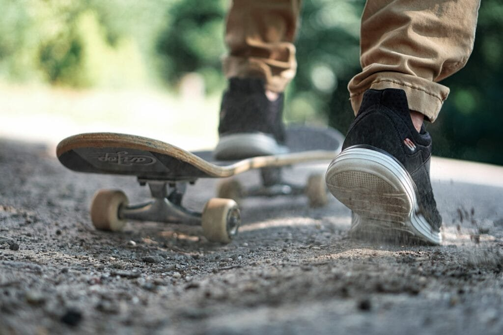
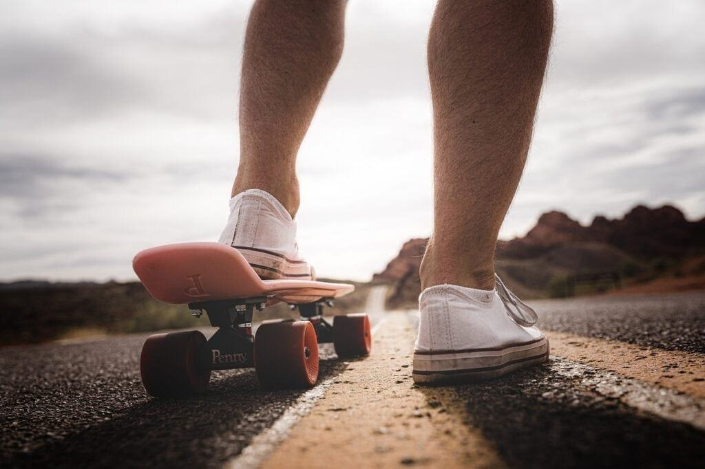
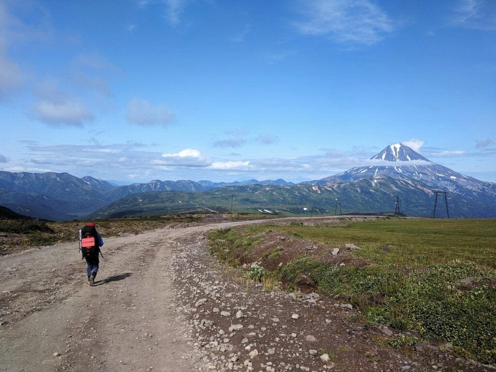

Are you an adventurous soul looking for exciting new experiences? If so, then exploring volcano themed locations might be just the thing for you! Volcanoes, these powerful natural wonders formed by molten rock and gases, offer a unique and thrilling backdrop for recreational activities. Whether you're interested in hiking, camping, or even lava tube exploration, volcano themed locations have it all. Get ready to immerse yourself in the awe-inspiring beauty of these volcanic landscapes and witness firsthand the incredible forces of nature at play. So, pack your bags and get ready for the adventure of a lifetime!

## Hiking and Trekking

This image is property of pixabay.com.

### Overview of popular volcano trekking spots

Volcano hiking and trekking are exhilarating outdoor activities that allow you to explore the raw beauty and power of volcanic landscapes. There are numerous popular volcano trekking spots around the world that offer breathtaking views and unique experiences.

One of the most famous volcano trekking spots is Mount Kilimanjaro in Tanzania. As the highest peak in Africa, reaching the summit of Kilimanjaro is a challenging but rewarding trek. Other notable volcano trekking spots include Mount Fuji in Japan, Mount Rinjani in Indonesia, and Mount Etna in Italy.

This image is property of pixabay.com.

### Safety measures and equipment needed for volcano hiking

When embarking on a volcano hiking adventure, it is essential to prioritize safety. Volcanic terrains can be unpredictable and hazardous, so taking the necessary precautions is vital.

Firstly, make sure you research and understand the specific risks associated with the volcano you plan to hike. Some volcanoes may have unstable slopes, toxic gases, or potential for sudden eruptions. Check local authorities for any safety advisories and follow their instructions.

Secondly, always hike with a qualified guide who is knowledgeable about the volcano and the surrounding area. They can provide valuable insights, ensure your safety, and navigate through challenging terrains.

In terms of equipment, sturdy hiking boots with good ankle support are a must to handle uneven volcanic terrain. Additionally, pack sufficient water, snacks, and sunscreen to stay hydrated and protect yourself from the intense sun exposure. It is also advisable to carry a map, compass, first aid kit, and a means of communication in case of emergencies.

This image is property of pixabay.com.

### Best time to go volcano trekking

The best time to go volcano trekking depends on the specific volcano and its geographical location. Generally, it is recommended to plan your trek during the dry season when weather conditions are more stable.

For example, if you're considering hiking Mount Kilimanjaro, the best time to go would be during the dry seasons of January to February and August to September. This is when the weather is less likely to be rainy, increasing your chances of reaching the summit successfully.

However, it's important to note that some volcanoes have specific trekking seasons due to extreme weather conditions or potential hazards. It is crucial to research and consult local authorities or experienced hikers to determine the optimal time for your volcano trekking adventure.

This image is property of pixabay.com.

### Personal experiences from seasoned volcano hikers

To truly grasp the wonders of volcano trekking, it's enlightening to hear personal experiences from seasoned hikers who have traversed these majestic landscapes.

One hiker, Sarah, shared her experience of hiking Mount Fuji in Japan. She described the awe-inspiring beauty of watching the sunrise from the summit, as the golden rays illuminated the surrounding volcanic peaks. Sarah also emphasized the importance of physical fitness and mental preparation for the challenging ascent.

Another hiker, Michael, recounted his trek on Mount Etna in Italy. He spoke of the surreal experience of walking on solidified lava flows and witnessing steam vents releasing billows of hot vapor. Michael highlighted the importance of wearing appropriate clothing to protect against sharp volcanic rocks and extreme temperature changes.

These personal accounts showcase the profound sense of accomplishment and connection with [nature that volcano](https://magmamatters.com/the-art-and-science-of-volcano-monitoring/ "The Art and Science of Volcano Monitoring") trekking can provide. Hearing the stories of experienced hikers can inspire and motivate others to embark on their own volcano hiking adventures.

