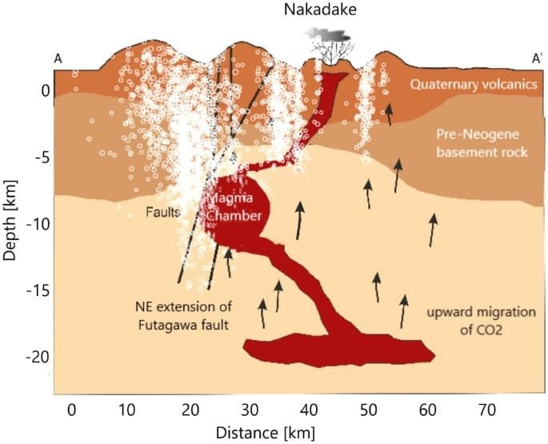
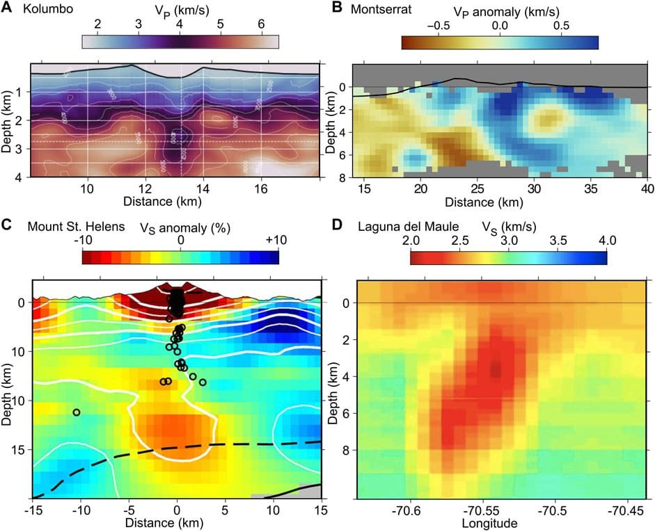
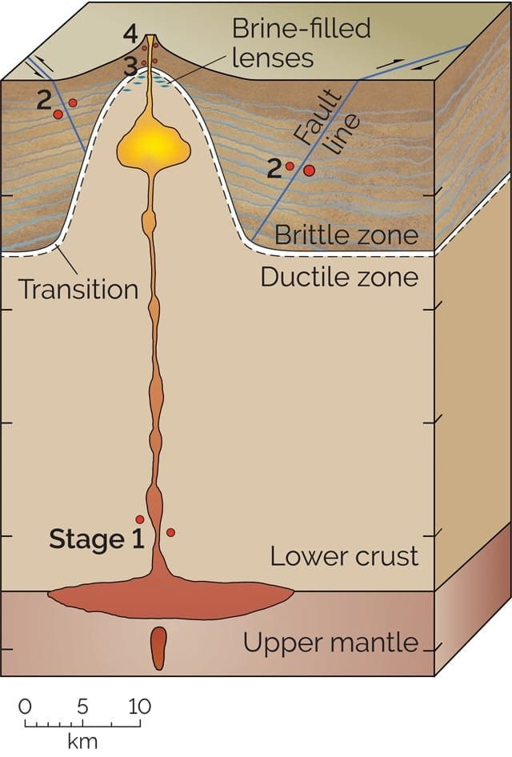
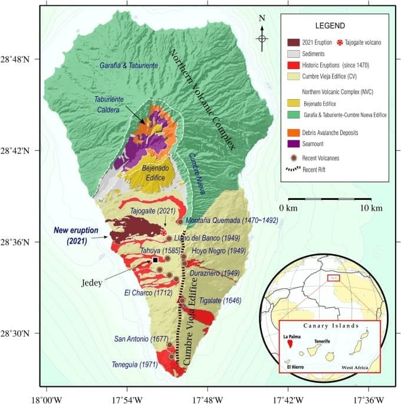
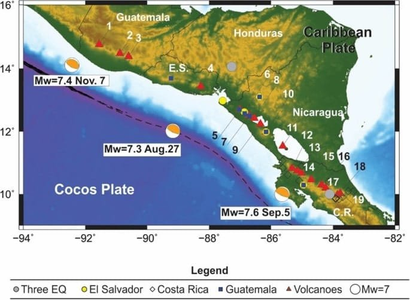

Are you fascinated by the raw power and unpredictable nature of volcanoes? If so, you'll be thrilled to learn about the latest research on volcano seismic activity. This article presents the top five studies in the field, offering valuable insights into the formation, eruption patterns, and potential hazards associated with volcanoes. From the volatile Ring of Fire to the steady eruption of shield volcanoes, each study sheds light on the unique characteristics of these geological wonders. By delving into the science behind volcano seismic activity, we can better understand the risks they pose and take steps to protect the communities living in their vicinity. So, grab your scientific goggles and get ready to explore the fascinating world of volcanoes!

This image is property of media.springernature.com.

## In-depth study on seismic signals preceding Etna's eruptions

When it comes to predicting volcanic eruptions, studying seismic signals is crucial. Researchers have conducted an in-depth study on the seismic signals that precede eruptions from Mount Etna, one of the most active volcanoes in the world. By analyzing these signals, scientists have found that certain factors, such as lava viscosity and gas content, can act as predictors for eruption events.

Lava viscosity refers to the resistance of lava to flow. When the viscosity is high, the lava is more sticky and tends to trap gas bubbles. On the other hand, low viscosity lava flows more easily and escapes gas bubbles more readily. By monitoring seismic signals, researchers have observed that the presence of high-frequency seismic waves indicates the movement of more viscous lava, which is often associated with explosive eruptions. Conversely, low-frequency seismic waves are linked to the movement of less viscous lava, which is characteristic of effusive eruptions.

Gas content is another important factor that can be predicted through seismic signals. Volcanic gases, such as sulfur dioxide and carbon dioxide, are released during eruptions. By monitoring the seismic activity, researchers have found that an increase in the amplitude of seismic waves can be an indication of a build-up of gas pressure within the volcano. This increase in amplitude is often followed by an eruption. Therefore, the study of seismic signals can help scientists anticipate the intensity of an eruption by analyzing the gas content of the volcano.

This research has significant implications for predicting eruption timelines. By studying the seismic signals, scientists can identify the precursory seismic patterns that often precede an eruption. This knowledge can enable better eruption forecasting and evacuation planning, which can save lives and reduce the impact of volcanic disasters.

## Research on seismic activity patterns in Pacific 'Ring of Fire' volcanoes

The Pacific "Ring of Fire" is notorious for its high concentration of volcanic and seismic activity. This region is characterized by tectonic plate boundaries, where plates collide, slide past each other, or move apart. Researchers have conducted extensive studies on the seismic activity patterns in these volcanoes to better understand the behavior of the Ring of Fire.

One of the key findings from this research is the identification of anomalies in seismic activity prior to major eruptions. By analyzing the seismic data, scientists have discovered distinct patterns that deviate from the normal background seismic activity. These anomalies often occur days or even weeks before an eruption and serve as warning signs. By recognizing these patterns, scientists can improve their ability to forecast eruptions and issue timely warnings to at-risk communities.

Predictive models have been developed based on quantifying seismic activities in these volcanoes. By collecting data on various seismic parameters, such as amplitude, frequency, and duration of seismic waves, scientists have been able to create models that correlate these parameters with eruption likelihood. These models provide valuable insights into the behavior of volcanic systems and contribute to the ongoing efforts to improve eruption prediction capabilities.

This image is property of www.frontiersin.org.

## Investigation of deep underwater seismic activity in Hawaii shield volcanoes

While much research has been conducted on terrestrial volcanoes, the study of underwater volcanoes presents unique challenges. Hawaii's shield volcanoes, such as Mauna Loa and Kilauea, provide an excellent opportunity to investigate deep underwater seismic activity.

Underwater volcanoes behave differently from their terrestrial counterparts due to the surrounding water. The high pressure of water can suppress the explosive eruptions commonly seen in terrestrial volcanoes. Instead, underwater eruptions are often characterized by the release of large amounts of lava, creating vast lava fields.

Detecting and interpreting seismic signals in the underwater environment is challenging. Water attenuates seismic waves, making them weaker and harder to detect. Additionally, the complex nature of the volcanic structures and the presence of hydrothermal systems can mask the seismic signals. Despite these challenges, researchers have made significant progress in [understanding the deep underwater seismic activity in Hawaii shield volcanoes](https://magmamatters.com/understanding-volcanic-formation-a-comprehensive-guide/ "Understanding Volcanic Formation: A Comprehensive Guide").

There is potential correlation between the seismic activity in underwater volcanoes and surface volcanic activity. By studying the seismic signals from both underwater and above-water volcanoes, scientists aim to gain a deeper understanding of the underlying processes and mechanisms driving volcanic eruptions. This knowledge can contribute to better prediction models and improved mitigation strategies for volcanic hazards.

## Seismic activity and eruption mechanisms in stratovolcanoes

Stratovolcanoes are characterized by their steep slopes and symmetrical cone shape. These volcanoes, also known as composite volcanoes, are comprised of alternating layers of solidified lava, ash, and volcanic debris. Understanding the seismic activity associated with stratovolcanoes can provide valuable insights into their eruption mechanisms.

One of the key aspects of this research is identifying unique seismic signals related to gas pressure buildup. As magma rises towards the surface, gas bubbles trapped within it accumulate and increase the pressure. This pressure buildup can manifest as specific seismic patterns, such as harmonic tremors, which are rhythmic ground movements caused by the movement of magma and gas.

Deducing the link between the frequency of tremors and the magnitude of an impending eruption is another area of focus. By monitoring the frequency of seismic waves, researchers can estimate the size and intensity of an eruption. Higher frequency tremors often indicate a larger eruption, while lower frequency tremors suggest a smaller event.

Studying the seismic activity of stratovolcanoes also provides insights into the underlying geological structures. By analyzing the seismic waves' propagation characteristics, researchers can infer the subsurface structures, such as faults, magma chambers, and pathways, which influence volcanic behavior. This information is crucial for understanding the overall volcanic system and improving eruption predictions.

This image is property of www.americangeosciences.org.

## Ground-breaking study on rift zone volcanoes seismic activities

Rift zones, characterized by diverging tectonic plates, host unique volcanic activity. These volcanoes, such as the ones found in the East African Rift and Iceland, provide valuable opportunities for studying seismic activities associated with plate boundaries.

Understanding the role of diverging tectonic plates in seismic activities is a key focus of this research. As plates move apart, magma from the mantle rises to fill the gap, leading to the formation of volcanic systems. By studying the seismic activity in rift zones, scientists can gain insights into the processes occurring deep within the Earth's crust.

One of the primary goals of this research is to parse specific seismic patterns that precede upcoming eruptions. By analyzing the seismic signals, scientists aim to identify unique patterns that are characteristic of an imminent eruption event. This real-time monitoring and interpretation of seismic data can significantly enhance early warning systems for volcanic hazards.

Suggestions for improving early warning systems are another significant aspect of this study. By integrating data from various sources, such as seismic networks, satellite observations, and ground deformation measurements, scientists can develop more comprehensive and accurate tools for predicting volcanic eruptions. These advancements can help minimize the impact of volcanic disasters on surrounding communities.

## Linking Volcano Seismic Activity to Eruption Types

Volcano eruptions can be broadly classified into two main types: explosive and effusive eruptions. Understanding the relationship between seismic activity and eruption types is crucial for predicting and mitigating volcanic hazards.

Identifying specific seismic signatures for explosive and effusive eruption types is a major focus of this research. Explosive eruptions are characterized by high-energy releases, including ash clouds, pyroclastic flows, and volcanic bombs. Effusive eruptions, on the other hand, involve the relatively gentle outpouring of lava. By analyzing the seismic signals associated with these eruptions, scientists have been able to identify distinct patterns that correspond to each eruption type.

Exploring how seismic patterns change with variation in eruption types is another area of interest. By comparing the seismic activity before, during, and after different eruption types, researchers can gain insights into the underlying processes and mechanisms. This knowledge can contribute to more accurate eruption forecasting and hazard assessment.

Understanding the link between volcano seismic activity and eruption types is a crucial step towards improving our ability to predict and mitigate volcanic disasters. By correlating the observed seismic signals with the expected eruption type, scientists can provide more timely warnings and enable better decision-making for disaster management.

This image is property of media.springernature.com.

## Tools and Technology used to Monitor Volcano Seismic Activity

Monitoring [volcano seismic activity](https://magmamatters.com/the-art-and-science-of-volcano-monitoring/ "The Art and Science of Volcano Monitoring") requires the use of specialized tools and technology. Advances in seismograph technology, aerial and space-based monitoring, and artificial intelligence have greatly enhanced our ability to collect and interpret seismic data.

Different types of seismographs are used to monitor volcano seismic activity. Broadband seismographs, which measure a wide range of frequencies, provide detailed information about the seismic waves. Short-period seismographs, on the other hand, are more sensitive to higher frequencies and are ideal for detecting smaller seismic events. By deploying a network of seismographs around a volcano, scientists can obtain a comprehensive view of its seismic activity.

Integrating aerial and space-based technology has revolutionized volcano monitoring. Aerial surveys using drones or helicopters provide high-resolution images and data on ground deformation, gas emissions, and volcanic structures. Satellite observations, such as those from synthetic aperture radar (SAR) or thermal radiometry, enable monitoring of large volcanic areas and the detection of volcanic gas emissions. These technologies enhance our understanding of volcanic processes and enable better assessment of volcanic hazards.

The latest advancements in artificial intelligence (AI) have also been applied to seismic data interpretation. AI algorithms can analyze large volumes of seismic data, identify patterns, and make predictions. Machine learning techniques, such as pattern recognition and anomaly detection, have shown promising results in identifying precursors to volcanic eruptions. AI-powered tools can significantly improve the efficiency and accuracy of seismic data analysis, leading to better hazard assessment.

## Importance of Understanding Seismic Activity for Disaster Management

Understanding volcano seismic activity is crucial for effective disaster management. Seismic signals can provide valuable information for evacuation plans, infrastructure planning and resilience, and assessing the socio-economic impacts of volcanic eruptions.

Seismic activity serves as a precursor to volcanic eruptions, providing critical information for evacuation plans. By continuously monitoring and analyzing the seismic signals, scientists can issue timely warnings to at-risk communities, allowing them to evacuate to safer locations. This early evacuation can save lives and minimize the impact of volcanic disasters.

Volcano seismic activity also plays a significant role in infrastructure planning and resilience. By understanding the seismic hazards associated with a particular volcano, engineers can design structures that can withstand the ground shaking caused by volcanic activity. Additionally, the knowledge of seismic activity can inform the development of hazard maps, which guide land use planning and zoning to minimize exposure to volcanic hazards.

The socio-economic impacts of volcanic eruptions can be devastating. By studying and understanding the seismic activity, scientists can estimate the potential severity and duration of eruptions, allowing for better disaster response and resource allocation. This knowledge can assist decision-makers in formulating effective strategies for recovery and reconstruction in the aftermath of an eruption.

This image is property of media.springernature.com.

## Case Studies: Predicting eruptions based on Seismic Activity

Numerous case studies have demonstrated the effectiveness of using seismic activity to predict volcanic eruptions. By analyzing seismic signals, scientists have successfully predicted eruptions in various historical events and gained valuable insights from instances where the predictions did not pan out.

In one case study, researchers analyzed the seismic activity preceding the eruption of Mount St. Helens in 1980. By closely monitoring the seismic signals, scientists observed a sharp increase in the frequency and amplitude of tremors, indicating an imminent eruption. Based on this analysis, appropriate warnings were issued, and evacuation plans were put into action, resulting in the successful evacuation of thousands of people and the prevention of significant loss of life.

However, not all predictions based on seismic activity have been successful. In the case of the eruption of Mount Pinatubo in 1991, scientists were unable to accurately predict the eruption despite ongoing monitoring of the seismic signals. This failure highlighted the complex nature of volcanic systems and the challenges involved in volcano prediction. It emphasized the need for continued research and improvement in volcano monitoring techniques and data analysis.

These case studies provide valuable lessons for improving eruption prediction based on seismic activity. They underscore the importance of ongoing research, data collection, and analysis to enhance our understanding of volcanic systems and improve the accuracy of eruption forecasts. While seismic signals offer valuable insights, they are just one piece of the puzzle, and the integration of multiple monitoring techniques is crucial for effective volcano prediction.

## Future Directions for Volcano Seismic Activity Research

Volcano seismic activity research is an ever-evolving field, and several future directions show great promise in advancing our understanding and prediction capabilities.

Emerging trends and hot topics in volcano seismic activity research include the integration of various monitoring techniques. By combining seismic data with other data sources, such as ground deformation measurements, gas emissions, and thermal observations, scientists can gain a more comprehensive understanding of volcanic processes. This multi-disciplinary approach can lead to better eruption forecasts and hazard assessments.

Despite the advancements made in volcano seismic activity research, there are still potential limitations and challenges. One challenge is the need for improved data quality and resolution. Developing high-quality seismic networks and improving the sensitivity of seismographs can enhance our ability to detect and interpret small seismic events, which often serve as precursors to eruptions. Additionally, standardizing data collection and analysis methodologies can ensure consistency and comparability across different research studies.

The next steps for volcano seismic activity prediction involve further refinement of predictive models. By incorporating more detailed and accurate data into the models, scientists can enhance their accuracy and reliability. This includes incorporating real-time data from ongoing monitoring efforts and developing more sophisticated algorithms for data analysis.

In conclusion, the latest research on volcano seismic activity has uncovered valuable insights into the behavior of volcanoes and their eruption patterns. By studying seismic signals, researchers have been able to predict eruptions, anticipate eruption intensity, and gain insights into eruption mechanisms. The use of advanced tools and technology, such as seismographs, aerial and space-based monitoring, and artificial intelligence, has significantly enhanced our ability to monitor and interpret seismic data.

Understanding volcano seismic activity is of utmost importance for disaster management. It enables the development of effective evacuation plans, infrastructure planning, and resilience strategies. Furthermore, it provides insights into the socio-economic impacts of volcanic eruptions, which can inform decision-making and resource allocation.

As research in volcano seismic activity continues to advance, future directions include integrating multiple monitoring techniques, addressing data quality and resolution challenges, and refining predictive models. By focusing on these areas, scientists can further improve eruption prediction capabilities and minimize the impact of volcanic disasters on communities.

