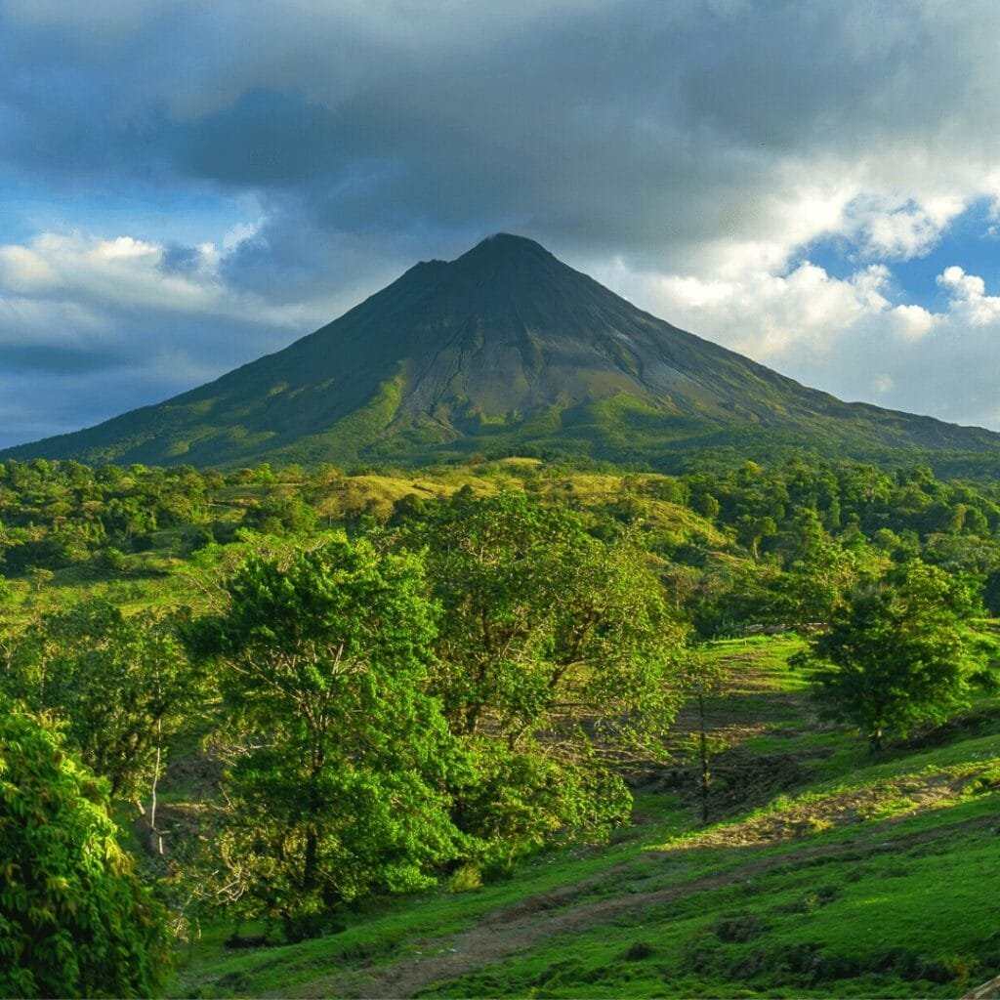
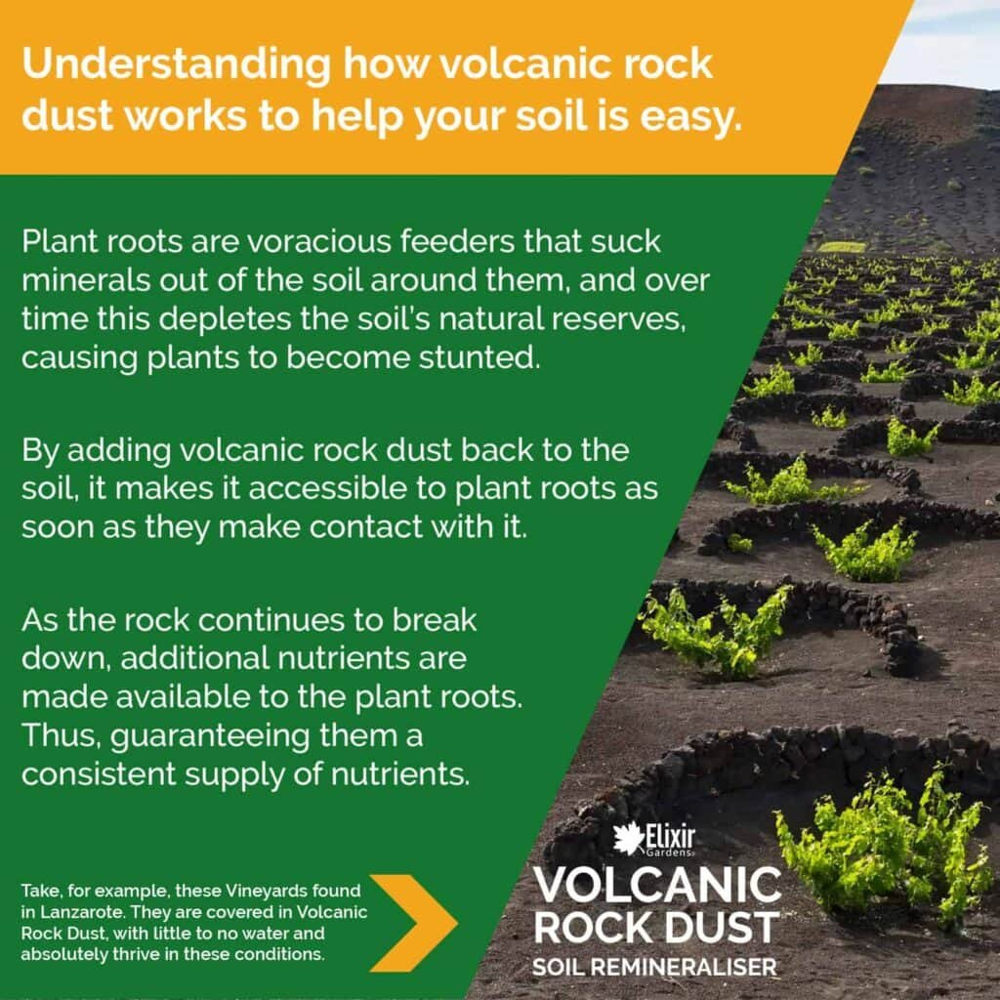
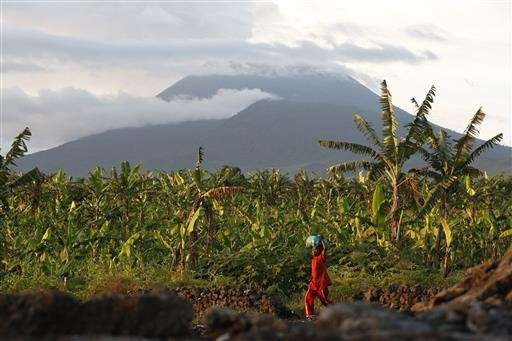

If you find yourself living or farming in an area with volcanic soil, you may be wondering how to maximize your crop growth and yield. Volcanic soil can offer a range of benefits, including high fertility and nutrient-rich composition. However, it also poses some challenges due to its unique characteristics. In this article, we will explore the top three tips for growing crops in volcanic soil, helping you make the most of this rich and powerful resource. By implementing these tips, you can ensure that your crops not only survive but thrive in this unique soil environment.

This image is property of www.chfusa.com.

## Understanding Volcanic Soil

Volcanic soil, also known as volcanic ash soil, is formed from the minerals and nutrients released during volcanic eruptions. This type of soil is highly fertile and has distinct characteristics that make it ideal for growing certain crops. By understanding the formation, nutrient composition, and different types of volcanic soil, you can make the most of its beneficial characteristics and overcome potential challenges.

### The Formation of Volcanic Soil

Volcanic soil is formed when lava and ash from volcanic eruptions break down and mix with existing soil over time. The intense heat of volcanic activity causes the minerals in the lava and ash to break down into smaller particles, which gradually become part of the soil. The resulting volcanic soil is rich in minerals and organic matter, making it highly fertile.

### Nutrient Composition of Volcanic Soil

The nutrient composition of volcanic soil is one of its most beneficial characteristics. Volcanic eruptions release a wide range of minerals and nutrients, including nitrogen, phosphorus, potassium, calcium, and magnesium. These essential nutrients are present in high concentrations in volcanic soil, providing a fertile environment for plant growth. Additionally, volcanic soil often has a slightly acidic pH, which is favorable for many crops.

### Types of Volcanic Soil

There are several types of volcanic soil, each with its own unique characteristics. The type of volcanic soil found in a particular area depends on factors such as the type of [volcano](https://magmamatters.com/geothermal-energy-and-its-volcanic-origins/ "Geothermal Energy and Its Volcanic Origins"), the age of the volcanic activity, and the composition of the volcanic materials. Some common types of volcanic soil include andisols, ash soils, and tephras. These different types of volcanic soil may vary in texture, nutrient content, and drainage properties.

## Beneficial Characteristics of Volcanic Soil

Volcanic soil offers a range of beneficial characteristics that make it highly suitable for certain crops. Understanding these characteristics can help you make the most of your volcanic soil and optimize your crop production.

### High Nutrient Content

One of the key benefits of volcanic soil is its high nutrient content. The minerals and nutrients released during volcanic eruptions enrich the soil, providing essential elements for plant growth. This nutrient-rich soil promotes healthy crop development, improves yield, and enhances the nutritional value of the harvested crops.

### Good Water Retention

Volcanic soil has excellent water retention properties. The porous [nature](https://magmamatters.com/the-art-and-science-of-volcano-monitoring/ "The Art and Science of Volcano Monitoring") of volcanic materials allows the soil to absorb and hold moisture, preventing excessive water loss through drainage. This characteristic is particularly beneficial in regions with hot or dry climates, as it ensures that plants have a constant water supply for growth and development.

### Superior Drainage

Despite its water retention capabilities, volcanic soil also boasts superior drainage. The porous structure of volcanic materials allows excess water to drain easily, preventing waterlogged conditions that can be detrimental to plant roots. This characteristic helps prevent root rot and enhances overall crop health.

This image is property of elixirgardensupplies.co.uk.

## Potential Challenges of Volcanic Soil

While volcanic soil offers numerous advantages, there are also potential challenges that come with its unique characteristics. Being aware of these challenges can help you address them effectively and ensure successful crop cultivation.

### Variability in Nutrient Levels

One challenge of volcanic soil is the variability in nutrient levels. The abundance of minerals and nutrients in volcanic soil can vary from one location to another, and even within the same plot of land. This means that careful monitoring and adjustment of nutrient levels may be necessary to ensure optimal plant nutrition and prevent nutrient deficiencies or excesses.

### Potential Toxicity Issues

Volcanic soil can contain high levels of certain minerals and heavy metals, which can be toxic to plants in high concentrations. For example, volcanic soils derived from volcanic ash may contain elevated levels of aluminum, which can inhibit plant growth. It is important to assess the potential toxicity of the volcanic soil in your area and choose crops that can withstand or tolerate these conditions.

### May Need Additional Fertilization

While volcanic soil is nutrient-rich, it may still require additional fertilization to meet the specific needs of certain crops. The high nutrient content of volcanic soil can be beneficial for some plants but may not be sufficient for others. Conducting soil tests and consulting with agricultural experts can help determine the precise fertilization requirements for your crops and optimize their growth potential.

## Choosing Suitable Crops for Volcanic Soil

To maximize the potential of volcanic soil, it is important to choose crops that are well-suited to its unique characteristics. Consider the following factors when selecting crops for your volcanic soil:

### Identifying Crops Suited to High Nutrient Soils

Crops that have high nutrient requirements and thrive in fertile soil are ideal for volcanic soil. Examples of such crops include tomatoes, beans, peppers, corn, and leafy greens like spinach and kale. These crops can make the most of the abundant nutrients available in volcanic soil and produce healthy, nutrient-dense harvests.

### Crops That Thrive in Well-Drained Soils

Given the excellent drainage properties of volcanic soil, it is wise to choose crops that prefer well-drained conditions. Plants like strawberries, melons, cucumbers, and herbs are well-suited to volcanic soil due to their preference for moisture-rich yet well-drained environments. These crops can flourish in volcanic soil without the risk of waterlogging and root-related issues.

### Crops That Can Withstand Potential Toxicity

As mentioned earlier, volcanic soil may contain elevated levels of certain minerals and heavy metals. To avoid toxicity issues, consider crops that have a natural tolerance for these conditions. Some examples include potatoes, carrots, beets, and legumes like lentils and soybeans. These crops have mechanisms to cope with elevated levels of minerals and heavy metals, allowing them to thrive in volcanic soil.

This image is property of scx1.b-cdn.net.

## Preparing Volcanic Soil for Planting

Before planting crops in volcanic soil, it is important to prepare the soil properly to create an optimal growing environment. Follow these steps to prepare your volcanic soil for planting:

### Checking Soil pH Levels

The first step in preparing volcanic soil is to check its pH levels. Most crops prefer slightly acidic to neutral soil pH. Conduct a soil pH test using a soil testing kit, and if necessary, make adjustments using appropriate soil amendments to achieve the desired pH range for your selected crops.

### Adding Necessary Soil Amendments

Depending on the results of the soil pH test and the specific nutrient requirements of your crops, you may need to add soil amendments to optimize the nutrient content and balance of your volcanic soil. Common soil amendments for volcanic soil include organic matter, lime, and specific mineral fertilizers. Consult a local agricultural extension office or expert for guidance on the appropriate amendments for your soil.

### Preparing the Planting Beds

Once the necessary adjustments have been made to your volcanic soil, it is time to prepare the planting beds. Clear the area of any weeds or debris and loosen the soil using a garden fork or tiller. This will ensure good aeration and proper root penetration when you plant your crops. Level the soil surface and create raised beds if necessary to improve drainage in areas with heavier clay-based volcanic soils.

## Planting Techniques for Volcanic Soil

Proper planting techniques are essential for maximizing the growth potential of your crops in volcanic soil. Consider the following tips when planting in volcanic soil:

### Proper Spacing for Good Drainage

In volcanic soil, it is important to provide adequate spacing between plants to ensure good drainage and prevent overcrowding. Crowded plants can impede airflow and increase the risk of disease and pest problems. Refer to the specific spacing requirements for your chosen crops and follow them diligently to optimize plant health and yield.

### Using the Best Seed Varieties for Volcanic Soil

Different crops have different preferences for soil types and nutrient levels. When planting in volcanic soil, choose seed varieties that are specifically adapted to thrive in nutrient-rich environments. Look for seed labels or consult with local gardening experts to find varieties that are well-suited to volcanic soil conditions.

### Understanding the Best Planting Depths for Different Crops

Planting depth is crucial for successful crop establishment in volcanic soil. Incorrect planting depths can lead to poor root development or shallow root systems, compromising the plant's ability to access nutrients and water. Consult planting guides or seed packets to determine the recommended planting depths for your chosen crops and follow them carefully.

This image is property of www.venturesir.com.

## Maintaining Healthy Crops in Volcanic Soil

Once your crops are established, it is important to maintain their health and optimize their growth in volcanic soil. Consider the following techniques for successful crop maintenance:

### Proper Watering Techniques

Watering is essential for crop growth, and in volcanic soil, it is necessary to adopt proper watering techniques to ensure optimal plant health. Monitor soil moisture levels regularly and water deeply when necessary, allowing the water to penetrate the root zone. Avoid overwatering, as excessive moisture can lead to root rot and other problems.

### Managing Nutrient Levels

While volcanic soil is naturally nutrient-rich, it is still important to monitor and manage nutrient levels to meet the specific needs of your crops. Conduct regular soil tests to assess nutrient deficiencies or excesses and adjust fertilization accordingly. Use organic or slow-release fertilizers to supply nutrients gradually and minimize the risk of nutrient imbalances.

### Controlling Weeds and Pests

Weeds and pests can hinder the growth of your crops and compete for essential nutrients in volcanic soil. Implement effective weed control measures, such as mulching or hand weeding, to minimize weed growth. Employ integrated pest management techniques to identify and address pest issues promptly, ensuring the health and productivity of your crops.

## Utilizing Natural Fertilizers

While volcanic soil already contains abundant nutrients, supplementing it with natural fertilizers can further enhance its fertility and productivity. Consider the following aspects when utilizing natural fertilizers:

### The Benefits of Organic Fertilizers

Organic fertilizers, such as compost, manure, and bone meal, offer numerous benefits for crops in volcanic soil. They enrich the soil with essential nutrients, improve soil structure, enhance water retention, and promote beneficial microbial activity. Organic fertilizers also contribute to long-term soil health and sustainability.

### How to Apply Natural Fertilizers

Apply organic fertilizers in accordance with the specific nutrient needs of your crops and based on the recommendations of a soil test. Follow the manufacturer's instructions for proper application rates and methods. Incorporate the organic fertilizers into the soil before planting or apply them as a top dressing around established plants, ensuring even distribution.

### Determining the Right Fertilizer Formula for Your Soil

Different crops require different nutrient ratios for optimal growth. Consult fertilizer labels or seek advice from agricultural experts to determine the appropriate fertilizer formula for your specific crops and volcanic soil. Balanced fertilizers that provide a mix of nitrogen, phosphorus, and potassium, along with other essential micronutrients, are generally suitable for most crops.

This image is property of pub.mdpi-res.com.

## Monitoring Crop Health

Regular monitoring of crop health is essential for early detection of potential issues and prompt intervention. Consider the following aspects when monitoring the health of your crops in volcanic soil:

### Regular Soil Testing

Regular soil testing is crucial for maintaining optimal plant nutrition and preventing nutrient deficiencies or excesses. Perform soil tests at least once a year, preferably before each planting season. A soil test will provide valuable information on the nutrient levels, pH, and other important parameters of your volcanic soil, allowing you to make educated adjustments.

### Identifying Signs of Nutrient Deficiency

Nutrient deficiencies can manifest in various ways, such as stunted growth, yellowing leaves, or poor fruit development. Familiarize yourself with the specific nutrient deficiency symptoms of your crops and regularly inspect your plants for any signs of nutrient imbalances. If deficiencies are detected, address them promptly through targeted fertilization or foliar sprays.

### Addressing Signs of Disease or Pest Infestation

In addition to monitoring nutrient levels, it is crucial to observe your crops for signs of disease or pest infestation. Identify common pests and diseases that affect your crops in volcanic soil and implement appropriate preventive measures, such as crop rotation, biological controls, or the use of organic pest and disease management techniques. Early detection and intervention can prevent the spread of diseases and minimize crop damage.

## Harvesting and Post-Harvest Management

Successfully growing crops in volcanic soil culminates in the harvest and post-harvest management stages. Follow these guidelines for a successful harvest and to ensure the continued health of your volcanic soil:

### When to Harvest Different Crops

The timing of harvest varies depending on the type of crop and its intended use. Refer to crop-specific guides or consult with local agricultural experts to determine the optimal timing for harvesting your crops. Harvesting at the correct stage of maturity ensures the best flavor, texture, and nutritional value.

### Proper Harvesting Techniques

Adopt proper harvesting techniques to minimize damage to your crops and promote their overall quality. Use sharp and clean tools to avoid injury and contamination. Harvest leafy greens and herbs by picking the outer leaves or branches first, allowing the inner growth to continue. For fruits and vegetables, carefully cut them from the plant to avoid bruising or damaging the surrounding foliage.

### Post-Harvest Soil Care

After harvesting, it is important to care for your volcanic soil to maintain its fertility and prepare it for future plantings. Remove any plant debris and weeds from the soil surface to prevent the buildup of pathogens or pests. Consider adding organic matter, such as compost or cover crops, to replenish nutrients and improve soil structure. This post-harvest care ensures the long-term health and productivity of your volcanic soil.

In conclusion, understanding volcanic soil and its unique characteristics is essential for successful crop cultivation. By recognizing the formation process, nutrient composition, and types of volcanic soil, you can make informed decisions regarding suitable crops and proper soil preparation. With careful attention to planting techniques, crop maintenance, and post-harvest soil care, you can maximize the fertility and productivity of your volcanic soil, reaping the benefits of this rich and dynamic natural resource.

