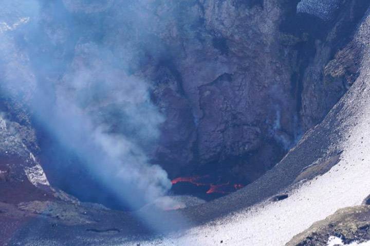
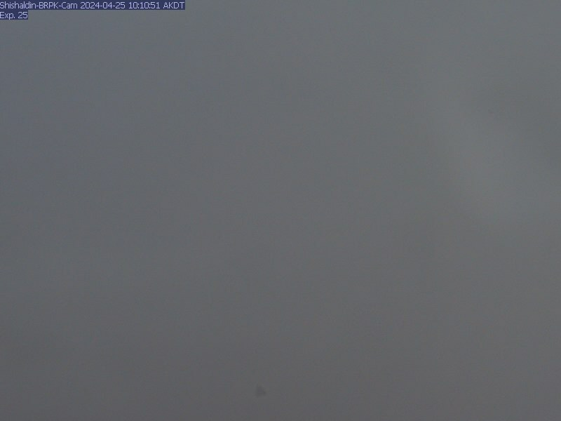

   

# Alert and Watchful: Understanding the Recent Unrest at Shishaldin Volcano

**Date:** April 25, 2024

**Author:** Your Name or Website Name

## Recent Seismic Activities and Historical Context

Shishaldin Volcano, a prominent feature of the Aleutian Islands, has entered a phase of unrest characterized by small but persistent earthquakes. This activity is monitored using advanced techniques such as InSAR (Interferometric Synthetic-Aperture Radar) and GPS to track deformations, alongside gas spectroscopy to analyze volcanic gases. Historical records from NASA Earth Observatory indicate that Shishaldin has had 24 confirmed eruptions since 1775, with a significant event in 1999 producing an ash column that reached 14 kilometers above sea level.

## Monitoring Technologies and Techniques

The Alaska Volcano Observatory (AVO) employs a comprehensive suite of monitoring tools to observe Shishaldin's behavior. This includes seismic and infrasound sensors, satellite monitoring, and web cameras. These tools help detect signs of magma movement, venting of [volcanic gases](https://magmamatters.com/the-art-and-science-of-volcano-monitoring/ "The Art and Science of Volcano Monitoring") from fumaroles, and the potential for pyroclastic flows or lahars.

## Implications for the Environment and Aviation

The volcanic unrest at Shishaldin poses potential risks not only to the local environment but also to aviation. Ash hazards can lead to significant aviation disruption, as volcanic ash is capable of damaging aircraft engines. The AVO's alert systems provide crucial information to mitigate these risks, ensuring the safety of air travel over and near the Aleutian Islands.

This article provides a snapshot of the situation as of April 25, 2024. For the most current information and updates on the Shishaldin Volcano, please visit the [USGS Volcano Notice](https://volcanoes.usgs.gov/hans-public/notice/DOI-USGS-AVO-2024-04-24T19:48:12+00:00).
