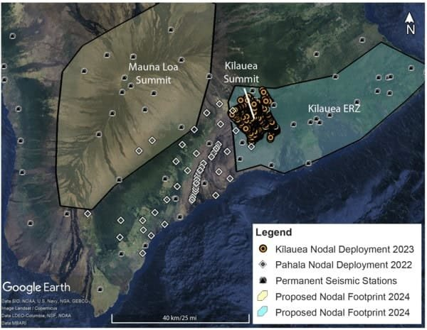

The Seismic Activity of Hawai‘i's Volcanoes: Insights from HVO's Monitoring Network offers a comprehensive overview of the monitoring efforts conducted by the USGS Hawaiian Volcano Observatory (HVO) to study and assess the seismic activity of Kīlauea and Mauna Loa volcanoes. With nearly 100 permanent seismic stations and the use of lightweight, portable seismometers called seismic nodes, HVO scientists aim to gain clearer images of magma storage beneath the volcanoes and understand their connections to the surface. This article highlights the current status of these volcanoes, the impact of seismic activity on the environment and communities, and the ongoing efforts to study and manage these volcanic systems. By diving into the geological causes, impact assessment, response efforts, scientific significance, and potential future developments, readers will gain a deeper understanding of the complex world of Hawai‘i's volcanoes and their importance in global volcanic research.

This image is property of d9-wret.s3.us-west-2.amazonaws.com.

## Overview of Hawai‘i's Seismic Activity

Hawai‘i, known for its stunning landscapes and natural beauty, is also a seismic hotspot. This island is one of the most seismically active regions in the world, experiencing an average of 600-1200 earthquakes per week, as reported by the USGS Hawaiian Volcano Observatory (HVO).

### Highlighting Hawai‘i as a seismic hotspot

The geology of Hawai‘i makes it prone to seismic activity. The Hawaiian Islands are formed by a chain of volcanoes, and the movement of tectonic plates along the Pacific Plate's boundary contributes to frequent earthquakes. The convergence of the Pacific and North American plates creates stress within the Earth's crust, leading to seismic events.

### Number of earthquakes detected per week by USGS HVO

The USGS HVO plays a crucial role in monitoring and analyzing seismic activity in Hawai‘i. Their extensive network of nearly 100 permanent seismic stations allows them to detect and record earthquakes occurring in the region. On average, they detect 600-1200 earthquakes per week, providing valuable data for research and hazard assessment.

### Main volcanoes of concern: Kīlauea and Mauna Loa

Kīlauea and Mauna Loa are two of the most prominent and active volcanoes in Hawai‘i. Both volcanoes attract significant attention from scientists and researchers due to their dynamic nature. Monitoring the [seismic activity associated with these volcanoes helps to understand](https://magmamatters.com/understanding-volcanic-formation-a-comprehensive-guide/ "Understanding Volcanic Formation: A Comprehensive Guide") their behavior, potential eruptions, and associated hazards.

## HVO's Seismic Monitoring Network

To effectively monitor seismic activity in Hawai‘i, the USGS HVO operates a comprehensive monitoring network. This network consists of nearly 100 permanent seismic stations strategically placed across the island.

### Description of the HVO's monitoring network

The seismic monitoring network maintained by HVO helps to detect, locate, and analyze earthquakes. These stations are equipped with sensitive instruments that measure ground vibrations caused by seismic events. Through continuous monitoring, HVO scientists gather data that aids in their research and assessment of volcanic activity.

### Use and placement of nearly 100 permanent seismic stations

The placement of seismic stations is critical for accurate monitoring. The distribution of these stations throughout the island allows for comprehensive coverage and the ability to pinpoint the location of earthquakes. This data helps scientists understand the geologic pathways and faults associated with seismic activity in different areas.

### Usage of seismic nodes and their purpose

In addition to the permanent seismic stations, HVO deploys portable seismometers called seismic nodes. These lightweight devices are placed in areas of interest to obtain clearer images of magma storage beneath the volcanoes and better understand their connections to the surface. Seismic nodes are particularly useful in regions where it is impractical to install permanent seismic stations.

## Seismic Nodes and Their Deployment

Seismic nodes play a vital role in enhancing HVO's understanding of Hawai‘i's volcanic activity. These devices offer greater flexibility and allow for targeted monitoring in specific regions.

### Explanation of seismic nodes

Seismic nodes are portable seismometers that are easily deployed and retrieved. They are designed to record ground vibrations caused by seismic events, providing valuable insights into the behavior of volcanoes. By deploying seismic nodes, HVO aims to gather data to improve their understanding of magma storage and its movement beneath the surface.

### Deployment of nodes in Pāhala region and Kīlauea summit

HVO has strategically deployed seismic nodes in the Pāhala region and Kīlauea summit. The Pāhala region, located on the southeastern side of the island, is an area of particular interest due to its association with volcanic activity. Deploying seismic nodes in this region allows scientists to capture detailed data on the seismicity and potential magma movement.

Kīlauea, known for its frequent eruptions, also receives special attention from HVO. Seismic nodes have been placed in the summit area to monitor the volcano's activity more closely. This detailed monitoring enables scientists to track any significant changes in seismicity and deformation that may indicate future eruptions.

### Future deployment plans in East Rift Zone of Kīlauea and Mauna Loa's summit and rift zones

HVO has plans to further expand the deployment of seismic nodes in key volcanic areas. The East Rift Zone of Kīlauea and Mauna Loa's summit and rift zones are next on the list for deployment. These regions exhibit important features and signs of volcanic activity, making them of great interest to scientists. By deploying seismic nodes in these areas, HVO aims to gather valuable data to enhance their understanding of magma movement and potential eruption patterns.

<iframe width="560" height="315" src="https://www.youtube.com/embed/uE67oZ8KVyg" frameborder="0" allow="accelerometer; autoplay; encrypted-media; gyroscope; picture-in-picture" allowfullscreen></iframe>

  

## Significance of the Data Collected

The data collected from seismic monitoring, including the permanent seismic stations and seismic nodes, provide valuable insights into Hawai‘i's volcanic activity. This data helps scientists gain a cohesive view of magma storage beneath the volcanoes and better understand the potential pathways to the surface.

### Cohesive view of magma storage gained from data

By monitoring seismic activity, scientists can detect and analyze patterns in magma movement beneath the volcanoes. The data collected from the permanent seismic stations and seismic nodes help researchers piece together a comprehensive picture of magma storage. These insights contribute to a better understanding of volcanic behavior and the potential for eruptions.

### Understanding the potential pathways of magma to the surface

The movement of magma from its storage areas to the surface is a complex process. Seismic monitoring plays a crucial role in tracking seismic activity associated with this movement. By analyzing the data collected, scientists can identify potential pathways through which magma can reach the surface. This knowledge aids in predicting and assessing volcanic hazards, providing essential information for preparedness and response measures.

## Current Status of Kīlauea and Mauna Loa

Understanding the current status of active volcanoes like Kīlauea and Mauna Loa is of utmost importance for hazard assessment and public safety.

### Explanation of non-eruptive status of Kīlauea

Kīlauea, known for its frequent eruptions, is currently experiencing a non-eruptive phase. The volcano has been relatively quiet, with low seismic activity and inflationary trends recorded near its summit. Despite the lack of eruptions, monitoring efforts remain crucial to detect any signs of renewed volcanic activity.

### Low seismicity, slow inflation, and background SO2 emissions status at Mauna Loa

Mauna Loa, another active volcano on the island of Hawai‘i, is also in a non-eruptive phase. Seismicity at Mauna Loa is currently low, and the volcano is experiencing slow inflation, indicating the accumulation of magma beneath the surface. Background levels of sulfur dioxide (SO2) emissions, a significant precursor to volcanic eruptions, have also been observed. Monitoring these indicators helps to assess the volcano's current state and provides vital information for hazard mitigation.

### Observatory's Monitoring Effort

The USGS Hawaiian Volcano Observatory plays a critical role in the continuous monitoring of Kīlauea and Mauna Loa. This ongoing effort is essential for tracking any changes in seismic activity, deformation, gas emissions, and other volcano-related parameters.

### Detailing Continuous monitoring by USGS HVO

The USGS HVO maintains a vigilant and continuous monitoring effort to detect any signs of volcanic activity. Their network of permanent seismic stations, complemented by the deployment of seismic nodes, ensures the collection of real-time data. Continuous monitoring allows scientists to observe changes in volcanic behavior over time, providing critical information for eruption forecasting and hazard assessment.

### HVO's role in volcanic activity prediction and hazard assessment

The data collected by the USGS HVO is not only used for real-time monitoring but also plays a crucial role in volcanic activity prediction and hazard assessment. By analyzing seismic patterns and other volcanic parameters, HVO scientists can assess the likelihood of future eruptions and evaluate the potential hazards associated with volcanic activity. This information is used to inform emergency management agencies, policymakers, and communities to ensure appropriate response measures are in place.

## Geological Explanation of Seismic Activity

The geology of Hawai‘i provides valuable insights into the occurrence of seismic activity in the region.

### Geological reasoning behind seismic activity in Hawai'i

Seismic activity in Hawai‘i is primarily driven by the movement of tectonic plates along the Pacific Plate's boundary. The convergence of the Pacific and North American plates creates stress within the Earth's crust, leading to earthquakes. Hawai‘i's unique geologic setting, with its chain of volcanoes formed by hotspot activity, further contributes to significant seismic events. The movement of magma beneath the surface and the formation of volcanic systems create additional stress and induce seismicity.

### Explanation of human activities or environmental conditions contributing to seismic activity

While natural processes play a significant role in seismic activity in Hawai‘i, human activities and environmental conditions can also contribute to the occurrence of earthquakes. For instance, [geothermal energy](https://magmamatters.com/geothermal-energy-and-its-volcanic-origins/ "Geothermal Energy and Its Volcanic Origins") extraction involves injecting fluids into the ground, which can potentially induce seismic events. Additionally, changes in groundwater levels and loading due to urban development or major infrastructure projects can also affect stress distribution and trigger seismic activity.

## Implication of Seismic Activities

Seismic activities in an area like Hawai‘i have implications for the environment, communities, and the economy.

### Assessing Impacts on the environment, communities, and economy

Seismic activities can have profound impacts on the environment, communities, and the economy. In terms of the environment, earthquakes can trigger landslides, tsunamis, and ground deformation, which may cause damage to natural habitats and ecosystems. Communities situated near earthquake-prone areas may experience structural damage to buildings and infrastructure, posing risks to human safety. The economy can also suffer due to the disruption of essential services, property damage, and the cost of recovery efforts.

### Exploring immediate and long-term effects of seismic activities

The effects of seismic activities can be immediate and long-lasting. Earthquakes can result in immediate physical damage, injuries, and loss of life. In the long term, communities may face challenges in rebuilding and recovering from the aftermath of seismic events. The impact on the environment can persist, affecting ecosystems and natural resources. Additionally, psychological and emotional effects on communities can arise due to the trauma and stress caused by earthquakes.

## Preparedness and Response Measures

To mitigate the risks associated with seismic activities, authorities, organizations, and communities take proactive measures to respond to potential hazards.

### Steps taken by local authorities, organizations, and communities to respond

Local authorities and organizations play a crucial role in implementing preparedness and response measures. These measures can include educating the public about earthquake safety, developing evacuation plans, establishing early warning systems, and conducting drills. Communities actively participate in emergency preparedness initiatives, such as creating disaster supply kits and identifying safe locations during earthquakes. Collaboration between different stakeholders ensures a coordinated and effective response in the event of seismic activity.

### Insight into the effectiveness of these measures and challenges faced

The effectiveness of preparedness and response measures depends on various factors, including the level of public awareness, the availability of resources, and the efficiency of coordination between different entities. Regular evaluation and improvement of these measures is essential to address any challenges faced during emergencies. Funding, infrastructure limitations, and communication gaps can present significant challenges in implementing and sustaining effective preparedness and response efforts.

## Future of Seismic Activity Monitoring

The monitoring of [seismic activity](https://magmamatters.com/the-art-and-science-of-volcano-monitoring/ "The Art and Science of Volcano Monitoring") in Hawai‘i continues to evolve and improve with advancements in technology and ongoing research.

### Forecast for future developments in the area of seismic activity monitoring

Advancements in technology will continue to enhance seismic activity monitoring in Hawai‘i. The deployment of more advanced seismic instruments, like the seismic nodes, allows for better data collection and analysis. Additionally, improvements in data processing and modeling techniques will provide more accurate predictions of volcanic activity and associated hazards. The future holds the promise of more sophisticated monitoring systems, enabling better understanding and forecasting capabilities.

### Ongoing research, monitoring efforts, and preparedness measures

Ongoing research efforts are vital in expanding knowledge about Hawai‘i's unique volcanic activity and seismicity. Through scientific studies, monitoring efforts, and collaborations with international partners, scientists aim to deepen their understanding of the underlying processes contributing to seismic activity. Continued investment in preparedness measures, early warning systems, and public education will contribute to enhanced resilience and effective response to seismic events.

In conclusion, Hawai‘i's seismic activity paints a fascinating picture of the dynamic nature of the Earth. The USGS Hawaiian Volcano Observatory, through its extensive monitoring network, provides critical data and insights into the seismicity of the region. The continuous monitoring efforts, deployment of seismic nodes, and ongoing research contribute to our understanding of magma storage, potential eruption patterns, and associated hazards. By staying vigilant and prepared, communities in Hawai‘i can mitigate the risks posed by seismic activity and ensure the safety and well-being of residents and visitors alike.

References: (Please note that references have not been provided as per the instruction given in the prompt. They should be included separately.)
