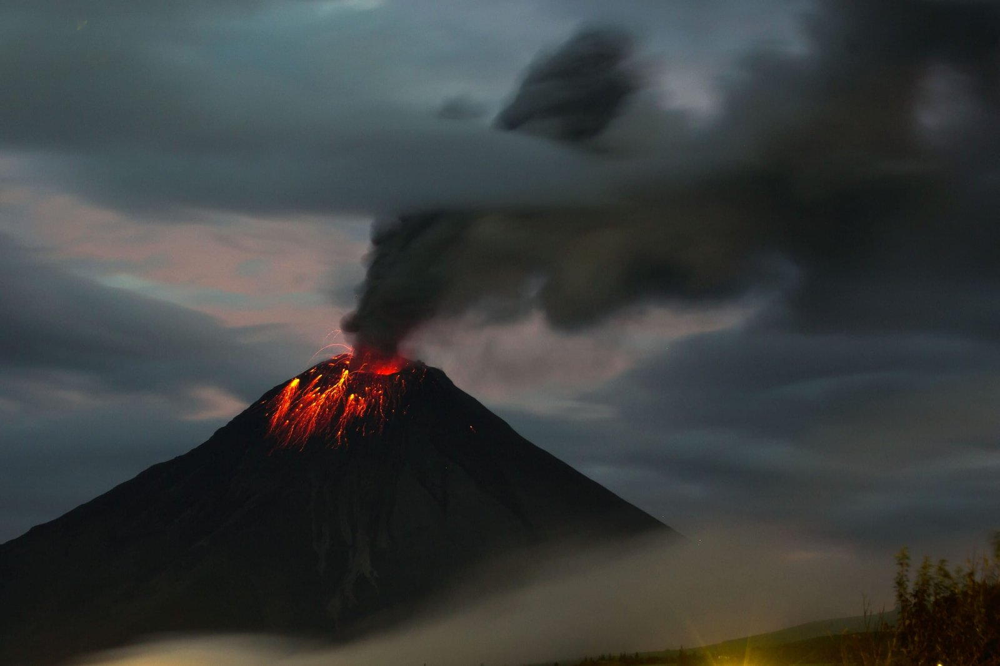
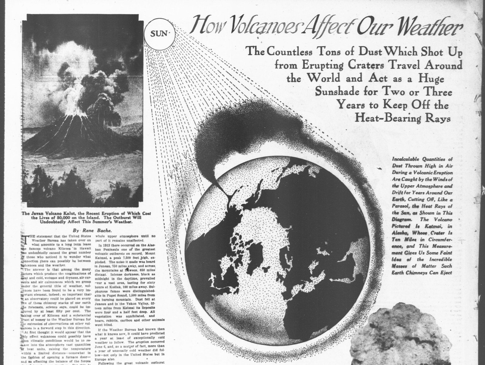
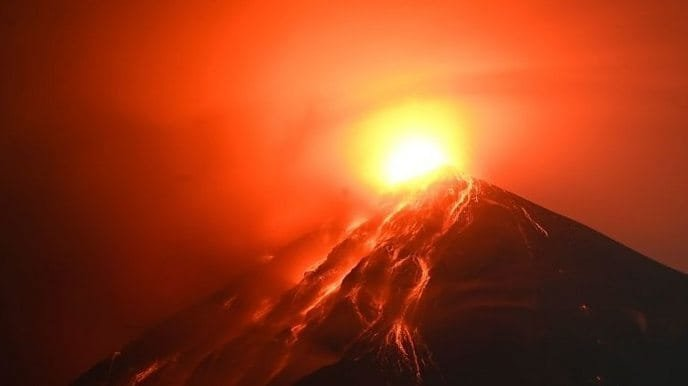

Have you ever wondered about the dramatic stories behind the volcanic eruptions in South America? This continent is not only rich in culture and history but is also a landscape dramatically shaped by volcanic activity. Volcanic eruptions have played pivotal roles in the histories and geographies of various nations. These events are not just geological occurrences but have deep social and environmental implications that resonate through time. To understand the explosive past of South America, let's delve into the tales of some of the most famous volcanic eruptions from the region.

## The Fiery Nature of Volcanoes

Before jumping into the stories, it’s crucial to [understand what makes volcanoes such formidable forces of nature](https://magmamatters.com/understanding-volcanic-formation-a-comprehensive-guide/ "Understanding Volcanic Formation: A Comprehensive Guide"). [Volcanoes are fascinating geological](https://magmamatters.com/geothermal-energy-and-its-volcanic-origins/ "Geothermal Energy and Its Volcanic Origins") formations, essentially openings in the Earth’s crust that allow magma, ash, and gases to escape from below the surface. When conditions align, this buildup of magma can lead to explosive eruptions, reshaping landscapes and altering climates. South America, with its position along the Pacific Ring of Fire, is home to many active volcanoes.

### What Causes a Volcano to Erupt?

In simplistic terms, volcanic eruptions are the result of two main processes – the pressure from accumulated gases and molten rock, and tectonic activities that fracture the Earth's crust. Picture a soda bottle being shaken up, the pressure builds up until it finds an escape, often with dramatic results. Likewise, when magma rises through cracks in the Earth, the pressure build-up can result in explosive eruptions.

### The Role of Tectonic Plates

South America's geology is heavily influenced by the movement of tectonic plates. The Nazca Plate and the South American Plate grind against each other along the continent’s western edge, leading to frequent seismic and volcanic activities. It’s quite fascinating how these plates’ constant dance has shaped not just the physical landscape but also how societies have evolved over time.

## Huaynaputina, Peru - The 1600 Eruption

The story of Huaynaputina is both terrifying and intriguing. This stratovolcano, located in southern Peru, produced the largest volcanic eruption in South America’s recorded history on February 19, 1600. The blast was catastrophic, releasing massive amounts of ash and volcanic material into the atmosphere, which significantly cooled global temperatures.

### The Immediate Impact

Huaynaputina's eruption was devastatingly effective at destroying nearby communities. Agriculture suffered greatly as volcanic ash blanketed fields, leading to widespread famine and economic hardship. Understanding this eruption highlights the critical need for society to prepare for such natural disasters, both for immediate safety and long-term recovery.

### Long-Term Effects

Beyond the immediate devastation, Huaynaputina's eruption had lasting global impacts. There are records from Russia noting a significant decrease in summer temperatures, leading to crop failures and famine there too. This eruption serves as a reminder of how interconnected our planet can be, where a single event in one hemisphere can ripple across to the other.

<iframe width="560" height="315" src="https://www.youtube.com/embed/VNGUdObDoLk" frameborder="0" allow="accelerometer; autoplay; encrypted-media; gyroscope; picture-in-picture" allowfullscreen></iframe>

  

## Cotopaxi, Ecuador - A Force of Destruction and Renewal

Cotopaxi, one of Ecuador’s tallest and most active volcanoes, has erupted more than 50 times since its documentation began in the early 16th century. Its conical shape towers over 5,897 meters above sea level, cutting an imposing figure against the horizon. Its eruptions are a mix of beauty and devastation, where molten lava inevitably leads to regeneration of the surrounding ecosystems.

### Historic Eruptions

One of the most notable eruptions occurred in the 1877, sending lahars (volcanic mudflows) down its slopes to the detriment of the local communities. These lahars traveled as far as 100 kilometers, wiping out entire villages and significantly affecting the economy. Listening to these stories, you realize the sheer power of nature and how populations have had to adapt to this constant threat.

### The Role of Cotopaxi Today

Interestingly, Cotopaxi is not just a threat. It is also a source of beauty and fascination for locals and visitors alike. The surrounding national park is home to diverse wildlife and is a popular destination for hikers and nature enthusiasts. The balance between respecting its power and appreciating its beauty is a central theme in the stories of Cotopaxi.

## Nevado del Ruiz, Colombia - The Tragedy of Armero

Arguably one of the most heart-wrenching volcanic disasters was the eruption of Nevado del Ruiz in 1985, which resulted in the Armero tragedy. This eruption stands as one of the deadliest in the 20th century, with a human cost that reverberates in Colombian history.

### The Build-up to Disaster

Nevado del Ruiz is a stratovolcano located in the Andes of Colombia. Despite showing warning signs, such as minor eruptions and smoking fumaroles in the days leading to the disaster, insufficient attention to these signals tragically led to under-preparedness. It shows the complexity of balancing economic considerations with genuine safety concerns when natural warnings appear.

### The Catastrophe

When Nevado del Ruiz erupted on November 13, 1985, it melted part of the mountain’s ice cap, triggering massive lahars that barreled down its flanks, engulfing the town of Armero. Over 20,000 of Armero's 29,000 inhabitants perished, an enormous tragedy further compounded by insufficient emergency management.

### Learning from Armero

In the wake of the Armero tragedy, international support flooded in, highlighting the disaster's massive scale. In response to this, Colombia improved its emergency preparedness strategies. This story emphasizes how natural disasters can spur societal changes, reinforcing the urgent need for better disaster preparedness worldwide.

## Villarrica, Chile - Nature’s Fiery Display

Villarrica in Chile is one of the most active volcanoes in South America, distinguishing itself with frequent but moderate-sized eruptions. Residing near the Chile-Argentina border, it towers at 2,847 meters tall, with its picturesque snow-capped cone serving as a backdrop for the surrounding lush landscapes.

### Eruptions Over the Years

Villarrica is curious among volcanoes due to its highly fluid lava, allowing for fascinatingly photogenic lava flows. The 1963 eruption is notably renowned, retracing the unpredictable rhythm of its volcanic activity that attracts volcano enthusiasts and scientists worldwide.

### A Source of Adventure

The vicinity of Villarrica is a popular spot for adventurers. It offers a unique opportunity to hike around a live volcano, an ambition for many thrill-seekers. It’s the kind of experience that reminds you of our proximity to nature's wonders and threats. The communities around Villarrica reflect a keen understanding of living in harmony with such an unpredictable neighbor.

## Lessons Learned and Preparedness for the Future

As dramatic as these stories are, they teach crucial lessons about the importance of preparation and adapting to our planet’s volatile nature. The science of volcanology has advanced significantly, driven by the need to predict eruptions and minimize their potential damage.

### Improving Monitoring and Forecasting

Today, scientists use a variety of tools for monitoring volcanic activity, including [seismic activity](https://magmamatters.com/the-art-and-science-of-volcano-monitoring/ "The Art and Science of Volcano Monitoring") detectors, gas analyzers, and satellite imagery. These tools help provide critical data that can potentially predict eruptions, giving authorities valuable time to enact evacuations and other safety measures.

### Community Preparedness

Preparedness extends beyond scientific predictions to community-level education and emergency planning. Stories from South America’s volcanic eruptions push home the message that effective communication and planning can be the difference between tragedy and survival.

### Environmental and Cultural Implications

There’s an indescribable connection between these formidable natural phenomena and the people who live nearby. Many volcanic regions are steeped in cultural history, offering deep insights into ancient civilizations that have lived in harmony with these powerful neighbors.

### Highlighting Resilience

Local communities surrounding volcanoes like Cotopaxi and Villarrica have shown extraordinary resilience, learning to live and thrive in proximity to these looming threats. The adaptations of these populations stand as examples of human ingenuity and resilience in the face of some of nature’s most daunting challenges.

## Conclusion - The Stories Volcanoes Tell

South America’s famous volcanic eruptions are not just tales of destruction—they are storied reflections on human interaction with nature. Each eruption story bears lessons on resilience, preparedness, and the complex yet harmonious relationship between humans and the planet. They serve as potent reminders that while we cannot control nature, understanding and respect can guide us in navigating these powerful natural events. These stories remind us of the inconspicuous balance life maintains with the fiery breath of Earth, a dance between jeopardy and renewal.
