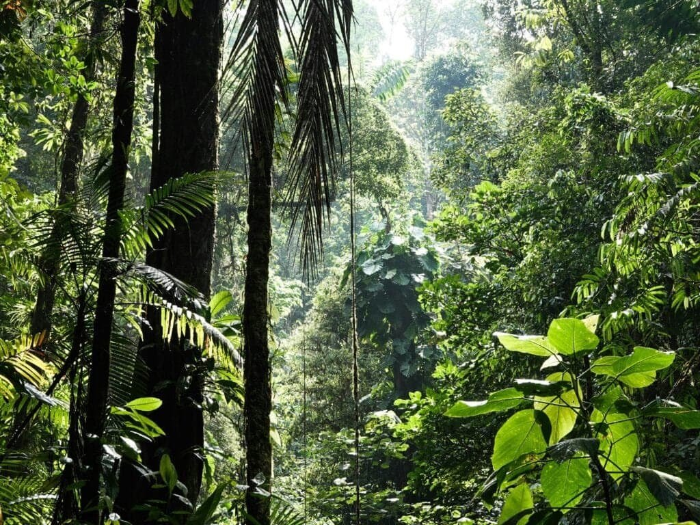

Have you ever considered the surprisingly rich biodiversity that thrives in the shadow of active volcanoes? It might sound a little counterintuitive at first. After all, you might think of volcanoes as dangerous and destructive forces of nature, spewing lava and ash. Yet, these fiery giants create diverse habitats that host an incredible array of life. Let's journey into this fascinating world to uncover the dynamic relationships between volcanic environments and the living organisms that call them home.

<iframe width="560" height="315" src="https://www.youtube.com/embed/EOzLLbWn22Y" frameborder="0" allow="accelerometer; autoplay; encrypted-media; gyroscope; picture-in-picture" allowfullscreen></iframe>

  

## Understanding Volcanic Environments

Volcanoes are more than just mountains that erupt molten rock. They are complex geological formations that significantly influence their surroundings. These environments are strikingly diverse, shaped by the frequency and intensity of eruptions, the landscape's geography, and climatic conditions.

### The Anatomy of a Volcano

The structure of a volcano plays a crucial role in shaping biodiversity. You have the magma chamber deep below the surface, the vent through which magma escapes, and the crater that forms the visible part of an erupted volcano. Each of these components influences the surrounding habitat differently, from the nutrient deposits in the soil to the formation of unique geological features such as lava tubes and geothermal vents.

### Types of Volcanic Habitats

Volcanic habitats are not a one-size-fits-all scenario. They're incredibly diverse, ranging from barren lava fields and fertile volcanic soils to hot springs and fumaroles. Each habitat offers unique conditions that various species can exploit. The variation in vegetation and wildlife is staggering because of these differences, providing a myriad of niches for different species to occupy.

### The Living Terrain: Soil and Nutrients

You might be surprised to learn that volcanic areas often boast some of the richest soils found anywhere in the world. After an eruption, pyroclastic materials, once they break down, provide essential minerals that enrich the soil, supporting lush plant life. This rapid nutrient cycling is a major reason why agriculture thrives in volcanic regions worldwide.

## Biodiversity Hotspots: Life in the Presence of Volcanoes

Despite the catastrophic force of volcanic eruptions, life has a way of bouncing back. In many cases, volcanic regions quickly become biodiversity hotspots, filled with species that have adapted to thrive in these unique conditions.

### Pioneer Species: The First Colonizers

When a volcano erupts, it often wipes the slate clean. But nature doesn’t take long to respond. Pioneer species, such as certain types of lichens and algae, are the first to colonize new volcanic landscapes. They act as biological Kickstarter, stabilizing the environment and paving the way for other life forms.

### Flora: Nature’s Resilience

Volcanic soils are incredibly fertile, supporting a diverse array of plant species. Some plants, known as pyrophytic plants, have even adapted to survive in the fiery heart of active volcanic zones. You might find unique plant life, such as various types of ferns and unique orchid species, thriving here, thanks to the mineral-rich soils.

### Fauna: Animal Adaptations

The animal kingdom, too, finds a way to thrive in volcanic regions. Birds, mammals, and insects have developed fascinating adaptations to live in these environments. For instance, some bird species use geothermal heat to their advantage, nesting in the warm earth to incubate their eggs. Meanwhile, certain amphibians and insects can tolerate the thermal pools' high temperatures and mineral concentrations.

## The Role of Microorganisms in Volcanic Ecosystems

When discussing biodiversity, it's easy to overlook the microscopic world. Yet, microorganisms play a pivotal role in volcanic ecosystems, contributing to nutrient cycles and even aiding in the colonization of barren terrains.

### Microbial Mat Communities

In hydrothermal areas, where water temperatures can exceed 100°C, you'll find complex microbial ecosystems. These microorganisms, including thermophilic bacteria, thrive in boiling conditions and contribute to the ecosystem by breaking down minerals and converting them into nutrients accessible to other species.

### Decomposers: Recycling Nutrients

Microbes also serve as nature's recyclers in volcanic habitats. They help break down organic matter, ensuring that nutrients are reintroduced into the ecosystem. This is especially crucial in areas recovering from volcanic activity, ensuring the rapid regrowth of flora and fauna.

## Volcanic Eruptions: Agents of Change

While volcanoes are renowned for their destructive power, they also act as powerful agents of environmental change. Their eruptions can redefine landscapes, alter climate conditions, and spur biodiversity by creating new habitats.

### Short-Term Impact: Destruction and Renewal

In the immediate aftermath of an eruption, life undergoes a brutal reset. However, this destruction often leads to new opportunities for life to flourish. The gradual cooling of lava flows creates new geothermal features, while the deposition of volcanic ash enriches soils.

### Long-Term Impact: Evolutionary Processes

Volcanic islands are especially notable for their unique biodiversity. Isolated by vast stretches of ocean, these islands become natural laboratories for evolution. Species adapt in surprising ways, developing traits that allow them to thrive in this unique mix of isolation and volcanic activity.

## Case Studies: Biodiversity Around Some of the World’s Active Volcanoes

To really connect with this topic, it helps to look at specific examples around the world where biodiversity flourishes near active volcanoes. Let's take a closer look at a few of these extraordinary places.

### Mount St. Helens, USA

After its colossal eruption in 1980, Mount St. Helens witnessed an incredible story of recovery. The area became a living laboratory where scientists observed the re-establishment of ecosystems from scratch. Pioneer species and small mammals were among the first to return, followed by larger predators and diverse plant life, all thriving in a region that was once a barren expanse of volcanic ash.

### Galápagos Islands, Ecuador

These islands offer some of the most unique examples of biodiversity in volcanic environments. The isolated nature of the Galápagos, combined with ongoing volcanic activity, results in an incredible variety of life. Species like the Galápagos tortoise and marine iguanas have evolved distinctive traits to survive in this rugged landscape, showcasing evolution in action in an active volcanic setting.

### Mount Fuji, Japan

Mount Fuji is not just a cultural icon; it's also an epicenter of biodiversity. The mountain’s varying altitudes support an array of ecosystems, from alpine meadows to dense forests. This rich diversity of habitats allows for a wide range of species to thrive, including many endemic plants and animals found nowhere else on Earth.

## Conservation Efforts and Challenges

Maintaining biodiversity in volcanic regions comes with its own unique set of challenges and opportunities. Conservationists aim to protect these vital areas while ensuring that human activities do not upset the delicate balance of these ecosystems.

### Balancing Human Activity with Ecosystem Health

Volcanic regions often draw human settlements due to their fertile soils. However, activities such as mining and deforestation can have significant impacts on local biodiversity. Sustainable practices and careful management are necessary to preserve these delicate ecosystems.

### Protected Areas and Reserves

Many volcanic regions across the globe have been designated as protected reserves and national parks. These areas are crucial for the conservation of biodiversity, allowing ecosystems to function naturally and species to thrive without the pressure of human intervention.

## Your Role in Preserving Biodiversity in Volcanic Regions

It’s easy to feel disconnected from these distant, dramatic landscapes, but everyone can play a part in preserving the biodiversity of volcanic regions. Whether through direct action or simple awareness and education, your contributions can make a difference.

### Support Conservation Initiatives

Consider supporting organizations dedicated to protecting volcanic regions and their unique biodiversity. These groups work tirelessly to ensure these ecosystems remain healthy and vibrant for future generations.

### Educate and Advocate

Increasing awareness about the importance of biodiversity around active volcanoes can empower others to take action. By educating people about the intricate relationships between volcanic activity and the life it supports, you can help foster a sense of responsibility and inspire change.

## Final Thoughts

The biodiversity around active [volcanoes is an awe-inspiring testament to nature’s](https://magmamatters.com/the-art-and-science-of-volcano-monitoring/ "The Art and Science of Volcano Monitoring") resilience and adaptability. Despite the challenges posed by eruptions and harsh conditions, life finds a way to not only survive but thrive. By understanding and appreciating these ecosystems, you can play a part in ensuring their continued existence. The next time you consider a volcano, remember its role as a dynamic force, shaping life in ways both dramatic and subtle. There's a whole world to discover in the places where fire meets life, and you’re invited to be part of the journey in appreciating and conserving this incredible biodiversity.
