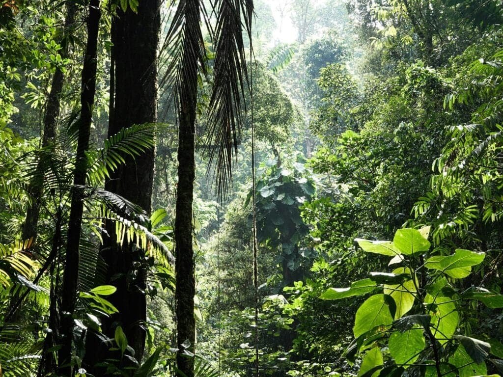

Have you ever considered how life thrives in some of the most unpredictable and harsh environments on Earth, like around active volcanoes? It might seem counterintuitive, but these fiery landscapes are teeming with unique ecosystems, rich in both diversity and resilience. This article is a journey into the heart of these fascinating habitats, exploring how species have adapted to not just survive but thrive within the shadows of active volcanoes.

<iframe width="560" height="315" src="https://www.youtube.com/embed/EOzLLbWn22Y" frameborder="0" allow="accelerometer; autoplay; encrypted-media; gyroscope; picture-in-picture" allowfullscreen></iframe>

  

## The Volcanic Landscape: A Harsh Starting Point

Active volcanoes present a challenging milieu, marked by extremes in temperature, unstable ground, and periodic eruptions. These geological phenomena create a dynamic environment where the landscape can change dramatically in a matter of minutes. Yet, such harsh conditions also lay the groundwork for unique ecological niches.

Volcanic soil, despite its rocky nature and sometimes scorching temperatures, is surprisingly fertile due to its rich mineral content. As lava cools and breaks down over time, it becomes a nutrient-rich substrate that supports life. It’s this paradox of fire and fertility that sets the stage for biodiversity in these regions.

### Unique Geological Features

Volcanoes bring forth a range of features like lava flows, ash deposits, and hot springs. Each of these contributes differently to the biodiversity of the region. Hot springs, for example, harbor thermophilic organisms that thrive in high temperatures, contributing to an unusual set of life forms that defy typical biological constraints.

The rocky crevices of lava flows provide habitats for various organisms, from insects to small mammals, each finding unique ways to eke out a living. The ash layer that covers the ground post-eruption can initially seem barren, but it eventually transforms into a nutrient-rich bed that seeds quickly colonize.

## The Pioneer Species: First Responders

In the wake of an eruption, life seems obliterated. However, pioneer species are quick to colonize these barren environments. These are plants and organisms that can tolerate extreme conditions and often lay the groundwork for more complex ecosystems to develop.

### Lichens and Mosses

Lichens and mosses are often the first pioneers in a post-eruption landscape. They are remarkably resilient, needing little more than light, moisture, and a surface to cling to. Lichens, especially, play a crucial role in breaking down volcanic rock, paving the way for soil formation. This gradual transformation allows other plant species to take root, hastening ecological succession.

### Thermophiles: Heat-Loving Organisms

One of the most fascinating groups of pioneer species are thermophiles—microorganisms that thrive at high temperatures. Hot springs and fumaroles (openings in a planet's crust) are ideal environments for these organisms. Their presence is not just limited to microbes; larger organisms like the Pompeii worm also find existence possible in such heated conditions. They display unique adaptations like specialized proteins that remain stable at high temperatures, an evolutionary marvel worthy of admiration.

## Succession: From Barren to Blooming

The succession process on volcanic landscapes illustrates nature’s capacity for resilience and renewal. Over time, the barren land undergoes a series of stages, from being populated by pioneer species to developing into a more complex ecosystem with shrubs, trees, and diverse animal populations.

### First Flora: Grasses and Shrubs

Once the lichens and mosses have prepared the ground, grasses and shrubs follow. These plants further enrich the soil, adding organic matter as they die and decompose. They also provide food and habitat for a range of insects and small animals, increasing biodiversity incrementally.

### Forests and Larger Fauna

In some volcanic regions, forests eventually emerge. Trees like the Ohia (Metrosideros polymorpha) in Hawaii play a major role in shaping the landscape. These forests support a wealth of wildlife, from birds to insects, each relying on the intricate web of relationships established in these ecosystems.

Larger animals typically move in when there’s sufficient vegetation to support their dietary needs. These include herbivores that contribute to the ecosystem by spreading seeds and forming a major link in the food chain.

## The Role of Water: Catalyst for Life

Water in the vicinity of volcanoes takes many forms—rivers, lakes, and even geothermal features like hotsprings. Each serves a unique function in sustaining and diversifying life around volcanic regions.

### Geothermal Hotspots

Water heated by geothermal processes fosters the survival of various specialized organisms. These hotspots can support unique ecosystems quite different from their cooler surroundings—boasting distinct species that have adapted to high temperatures.

### Bodies of Water: Rivers and Lakes

Volcanic activity often influences the topography, creating natural depressions that become lakes or influencing river courses. These bodies of water are vital, providing not only hydration but also supporting aquatic life which, in turn, attracts predators and contributes to the complexity of the ecosystem.

## Adaptive Strategies: Survival in the Volcanic Shadow

Species living around active [volcanoes](https://magmamatters.com/the-art-and-science-of-volcano-monitoring/ "The Art and Science of Volcano Monitoring") exhibit some of the most remarkable adaptations known in nature. Over time, they have developed strategies that allow them to survive the periodic upheavals and extremes of this environment.

### Plant Adaptations

Plants around active volcanoes often have adaptations like deep root systems to access nutrient resources far below the surface or thick bark to resist heat and fire. Other plants may produce seeds that can withstand extended periods of dormancy until conditions are favorable.

### Animal Adaptations

Animals, ranging from small invertebrates to large mammals, exhibit behavioral and physical adaptations to cope with the known risks of residing near volcanoes. Birds, for instance, might develop migratory patterns that allow them to avoid active eruptions yet establish nesting grounds amidst the cooled volcanic debris thereafter.

## Human Impacts: Harmonizing With Nature

Human activity has both positive and negative impacts on biodiversity around volcanoes. On one hand, the attraction of unique landscapes can drive conservation efforts; on the other hand, increased human presence may introduce new challenges to these fragile ecosystems.

### Conservation Efforts

Many volcanic regions are preserved as national parks or reserves because of their unique ecosystems and geological importance. These protected areas are crucial for scientific research and preserving the biodiversity that’s developed over millennia.

### Tourism and Cultural Impact

Volcanoes often attract tourism which can be a double-edged sword. While it brings awareness and financial resources necessary for conservation, it can also lead to habitat disturbances and pollution if not managed responsibly.

## Case Studies: Vibrant Ecosystems Near Famous Volcanoes

To illustrate the richness of biodiversity around active volcanoes, let’s look at a few remarkable examples across the globe.

### Mount St. Helens, USA

After its catastrophic eruption in 1980, Mount St. Helens became a living laboratory for studying ecological succession. The area initially resembled a lunar landscape but is now thriving with a variety of species, from grasses to elk herds. Scientists have documented the recovery closely, providing invaluable insights into resilience and nature's power to regenerate.

### Kīlauea, Hawaii

Home to the world’s most active volcano, Kīlauea reveals how life can flourish despite constant upheaval. The surrounding Hawaiian rainforest supports a myriad of species, many of which are endemic to the islands. The unique interplay of fire, water, and life in this region highlights adaptation’s crucial role in biodiversity.

### Mount Etna, Italy

This Sicilian volcano is not only a geological wonder but also a life-supporting powerhouse. The fertile volcanic soil supports extensive agriculture, including vineyards and orchards, along with a diverse flora and fauna that exudes resilience despite the omnipresent threat of eruptions.

## Conclusion: Understanding our Fiery Frontiers

The biodiversity around active volcanoes stands as a testament to nature's resilience and ingenuity. These landscapes may seem inhospitable at first glance, yet they nurture complex ecosystems filled with uniquely adapted life forms. From pioneering lichens to complex forest systems and the adaptive behaviors of animals, the volcanic environment is a living illustration of life’s ability to innovate and persist.

Engaging with these vibrant ecosystems not only deepens our appreciation for life’s tenacity but also poses important questions about how we, as humans, can better coexist with and preserve these fiery frontiers. Understanding the intricate balance and interactions at play is crucial as we face broader environmental challenges globally. If anything, the biodiversity around volcanoes reminds us of the delicate interplay between destruction and rejuvenation—a cycle that continues to shape life as we know it.
