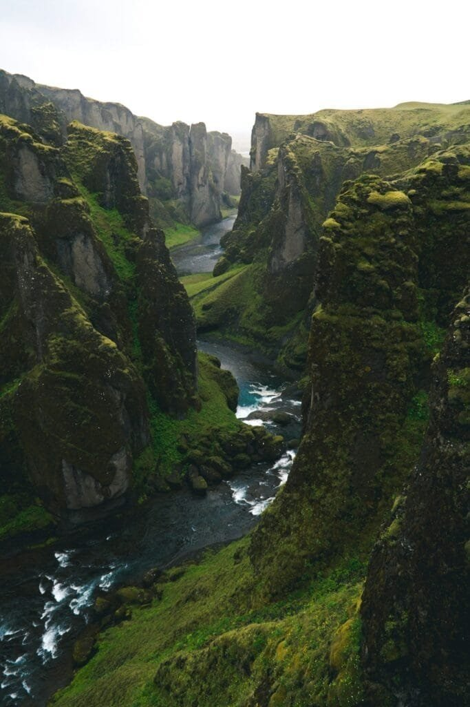

Have you ever found yourself intrigued by the mysterious and explosive power of volcanoes? If so, Iceland offers a fascinating terrain for those interested in volcanic eruptions. The country, with its otherworldly landscapes and dramatic geological activity, holds intriguing tales of volcanic events that shaped its history and terrain.

<iframe width="560" height="315" src="https://www.youtube.com/embed/kze8FkP6Guk" frameborder="0" allow="accelerometer; autoplay; encrypted-media; gyroscope; picture-in-picture" allowfullscreen></iframe>

  

## The Volcanic Landscape of Iceland

Nestling on the Mid-Atlantic Ridge, Iceland is a land sculpted by volcanic activity. This unique positioning means the country experiences frequent volcanic activity, making it one of the most volcanically active places in the world. But with such a dangerous and unpredictable geological feature, Icelanders have adapted to living in harmony with their fiery environment.

### Why is Iceland So Volcanically Active?

You might wonder why Iceland, of all places, is a hotspot for volcanic activity. The answer lies beneath the Earth's surface. Straddling the Mid-Atlantic Ridge, where the Eurasian and North American tectonic plates diverge, Iceland is home to around 130 active and inactive volcanoes. The country is also perched on a hot spot, which is an area where hot plumes of magma rise towards the surface. This combination makes for lively geological happenings.

### Importance of Volcanism in Iceland's History

Volcanism isn’t just about fiery eruptions in Iceland; it’s also interwoven into the very fabric of its history and culture. Historically, eruptions have both fostered and hindered human activity. The rich, fertile soils created by volcanic ash significantly benefit agriculture. Yet, conversely, eruptions have also caused massive destruction and have heavily influenced Icelandic folklore and art.

## The Infamous Eruption Stories

Iceland’s volcanic tales are filled with both wonder and devastation. From historic events that changed the climate worldwide to more recent eruptions that captured global attention, these stories are crucial in understanding Iceland's volatile nature.

### The Laki Eruption of 1783

The Laki eruption stands as one of the most infamous volcanic events in Icelandic history. Over eight months in 1783-1784, the eruption of the Laki fissure produced a volcanic haze that had far-reaching impacts beyond Iceland's borders.

#### The Devastation in Iceland

It was no ordinary eruption. The vast clouds of poisonous gas released led to the Móðuharðindin, or "Mist Hardships." This period saw a significant loss of life, with an estimated 20% of Iceland's population succumbing to starvation and the effects of toxic gas. Livestock perished, and crop failure was rampant, painting a grim picture as the Icelandic climate turned harsher due to the eruption.

#### Global Impacts

Imagine an eruption affecting the entire Northern Hemisphere's climate. The Laki eruption did just that, lowering temperatures and causing extreme weather conditions. Famously, this event contributed to food shortages in Europe and might have played a role in sparking societal unrest leading up to the French Revolution. Such is the power of Iceland’s volcanoes that their effects ripple far from their fiery source.

### The Eyjafjallajökull Explosion of 2010

More recently, the eruption of Eyjafjallajökull in 2010 grabbed worldwide headlines. Though less catastrophic in terms of human impact, it provided a powerful reminder of how disruptive volcanic eruptions can be.

#### Consequences for Air Travel

The eruption led to the largest air-traffic shutdown since World War II, affecting over 10 million air travelers. The ash cloud from Eyjafjallajökull extended across Europe, grounding flights for several days. It was a stark example of how natural forces can quickly influence modern life, inconveniencing millions and causing significant economic impact.

#### Volcanic Tourism Boom

Ironically, while the eruption caused havoc in air travel, it also sparked increased interest in volcanic tourism to Iceland. Visitors flocked to witness the powerful forces at play, boosting Iceland’s tourism industry. The eruption inadvertently became a global advertisement for Iceland's fiery attractions.

### Heimaey Eruption of 1973

Turning to another significant event, the eruption on Heimaey, part of the Vestmannaeyjar archipelago, stands out. It was unique due to the proximity to human habitation and the remarkable response from the island’s residents.

#### A Midnight Awakening

On a cold January night in 1973, residents of Heimaey awoke to the sight and sound of lava spewing from a fissure just outside the town. Unlike previous eruptions on sparsely populated areas, this one threatened the homes and livelihoods of the island’s inhabitants.

#### The Innovative Human Response

Demonstrating resilience and ingenuity, the residents and the government carried out an unprecedented effort to save the town. They pumped seawater onto the advancing lava flows to cool and harden the lava, ultimately redirecting its path away from the harbor, an essential lifeline for the community's fishing industry. This remarkable response not only saved the town but also highlighted human resilience in the face of natural disasters.

## The Science Behind Volcanoes

Understanding volcanoes goes beyond just narrating their stories. It involves delving into the science that explains their relentless activity. From underlying [geology to predictive technology](https://magmamatters.com/geothermal-energy-and-its-volcanic-origins/ "Geothermal Energy and Its Volcanic Origins"), science plays a crucial role.

### How Volcanoes Work

At the heart of a volcano’s power is magma, the molten rock that forms beneath Earth’s crust. But how does this molten material get to the surface? Pressure builds within the Earth's mantle until it finds an escape route through fractures in the crust. When enough pressure accumulates, an eruption occurs, releasing magma as lava, along with ash and gases.

### Monitoring and Predicting Eruptions

You might wonder if it’s possible to predict volcanic eruptions. While absolute prediction remains elusive, significant advances have been made in monitoring technologies. Instruments such as seismographs measure earthquake activity, while satellite imagery helps track ground deformation and gas emissions. Combined, these tools allow scientists to assess the likelihood of an eruption, providing valuable warnings and reducing potential impacts.

## Living with Volcanoes

For Icelanders, living with volcanoes is simply part of life. From harnessing geothermal energy to ensuring public safety, Iceland exemplifies how to coexist with such powerful [natural phenomena](https://magmamatters.com/the-art-and-science-of-volcano-monitoring/ "The Art and Science of Volcano Monitoring").

### Geothermal Energy

Did you know that Iceland's volcanic activity provides a sustainable energy source? The geothermal energy harnessed from below the Earth’s surface heats homes, powers industry, and provides hot water throughout the country. This renewable energy source contributes significantly to Iceland's commitment to environmental sustainability, illustrating a harmonious relationship between humans and nature.

### Continuing Vigilance and Preparedness

With the understanding that another eruption is always possible, Iceland maintains a high level of preparedness. Vigorous research, constant monitoring, and a robust emergency response system help safeguard against future eruptions. Moreover, public education campaigns ensure that residents remain informed and prepared, highlighting Iceland’s proactive approach to living amid volcanoes.

## Conclusion

Iceland’s volcanic eruptions tell stories of both destruction and resilience, awe, and understanding. From shaping the landscape physically to influencing historical events globally, these eruptions underscore the profound impact of natural forces. As you reflect on these tales, it’s a reminder of the delicate balance between humanity and nature, where understanding and respect for the powerful forces of our planet can lead to coexistence and, sometimes, even benefit.

These stories are more than just reminders of past events; they are ongoing lessons in resilience, adaptation, and the sheer wonder of the Earth’s activity. They invite you to contemplate humanity's place on this dynamic planet and how we might continue to thrive using knowledge, preparedness, and respect for these monumental natural processes.
