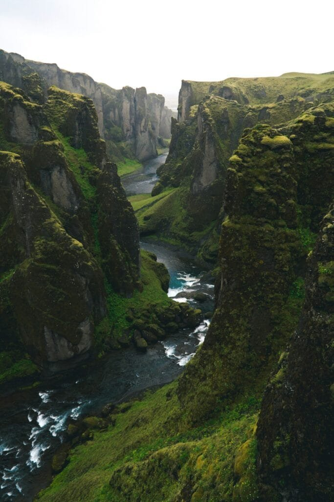

Have you ever wondered why Iceland is often referred to as the land of fire and ice? The answer lies within its stunning landscapes and the powerful volcanic activity that has shaped and influenced both its geography and its history. This small island country in the North Atlantic is perched atop the Mid-Atlantic Ridge and boasts around 130 volcanic mountains, a testament to the ongoing tectonic showdown beneath its surface. Here, you can discover fascinating stories of volcanic eruptions that have made headlines, changed lives, and sparked legends. Let me tell you about some of these extraordinary tales connected to Iceland's fiery heart.

<iframe width="560" height="315" src="https://www.youtube.com/embed/kze8FkP6Guk" frameborder="0" allow="accelerometer; autoplay; encrypted-media; gyroscope; picture-in-picture" allowfullscreen></iframe>

  

## The Role of Volcanoes in Iceland

Iceland's unique positioning on the tectonic plate boundary makes it one of the most volcanically active regions in the world. This ongoing geologic activity not only impacts the landscape but also significantly influences local culture and history. Volcanic eruptions here are not just natural events; they are stories of survival, adaptation, and sometimes even inspiration for change. The extensive history of eruptions has shaped the land, with lava fields, hot springs, and geysers serving as constant reminders of the power simmering just beneath the surface.

## The 1783 Laki Eruption: A Global Catastrophe

Perhaps the most dramatic volcanic event in Iceland's history is the Laki eruption of 1783. This was not an ordinary eruption; it was a cataclysm that affected the entire Northern Hemisphere. Spanning over eight months, the eruption released vast quantities of lava and poisonous gases.

### Impact on Iceland

The devastation was immediate for Iceland. The toxic haze from Laki led to what became known as the "Mist Hardships." Around a quarter of Iceland's population perished due to the famine and disease brought on by the eruption. The livestock death-rate soared as well, as fields were poisoned, and feed became scarcer. The aftershocks of this catastrophe rippled through Iceland, dramatically reshaping its demographic and economic landscape.

### Influence Beyond Iceland

Interestingly, the effects of the Laki eruption didn't stay confined to Iceland. The massive amount of [sulfur dioxide](https://magmamatters.com/the-art-and-science-of-volcano-monitoring/ "The Art and Science of Volcano Monitoring") released into the atmosphere led to climate anomalies worldwide, contributing to what some historians believe was the infamous harsh winter that preluded the French Revolution. Widespread famines occurred in various parts of Europe as crops failed due to the ‘Laki haze,’ demonstrating not just the local, but the global impact of volcanic events.

## The Mystique of Eyjafjallajökull's 2010 Eruption

If you were to ask anyone about an Icelandic volcano that caused recent chaos, Eyjafjallajökull would likely spring to mind. The 2010 eruption of Eyjafjallajökull was not the largest by any means, but its impact on air travel was unprecedented.

### The Days the World Looked Up

Eyjafjallajökull erupted in April 2010, sending an ash plume soaring into the sky. The fine particles of volcanic ash infiltrated the jet stream, spreading across Europe and forcing the closure of airspace in an unprecedented peacetime measure. Over 100,000 flights were canceled, affecting millions of passengers worldwide, and revealing just how interconnected we actually are.

### The Cultural Aftereffects

The eruption of Eyjafjallajökull also fostered a renewed interest in how society responds to natural disasters. It sparked discussions about crisis management, and how we prepare for and manage such global disruptions. For Iceland, it was a moment that highlighted the delicate balance between gaining economic benefits from tourism and the [environmental costs their unique geological](https://magmamatters.com/geothermal-energy-and-its-volcanic-origins/ "Geothermal Energy and Its Volcanic Origins") features could incur.

## Grímsvötn Eruption: A Reminder of Iceland's Volcanic Nature

Another significant volcanic eruption was that of Grímsvötn in 2011. Though not as disruptive internationally as its predecessor Eyjafjallajökull, Grímsvötn was, and is, a reminder of Iceland's volatile volcanic nature.

### Local Challenges Over Global Headlines

Grímsvötn produced a high plume of ash, but due to favorable weather conditions, the long-term disruption was minimal. However, for the people living in the immediate vicinity, it was a stark reminder of the challenges they face living in such proximity to an active volcano. The ash fall impacted the local environment, farms, and communities, with residents working tirelessly to prevent ash-induced damage.

### Scientific Opportunities

Despite the disruption, the eruption was invaluable for scientists, offering a rare opportunity to study volcanic ash clouds and their movements. The data collected during these eruptions improve our understanding of volcanic activity and enhance the predictive models that help in effective disaster preparedness.

## The Story of Eldfell's Eruption and Impact on Heimaey Island

Closer to residents' hearts is the 1973 eruption of Eldfell on the island of Heimaey, part of the Vestmannaeyjar archipelago. Often remembered because it occurred unexpectedly in the middle of the night, this eruption was one of the more dramatic and intrusive volcanic events in Iceland's recent history.

### Unforeseen Devastation

Residents of Heimaey faced almost immediate evacuation in harsh winter conditions as lava flow threatened the town. The navy mobilized, and in an astonishing feat, almost everyone was safely evacuated. In the following days and months, relentless efforts to save the town involved spraying seawater onto the advancing lava to cool it and redirect its flow, demonstrating innovative resilience against nature's force.

### A New Landscape and Economy

The eruption created a new landscape, with the growing lava field forming a natural harbor extension that became beneficial for the island's fishing industry. Today, the story of Eldfell is not just told in schoolbooks but lives on in the memories of those who witnessed it, along with its impacts on the island's future economic development.

## Volcanic Eruptions: Shaping Culture and Myth

This intertwining of Iceland's people with their volcanic land has brewed its own unique culture and folklore. Throughout history, volcanic eruptions have been both feared and revered, providing rich fodder for Icelandic sagas and myths.

### Folklore and Eruptions

Often, eruptions were seen as acts of gods or malevolent spirits, and these ominous geological events have understandably embedded themselves in Icelandic folklore. Tales of trolls or surprisingly modern stories interpreted as metaphors for change encapsulate how deeply these natural phenomena are entwined with cultural identity.

### The Artistic Influence

Artists and writers have drawn inspiration from the volatile beauty of Iceland's landscape. The unpredictable majesty of volcanoes often serves as a canvas for painting the deeper complexities of human emotion and endurance. As unpredictable and grand as life itself, the volatile expression of Iceland's geological heart continues to inspire countless stories and works of art.

## Preparing for the Unpredictable Future

Living amidst active volcanoes means a continued preparedness for eruptions. Technology advances aim to predict volcanic activity better and mitigate its impacts with greater accuracy.

### Early Warning Systems

Today, Iceland is heavily equipped with cutting-edge seismic monitoring systems. These provide crucial early warnings that can save lives and minimize damage. While prediction technology is not foolproof, it has significantly improved since the times of Eldfell and Laki, potentially altering the course of future volcanic events.

### Post-Eruption Recovery Planning

Equally important is post-eruption planning. Iceland remains committed to balancing its economic, social, and environmental needs in the wake of eruptions. Recovery plans are built on both contemporary innovations and age-old instincts to adapt and thrive even after the landscape – and life – has shifted.

## The Continuing Tale of Fire and Ice

So, as you reflect on these stories of fiery havoc and human resilience, remember they're far more than just natural events. Each eruption holds tales of survival, ingenuity, and a profound bond between Icelanders and their dynamic, beautiful land of fire and ice. This visceral connection to the earth, paired with an indomitable spirit, continues to define both Iceland and its people, sculpting an evolving landscape filled with stories waiting to be told.

Iceland is a place where the land and its stories are intrinsically linked, each eruption adding another chapter to its captivating annals. Through these fiery narratives, we are reminded not only of our place within the natural world but also of the power we possess to adapt and find unity, even when faced with the unpredictable forces of nature.
