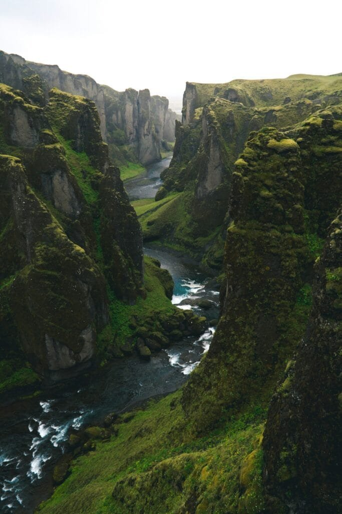

Have you ever wondered what it would be like to witness one of nature's most powerful and awe-inspiring phenomena? Volcanic eruptions are not just bursts of fiery lava and ash; they are spectacles of Earth's raw energy and have captivated human imagination for centuries. In Iceland, a land where the natural elements coalesce in dramatic fashion, volcanic eruptions come with stories as compelling as the eruptions themselves. Are you ready to hear some of these captivating tales?

<iframe width="560" height="315" src="https://www.youtube.com/embed/kze8FkP6Guk" frameborder="0" allow="accelerometer; autoplay; encrypted-media; gyroscope; picture-in-picture" allowfullscreen></iframe>

  

## The Land of Fire and Ice

Iceland is often referred to as the "Land of Fire and Ice," but what does this really mean? Situated on the Mid-Atlantic Ridge where the North American and Eurasian tectonic plates meet, Iceland is a hotbed of geothermal activity. Its unique geographical position gives rise to approximately 130 volcanic mountains, some of which still bubble with life today. You're probably aware that this small island country holds a significant number of the Earth's volcanoes—in fact, it’s home to approximately 30 active volcanic systems.

### A Geological Marvel

The geological landscape of Iceland is diverse and unique. From its vast glaciers to its steaming geysers, it's a living laboratory of physics and Earth science. Volcanic eruptions are a key part of this natural tapestry, continuously reshaping the land. When it comes to eruptions, Iceland offers a fascinating blend of fear and fascination. Here, let’s delve into some of the most famous volcanic eruptions that have left an indelible mark on both Iceland and the world’s history.

## The Laki Eruption (1783-1784)

One of the most devastating eruptions that Iceland has ever witnessed is the Laki eruption, which took place over a period of eight months from June 8, 1783, to February 1784. Can you imagine the scale of destruction caused by something as seemingly innocuous as openings in the Earth’s crust?

### The Catastrophic Consequences

The Laki eruption released about 14 cubic kilometers of lava and expelled an estimated 120 million tons of [sulfur dioxide](https://magmamatters.com/the-art-and-science-of-volcano-monitoring/ "The Art and Science of Volcano Monitoring") into the atmosphere. What does that mean for you in terms of understanding its impact? Well, this led to an environmental disaster with far-reaching effects, from severe weather patterns across Europe to failing crops in Iceland, resulting in a famine that reduced the country's population by about one fifth.

### A Global Impact

The consequences of the Laki eruption were not confined to Iceland. Have you heard of the "haze famine" that swept across Europe? Sulfur dioxide generated an acidic haze, resulting in climatic anomalies like the "Great Fog" of 1783, which strangled much of Europe. Some historians even link this event to social unrest and the French Revolution. Quite a ripple effect for a phenomenon that's often considered local, wouldn't you agree?

## The Eyjafjallajökull Eruption (2010)

You might remember the name Eyjafjallajökull, especially if air travel holds any interest for you. An eruption of this volcano in 2010 caused one of the largest air traffic shutdowns since World War II, affecting millions of people across Europe and beyond.

### Why the Chaos?

What made Eyjafjallajökull so disruptive wasn't its size or strength, but its location and the type of eruption it produced. The volcano belched massive amounts of ash high into the atmosphere, where it was carried by prevailing winds across Europe. If you've ever flown, you probably know that ash clouds can cause serious damage to airplane engines, leading to the grounding of over 100,000 flights and the loss of billions of dollars.

### Social and Economic Repercussions

The upheaval caused by the Eyjafjallajökull eruption extended beyond mere inconvenience. Stranded travelers, disrupted supply chains, and financial losses were just some of the immediate consequences. But beyond this, Eyjafjallajökull served as a stark reminder of how interconnected our modern world is—and how a natural event in a remote part of the globe can impact lives around the world in unpredictable ways.

## The Katla Volcano: The Sleeping Giant

If volcanic legends fascinate you, then Katla is definitely a name that should grab your attention. Often referred to as one of Iceland’s "most dangerous volcanoes," Katla lies beneath the Myrdalsjökull glacier. It’s been rumbling quietly with seismic activity, leading many to worry about when it will next wake.

### The Potential Threat

Katla last erupted in 1918, but it has a history of erupting approximately every 50 years, making its current silence slightly unsettling. When it does erupt, Katla tends to do so explosively, creating dramatic and devastating jökulhlaups—glacial floods—that can reshape landscapes. For you, this might prompt the question: Are we ready for Katla’s next major show?

### Historical Anecdotes

Throughout Icelandic history, Katla has been a cause of significant anxiety and destruction. From forcing massive evacuations to altering the geography of nearby areas, each Katla eruption has carried its own set of dramatic tales. Its legend is so pervasive that locals and geologists alike keep a wary eye on this dormant, yet unpredictable giant.

## The Hekla Volcano: The Gateway to Hell

Hekla is another iconic volcano in Iceland, often referred to as the "Gateway to Hell" because of its fiery past and the lore surrounding it. For centuries, superstitious sailors and locals believed it to be an entrance to the underworld.

### Historical Significance

One of the earliest recorded eruptions of Hekla occurred in 1104, which ironically marked the start of the Written Age in Iceland as it prompted extensive documentation. Throughout the ages, Hekla has erupted more than 20 times, affecting local settlements and, at times, altering the course of Iceland's history.

### Both Beauty and Destruction

For you as an observer, Hekla offers both a beautiful and frightening experience. While the sight of crimson lava painting the night sky is mesmerizing, the devastation it can unleash is a reminder of nature's duality. Hekla's frequent activity doesn't just change the physical landscape; it also shapes the cultural and social fabric of Iceland, inspiring art, literature, and folklore.

## Surtsey: The Birth of an Island

Would you like to witness the miracle of life emerging amidst chaos? Surtsey offers just that—a real-time, tangible spectacle where you can see new land forming from volcanic activity. This new island was born from an underwater eruption off Iceland's coast between 1963 and 1967.

### A Living Laboratory

Surtsey is more than just an island; it's a natural laboratory. Undisturbed by human intervention, it serves as a pristine environment for scientists to study biological colonization. Over time, the barren rock began hosting life such as plants, insects, and birds. Imagine witnessing the gradual but sure march of life in a place where once there was none. It’s certainly a sight to behold, wouldn’t you agree?

### The Story of Creation

The creation of Surtsey added not just a physical entity to the Earth's surface but also a rich story to the chronicles of scientific discovery. For you, this tale invites a deeper understanding of Earth's continuous evolutionary dance. It provides a humbling view into the processes that have shaped our planet over millennia.

## Modern-Day Implications and Learnings

The legacy of volcanic eruptions in Iceland is as contemporary as it is historical. What do these past events tell us about what lies ahead? Learning from the past may help mitigate future risks, especially in our interconnected world.

### Monitoring and Predictability

Modern [technology has significantly improved our ability to monitor volcanic](https://magmamatters.com/geothermal-energy-and-its-volcanic-origins/ "Geothermal Energy and Its Volcanic Origins") activity. You might find it fascinating that Iceland employs a sophisticated network of sensors, satellites, and seismographs to keep an eye on its volatile neighbors. These advancements give us crucial lead time in preparing for potential eruptions, helping to avert or minimize disasters.

### Preparedness and Adaptation

With this knowledge comes the responsibility to prepare and adapt. Iceland's civil defense strategies have evolved through years of lessons learned from its volcanic past. From planning evacuation routes to building infrastructure designed to withstand natural calamities, Iceland serves as a role model in how to live alongside such unpredictable natural forces.

## The Cultural Reverberations

Beyond the scientific and environmental aspects, volcanic eruptions also ricochet through Iceland's cultural identity. From folklore to literature, these forceful events permeate various facets of Icelandic life.

### Folklore and Myths

You may find it intriguing that Icelandic folklore is rich with tales of elves, trolls, and other-worldly creatures, many of which are influenced by the island’s unique geological features. Volcanic eruptions have long served as powerful metaphors and narrative devices within these tales, illustrating the delicate balance between humanity and nature.

### Literature and Art

The potent imagery of volcanic eruptions infuses Icelandic literature and art. From poems extolling the ferocity of a volcanic outburst to paintings capturing the interplay of fire and ice, the eruptions are immortalized in creative expressions. Should you ever visit an Icelandic gallery or read an Icelandic poem, you're likely to encounter the haunting presence of its volcanoes.

## Conclusion: The Ever-Present Reminder

Living in or even just visiting Iceland offers a constant reminder of Earth's relentless energy and beauty. The story of Iceland's volcanic eruptions is not just a history lesson; it's an ongoing saga that challenges, fascinates, and inspires. As you unravel these narratives, you're journeying into a world where raw natural power shapes history and defines human experience.

Rather than fearing these volatile giants, the Icelandic people have learned to coexist with them, treating these immense forces with a mix of respect, awe, and vigilance. In doing so, they offer a unique perspective on resilience and adaptability in the face of nature’s sublime and sometimes terrifying spectacles. Isn't that a lesson worth embracing, wherever you may find yourself in the world?
