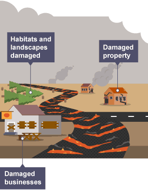
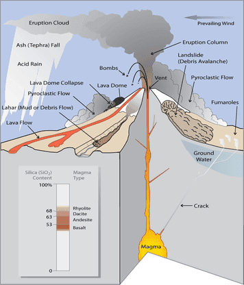
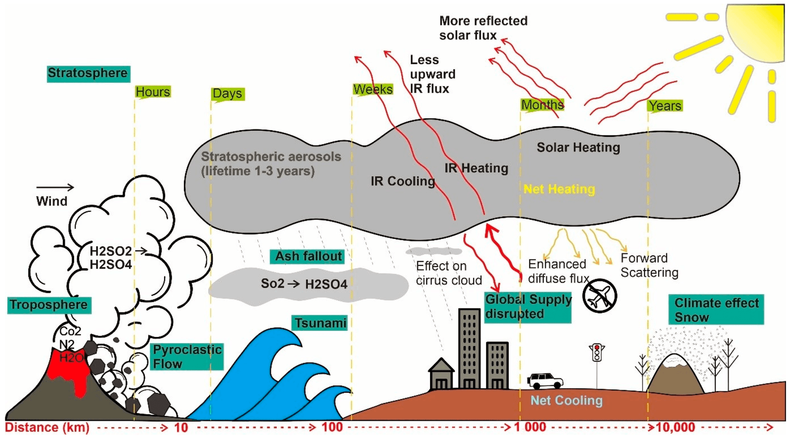

Have you ever considered how a natural event, magnificent yet menacing, like a volcanic eruption, can ripple through the fabric of local economies? When you think about a volcanic eruption, perhaps images of flowing lava or the mighty plume bursting into the sky come to mind. However, the real picture extends beyond the immediate visual spectacle. The aftermath can significantly influence the socioeconomic landscape of the areas affected.

## Understanding Volcanic Eruptions

Before contemplating their economic impacts, let’s first understand what volcanic eruptions are. Picture this: a volcano is like a pressure cooker. Over time, pressure builds up beneath the Earth’s crust in the form of magma. When this pressure becomes too much for the Earth to contain, the volcano erupts, releasing lava, ash, and gases. The intensity and type of eruption vary, which can set off diverse chains of effects on the surrounding environment and communities.

### Types of Volcanic Eruptions

Different types of eruptions present different kinds of challenges. Explosive eruptions, for example, are mighty and sudden, spewing ash clouds and [pyroclastic flows](https://magmamatters.com/the-environmental-impact-of-volcanic-eruptions-2/ "The Environmental Impact of Volcanic Eruptions"). On the other hand, effusive eruptions are calmer, with slow magma flows. Each type has varying effects, costs, and damages, influencing how communities can plan and respond to them.

### Immediate Effects of Eruptions

When a volcano erupts, the initial impact is often one of chaos and destruction. The immediate effects might include lava flows engulfing land, ash clouds disrupting air travel, and massive evacuations. For communities living close to volcanoes, this translates into the immediate challenge of survival and safety.

## Short-term Economic Impacts

It’s not just the earth that shakes; local economies often experience tremors of their own. The short-term impact of volcanic eruptions can be both direct and indirect, immediately affecting locals' livelihoods.

### Disruption of Daily Activities

Imagine your day abruptly interrupted by an ash cloud. Schools close, businesses shutter, and transportation grinds to a halt. These disruptions can last from days to weeks, affecting productivity and economic activity in the region.

### Tourism

For regions that thrive on tourism, the eruption can be both a curse and a blessing. While an immediate drop in tourist numbers is expected due to accessibility and safety concerns, there can also be a curious allure to the might of Mother [Nature](https://magmamatters.com/the-art-and-science-of-volcano-monitoring/ "The Art and Science of Volcano Monitoring"), drawing visitors after the activity settles.

### Damage to Infrastructure

Infrastructural damage is another hurdle. Roads, bridges, and buildings may be damaged or destroyed. These structures form the veins of an economy, and their disruption leads to significant short-term economic implications. Rebuilding efforts also require time and resources that might not have been pre-allocated.

### Agriculture and Livelihood

A major part of any local economy, agriculture can suffer massively. Ash clouds can suffocate crops and livestock, leading to loss of food supply and income for farmers. This not only impacts primary producers but also has a cascading effect on supply chains and consumers.

<iframe width="560" height="315" src="https://www.youtube.com/embed/Wam8kR95xKk" frameborder="0" allow="accelerometer; autoplay; encrypted-media; gyroscope; picture-in-picture" allowfullscreen></iframe>

  

## Long-term Economic Impacts

The impact of a volcanic eruption is not fleeting. While the ash settles and the lava cools, the economic repercussions can linger for years.

### Reconstruction Costs

Rebuilding is no easy task. Governments and local authorities must allocate significant funds for reconstruction which could otherwise be spent on development or other critical areas. The ability to rebuild efficiently can determine how quickly an economy recovers or if it stagnates.

### Changes in Land Value

Post-eruption, land value may fluctuate dramatically. Some areas become undesirable due to risks of further activity, while others may see value in agricultural revitalization afforded by the nutrient-rich volcanic soil. This dynamic shift impacts real estate and local economies as businesses reassess their positions.

### Long-term Displacement and Migration

For some individuals, returning home is not an option. Long-term displacement leads to migration, both internal and international, which can put additional pressure on economies receiving these populations. These communities then must adapt to provide services and economic opportunities.

## Economic Opportunities and Possibilities

Amidst the challenges, volcanic eruptions provide opportunities for growth and innovation, often transforming the economic landscape in unexpected ways.

### Fertile Ground for Agriculture

The silver lining often lies in the land itself. Volcanic soil is incredibly fertile, and after an initial period of recovery, it can offer potent agricultural opportunities. Regions can leverage this to rebuild agricultural bases that are more productive than before.

### Tourism Boom

Over time, the volcano itself becomes a point of interest. The catastrophic power of nature and its serene slumber draw tourists, revitalizing areas with eco-tourism and creating new economic pathways.

### Energy Opportunities

Geothermal energy is a direct benefit of volcanic activity, often untapped yet potent. This form of renewable energy presents a long-term investment opportunity that can drive local economies towards sustainable futures.

## Challenges and Strategies for Recovery

While opportunities abound, recovering from a volcanic eruption is far from straightforward. Effective planning, resilience, and adaptability are crucial to mitigating the long-term economic impact.

### Disaster Preparedness and Community Resilience

One can never predict when a volcano will erupt, but communities can enhance their resilience through disaster preparedness. This involves educating locals on evacuation plans, building infrastructure meant to withstand ash and tremor, and diversifying economic bases to minimize dependency on a single sector.

### Government and International Aid

Local governments, often stretched in resources, require both national and international support—financial aid, expertise, and logistical help—to aid in effective recovery efforts. Such cooperation facilitates quicker, more sustainable rehabilitation.

### Innovation and Technology

Incorporating innovation, from technology to policy enhancements, can redefine how communities respond to and recover from eruptions. Predictive technology, social media, and real-time data sharing can be instrumental in efficient management.

## Case Studies and Examples

Looking at real-world examples offers a clearer picture of how volcanic eruptions affect local economies. From Hawaii to Iceland, each case demonstrates unique responses and recovery models.

### Hawaii's Kilauea

Kilauea’s frequent activity impacts Hawaii’s Big Island differently than one might expect. While lava covers roads and tourist spots initially scram, long-term gains in [geological tourism and a booming new energy](https://magmamatters.com/geothermal-energy-and-its-volcanic-origins/ "Geothermal Energy and Its Volcanic Origins") sector have changed local economic structures.

### Iceland's Eyjafjallajökull

The massive ash cloud of 2010 shut down European air traffic, costing billions. However, Iceland capitalized on the eruption to boost tourism with interactive exhibits and increased awareness about geothermal potentials.

### Mount St. Helens, USA

The catastrophic 1980 eruption obliterated the surrounding ecosystem. Supplemented by government support and a growing interest in disaster tourism, these efforts provided essential lessons in balancing ecological restoration with economic revitalization.

## Conclusion

Understanding the multifaceted economic impacts of volcanic eruptions invites a deeper contemplation of nature's power. It forces one to consider how societies adapt, how economies are rebuilt, and how resilience can turn potential adversities into opportunities. When we understand the delicate interplay between Earth’s forces and human economies, perhaps we can plan for a future where disasters are not just interruptions, but catalysts for positive change.
