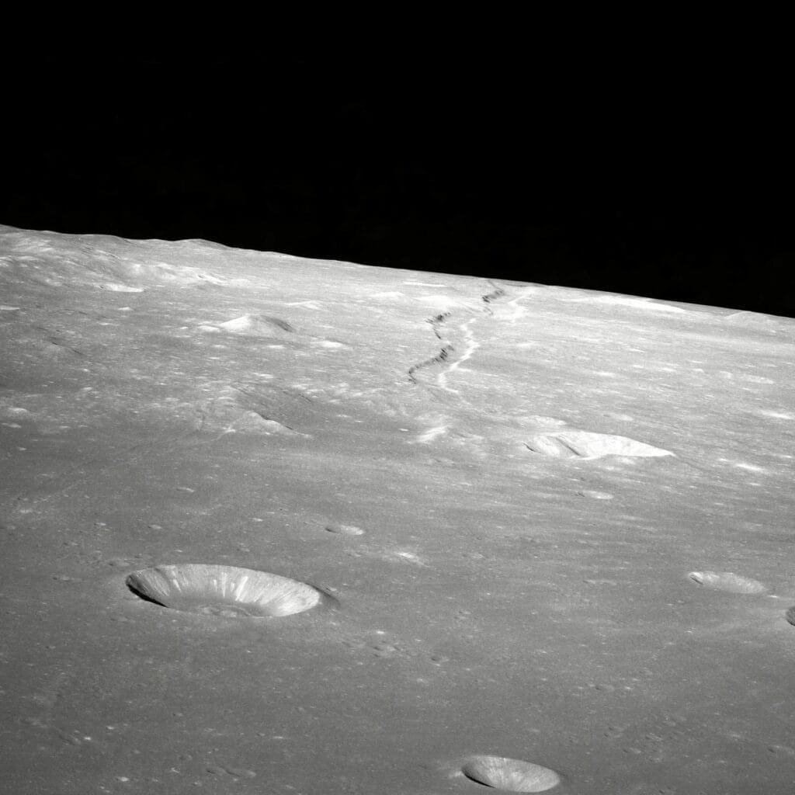

Have you ever marveled at the otherworldly beauty of a crater lake and wondered how it came to be? These stunning natural wonders are a testament to the incredible power of volcanic eruptions. Yes, the very same geological forces that can be so destructive and terrifying also possess the ability to create breathtaking, tranquil bodies of water nestled within the craters of dormant or extinct volcanoes. Let's explore how these magnificent lakes form and what makes them so captivating.

<iframe width="560" height="315" src="https://www.youtube.com/embed/dR0RF8SoM38" frameborder="0" allow="accelerometer; autoplay; encrypted-media; gyroscope; picture-in-picture" allowfullscreen></iframe>

  

## The Birth of a Crater: A Volcanic Symphony

The journey of a crater lake begins with a volcanic eruption, an awe-inspiring event that can dramatically reshape the landscape. A volcano erupts when molten rock, known as magma, escapes from beneath the Earth's crust. This explosive event can carve out a large depression known as a caldera, which can eventually evolve into a crater lake.

### The Caldera: A Volcanic Sculptor

When a volcano expels a significant amount of its magma, its structural support is compromised. The result? The ground collapses, creating a large, bowl-shaped depression called a caldera. This isn't your everyday eruption; it's a monumental event that lays the groundwork for a potential crater lake.

Consider this: would you expect an artistic masterpiece to emerge from chaos? In a way, that's what these volcanic processes accomplish. The earth reshapes itself in the aftermath of extraordinary turmoil, laying the foundation for a tranquil water body.

### Magma's Dance and Its Aftermath

Why does magma decide to make a dramatic exit like this? The answer lies in the buildup of pressure within the magma chamber beneath the volcano. Imagine the pressure of a shaken soda can, desperate for release. When the pressure becomes unsustainable, the volcanic mountain cracks open, and the caldera forms as the earth settles into its new shape.

Once this explosive act reaches its denouement, a caldera remains—empty, expectant, and oddly serene. Does one marvel at the possibility that this hollow, hardened shell could shelter something as peaceful as a lake?

## Nature’s Paintbrush: The Formation of a Crater Lake

With a caldera in place, the stage is set for the formation of a crater lake. It's a gradual process, painting the barren canvas left by the volcano with colorful strokes of life.

### Interaction with Water: Filling the Caldera

Not all calderas become lakes, but when they do, it's often due to the interaction with water. Precipitation, snowmelt, or underground springs can fill the depression, slowly creating a lake over time.

Imagine the gentle yet persistent patter of rain or the slow thawing of snow ushering water into the caldera's embrace. An ongoing dialogue between sky and earth that finally results in a body of water within the crater. Can it be any wonder why these lakes hold such a mystical allure?

### A Perfect Ecosystem Emerges

Now, let’s talk about life. Once water takes residence within the caldera, it doesn't take long for life to follow. Aquatic plants and animals make their home in these newfound lakes, establishing a balanced ecosystem.

As you stand at the edge of a crater lake, perhaps you sense the invisible threads that weave the tapestry of life within it. From the clear waters to the vibrant flora and fauna, every element harmonizes to form a delicate balance—a natural masterpiece crafted by both chaos and calm.

## Facts and Figures: Crater Lakes of the World

To better understand the phenomenon, it’s fascinating to look at some renowned crater lakes around the globe. This brief table gives you a peek:

| Crater Lake | Location | Noteworthy Facts |
| --- | --- | --- |
| Crater Lake | Oregon, USA | Famous for its deep blue color and clarity |
| Lake Toba | Sumatra, Indonesia | The largest volcanic lake in the world |
| Lake Taupo | North Island, New Zealand | Formed by a supervolcanic eruption over 26,000 years ago |
| Quilotoa Lake | Ecuador | Known for its stunning turquoise water |
| Kelimutu Lakes | Flores Island, Indonesia | Unique for having three differently colored lakes |

Each of these lakes tells a unique story, shaped by distinctive volcanic events and geographical characteristics.

### Crater Lake, Oregon: A Deep, Blue Wonder

Crater Lake in Oregon is an epitome of serenity, and its vibrant blue color is simply mesmerizing. Interestingly, it holds the title for being one of the clearest lakes on Earth. But what makes it so vividly blue? The answer is simple—it's all about the purity and depth of the water that scatters sunlight.

### Lake Toba: A Giant Among Lakes

In contrast, Lake Toba in Indonesia is a behemoth that dwarfs others in size. It's not just the world's largest crater lake but also a byproduct of one of the most explosive volcanic events in ancient history. Imagine a lake so vast it hosts an island larger than Singapore—how does that alter your perception of volcanic might?

### Kelimutu Lakes: The Rainbow's End

Then there's the Kelimutu Lakes in Indonesia, which whimsically change colors, offering a sublime display of nature's artistry. Made up of three separate lakes, each with distinct hues, it's sometimes as if a rainbow had dissolved itself into water. Ever wondered what could cause a lake to shift from turquoise to red to black? The answer lies in the changing mineral composition and the [volcanic gases](https://magmamatters.com/the-art-and-science-of-volcano-monitoring/ "The Art and Science of Volcano Monitoring") from below.

## The Science Behind the Serenity

Sure, crater lakes possess an ethereal beauty, but what’s the science lurking beneath their glassy surfaces?

### Chemical Symphonies Within Crater Lakes

One notable characteristic is their high mineral content. These minerals affect everything from the lake's hue to its ability to sustain aquatic life. Minerals leaching from volcanic rocks fertilize the water, inviting an array of life forms to inhabit it.

Picture this: as minerals dissolve, they sometimes create vivid colors or nurture unique microbial life, producing a living kaleidoscope within the lake. Could there be a deeper narrative hidden beneath the stillness of these waters?

### Volcanic Gases: A Silent Influence

Neither can we ignore the role of volcanic gases, remnants of the same forces that forged the caldera. These gases might seep through the lakebed, subtly influencing the lake’s chemistry. Impacts range from altering pH levels to occasionally posing risks to the living organisms that dance to this chemical symphony.

## The Allure and Mystique of Crater Lakes

As you stand before a crater lake, it’s difficult not to feel a sense of awe. These lakes are more than just bodies of water; they are cradles of history and life, born from fiery chaos and shaped by time and chance.

### A Tourist’s Delighting Perspective

Visitors often find themselves mesmerized not just by the physical beauty of these lakes, but by their stories—tales of ancient eruptions, evolving ecosystems, and the sheer power of nature’s ability to rejuvenate itself. Picture hiking through lush forests to discover a hidden lake, its surface a mirror reflecting the essence of its surroundings.

### A Reservoir of Ecological Importance

Beyond human appreciation, these lakes are vital ecosystems, harbors of biodiversity, feeding both endemic and migratory species, maintaining ecological balance. The exquisite interplay of life makes you wonder: do crater lakes hold a wisdom that prospers in their solitude?

## Conservation and Challenges: Guardians of Nature's Legacies

But even as we revel in their beauty, crater lakes face challenges that threaten their delicate balance. [Climate change](https://magmamatters.com/geothermal-energy-and-its-volcanic-origins/ "Geothermal Energy and Its Volcanic Origins"), pollution, and tourism all play a role in impacting these pristine ecosystems.

### The Threat of Climate Change

As global temperatures rise, water levels in some crater lakes are dropping, which may disrupt their ecological balance. It’s as if someone were gradually dimming the lights on this scene of natural splendor. How do we safeguard these wonders against such a formidable opponent?

### Human Influence: A Double-Edged Sword

On the one hand, tourism provides economic benefits and raises awareness of the need to preserve these remarkable ecosystems. On the other, it can bring pollution and environmental damage, if not managed responsibly. It's a delicate act, much like conservation efforts themselves—perhaps leaving you questioning your own role in this narrative.

## Reflection: Where Beauty and Catastrophe Coalesce

Understanding how crater lakes form and thrive can deepen your appreciation for the intricate processes of the natural world. These lakes capture the dance of destruction and creation in a way few other landscapes can.

### The Duality of Nature’s Canvas

In essence, crater lakes reconcile the seemingly contradictory elements of beauty and calamity. A volatile past gives way to a tranquil present. It’s this peculiar duality that renders them so mesmerizing—a mirror of the complex, interconnected world we inhabit.

So, next time you encounter a crater lake, perhaps you’ll linger a little longer, pondering the unimaginable forces and subtler stories that created such captivating beauty. Perhaps you’ll feel an urge to glimpse the cosmic dance of stability and chaos that each lake embodies. After all, haven’t crater lakes always been more than just geographical features? They're eloquent narrators of earth’s long, turbulent, and awe-inspiring saga.
