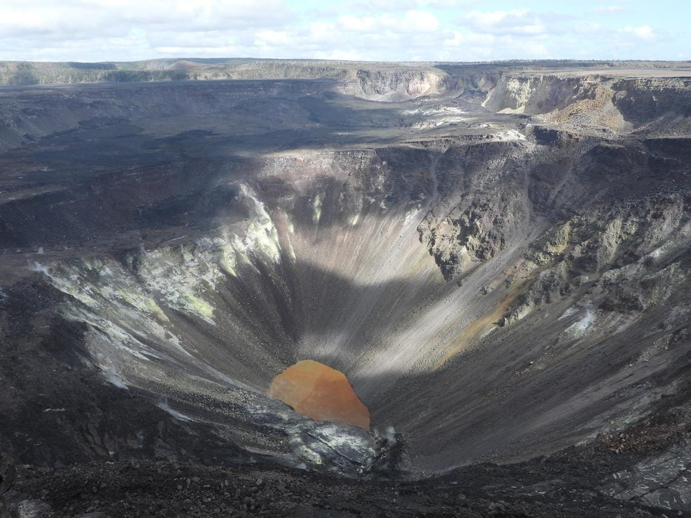
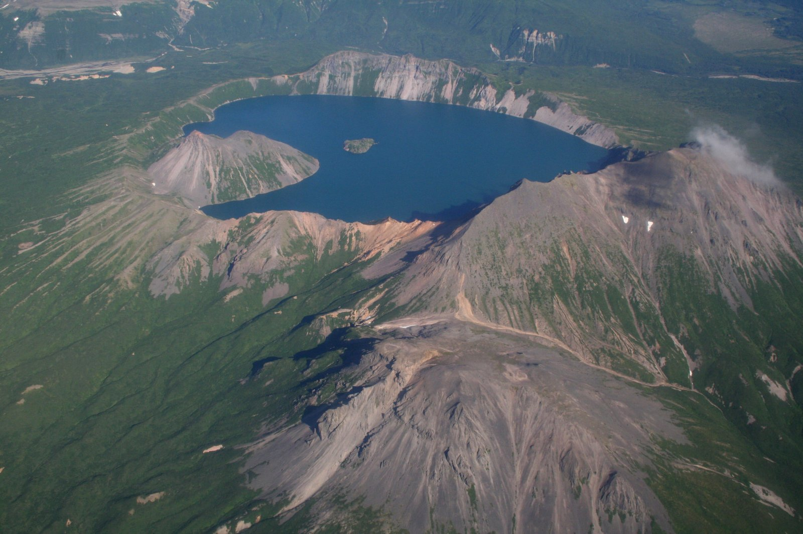
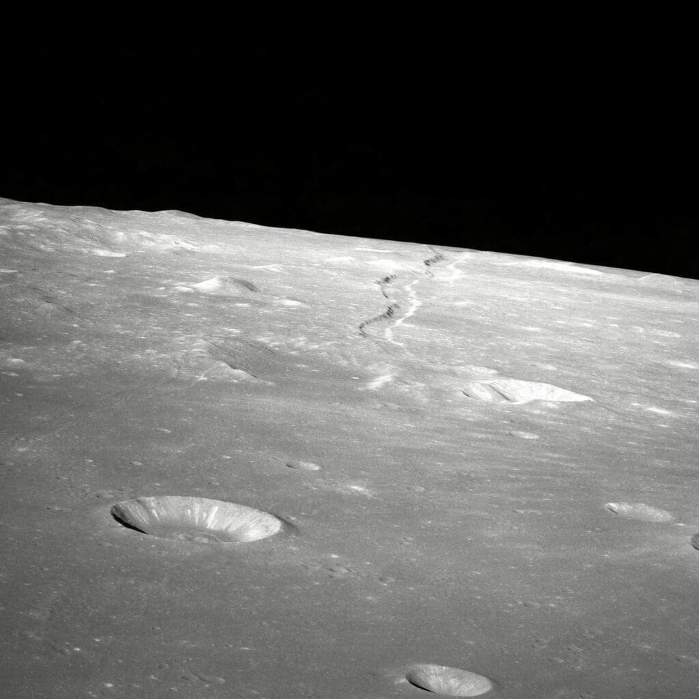
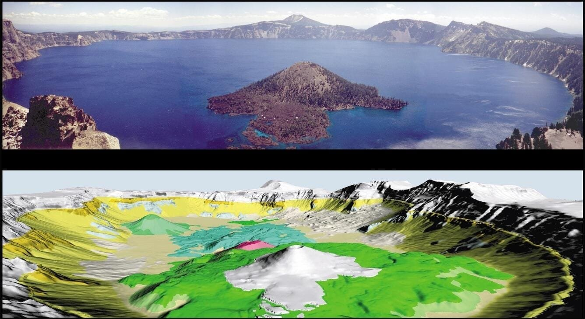
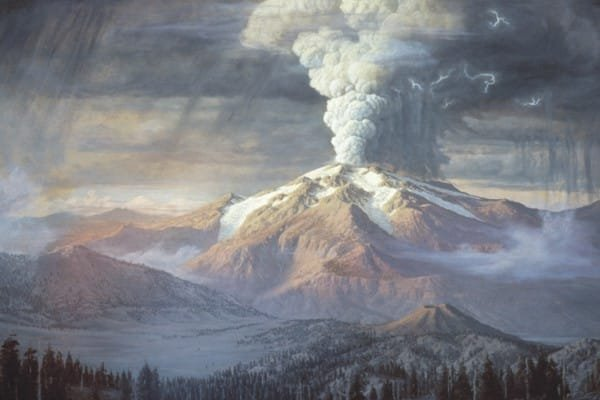

Have you ever wondered how the craters left by volcanic eruptions transform into mesmerizing lakes? This natural process is a complex yet fascinating journey. Let’s unravel how nature turns fiery chaos into serene beauty.

## The Science Behind Volcanoes and Crater Formation

Before you can appreciate the beauty of a crater lake, it’s crucial to grasp the basic mechanics of a volcanic eruption. Imagine a reservoir of molten rock beneath the earth's surface. When pressure builds to a breaking point, this molten rock, or magma, bursts through the Earth's crust in a spectacular display of pyroclastic emotion.

### Anatomy of a Volcano

Understanding what makes up a volcano can enlighten you on how they evolve over time to host crater lakes. At its core (pun intended), a volcano consists of a magma chamber, a main vent, and several secondary conduits. When the volcano erupts, it releases magma through these passages, which, once expelled, is termed lava.

### What is a Crater?

Following an eruption, there's often a sunken depression at the top of a volcano, known as a crater. Sometimes, the entire summit collapses, forming a caldera. These [natural](https://magmamatters.com/the-art-and-science-of-volcano-monitoring/ "The Art and Science of Volcano Monitoring") bowls and basins become the womb-like formations that eventually capture and hold water, turning into lakes.

## The Eruption Process and its Aftermath

Volcanic eruptions are a dynamic process with stages that can radically alter the landscape. Picture this: an explosion sends ash and lava trailing into the sky, altering the earth below. What’s left behind often sets the stage for the formation of a future lake.

### Explosive Activity

The greatest drama of a volcanic eruption unfolds with explosive eruptions, where pressure is instantly released. This can blow the top off a volcanic cone, creating or enlarging a crater. It’s a violent, theatrical transformation that crafts the space needed for water to later gather.

### Gradual Changes After the Explosion

Over time, rainwater and melted snow begin filling the crater, but this doesn't happen immediately. The barren pit evolves slowly after the eruption. It’s almost like nature's way of self-healing, filling its own void over months and years.

## How Water Finds Its Way into Craters

With a fresh crater now in place, water’s journey into these basins starts. You can't rush a masterpiece, and nature is no different. Natural factors like rain, snow, and even underground springs play their roles in nurturing new lakes.

### Rain and Snowfall

One of the most straightforward ways water accumulates is through rainfall and melting snow. These elements gradually feed water into the crater over time. The larger the catchment area, the more water it can gather.

### Groundwater and Springs

You might find it surprising that some crater lakes are fed by underwater springs or connected aquifers. When a crater forms, it could intersect these hidden water pathways, allowing groundwater to seep and gather into the depression.

## Crater Lakes: Nature's Astonishing Artwork

If you picture a crater lake, you might envision serene, glacial-blue waters nestled against rugged landscapes. That spectacular aesthetic result is thanks in part to how the lake's surroundings and its mineral-rich water interact.

### Unique Coloration

The hue of a crater lake is influenced by minerals from volcanic rocks around and beneath the lake, as well as algae that wander into the scene over time. These natural ingredients lend character to the water, creating shades from turquoise to deep blue.

### Diverse Ecosystems

Despite what you might think, many crater lakes host robust ecosystems. While it may seem lifeless initially, these lakes become home to unique flora and fauna—forming another layer of involvement in nature’s ongoing conversation.

## Famous Crater Lakes Around the World

Feeling the wanderlust? Crater lakes are scattered across the globe, each offering its own tantalizing beauty. Here are a few you might find intriguing:

| Crater Lake | Location | Notable Features |
| --- | --- | --- |
| Crater Lake | Oregon, USA | Deepest in the United States, stunning blue waters |
| Lake Toba | Sumatra, Indonesia | Formed in a supervolcanic eruption, one of the largest |
| Kelimutu Crater Lakes | Flores Island, Indonesia | Known for changing colors |
| Lake Nyos | Cameroon | Known for its deadly [carbon dioxide](https://magmamatters.com/geothermal-energy-and-its-volcanic-origins/ "Geothermal Energy and Its Volcanic Origins") release |
| Mount Katmai Crater Lake | Alaska, USA | Located within a remote and rugged national park |

### Crater Lake, Oregon

Have you imagined what diving into the deepest lake in the U.S. might be like? Here, in Crater Lake, Oregon, the water reaches depths over 1,900 feet, offering pristine clarity that’s nearly unparalleled.

### Lake Toba, Indonesia

On the flip side, Lake Toba occupies a supervolcanic caldera and covers a massive area, providing not only natural beauty but also significant cultural and geological history.

## The Environmental Impact of Crater Lakes

While crater lakes offer ecological and aesthetic benefits, they also carry potential risks and environmental impacts. It’s like nature's double-edged sword.

### Stability Concerns

In some blistering events, such as the 1986 Lake Nyos disaster in Cameroon, a crater lake can release lethal gases. This reminds us that although tranquil on the surface, these lakes can harbor unseen dangers.

### Conservation and Protection

Recognizing the ecological and geological value of crater lakes, many have become protected areas, requiring conservation efforts to maintain their health and beauty. It’s a shared responsibility to both enjoy and protect these natural wonders.

## The Geological Timeframe and Process

You're likely curious about how long these landscapes take to shape. While living in the present, the geological timeframe presides over an expanse of many years—sometimes millennia.

### Earth’s Ongoing Processes

A crater lake might form over hundreds or even thousands of years. It’s an enduring symphony on Earth’s canvas showcasing change, adaptation, and the cyclical nature of volcanic activity.

## Human Interaction and Influence

As with any natural wonder, human interaction shapes the fate and experience of crater lakes. Tourism, scientific endeavors, and cultural significance intertwine, creating a rich tapestry of human involvement.

### Tourism and Economical Impact

Craters turned lakes become tourist attractions. They host visitors captivated by the idea of gazing into the echoes of Earth's fiery past while standing amid calm waters. This tourism can bolster local economies but may also pose environmental threats if unmanaged.

## Visual Appeal and Emotional Connection

Ultimately, crater lakes hold a beauty that reaches beyond the physical. They offer profound emotional experiences, leaving one reflective, grounded, and awestruck by nature’s tablet of resilience and tranquility.

### Nature’s Mirror

The alignment between geological chaos and serene beauty provides a poignant reminder of transformation. Finding harmony amid chaos isn't limited to nature; it speaks to broader human experiences too.

## Concluding Thoughts

The world of crater lakes is like entering a realm where chaos and tranquility coexist seamlessly. By diving into their formation, existence, and impact, we've glimpsed a facet of nature's brilliance. You now hold a mirror to the past eruptions, standing beside the shimmering future of revitalized terrains. The enchanting crater lakes await your exploration, promising both new discoveries and a calming retreat from our bustling human endeavors.
