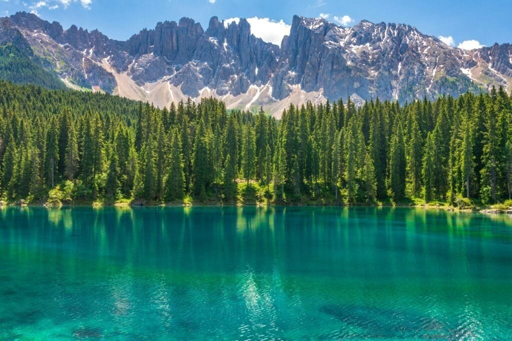

Have you ever wondered how those breathtaking crater lakes come into existence? Those tranquil bodies of water surrounded by steep walls tell a story that begins with an extraordinary geological event. Understanding crater lakes can be like putting together pieces of an intricate puzzle where a violent fiery past meets serene beauty. Let's embark on this journey together to explore the link between volcanic eruptions and the creation of these magnificent lakes.

<iframe width="560" height="315" src="https://www.youtube.com/embed/dR0RF8SoM38" frameborder="0" allow="accelerometer; autoplay; encrypted-media; gyroscope; picture-in-picture" allowfullscreen></iframe>

  

## The Fiery Origins of Volcanoes

Volcanoes are fascinating geological features where molten rock, ash, and gases escape from beneath the Earth's crust. Picture it like the Earth releasing pressure from a tightly sealed pressure cooker. These eruptions can be explosive, throwing up massive plumes of ash and lava, or they can be more effusive, allowing lava to flow gently over the surface. Each volcano has its unique characteristics based on its location and the composition of the magma beneath it.

### Types of Volcanic Eruptions

Not all volcanic eruptions are created equal. The type depends on several factors, including magma composition, temperature, and gas content. For a more straightforward understanding, eruptions can be categorized into:

- **Explosive Eruptions**: These are the more violent eruptions, often ejecting ash and debris high into the sky. When the magma is high in silica, it becomes more viscous and traps gases, leading to a highly explosive scenario.
- **Effusive Eruptions**: These are less dramatic but equally significant. The lava in these eruptions is low in silica, making it thin and runny, allowing it to spread over large areas.

### Volcano Structure

Volcanoes have a complex internal structure. Inside, you have the magma chamber—a reservoir of molten rock—deep beneath the surface. Then there’s the vent, which is the opening through which magma, ash, and gases are expelled. Over time, successive eruptions build the volcano, layer by layer, forming a mountain or a hill depending on the eruption style and material involved.

## The Role of Volcanic Calderas

When we talk about crater lakes, we're often referring to a particular kind of volcanic structure called a caldera. A caldera is formed after a significant volcanic eruption. It's like when a cake collapses in the oven after you've taken it out too soon.

### How Calderas Form

Imagine a substantial eruption where the magma chamber is emptied rapidly. There's nothing left to support the weight of the volcano, causing the ground above it to collapse and form a large depression or basin. This new landscape is what we refer to as a caldera.

### The Transformation into Crater Lakes

Here's where nature's artistry begins. Over time, these calderas collect rainwater, snowmelt, and groundwater, gradually forming a lake. It's a process of patience and geological alignment. Not every caldera becomes a lake, though. The conditions must be just right.

## The Formation of Crater Lakes

If you're picturing this in your mind, you see a massive, bowl-shaped depression filling up with water—a beautiful transformation from fiery chaos to tranquil beauty.

### Water Sources for Crater Lakes

Crater lakes draw water from a mix of sources:

- **Precipitation**: This is the primary source, mainly rain and snow that fall directly into the caldera.
- **Groundwater Seepage**: Water can seep in from underground aquifers, which further helps fill the lake.
- **Streams and Rivers**: In some cases, where the geography allows, streams might flow directly into the caldera, contributing to the water level.

### Unique Characteristics of Crater Lakes

Crater lakes are unique in their characteristics due to their volcanic origins. They are often deep and isolated, giving them remarkably clear waters. Some lakes have a vibrant blue color due to the depth and purity of the water, which absorbs and scatters sunlight in fascinating ways.

## Famous Crater Lakes Around the World

Have you ever wanted to visit one of these natural wonders? Several crater lakes around the world have captured human imagination with their scenic beauty and geological significance.

### Crater Lake, Oregon, USA

Perhaps the most famous of all is Crater Lake in Oregon. It is not only the deepest lake in the United States but also one of the clearest in the world. This lake fills the caldera of Mount Mazama, and its deep blue waters have mesmerized visitors for generations.

### Lake Toba, Indonesia

Lake Toba is something amazing—you'll find the world's largest volcanic lake here. Formed in a massive caldera, it stretches over 1,700 square kilometers and is a significant geographical and cultural site in Indonesia.

### Kelimutu, Indonesia

Kelimutu is known for its three crater lakes, each with different hues. They change color due to chemical reactions of the minerals in the water with the gases and ash produced by volcanic activity. It's like witnessing a giant, natural palette that changes with the seasons.

### Lake Taupo, New Zealand

Lake Taupo forms the caldera of the Taupo Volcano. It's so expansive that from above, you might mistake it for an inland sea. It's a cornerstone of New Zealand’s geothermal energy and tourism industries.

## The Ecosystems Within Crater Lakes

Crater lakes are more than just water-filled depressions; they are vibrant ecosystems supporting various forms of life.

### The Flora and Fauna

- **Aquatic Plants**: These thrive at the margins where sunlight penetrates, providing oxygen and habitat for aquatic life.
- **Fish and Invertebrates**: Some lakes have endemic species, which have evolved in isolation.
- **Bird Species**: Many crater lakes serve as vital habitat for bird species, both resident and migratory.

### Challenges to These Ecosystems

Crater lake ecosystems are incredibly delicate, and small changes can have significant impacts:

- **[Climate Change](https://magmamatters.com/geothermal-energy-and-its-volcanic-origins/ "Geothermal Energy and Its Volcanic Origins")**: Variations in temperature and precipitation patterns can alter lake levels and temperatures.
- **Pollution**: Although isolated, human activity can introduce pollutants, disrupting the biological balance.
- **Invasive Species**: These can outcompete native species, altering the ecosystem dynamics.

## The Scientific Importance of Crater Lakes

Researchers and scientists are drawn to crater lakes because of their distinct features and the data they can offer. Studying these lakes helps us understand more about geological processes, climate changes over millennia, and even potential extraterrestrial life.

### Geological Insights

Crater lakes provide a natural laboratory to study volcanic activity. By analyzing the sediments from these lakes, scientists can trace back to ancient volcanic events and understand the timeline and frequency of such activities.

### Climate Change Records

The layers of sediments settled at the bottom of crater lakes serve as an archive of historical climatic data. Pollen, volcanic ash, and other residues trapped in these sediments can reveal past climate changes.

### Astrobiological Research

Interestingly, crater lakes also hold interest in the search for life beyond Earth. Their unique conditions—often isolated and chemically diverse—provide a close parallel to potential extraterrestrial environments like Mars or the moons of Jupiter and Saturn.

## Human Interaction and Tourism

Crater lakes are a draw for tourists, artists, and adventurers. They inspire awe and often prompt people to connect deeper with nature.

### Sustainable Tourism

With the rising interest in visiting natural sites, it's essential to ensure that tourism is sustainable. Protective measures can help safeguard the delicate ecosystems of these lakes while allowing people to enjoy their beauty.

### Cultural Significance

For many communities living near crater lakes, these bodies of water are laced with stories, myths, and beliefs. They are more than geological features—they are part of the cultural identity and spirituality of local people.

## Conservation Efforts

Preserving the delicate ecology of crater lakes is crucial.

### Environmental Protection Policies

Governments and international bodies often work to protect these unique landscapes. Regulations might include limiting access, controlling pollution sources, and actively managing wildlife.

### Community Involvement

Local communities play a significant role in conservation, pooling traditional practices with modern science to steward their natural resources effectively.

## Future of Crater Lakes

What does the future hold for these geological marvels?

### Impact of Climate Change

One of the most significant concerns is climate change. As global temperatures rise, the ecosystems within crater lakes face stressors like altered water levels and increased evaporation rates.

### Technological Advancements

Modern [technology](https://magmamatters.com/understanding-volcanic-formation-a-comprehensive-guide/ "Understanding Volcanic Formation: A Comprehensive Guide") offers tools for better monitoring and understanding of these environments. Drone technology, satellite imagery, and advanced water analysis methods provide clearer insights into the health and changes of crater lakes.

### Educating the Next Generation

[Educating younger generations about the importance of preserving natural](https://magmamatters.com/the-art-and-science-of-volcano-monitoring/ "The Art and Science of Volcano Monitoring") wonders like crater lakes ensures they will continue to be cherished and protected long into the future.

Understanding crater lakes is like connecting the pieces of a finely crafted narrative that unfolds at the intersection of violent geological upheaval and serene natural beauty. Through volcanic eruptions that shape the landscape, diverse ecosystems that thrive within, and human cultures that cherish and protect them, crater lakes are remarkable testaments to Earth's dynamic processes.
