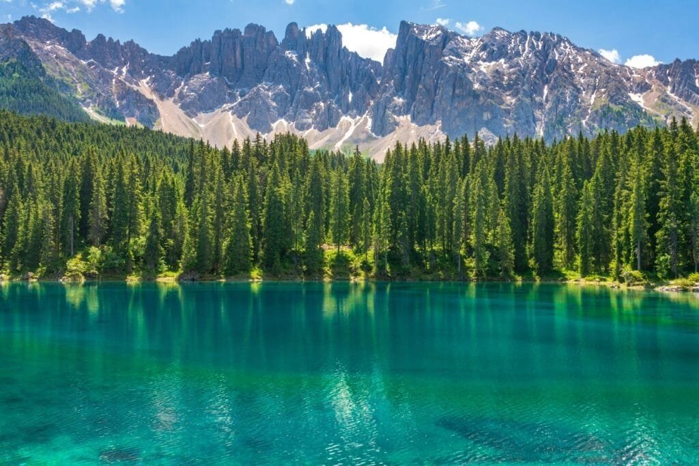

Have you ever wondered how some of the world's most stunning natural wonders, like crater lakes, come into existence? These breathtaking bodies of water, cradled in the basins of extinct or dormant volcanoes, are not just the result of explosive geological events; they're also shaped and influenced by time, weather, and environmental conditions. Let's unravel the mesmerizing journey from fiery eruptions to tranquil lakes, exploring how volcanic activity crafts such beautiful and unique landscapes.

<iframe width="560" height="315" src="https://www.youtube.com/embed/dR0RF8SoM38" frameborder="0" allow="accelerometer; autoplay; encrypted-media; gyroscope; picture-in-picture" allowfullscreen></iframe>

  

## Crater Lakes: More than a Beautiful View

Crater lakes are nature's masterpieces. They form in the craters or calderas created by volcanic eruptions and fill with rainwater, melted snow, or groundwater. Each lake has its own distinct features and characteristics. Some are crystal clear and azure, while others boast vibrant colors due to mineral content, algae, and microbial life. But, how do these lakes come to be, and what makes them so fascinating?

### The Explosive Genesis: Volcanic Eruptions

To understand crater lakes, you first need to grasp the basics of volcanic eruptions. Eruptions occur when magma from beneath the Earth's crust rises to the surface, either through fissures or openings in the Earth's surface. These eruptions can be explosive, producing ash, lava, and gases. It is during an explosive eruption that a crater or caldera is typically formed.

### Types of Volcanic Eruptions

Not all eruptions lead to crater lakes. It's usually the more violent, explosive ones that do. Here are the types of eruptions that can lead to crater formation:

| Eruption Type | Description |
| --- | --- |
| **Plinian** | Characterized by explosive outbursts of gas and ash, forming a column high into the atmosphere. |
| **Phreatomagmatic** | Interaction of magma with water, causing steam explosions. |
| **Caldera-forming** | Collapse of a volcano into itself, often after the emptying of a magma chamber. |

### Forming the Crater: An Explosive Transformation

During these eruptions, massive explosions blow out the top of a volcano, creating a large depression or crater. Sometimes, when a magma chamber is emptied and cannot support the weight of the volcanic structure above it, the volcano collapses inward, creating a larger depression known as a caldera.

### Filling the Crater: How Lakes Form

Once the explosive event is over and a crater or caldera is left behind, it begins its transformation into a lake. The depression often collects water from rain, melted snow, or underground sources. Over time, this water accumulation fills the basin, creating a crater lake. Some of these lakes are permanent, while others may only be temporary, depending on their water sources and climatic conditions.

### The Magic of Water Chemistry and Ecology

Water chemistry plays a vital role in the uniqueness of crater lakes. You might have noticed how some lakes display colors ranging from vibrant blue to vivid green. This often results from the water's mineral content and microbial life. For instance, the presence of specific algae or bacteria can affect the lake's color and overall ecosystem.

### Diverse Habitats: From Acidic to Alkaline

The chemistry of crater lakes can vary dramatically. Some lakes are acidic due to [volcanic gases such as sulfur dioxide](https://magmamatters.com/the-art-and-science-of-volcano-monitoring/ "The Art and Science of Volcano Monitoring") dissolving in the water. Others are alkaline, depending on the [volcanic rock and surrounding geology](https://magmamatters.com/geothermal-energy-and-its-volcanic-origins/ "Geothermal Energy and Its Volcanic Origins"). The pH level can significantly influence the types of organisms that thrive in these waters.

### Famous Crater Lakes Around the World

Would you like to know about some of the most famous crater lakes? Let's wander through a few iconic ones that offer breathtaking views and complex ecological systems.

#### Crater Lake, USA

Located in Oregon, Crater Lake is one of the deepest lakes in the world. Its astonishing blue color comes from the lake's clarity and purity. There is no river flowing in or out of the lake, so it is filled solely by rain and snowmelt.

#### Lake Toba, Indonesia

Lake Toba lies in a massive caldera formed by a supervolcanic eruption. This lake, along with its surrounding island, reflects some of the most extraordinary interactions between volcanic and hydrothermal activities.

#### Kelimutu Lakes, Indonesia

These are unique for their changing colors, ranging from turquoise to green, red, and brown. The color changes are due to chemical reactions from the gases emitted by the underlying volcano.

## The Role of Time and Climate

Time plays a monumental role in the development of crater lakes. Over many years, erosion, precipitation, and climatic shifts can alter the lake's size, basin, and even its water chemistry.

### The Influence of Weather Patterns

Weather patterns, such as seasonal rainfall or drought, can affect water levels and, in some cases, lead to the complete evaporation of a crater lake. Melting of nearby glaciers or snowcaps can also influence the volume and temperature of the water, which in turn affects the ecological balance of the lake.

### A Changing Landscape: Erosion and Sedimentation

Over decades or centuries, natural processes like erosion and sedimentation can reshape crater lakes. Erosion from the surrounding volcanic rock can introduce nutrients to the lake, supporting diverse aquatic life. Conversely, sedimentation can also fill the lake over time, reducing its depth and altering its shape.

## Human Interaction: The Good and the Bad

Human interactions with crater lakes can significantly impact their ecosystems and beauty. Activities like tourism, mining, and agriculture around these delicate ecosystems can introduce pollutants and disrupt natural processes, challenging the delicate balance these lakes maintain.

### The Impact of Tourism

While tourism brings economic benefits and awareness to regions with crater lakes, it can also lead to increased pollution, habitat disturbance, and water quality degradation. It's essential for visitors to understand and minimize their impact on these fragile environments.

### Conservation Efforts

Some regions have implemented conservation efforts to protect these natural wonders. Practices such as limiting visitor numbers, controlling waste, and educating the public about the importance of preserving these unique ecosystems are crucial to their conservation.

## Conclusion: Witness to Earth's Dynamic Processes

Crater lakes are remarkable natural features that beautifully illustrate Earth's dynamic processes. From the explosive forces of volcanic eruptions to the tranquil formation of water-filled basins, they offer a window into the planet's geological and ecological complexities. Understanding how these lakes form, change, and thrive underlines the importance of respecting and preserving them for future generations to marvel at and learn from.

By unraveling the secrets behind these stunning lakes, you're not just exploring a geological phenomenon—you're also appreciating the intricate, interconnected forces of nature that continuously shape and reshape our world.
