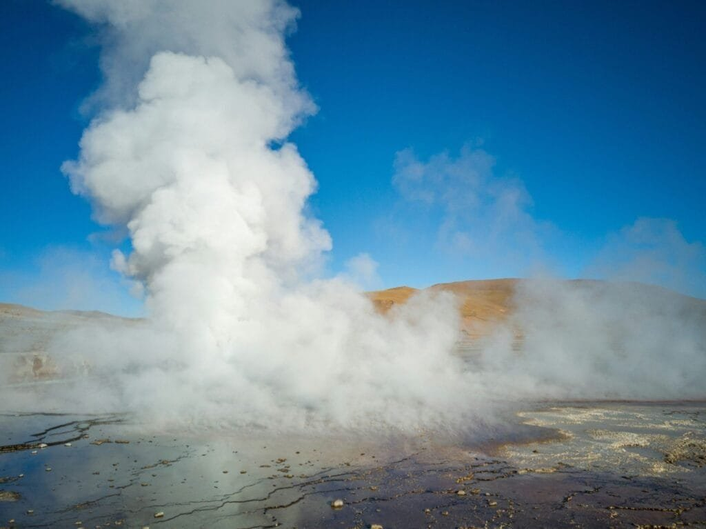

Have you ever wondered how a single volcanic eruption can ripple across the globe, impacting not only local environments but also the global climate as a whole? It’s a fascinating subject, isn't it, how forces of nature can be so intricately connected and influential?

<iframe width="560" height="315" src="https://www.youtube.com/embed/bgLMU5GFIbc" frameborder="0" allow="accelerometer; autoplay; encrypted-media; gyroscope; picture-in-picture" allowfullscreen></iframe>

  

## Understanding Volcanic Eruptions

Let's start by unraveling what exactly occurs during a volcanic eruption. When molten rock, or magma, breaks through the Earth's crust, it erupts as lava, ash, and gases. Each of these elements plays a unique role in influencing the climate. You might find it surprising to learn that these eruptions aren't just disastrous bursts of fire and lava but are significant natural events that contribute to shaping our planet's climate systems.

### Types of Volcanic Eruptions

Volcanic eruptions aren't one-size-fits-all. They vary based on the [type of volcano](https://magmamatters.com/understanding-volcanic-formation-a-comprehensive-guide/ "Understanding Volcanic Formation: A Comprehensive Guide") and the magma's properties. Generally, eruptions can be categorized as explosive or effusive. Explosive eruptions, like the infamous Mount St. Helens in 1980, violently eject vast amounts of ash and gases into the atmosphere. On the other hand, effusive eruptions, such as those seen at Hawaii’s Kilauea, are characterized by the flow of lava. Each of these eruption types contributes differently to climatic changes, which we’ll get into soon.

### Major Components Released in Eruptions

Eruptions release several components, each leaving its mark on the climate. Ash clouds can travel far and wide, blocking sunlight, while [volcanic gases](https://magmamatters.com/the-art-and-science-of-volcano-monitoring/ "The Art and Science of Volcano Monitoring"), such as sulfur dioxide (SO2), play a crucial role in affecting global temperatures. This is a central point to understand when considering their broad climate implications.

## The Immediate Atmospheric Impact

When a volcano erupts, its effects on the atmosphere are both immediate and complex. The gases and ash thrown into the skies can travel hundreds or even thousands of miles, creating a blanket over the Earth’s surface. Sounds intense, right? But it's precisely this dynamic that starts the chain of climatic influences.

### Ash and Aerosol Dispersal

The dispersal of ash and aerosols impacts the climate right away. Reflecting sunlight back into space, these particles cause a temporary cooling of the Earth's surface. This effect, although short-lived, can lead to noticeable shifts in weather patterns, affecting everything from seasonal temperatures to precipitation distribution.

### The Role of Sulfur Dioxide

Sulfur dioxide deserves special attention. Once released into the atmosphere, it transforms into sulfate aerosols, which effectively scatter solar radiation. This sounds like scientific jargon, but think of it as nature's way of deploying tiny mirrors in the sky, reflecting sunlight and cooling the planet temporarily.

| Element | Impact on Atmosphere |
| --- | --- |
| Ash | Reflects sunlight, temporary cooling |
| Sulfur Dioxide | Forms aerosols, longer-lasting cooling effects |

## The Cooling Effect and Climate Change

Here’s where things get even more intriguing. While individual eruptions might cool the Earth temporarily, the cumulative effect of volcanic activity over time has a different story to tell. It’s this cooling effect that connects [volcanic eruptions with the broader narrative of climate change](https://magmamatters.com/geothermal-energy-and-its-volcanic-origins/ "Geothermal Energy and Its Volcanic Origins").

### The Temporary Cool

Imagine a chilly summer or an unexpected frost; these can be the immediate aftermath of significant eruptions. For instance, the 1991 eruption of Mount Pinatubo in the Philippines led to a global temperature drop of about 0.6 degrees Celsius for the next two years. This might sound small, but on a global scale, it's substantial.

### Long-Term Climate Contributions

Volcanoes also play a part in longer-term climate patterns. Over decades and centuries, the consistent but less frequent release of greenhouse gases like carbon dioxide can contribute to gradual warming. It's these kinds of contributions that weave volcanic activity into the larger climate change fabric, alongside human activities.

## The Feedback Loops

Nature, as complex as it is, thrives on feedback loops. These are systems where the output of a process subsequently serves as its own input, reinforcing the process. Volcanic eruptions, too, have their unique feedback loops, impacting not just the climate system but feeding back into the volcanic activity itself.

### Climate Influencing Volcanic Activity

Did you know that climate changes can actually influence volcanic activity? For example, during periods of glacial melting, pressure on the Earth's crust decreases, potentially triggering volcanic eruptions. It’s like a cycle, where one process nudges another into motion, keeping the Earth's systems in a constant state of evolution.

### Volcanic Ash and Biosphere Interactions

Volcanic ash also interacts with the biosphere, affecting ecosystems below. When ash settles, it can alter soil chemistry, impacting everything from plant growth to aquatic ecosystems. This, in turn, influences how effectively these ecosystems can absorb carbon dioxide, thus affecting climate regulation.

## Case Studies of Notable Eruptions

To bring these concepts to life, let's look at some noteworthy volcanic eruptions and their climatic impacts. By examining these events, we can better appreciate the nuanced and significant role they play in shaping our climate.

### Tambora, 1815

Perhaps one of the most famous examples is the eruption of Mount Tambora in 1815, which was so massive that it led to the "Year Without a Summer" in 1816. Global temperatures fell significantly, leading to widespread crop failures and famines. It’s a stark reminder of how a single event can shift planetary conditions dramatically.

### Krakatoa, 1883

Similarly, the Krakatoa eruption in 1883 had pronounced atmospheric effects. The volcanic dust veil blocked sunlight, creating spectacular sunsets across the globe, but also contributing to cooler global temperatures. This duality of destruction and beauty is a profound aspect of volcanic eruptions.

### Eyjafjallajökull, 2010

More recently, the 2010 eruption of Iceland’s Eyjafjallajökull, while smaller in scale, caused significant disruption to air travel across Europe. Its influence on the climate wasn't as dramatic, but it highlighted how volcanic activity remains a relevant force in our interconnected world.

## The Science of Prediction

Wouldn't it be great if we could predict volcanic eruptions and their climatic impacts with precision? The good news is, science is making strides in this area. But it's challenging. You see, volcanoes are unpredictable beasts, driven by complex geophysical processes.

### Advances in Monitoring Technology

Technological advancements are giving us better tools to monitor volcanic activity. From satellites to seismic sensors, these technologies help scientists anticipate eruptions by detecting subtle changes in the Earth’s movements and temperatures.

| Technology | Use in Prediction |
| --- | --- |
| Seismic Sensors | Detect earth movements |
| Satellite Imagery | Monitor surface temperature and gas emissions |

### Challenges in Prediction Models

Despite these advances, challenges remain. Each volcano has its own personality, so to speak, and factors like magma composition and local geology affect eruption patterns. It's this variability that makes prediction a continuously evolving field, full of both promise and obstacles.

## Human Interaction and Mitigation

Although we can't control volcanic eruptions, understanding their impacts helps us mitigate the risks. Whether it's preparing communities for potential health effects from ash or understanding how eruptions might skew climate models, this knowledge is vital.

### Community Preparedness

For communities near active volcanoes, preparedness can save lives. Education and planning transform potential devastation into manageable risks. It’s all about taking proactive steps, from evacuation plans to building structures that can withstand ash fall.

### Climate Models and Volcanic Data

Incorporating volcanic data into climate models enhances their accuracy. By accounting for the short- and long-term effects of eruptions, scientists can produce better forecasts, helping us understand and adapt to future climatic challenges.

## Looking Forward: The Future of Volcanic Study

As we move forward, the study of volcanic eruptions and their climatic impacts will continue to evolve. It’s an exciting field that merges geology, meteorology, and environmental science, constantly reshaping how we see the world.

### Integrating Multidisciplinary Approaches

The future lies in integrating various disciplines to deepen our understanding. By combining data from different scientific areas, we can build comprehensive models that effectively predict volcanic behavior and its climatic consequences.

### Balancing Natural and Human Influences

Understanding how volcanic activity interacts with human-induced climate change is also essential. By balancing these perspectives, we can develop better strategies to tackle the pressing issues of our time, ensuring that we are prepared for whatever nature throws our way.

In reflecting on the power and mystery of volcanic eruptions, one can't help but marvel at their dual role as both destroyers and climate regulators. It’s a testament to the complexity of our planet and the ongoing dance of natural forces that shape our world. And as we learn more, we find ourselves not only better equipped to handle eruptions’ immediate impacts but also more appreciative of the intricate balances that maintain our global climate.
