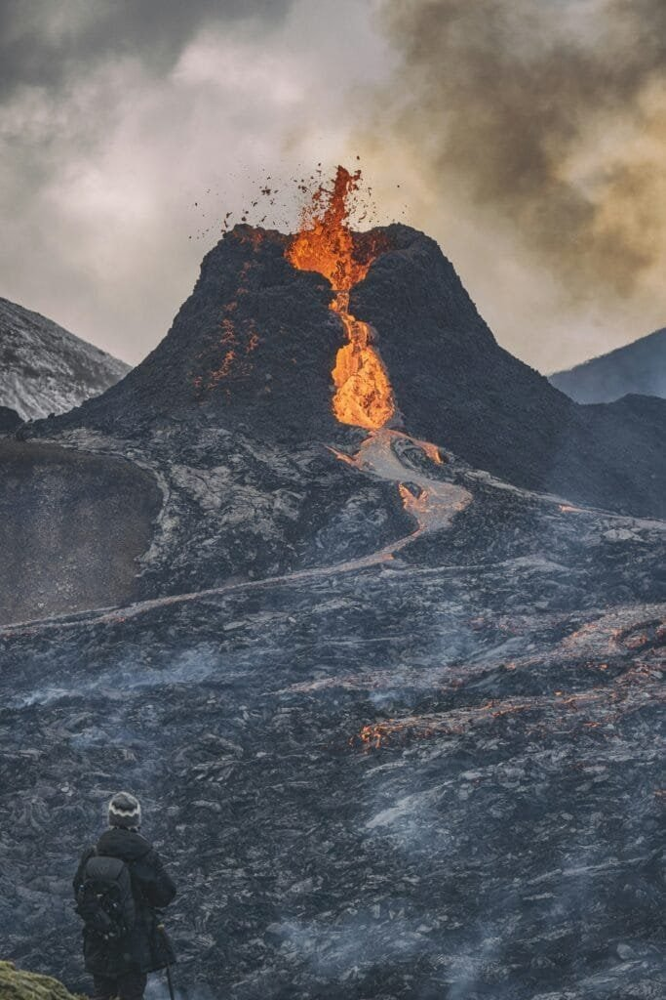

Have you ever wondered what secrets lie beneath the Earth's surface? It turns out, volcanic rocks are some of Earth's most profound storytellers. They hold the key to unlocking mysteries of our planet's past that you'd never guess just by looking at them. Isn't it fascinating how something as solid and persistent as stone can reveal tales of fire, time, and transformation?

<iframe width="560" height="315" src="https://www.youtube.com/embed/1UwTqXbL5Lo" frameborder="0" allow="accelerometer; autoplay; encrypted-media; gyroscope; picture-in-picture" allowfullscreen></iframe>

  

## The Nature of Volcanic Rocks

Volcanic rocks form from the eruption of magma onto the Earth's surface, either through volcanic eruptions or through cracks in the Earth's crust. They're a testament to Earth's dynamic processes and hold valuable information about the conditions and environments that shaped the planet over millennia.

### What Are Volcanic Rocks?

At their core, volcanic rocks are igneous rocks, a term that might sound a bit technical but simply refers to rocks formed through the cooling and solidification of magma or lava. You'll find them in various types, each telling a slightly different part of Earth's history. These types largely depend on the chemical and mineralogical composition of the magma from which they originated.

**Types of Volcanic Rocks:**

| Rock Type | Characteristics | Formation Process |
| --- | --- | --- |
| Basalt | Dark, fine-grained | Rapid cooling of lava |
| Andesite | Intermediate color, often porphyritic | Typically erupts from stratovolcanoes |
| Rhyolite | Light-colored, high silica content | Slow cooling, often explosive eruptions |
| Tuff | Made of volcanic ash | Consolidation of volcanic ash |

### How Do They Form?

Volcanic rocks form when magma from within the Earth erupts and cools on the surface. This process can occur both on land and underwater, defining much of the ocean floor. When magma reaches the surface and meets cooler temperatures, it begins to solidify. Depending on the rate of cooling and the chemical makeup, you end up with different types of volcanic rocks.

## The Role of Volcanic Rocks in Understanding Earth’s History

The formation and characteristics of volcanic rocks aren't just academic. They serve as a diary of sorts, chronicling the [environmental changes and geological](https://magmamatters.com/geothermal-energy-and-its-volcanic-origins/ "Geothermal Energy and Its Volcanic Origins") activities that have occurred over billions of years.

### Unlocking Geological Time

Volcanic rocks are like time capsules. By studying them, scientists can date geological events and understand the environmental conditions at different points in Earth's history. Isn't it mind-blowing to think that a rock can tell you about the climate millions of years ago? By analyzing isotopes within the rocks, researchers can determine ages and a sequence of events known as the geological timeline.

### Providing Clues About Earth’s Interior

Volcanic rocks also offer insights into the composition of the Earth’s interior. Because magma originates from deep within the Earth, its journey to the surface carries information about materials that are typically hidden far beneath our feet. This helps scientists piece together the puzzle of Earth’s inner layers.

## The Stories Volcanic Rocks Tell

### Environmental and Climatic Changes

Volcanic eruptions have historically had a substantial impact on Earth’s climate. By studying layers of volcanic rocks, scientists can infer past climatic conditions. For instance, massive eruptions have previously led to what’s known as "volcanic winters," where ash and particles fill the atmosphere and lead to cooler global temperatures. If you've ever heard of the "Year Without a Summer" in 1816, volcanic activity was its cause.

### Evolution of Life

It might be surprising, but volcanic rocks also play a role in understanding the evolution of life on Earth. They provide clues about the conditions under which life could have thrived or struggled. For example, the composition of volcanic rocks can reveal information about ancient atmospheres, helping scientists understand how life adapted to changes over time.

## Geographic Distribution of Volcanic Rocks

### Where Are They Found?

Volcanic rocks are widespread, but they're more common in specific regions known as "volcanic belts." These often align with tectonic plate boundaries, where conditions for volcanic activity are ideal. The Pacific Ring of Fire, for instance, is a notorious example, featuring numerous volcanoes and an abundance of volcanic rock formations.

### The Relationship With Tectonic Plates

The distribution of volcanic rocks is closely linked to the movement and interaction of tectonic plates. Convergent boundaries where plates meet often lead to intense volcanic activity due to subduction, while divergent boundaries, like mid-ocean ridges, create conditions where magma rises and volcanic rocks form.

## The Importance of Volcanic Rocks in Modern Times

Besides their storied history, volcanic rocks have significant importance today. They have numerous practical uses and their study can inform predictions of future volcanic activity.

### Practical Uses of Volcanic Rocks

Did you know volcanic rocks are used in construction and landscaping? Basalt is often crushed and used as an aggregate in roads. Pumice, a type of volcanic rock, is used in products ranging from exfoliants in beauty kits to lightweight concrete. These rocks are much more than mere geological curiosities—they’re part of your daily life in ways you might not expect.

### Predicting Volcanic Eruptions

Understanding the composition and formation of volcanic rocks helps in predicting future eruptions. Examining previous eruptions provides data that can be used to forecast volcanic behavior, potentially saving lives and minimizing damage to infrastructure. Skilled volcanologists rely on these rocks to interpret the complex signals that precede eruptions.

## Volcanic Rocks and the Science of Plate Tectonics

The study of volcanic rocks has significantly contributed to the understanding of plate tectonics—a groundbreaking theory that explains the movement of Earth’s lithosphere, leading to the dynamic [nature](https://magmamatters.com/the-art-and-science-of-volcano-monitoring/ "The Art and Science of Volcano Monitoring") of our planet.

### How Volcanic Activity Supports Plate Tectonics

Volcanic rocks have provided concrete evidence for the movement of tectonic plates. For example, the age and position of volcanic islands allow scientists to track the direction and speed of plate movements. This understanding is crucial for assessing geological hazards and understanding the history of Earth’s continents.

## Challenges in Studying Volcanic Rocks

Like all great sources of knowledge, volcanic rocks do not give up their secrets easily. The study of these rocks comes with challenges due to their diverse [nature and the extreme environments](https://magmamatters.com/the-environmental-impact-of-volcanic-eruptions-2/ "The Environmental Impact of Volcanic Eruptions") in which they are often formed.

### Analyzing Composition

Determining the precise composition of volcanic rocks can be tricky. Their diverse mineral content can lead to complex analyses requiring advanced technology and skilled personnel. Furthermore, samples often need to be handled with care, especially if they come from hazardous regions.

### Accessing Remote Locations

Some of the most informative volcanic rocks are located in remote or inhospitable parts of the world, making collection and study logistically difficult. Researchers often need to brave challenging conditions to gather samples, something that requires not only scientific expertise but also a good dose of adventurous spirit.

## Future of Volcanic Rock Research

Research into volcanic rocks is ever-evolving, driven by advances in technology and increasing recognition of their importance. Future studies will likely focus on refining our understanding of these rocks’ histories and applying this knowledge to modern-day challenges.

### Technological Advancements

Advancements in technology, such as satellite imaging and sophisticated analytical techniques, are transforming the study of volcanic rocks. With these new tools, scientists can achieve greater accuracy in their analyses, opening up new avenues for research.

### Implications for Climate Science

In the future, volcanic rock studies could provide invaluable data for climate science, offering insights into natural carbon sequestration processes and how volcanic emissions alter climate over long periods. Understanding these processes is crucial for making informed decisions about our planet's future.

## Conclusion

In the end, volcanic rocks are far from just lifeless fragments; they're essential elements of Earth’s narrative. They tell us stories of fiery eruptions, climate shifts, and the dynamic nature of our planet's interior. They connect us to Earth's deep past and guide us toward its future. As you reflect on how these remarkable rocks hold answers to many of the Earth’s hidden mysteries, let’s appreciate the ever-benevolent forces of nature shaping our world beneath our feet. Isn’t it incredible how something so ancient speaks so profoundly to the current age?
