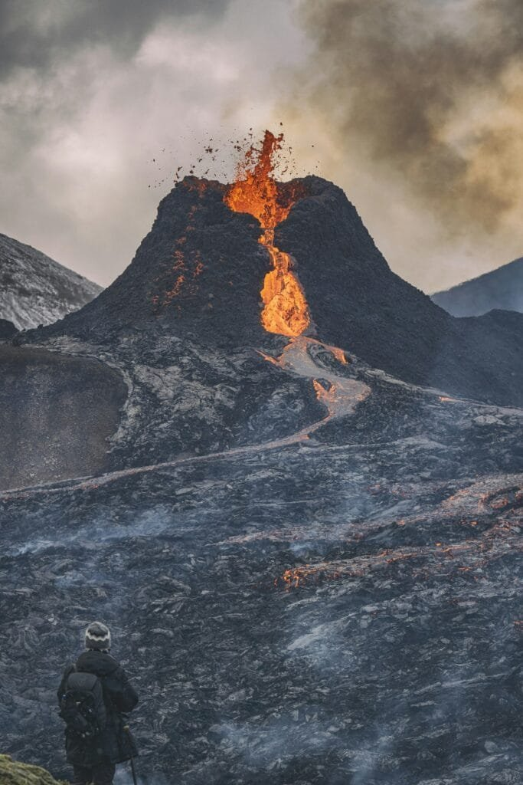

Have you ever found yourself captivated by the mysteries hidden beneath the Earth's surface? It’s truly fascinating to consider how much the ground beneath us holds stories of our planet’s ancient past. The rocks arising from volcanoes are an intricate part of this deep and complex narrative. They play an incredible role in uncovering secrets about the Earth's formation, changes, and the ongoing dance of geological activity that shapes our world.

<iframe width="560" height="315" src="https://www.youtube.com/embed/1UwTqXbL5Lo" frameborder="0" allow="accelerometer; autoplay; encrypted-media; gyroscope; picture-in-picture" allowfullscreen></iframe>

  

## The Basics: What Are Volcanic Rocks?

To begin with the basics, volcanic rocks are formed from magma, which erupts onto the Earth's surface through volcanoes. Upon cooling, this magma solidifies into the rocks that tell tales of fierce eruptions and serene landscapes long gone. They are like nature’s time capsules, containing critical insights about the Earth's past. These rocks are primarily classified into three types: basalt, andesite, and rhyolite. Each type forms under different conditions and environments, painting a varied picture of Earth’s volcanic activity.

### Basalt: The Most Common Yet Intriguing

Basalt is perhaps the most prevalent volcanic rock, covering huge areas of the ocean floor and forming the basis of many volcanic islands. It’s dark in color, rich in iron and magnesium, and forms from lava that is low in silica content. While its prevalence might make it seem mundane, basalt can actually reveal a lot about tectonic movements and the composition of the Earth's mantle.

### Andesite: A Rock of Intermediate Composition

Andesite often forms in volcanic arcs above subduction zones and is characterized by its intermediate silica content. Its study can provide insight into the processes occurring at convergent plate boundaries, where oceanic crust is subducted beneath continental crust.

### Rhyolite: The Silica-Rich Record Keeper

Rhyolite is less common but offers a unique glimpse into high-silica magmatic activity. It often forms in continental volcanic settings and can give us clues about the granitic composition of the Earth's crust and large explosive volcanic events.

## The Geological Story: What Volcanic Rocks Tell Us

Dating back millions of years, volcanic rocks help geologists reconstruct the Earth’s past. By studying them, scientists can determine the age of geological formations and even past climates. They are indispensable in understanding the drift of continents and the theory of plate tectonics.

### Plate Movements and Boundaries

Volcanic rocks are integral in tracing the movements of tectonic plates. The patterns in which these rocks are distributed both on land and below the oceans provide clear evidence of how continents once fitted together and have since drifted apart. For instance, the chains of volcanoes found in the Pacific "Ring of Fire" are closely associated with tectonic activity, showcasing the dynamic nature of the Earth's outer shell.

### Oceanic and Continental Shifts

Volcanic rocks reveal how oceanic and continental crusts have been created and altered over time. The Mid-Atlantic Ridge, a submarine volcanic mountain range, is a classic example of how new oceanic crust is continuously formed as tectonic plates pull apart.

### Volcanic Eruptions: Impact on Climate

Historically, large volcanic eruptions have had significant impacts on global climates. By analyzing volcanic ash layers within rock sequences, scientists can establish when these events occurred and how they influenced the Earth’s climate. Volcanic rocks provide a record of explosive eruptions that have sent particulates high into the atmosphere, affecting temperatures worldwide.

## How Do Scientists Analyze Volcanic Rocks?

The analysis of volcanic rocks involves several fascinating and complex processes. By examining these rocks, scientists can unravel the story they tell about the Earth's history.

### Radiometric Dating

One of the primary methods used is radiometric dating. It determines the age of volcanic rocks by measuring the decay of radioactive isotopes within them. This method allows scientists to pinpoint the time periods when different volcanic events occurred with impressive precision.

### Isotope Analysis

Isotope analysis can reveal the origins of the magma from which volcanic rocks formed. By studying the isotopic compositions of volcanic rocks, scientists can glean information about the conditions deep within the Earth’s mantle.

### Petrographic Studies

These involve examining thin sections of volcanic rocks under a microscope. This close examination uncovers the mineral composition and texture of the rocks, providing insights into the environment and conditions at the time of their formation.

## The Role of Volcanic Rocks in Understanding Magma and Eruptions

Volcanic rocks also offer clues about the character and behavior of magma and subsequent volcanic eruptions. This knowledge is indispensable for predicting future eruptions and mitigating their impact.

### Magma Composition

The composition of volcanic rocks helps geologists understand the diversity of magma types. The presence of certain minerals can indicate the temperature and pressure conditions in which the magma formed, and hence the potential explosivity of an eruption.

### Eruption Mechanisms

By studying the distribution and layering of volcanic rocks, scientists can infer the nature of past eruptions. Did the eruption involve slow, oozing lava flows or violent explosive blasts? This knowledge helps predict how similar volcanoes might behave in the future.

### Hazard Assessment

Understanding volcanic rocks aids in assessing hazards related to volcanic activity. By knowing the history of a volcano’s eruptions and the types of rocks it produces, scientists can better estimate the risks and prepare communities accordingly.

## The Broader Implications: What This Means for Us

Considering how volcanic rocks unveil Earth’s hidden past isn’t just an academic exercise. It holds broader implications for current and future human societies.

### Natural Resources and Mineral Wealth

Volcanic rocks are sources of valuable minerals and metals such as copper, gold, and silver, contributing significantly to economies around the world. Understanding where and how these rocks form can guide mining efforts and sustainable resource management strategies.

### Climate Change Insights

In the context of climate science, volcanic rocks offer invaluable data. By reconstructing past climate conditions via volcanic ash layers, scientists can better model current [climate change](https://magmamatters.com/geothermal-energy-and-its-volcanic-origins/ "Geothermal Energy and Its Volcanic Origins") scenarios and improve our understanding of how natural and human-made factors influence the planetary climate.

### Building and Infrastructure Materials

Basalt in particular is a vital building material, used in everything from roads to architecture. The study of volcanic rocks informs the development and optimal use of these resources, affecting construction industries worldwide.

## A Glimpse into Earthquakes and Volcanic Activity

The study of volcanic rocks doesn’t just tell us about the past—it can also help forecast geological events such as earthquakes and volcanic eruptions. Understanding how the Earth’s plates interact helps predict [seismic activity](https://magmamatters.com/the-art-and-science-of-volcano-monitoring/ "The Art and Science of Volcano Monitoring"), which is crucial for disaster preparedness and protecting lives.

## Personal Reflection: What Can You Do With This Knowledge?

So, knowing all this, how might you look at the ground beneath your feet differently? The next time you hike up a volcano or collect stones from a beach, consider the millennia of history encapsulated in those rocks. They are not just inert matter but vibrant storytellers of the geological forces that crafted our planet.

Whether you're an avid geology enthusiast or simply curious about the natural world, volcanic rocks offer a profound connection to Earth's dynamic history. Embracing this understanding enlarges our appreciation for the planet's past and informs how we think about its future. In every rock, there is a story waiting to be told, a narrative of fire and transformation, waiting for someone like you to explore its secrets.

With volcanic rocks as guides, you have the tools to understand not only the Earth's hidden history but also its ongoing evolution. Who knows, the next volcanic rock you pick up might carry with it a revelation, a small piece of the vast puzzle that is our ever-changing world.
