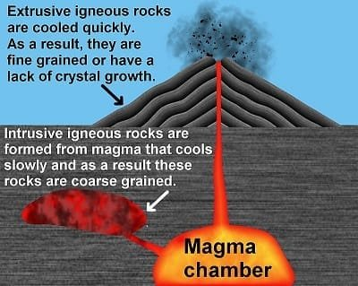
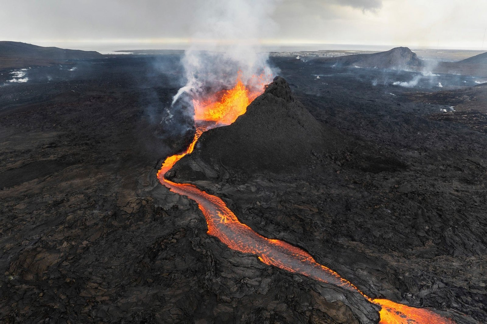
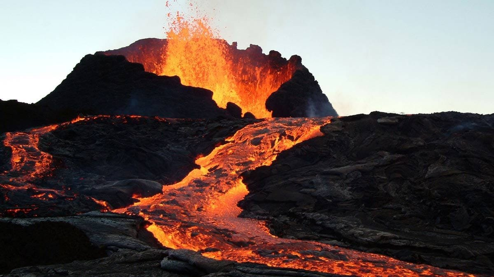
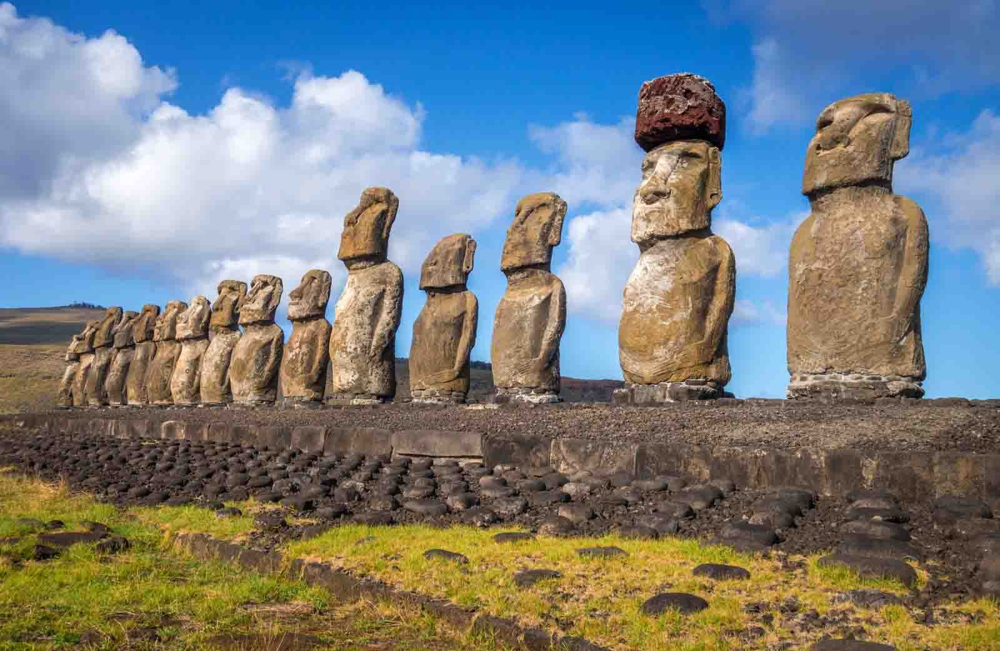
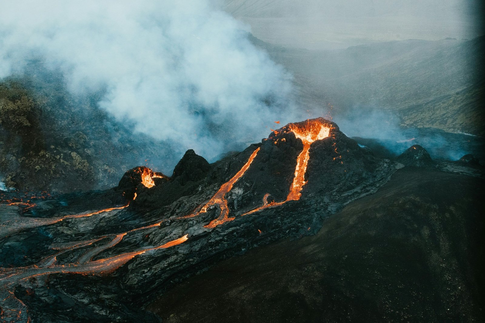

Have you ever wondered what secrets lie beneath the surface of our planet? It's a question that drives scientists and explorers alike to dig deeper—sometimes literally—into understanding the Earth we call home. At first glance, the answers might not be obvious, yet they can be found in some of the most unassuming places: volcanic rocks. These solidified remnants of once-molten lava have stories to tell, tales that go back millions, even billions, of years. Let me take you on a journey to uncover how volcanic rocks reveal Earth's hidden history.

## The Protagonists: Volcanic Rocks

You're probably familiar with volcanoes as dramatic, fiery mountains that occasionally erupt. But what about the rocks they produce? Volcanic rocks are the cool-off artifacts of these eruptions. They're incredibly fascinating because, although they form quickly, they encapsulate a historical timeline. Let's unpack that a little more.

Volcanic rocks are formed from lava that reaches the Earth's surface and cools rapidly, locking in its chemical and mineralogical structure. These rocks are like little time capsules, preserving vital information about our planet's past. You might say they're the Earth's way of keeping a diary, albeit in a language that requires some translation.

### Types of Volcanic Rocks

When it comes to volcanic rocks, not all are created equal. You'll come across terms like basalt, andesite, rhyolite, and pumice, each with unique characteristics and stories to tell. For instance, basalt is the most common volcanic rock on Earth and is primarily found on ocean floors. Meanwhile, rhyolite's high silica content makes it light-colored and explosive when it erupts. Check out the table below for a quick comparison:

| Type | Composition | Features |
| --- | --- | --- |
| Basalt | Low silica, high iron | Dark, dense, forms ocean floors |
| Andesite | Intermediate silica | Gray, found in volcanic arcs |
| Rhyolite | High silica | Light-colored, explosive eruptions |
| Pumice | High silica, gas-rich | Frothy, floats on water |

These variations in composition and properties not only determine how the rocks behave during an eruption but also provide clues about the Earth's inner workings.

## The Formation: A Step Back in Time

To truly appreciate the significance of volcanic rocks, you need to understand their journey from the depths of the Earth to the surface. It starts deep within the Earth's mantle where temperatures and pressures are so high that rocks melt to form magma. This magma then rises through the Earth's crust due to its buoyancy. The process involves a series of complex geological interactions that can spread over millions of years and distances.

Once magma reaches the surface, it erupts either explosively or effusively and cools to form volcanic rocks. These rocks serve as snapshots of the conditions under which they were formed. They reflect the composition of the magma and offer insights into the geological history of the region, including past tectonic activity.

### The Geological Clock

Did you know that volcanic rocks can also serve as natural timekeepers? Radiometric dating techniques, particularly those that involve isotopes like argon or uranium, allow scientists to determine the age of volcanic rocks with impressive accuracy. These techniques measure the decay rate of radioactive elements within the rock, providing a timeline that can extend back billions of years. It's like turning the pages back in the Earth's diary.

## Clues from Chemical Compositions

Volcanic rocks aren't just about looks; they're also about chemistry. The chemical compositions of these rocks reveal much about the environment where they formed. For instance, scientists analyze the proportions of elements such as silicon, magnesium, and iron to gain insights into the tectonic settings and the nature of the Earth's mantle at different times.

### Tectonic Settings and Compositions

Imagine the Earth as a puzzle, with its tectonic plates as the pieces. These plates are constantly in motion, sometimes colliding, sometimes pulling apart. This movement creates different tectonic settings, and each one produces volcanic rocks with distinct characteristics.

- **Mid-Ocean Ridges**: Here, tectonic plates are pulling apart, allowing magma to rise and form basaltic rock. These locations account for most of the Earth's volcanic activity.
    
- **Subduction Zones**: Where one plate slides beneath another, you'll find andesitic and rhyolitic rocks. The magma here is more complex, enriched by materials from the descending plate.
    
- **Hotspots**: These are isolated areas where heat from deep within the Earth triggers volcanic activity. Think of Hawaii, where basaltic lava accumulates to form volcanic islands.
    

Studying these situations enhances the ability to reconstruct past tectonic events, providing a picture of how continents and ocean floors have shifted over time.

## Volcanic Rocks and Climate

It might surprise you, but volcanic rocks can also give us insights into past climates. When volcanoes erupt, they release gases like [carbon dioxide and sulfur](https://magmamatters.com/the-art-and-science-of-volcano-monitoring/ "The Art and Science of Volcano Monitoring") dioxide into the atmosphere, which can influence climate. These emissions leave chemical signatures in volcanic rocks, offering clues about the atmospheric conditions at the time of the eruption.

### Deciphering Climate Change

[Volcanic emissions have been known to trigger climate change](https://magmamatters.com/geothermal-energy-and-its-volcanic-origins/ "Geothermal Energy and Its Volcanic Origins") events. For instance, the release of large amounts of sulfur dioxide into the stratosphere can cool the Earth by reflecting sunlight away. By studying sulfur concentrations in ancient volcanic rocks, researchers piece together impacts of volcanic activity on historical climate shifts, enhancing understanding of climate dynamics over millennia.

## Earth's Evolution Narrated by Volcanic Rocks

Tracing the Earth's evolution is a bit like following a long, complex narrative, only the characters and plot twists are plate tectonics, chemical compositions, and climatic impacts. Think of volcanic rocks as crucial storytellers. They've witnessed continental breakups, the birth of mountain ranges, and even mass extinctions. They hold the answers to many geological puzzles.

### Continental Drift and Supercontinents

Scientific exploration reveals that volcanic rocks align perfectly with theories about supercontinents like Pangaea. These rocks record the conditions present during the coupling and decoupling of massive landmasses. With radiometric dating, scientists can synchronize events across continents, proving that different parts of the globe were once united.

### Mass Extinctions

Volcanic rocks are silent witnesses to catastrophic events, such as mass extinctions. Consider the Permian-Triassic extinction event, which wiped out a majority of Earth's species. Massive volcanic eruptions in what is now Siberia left a trail of basaltic rocks, hinting at a connection between volcanic activity and environmental change.

## How Scientists Analyze Volcanic Rocks

Unpacking the history stored in volcanic rocks requires a host of scientific techniques. It’s not just about going out and grabbing a rock; each piece undergoes rigorous examination in a lab setting, revealing its secrets under microscopes and through complex computer models.

### Techniques and Technologies

- **Petrographic Analysis**: This involves looking at the mineral composition and texture of the rock, often using a microscope to get an up-close view of its history.
    
- **X-Ray Fluorescence (XRF)**: Scientists use XRF to measure the elemental composition of volcanic rocks, providing insight into their chemical make-up.
    
- **Mass Spectrometry**: This technique measures the isotopic composition helping to age and track the source of the volcanic material.
    

Each technique adds a layer to your understanding, contributing to a more detailed and nuanced picture of Earth's history.

## Volcanic Rocks in Today's World

While volcanic rocks connect us to the distant past, they also have a role to play in modern times. For one, they contribute to soil fertility and are often used in construction and art. But perhaps their most important modern-day relevance comes in the form of understanding and predicting volcanic hazards.

### Predicting Volcanic Hazards

With advances in technology, scientists are better equipped today to predict volcanic eruptions. Analyzing the shapes, formations, and compositions of volcanic rocks can help foresee future events. Understanding these materials allows scientists to better grasp volcano behaviors and potential impacts on human civilization.

## The Ongoing Puzzle

As you consider volcanic rocks, you're engaging with an ongoing Earth story that keeps on adding chapters. It's tempting to think of them as static, but the Earth is an active system constantly writing new history. Every time a new volcanic rock forms, it adds another layer to this complex narrative.

You might find it fascinating how these rocks reflect a picture of an ever-changing Earth, offering glimpses of ancient atmospheres, tectonic plate movements, and even the intricate dance of continents over vaults of geological time. Volcanic rocks are much more than mere stony relics; they're pages of a dynamic, historical novel that continues to unfold beneath our feet.

By studying them, you’re not only stepping back in time but also preparing for the future. Whether it’s predicting volcanic hazards, understanding climate change, or unlocking geological mysteries, the relevance of volcanic rocks cannot be overstated. They are, after all, the Earth's storytellers.

