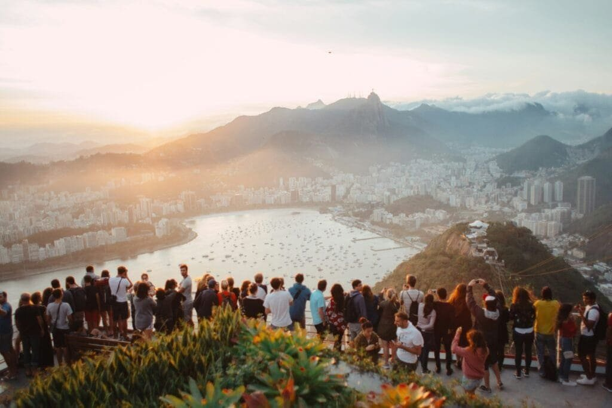

Have you ever thought about how nature's most powerful spectacles, like volcanoes, can have a ripple effect that touches lives far beyond their immediate vicinity? Volcano eruptions are mesmerizing and awe-inspiring, capturing our imaginations with their fiery display. But when these geological monsters awake and spew their molten fury, what's the impact on global tourism? It's an intriguing thought, isn't it?

<iframe width="560" height="315" src="https://www.youtube.com/embed/LQwZwKS9RPs" frameborder="0" allow="accelerometer; autoplay; encrypted-media; gyroscope; picture-in-picture" allowfullscreen></iframe>

  

## Understanding Volcanic Eruptions

Before we explore how these geological events influence tourism, we need to understand what a volcano eruption actually entails. Volcanoes are openings in the Earth's surface that allow molten rock, gases, and debris to escape from below the crust. It's a bit like the Earth itself is breathing out, albeit with spectacular force and potentially destructive impact.

### Types of Volcano Eruptions

Volcanic eruptions can be classified into several types, each with its own characteristics and consequences. Some eruptions are relatively gentle, oozing lava down their sides, while others explode with devastating force. Here's a simplified breakdown:

| Type | Characteristics |
| --- | --- |
| Effusive | Lava flows steadily, less explosive. |
| Explosive | Sudden explosions, ejection of ash clouds. |
| Phreatomagmatic | Interaction of water and magma, producing steam. |
| Strombolian | Short-lived, small explosions or fountains. |
| Plinian | Highly explosive, generating pyroclastic flows. |

These different types can influence both the immediate surroundings and global tourism in unique ways.

## Immediate Impacts on Local Tourism

When a volcano erupts, the nearby areas are usually the first to feel the effect. Imagine planning a serene getaway, only to be caught in the midst of nature's fiery outburst.

### Disruption of Tourist Activities

Tourist activities can be severely disrupted by an eruption. If a popular hiking trail suddenly gets buried under lava, or a scenic view is obscured by ash clouds, it's safe to say that plans get put on hold. Local businesses that rely on tourism, from charming bed-and-breakfasts to souvenir shops, often find themselves at a standstill.

### Evacuations and Safety Concerns

Safety becomes the paramount concern during an eruption. Evacuations are often necessary, and travelers might get stranded or need to make alternate arrangements. Authorities may close airports or reroute flights, which is why holiday itineraries can take unexpected detours or, unfortunately, get entirely canceled.

## Long-term Effects on Local Communities

The dust might settle eventually, but the repercussions can last much longer. Once the initial impact wanes, communities face the challenge of rebuilding and restoring their attraction to tourists.

### Economic Strain

Local economies, especially those heavily dependent on tourism, can face significant financial strain. The immediate impact might subside, but the economic repercussions can last for months or even years. Repairs and clean-up efforts require both time and money, and during this period, tourism revenue can plummet.

### Rehabilitation of Tourist Spots

Rehabilitating affected tourist attractions is often a lengthy process. Communities may need to repair infrastructure, clear away volcanic debris, and re-create safe conditions for tourists. Meanwhile, marketing efforts must reassure potential visitors that it’s both safe and enjoyable to return.

## Global Implications on Tourism

While the immediate vicinity of a volcano bears the brunt of its wrath, the effects can ripple outwards, influencing tourism on a global scale.

### Flight Disruptions

Volcanic ash clouds can disrupt air travel far beyond the volcano itself. Remember the 2010 Eyjafjallajökull eruption in Iceland? That event alone caused widespread flight cancellations across Europe, affecting millions of travelers. This kind of disruption requires airlines and tourists to adapt quickly, often with little notice.

### Destination Perception

A high-profile eruption can change the way potential visitors view a destination. They might associate it with danger or destruction, which can discourage travel in the future. Conversely, some thrill-seekers are drawn to visit an active volcanic area—volcano tourism, if you will—but we'll get to that a bit later.

## The Attraction of Volcano Tourism

While it might seem counterintuitive, volcanoes can actually attract as many tourists as they repel. There's something utterly captivating about witnessing one of Earth’s rawest displays of power.

### Curiosity and Adventure

For some, the lure of seeing a volcano up close is irresistible. People often travel far and wide to experience this natural phenomenon, driven by curiosity or a thirst for adventure. Tour operators have recognized this and built entire ecosystems around volcano tourism. Guided tours offer a (relatively) safe way to get close and personal with these fiery giants without getting singed.

### Cultural and Educational Value

Volcanoes also provide opportunities for cultural and educational tourism. They allow you to learn not only about geology and the forces of nature but also about how local cultures have coexisted with these mighty mountains over the years. Many tours are punctuated with stories and legends unique to the region, offering a richer travel experience.

## Balancing Benefits and Risks

While some tourists eagerly seek out volcanoes for excitement and enrichment, destinations must consider how to balance these interests with safety and sustainability.

### Safety Protocols

Ensuring the safety of both locals and tourists is paramount. Effective early warning systems, emergency plans, well-marked evacuation routes, and trained staff can mitigate risks dramatically. They don’t eliminate them, of course, but the assurance of safety can make a big difference in a potential visitor's mind.

### Environmental Impact

On the flip side, cultivating a volcano as a tourist attraction must be done with an eye toward environmental sustainability. Over-visitation can lead to erosion, waste, and other negative environmental impacts. Careful management and regulations are required to preserve these natural wonders for future generations.

## Technology and Volcanic Events

An interesting dimension to consider is how technology plays a role in both predicting and managing volcanic activity's impact on tourism.

### Predictive Technology

Advances in predictive technologies can give scientists increasingly accurate forecasts about potential eruptions. Satellite imagery, seismic readings, and AI models all contribute valuable insights. More accurate predictions translate to better preparedness—both for local authorities and for those planning their travel itineraries.

### Communication Channels

Technological advancements also bolster communication channels. Social media and alert systems can rapidly disseminate information about imminent eruptions or current conditions. Keeping tourists informed is essential for maintaining safety and minimizing panic or uncertainty.

## Case Studies: Notable Volcanic Eruptions and Their Tourism Effects

To better comprehend the broad impact of volcanic eruptions on tourism, let’s examine a few case studies.

### Mount St. Helens, USA

The 1980 eruption of Mount St. Helens was one of the most well-documented volcanic events in recent history. It drastically altered the landscape and had significant impacts on local tourism. However, over time, the story—of destruction and renewal—became itself a draw. Today, thousands of tourists visit Mount St. Helens annually to witness the rebirth firsthand.

### Mount Agung, Indonesia

More recently, Mount Agung in Bali erupted, causing widespread evacuations and a temporary drop in tourism. Bali, a popular destination, took steps to ensure that safety protocols were stringent and effectively communicated, helping to mitigate losses and reassure tourists of their safety.

### Eyjafjallajökull, Iceland

The eruption of Eyjafjallajökull, already mentioned, caused massive flight disruptions. However, it also put Iceland on the map for many travelers, curious about the landscapes and experiences offered by this remote and stunning country. As ironic as it sounds, the eruption sparked a surge in interest and visits post-eruption.

## Future Directions for Tourism in Volcanic Regions

With the complex interplay between [natural phenomena](https://magmamatters.com/the-art-and-science-of-volcano-monitoring/ "The Art and Science of Volcano Monitoring") and human interest, what does the future hold for tourism in volcanic regions?

### Sustainable Tourism Practices

The emphasis on sustainable tourism is likely to strengthen as we become more aware of the environmental impacts of our travels. In volcanic areas, this might mean stricter regulations on visitor numbers, waste management, and local resource use to ensure that human footprints don’t mar these breathtaking natural settings.

### Enhancing Tourist Experience

Innovation in tourist offerings—such as virtual reality experiences, augmented reality apps, and more interactive exploratory tours—can enrich visitor experiences without imposing increased physical demands on fragile volcanic environments.

## Conclusion: Navigating the Fiery Force of Nature

The connection between volcanic activity and global tourism is nuanced and multifaceted. On one hand, eruptions pose immediate threats and long-term economic challenges; on the other, they spark curiosity and adventure, drawing visitors seeking new experiences. Balancing these elements requires thoughtful planning, effective communication, and sustainable practices. And while we can predict and prepare to some extent, it's clear that volcanoes will never lose their power to both awe and humble us. After all, they are reminders of the incredible forces that lie beneath the Earth's crust—a mesmerizing spectacle of the natural world.

So, next time you consider traveling to a region shadowed by a volcano, remember that these mighty mountains offer more than danger and awe. They give us a glimpse into the Earth's innermost workings and a chance to marvel at the majestic power of nature—and isn't that what travel is all about?
