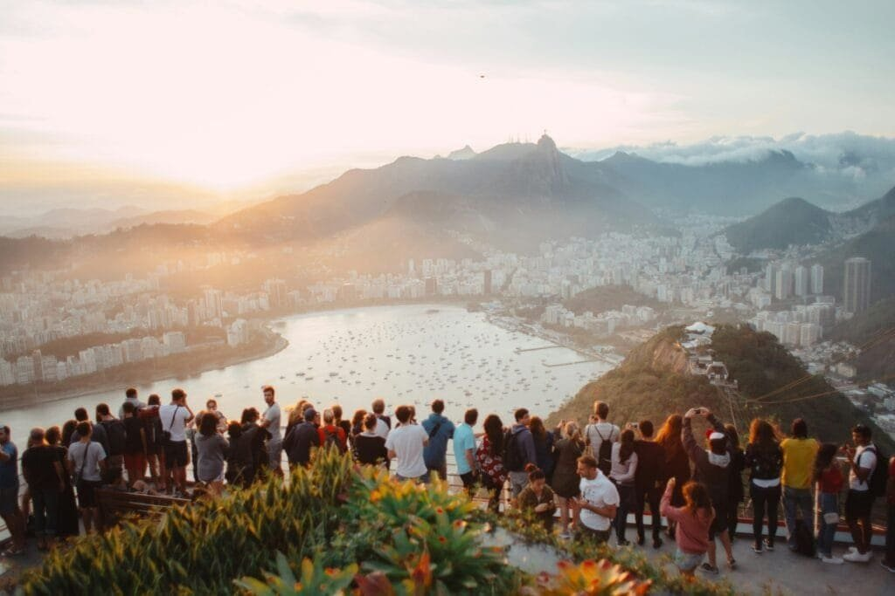

Have you ever wondered how those breathtaking, yet unpredictable volcano eruptions might affect your travel plans? Whether you're a thrill-seeker with a penchant for adventure or someone simply planning a serene holiday, volcano eruptions can play a significant role in the world of tourism.

<iframe width="560" height="315" src="https://www.youtube.com/embed/LQwZwKS9RPs" frameborder="0" allow="accelerometer; autoplay; encrypted-media; gyroscope; picture-in-picture" allowfullscreen></iframe>

  

## Understanding Volcanic Activity

Before we dive into the impact on tourism, let's take a moment to understand what volcanoes are all about. When we talk about a volcano eruption, we’re talking about a fascinating display where the earth puts on a fiery show. Molten rock, ash, and gases escape from a volcano, reaching the surface in a sometimes explosive manner. It's nature's way of keeping us on our toes.

### Types of Volcanic Eruptions

You might be surprised to know there's more than one type of volcanic eruption. Each type has a different impact on tourism. Here's a quick breakdown:

| Type of Eruption | Characteristics | Tourist Impact |
| --- | --- | --- |
| Explosive | Violent, ash clouds, pyroclastic flows | Can disrupt air travel and close tourist attractions |
| Effusive | Flowing lava, less dramatic explosions | Often safer, might attract tourists seeking adventure |
| Phreatic | Involves steam, minor explosions | Can be dangerous, often less predictable |

Understanding these types helps to illustrate why some eruptions might send tourists running, while others attract people from all over the globe.

## Impact on Tourist Destinations

Volcanoes dot our planet in some of the most popular tourist destinations. Whether active, dormant, or extinct, their presence shapes the landscape and the tourism industry itself.

### Popular Volcano-Related Destinations

Places like Hawaii, Iceland, and Japan are synonymous with stunning volcanic scenery. These locations rely heavily on volcano-related tourism.

#### Hawaii

In Hawaii, volcanoes are a key draw. Imagine hiking the heights of Mauna Kea or witnessing the glow of Kīlauea’s lava. However, eruptions can transform a typically safe experience into a risky adventure, leading to treks being halted and visitor centers closed for safety.

#### Iceland

Iceland’s Eyjafjallajökull eruption in 2010 famously disrupted European air travel but also increased interest in volcano tourism. Tourists now flock to witness the [volcanic landscapes and geothermal](https://magmamatters.com/geothermal-energy-and-its-volcanic-origins/ "Geothermal Energy and Its Volcanic Origins") features that this eruption expanded.

#### Japan

Japan, being part of the Ring of Fire, has a unique relationship with its volcanoes. With iconic sites like Mount Fuji, the country balances attraction with safety concerns during eruptions. This balance impacts tourism flows, sometimes increasing interest or necessitating caution.

### Economic Implications

Volcanic eruptions can have significant economic effects, particularly in regions heavily reliant on tourism. An eruption can lead to short-term economic loss due to travel disruptions and attraction closures. However, in some cases, these events can cause a spike in visitor numbers in the aftermath of an eruption, as tourists are drawn by the unique landscapes created.

## Air Travel Disruptions

One of the more immediate concerns for tourists when a [volcano erupts is the potential for air travel](https://magmamatters.com/the-environmental-impact-of-volcanic-eruptions-2/ "The Environmental Impact of Volcanic Eruptions") disruptions.

### Ash Clouds and Flight Safety

Volcanic ash clouds are notorious for grounding flights. The abrasive ash particles can damage airplane engines, creating a notable safety risk. Here's a closer look:

- **European Airspace**: The 2010 Eyjafjallajökull eruption led to unprecedented airspace closures, disrupting millions of travelers.
- **Economic Losses**: Airlines and travel companies faced significant losses, and travelers found themselves stranded, their plans thrown into chaos.

### Navigating Travel During Eruptions

If you find yourself trying to travel during a volcanic eruption, here’s a tip: always check with airlines for updates and have a flexible travel plan. Being adaptable can often mean the difference between a vacation saved or lost.

## Health and Safety Concerns

While volcanoes offer stunning views, they can also pose health risks to tourists.

### Health Risks from Volcanic Ash

Volcanic ash can cause respiratory issues, irritate eyes, and even contaminate water supplies. Here’s what you should keep in mind:

- **Respiratory Issues**: Fine ash particles can be inhaled, leading to conditions like bronchitis.
- **Travel Advisories**: Checking local advisories and having masks on hand can be wise preventative measures.

### Safety Measures for Tourists

For those determined to experience a volcanic region, safety is paramount. Listen to local authorities and guides, stay informed via reliable news sources, and have an emergency plan in place.

## Opportunities for Adventure Tourism

While eruptions can pose challenges, they also create opportunities for a burgeoning type of tourism—adventure tourism.

### The Thrill of Active Volcanoes

Active volcanoes are hotspots for thrill-seekers. Whether it's hiking to the crater's edge or riding a helicopter over flowing lava, adventurous tourists are drawn to the raw power of these natural wonders.

### Educational Tourism

[Volcanoes also offer a unique educational](https://magmamatters.com/the-art-and-science-of-volcano-monitoring/ "The Art and Science of Volcano Monitoring") opportunity. Tours that emphasize the geology and environmental impact of these formations can be both informative and awe-inspiring, opening up a distinct niche in the tourism market.

## Rebuilding and Recovery

After an eruption, the recovery process begins, and it’s pivotal for tourism to bounce back.

### Community Resilience

Communities have to be resilient, rebuilding infrastructures, readjusting tourism strategies, and rebranding their locales to appeal to future visitors again.

### Promoting Post-Eruption Tourism

Often, the geological changes from an eruption create new tourist attractions. From new landscapes to rare and beautiful phenomena, the allure for tourists to witness change first-hand can be significant.

## Balancing Tourism and Conservation

It’s crucial for volcanic regions to find a balance between capitalizing on tourism and conserving the natural environment.

### Preservation Efforts

Environmental preservation is essential. In popular sites like Yellowstone, authorities take measures to ensure visitor activity doesn't harm the ecosystem, balancing preservation with accessibility.

### Sustainable Tourism Practices

Implementing sustainable tourism practices ensures that while visitors experience the raw beauty of volcanoes, their impact doesn’t leave a lasting negative effect.

## Conclusion

So, how do volcanoes fit into your travel narrative? The mesmerizing power and beauty of these natural formations offer incredible opportunities and significant challenges for global tourism. While eruptions can disrupt travel plans and pose health and safety risks, they also draw adventure seekers and learners eager to explore the earth's fiery spectacles. As the dance between tourism and nature continues, the world watches with bated breath, ever ready to embrace the sights and stories that only volcanoes can tell.

Understanding these nuances can help in planning vacations that not only fulfill your wanderlust but also respect the unpredictable forces of nature. While volcano tourists vary from the adventurous at heart to the educational explorers, the allure remains unmistakable, drawing people back to the mysterious and dynamic spectacles of our planet, eruption after eruption.
