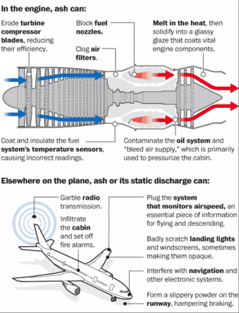

Have you ever wondered how natural occurrences like volcanic eruptions can throw a wrench in our meticulously planned air travel schedules? It's more common than you might think, and the effects can ripple through the industry in ways that might surprise you. In this exploration, we'll unpack the intricate relationship between volcanic eruptions and air travel, delving into the reasons why these natural events pose such a challenge to aviation.

## Understanding Volcanic Eruptions

Volcanic eruptions can be awe-inspiring yet immensely disruptive natural phenomena. Imagine standing at a safe distance as a volcano releases ash, gases, and molten rock high into the sky. While mesmerizing, these eruptions can lead to a multitude of problems for aircraft flying nearby. It’s not just the fiery explosion you need to worry about—it's the aftermath that poses the greatest threat.

### Anatomy of a Volcanic Eruption

When a volcano erupts, it emits ash clouds filled with fine particles and gases. These clouds can ascend to altitudes where commercial airplanes typically cruise, which can be anywhere from 30,000 to 40,000 feet. The particles in the ash clouds are mostly tiny shards of volcanic glass that can wreak havoc if they come into contact with an aircraft.

### Reasons for Concern

Pilots view volcanic ash as a serious flight risk for several reasons. The ash can damage engines, abrade the aircraft's exterior, and compromise visibility. It’s not just about avoiding an immediate collision with an ash cloud; the longer-term consequences of ash exposure can lead to costly repairs and significant downtime for aircraft.

## How Volcanic Ash Affects Aircraft

Understanding why volcanic ash is such a threat to planes is crucial. It’s not as simple as a sudden burst from a [volcano](https://magmamatters.com/the-environmental-impact-of-volcanic-eruptions-2/ "The Environmental Impact of Volcanic Eruptions") grounding flights—there are numerous ways ash can impact the aircraft and the logistics of air travel.

### Engine Damage

Imagine flying through something akin to a sandstorm, but with the particles being much harder and more abrasive. Volcanic ash can melt inside turbine engines due to the high operational temperatures, then re-solidify on cooler parts of the engine, leading to blockages and potential engine failure.

### Reduced Visibility

Volcanic ash clouds can reduce visibility mid-flight, making navigation perilous. Worse, the ash can also scratch the cockpit windows, making it hard for pilots to see where they’re going. It’s a safety issue that no airline can afford to ignore.

### Communication and Navigation Issues

Volcanic ash can interfere with onboard electronic systems. The ash particles carry an electrical charge and can disrupt communications and navigational aids that are crucial for safe flight operations.

<iframe width="560" height="315" src="https://www.youtube.com/embed/qeqUXeBr3Kk" frameborder="0" allow="accelerometer; autoplay; encrypted-media; gyroscope; picture-in-picture" allowfullscreen></iframe>

  

## Air Travel Disruptions Caused by Volcanic Eruptions

The disruption caused by volcanic eruptions can affect more than just a single flight pathway; they can have extensive economic and logistical consequences across the globe.

### Flight Cancellations and Delays

One of the most immediate impacts of a volcanic eruption is on flight schedules. If an ash cloud is detected in a flight path, airlines have no choice but to cancel or delay flights. This can lead to cascading delays affecting multiple airlines and countless passengers worldwide.

### Rerouting and Increased Costs

In situations where flying around the ash cloud is possible, airlines are forced to reroute flights, which can significantly increase flight times and operating costs due to additional fuel consumption. For airlines, this presents a delicate balancing act between ensuring passenger safety and maintaining service efficiency.

### Passenger Impact

For you, the traveler, volcanic eruptions can lead to inconvenient scenarios such as missed connections, delayed arrivals, and even cancellations. This can escalate costs for lodging and shatter any carefully laid travel plans, especially if you’re traveling for time-sensitive events.

## The Economic Ripple Effect

When volcanoes erupt, the financial implications stretch beyond airlines and extend to other sectors. You might not realize it, but these eruptions can have major economic impacts that can affect you indirectly.

### Impact on the Airline Industry

Increased maintenance costs, fuel expenses, and customer service challenges are some of the immediate financial burdens airlines face after a volcanic eruption. For smaller airlines, these costs can be crippling, sometimes leading to financial instability.

### Tourism and Hospitality

Naturally, the tourism and hospitality sectors feel the brunt when air travel is disrupted. Fewer tourists mean reduced business for hotels, restaurants, and attractions. The economic impact can be quite severe, especially in locations that rely heavily on tourism.

### Supply Chain Interruptions

Volcanic eruptions don’t just affect people flying for leisure or business; they also impact cargo flights. This can lead to disruptions in the global supply chain, affecting the availability of goods and potentially causing price spikes.

## Strategies to Mitigate the Impact of Volcanic Eruptions

Fortunately, there are measures in place aimed at reducing the chaos caused by volcanic eruptions. While it’s impossible to control when and where these eruptions occur, various strategies help mitigate their effects on air travel.

### Improved Monitoring and Prediction

Advancements in [technology](https://magmamatters.com/the-art-and-science-of-volcano-monitoring/ "The Art and Science of Volcano Monitoring") allow for better tracking and prediction of volcanic eruptions and ash cloud movements. Organizations like the Volcanic Ash Advisory Centers play a crucial role in issuing warnings to aircraft.

### Aircraft Design and Engineering

Some aircraft are now being designed with volcanic eruptions in mind. Engineers are working on creating engines more resilient to volcanic ash, enhancing aircraft durability in the face of such difficult conditions.

### Policy and Crisis Management

Airlines are also developing more robust crisis management policies. By preparing for such emergencies ahead of time, they can minimize disruptions and improve communication with passengers.

## The Future of Air Travel in a Volcanically Active World

Looking forward, the aviation industry continues to adapt to the challenges posed by volcanic eruptions. It’s an ongoing conversation about safety, costs, and technological advancements that feels more pressing with each new eruption.

### Technology to the Rescue

Innovations like ash detection systems and the development of drones to monitor volcanic activity are paving the way for even safer air travel.

### Collaborative Efforts

There is also a growing need for international cooperation. Sharing data and strategies globally helps airlines and governments better prepare for the disruptions caused by these natural events.

### What This Means for You

While the topic may seem distant from your everyday life, the effects of volcanic eruptions on air travel are more significant than you might expect. It's a subject worth keeping an eye on, especially if future travel plans involve flying over volcanically active regions.

## Conclusion

Volcanic eruptions, though magnificent and powerful in their natural beauty, pose significant challenges to air travel. From grounding flights to wreaking havoc on economies, their effects are wide-reaching and complex. Yet, with advances in technology and improved crisis management procedures, the aviation industry continues to find ways to navigate these turbulent situations. While you might not be able to plan for every contingency, being aware of the potential impacts can make your travel experience that much smoother. Who knows, next time you might even view those volcanic ash advisories with a little more understanding and a bit less frustration.
