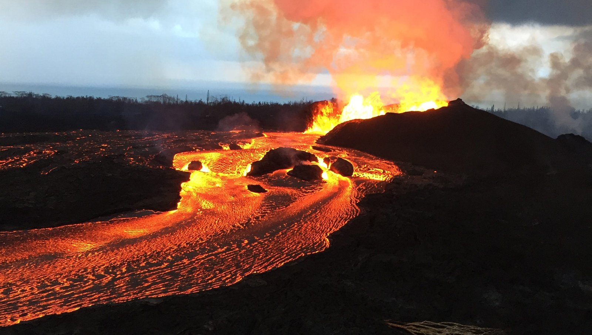
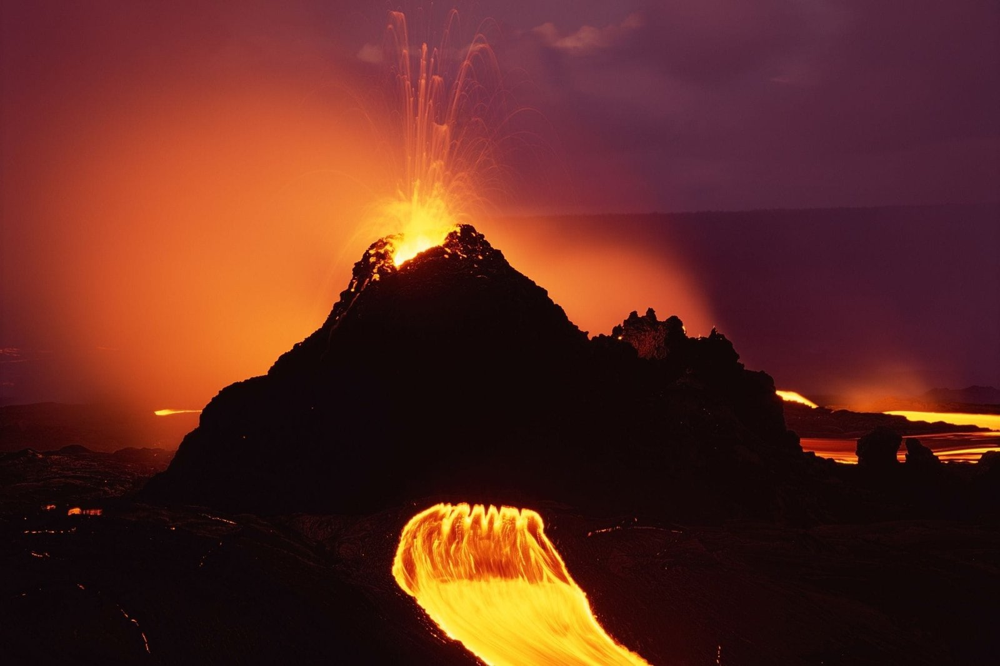

Have you ever wondered how the Hawaiian Islands came to be such a fascinating archipelago of fiery mountains and lush landscapes? It all began with volcanic eruptions, an explosive yet artistic display of Earth's dynamic forces. Hawaii as we know it wouldn't exist without these mighty natural events that have shaped not only its topography but also its culture and mythology. Let's take a conversational stroll through the fiery history of volcanic eruptions in Hawaii. We'll explore how these eruptions have sculpted the islands, the science that explains why they happen, and the cultural significance woven into the fabric of Hawaiian society.

<iframe width="560" height="315" src="https://www.youtube.com/embed/LdlEufZop-Y" frameborder="0" allow="accelerometer; autoplay; encrypted-media; gyroscope; picture-in-picture" allowfullscreen></iframe>

  

## The Birth of the Hawaiian Islands

The beginning of the Hawaiian Islands is a tale as old as time itself. It starts deep under the Pacific Ocean with volcanic activity around the Hawaii Hotspot. Unlike many volcanic activities triggered by tectonic plate boundaries, Hawaii's volcanic eruptions are caused by a stationary hotspot—a plume of hot magma rising through the Earth’s mantle.

### A Solo Hotspot in the Pacific

The Hawaii Hotspot has been super reliable, if you could apply such a characteristic to a geological feature. Imagine it like a blowtorch under the moving Pacific Plate. As the plate moves over this hotspot, magma pushes through the crust forming volcanoes. Over millions of years, these eruptions have conspired to create the Hawaiian island chain. The islands trail off from the hotspot, with the oldest volcanic formations in the northwest and the youngest in the southeast, like an assembly line of volcanic construction.

### Building an Island, One Layer at a Time

Think of it as natural layering. Each volcanic eruption adds a layer of lava, building vast mountains that eventually break the ocean's surface to form islands. Such activity has resulted in a collection of islands, each at different stages of volcanic birth and erosion. Among them, Hawaii Island—also known as the Big Island—is the youngest and most volcanically active, hosting some of the world's most famous volcanoes like Mauna Loa and Kilauea.

## The Notorious Volcanoes of Hawaii

Now, let’s spotlight the protagonists of this fiery tale, the powerhouses of Hawaii that continue to allure researchers and tourists alike.

### Mauna Loa: The Mighty

As the largest volcano on Earth in terms of volume and area covered, Mauna Loa demands respect. It rises about 13,680 feet above sea level and extends 3,100 feet below, making its total height over 56,000 feet. Remarkably, Mauna Loa has erupted 33 times since its first documented eruption in 1843. Understanding this [volcano is key to understanding Hawaiian geology](https://magmamatters.com/geothermal-energy-and-its-volcanic-origins/ "Geothermal Energy and Its Volcanic Origins").

### Kilauea: The Star Performer

Kilauea is somewhat Hawaii's celebrity volcano, thanks to its frequent eruptions—a scientific and touristic darling. It's one of the most active volcanoes on Earth and has been erupting continuously since 1983. Its activity provides a window into volcanic processes, offering both danger and beauty with its flowing lava that creates new land.

### Mauna Kea: The Stately Elder

Although currently dormant, Mauna Kea is taller than its neighboring Mauna Loa and carries a regal air with its snow-capped peaks. It's a profound reminder that Hawaiian volcanoes aren’t always explosive but enter phases of dormancy, sometimes awakening after centuries.

## The Science Behind Volcanic Eruptions

[Science can demystify these wondrous yet daunting natural](https://magmamatters.com/understanding-volcanic-formation-a-comprehensive-guide/ "Understanding Volcanic Formation: A Comprehensive Guide") occurrences. Let's break down how and why eruptions in Hawaii tend to be relatively gentle compared to other volcanic events globally, like those near the “Ring of Fire.”

### A Lesson in Lava

Hawaiian eruptions are primarily effusive rather than explosive, meaning the lava flows rather than combusts. This is due to the composition of the magma, which is particularly basaltic, allowing it to be fluid and less viscous.

### The Role of Tectonic Plates

The Pacific Plate plays a crucial role in shaping Hawaii’s volcanic activity. Simply put, as the plate shifts over the stationary Hawaiian Hotspot, it ignites volcanic action. This ongoing process contributes to Hawaii's evolving landscapes, islands sprouting over time only to be eroded by the elements.

### Seismology and Prediction

Predicting eruptions is both art and science. Seismologists use a range of tools to analyze movement beneath the Earth's surface, helping to gauge when an eruption might occur. Understanding these cycles is crucial for the safety of residents and visitors alike.

## Cultural Significance of Volcanoes in Hawaii

In Hawaii, volcanoes are more than geographical features; they're part of a rich tapestry of lore and tradition.

### Pele: The Goddess of Fire

Central to Hawaiian mythology is Pele, the goddess of fire and volcanoes. She's believed to inhabit Kilauea and is responsible for its eruptions. In local narratives, Pele’s fiery temper explains volcanic eruptions, and she serves as both creator and destroyer, respected and revered by locals.

### Traditions and Rituals

Traditional Hawaiian culture involves a deeply spiritual connection to the land and its [natural phenomena](https://magmamatters.com/the-art-and-science-of-volcano-monitoring/ "The Art and Science of Volcano Monitoring"). Rites and rituals often pay homage to the volcanic powers, embedding these mighty mountains with sacredness and storytelling passed down through generations.

### Modern-Day Influence

The cultural significance persists today as these volcanic elements are entwined in art, music, and dance. Stories of Pele and the islands’ origins are celebrated continuously in festivals and dances like the hula, making volcanism a living aspect of Hawaiian culture that’s tangible day-to-day.

## The Impact of Volcanic Eruptions on Hawaiian Life

Volcanic activity has molded more than just land; it’s altered everyday life in Hawaii, spanning from ecological impacts to human habitation.

### Economic Influence

The tourism industry is bolstered by interest in Hawaii's volcanoes—drawing visitors globally curious about the boiling calderas and their artistic lava flows. Volcano tourism is a significant contributor to the economy, providing jobs and promoting cultural exchange.

### Ecological Shifts

Eruptions can drastically change ecosystems, creating new environments while obliterating existing flora and fauna. The unique landscapes formed host endemic species and foster ecological research into evolutionary adaptation.

### Living with Volcanoes

For island inhabitants, living near active volcanoes demands precaution and preparedness. While rarely catastrophic, eruptions can disrupt lives. Ash fallout, lava flows, and air quality are managed with vigilance and adaptation to these unavoidable giants in their backyard.

## A Future of Volcanic Evolution

As we continue observing these magnificent processes, it's a glimpse into Earth’s ever-changing nature and a reminder of our planet’s potent forces.

### Ongoing Research

Researchers are constantly studying these volcanoes to better grasp volcanic behavior, protect communities, and harness this power, perhaps even tapping geothermal energy. Science investing in understanding these activities helps prepare us for a safer coexistence.

### Anticipating Changes

With climate trends shifting, scientists are also investigating how alterations in weather patterns might influence volcanic activity. This research is key to understanding future risks and preserving both human life and natural habitats.

## Conclusion

Volcanic eruptions are not merely destructive events; in Hawaii, they represent a cycle of life, death, and rebirth that has crafted one of Earth’s most picturesque places. They hold stories within their fiery histories, from the magma that builds islands far below sea level to the cultural tales that highlight humanity's adaptability and reverence for nature.

So, as you ponder the hot and simmering forces beneath one of the world's most beautiful paradises, remember the complexity and synergy in Earth's surprises. Hawaii's volcanic history doesn't just tell of a past forged in lava but forecasts an intriguing tapestry of land, culture, and life continuously woven in fiery, molten threads.
