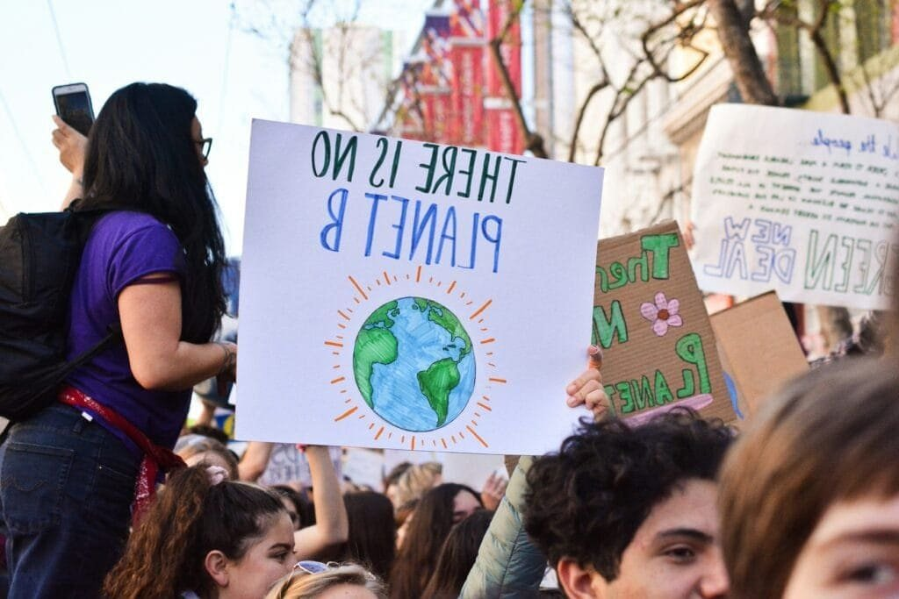

Have you ever wondered how the fiery forces beneath the Earth's surface could impact our climate? It might seem like a far-fetched connection at first glance, yet volcanoes and climate change share a fascinating bond that intertwines the throbbing veins of the planet with the shifting patterns of weather and climate.

<iframe width="560" height="315" src="https://www.youtube.com/embed/7zoycrMusK4" frameborder="0" allow="accelerometer; autoplay; encrypted-media; gyroscope; picture-in-picture" allowfullscreen></iframe>

  

## Understanding Volcanoes: The Fiery Breath of Earth

Volcanoes are essentially vents on the Earth's surface where molten rock, debris, and gases from within the planet escape. As you picture them, perhaps dramatic scenes of towering, lava-spewing mountains come to mind, but there are actually several types of volcanoes, each with unique characteristics and behaviors.

### Types of Volcanoes

Volcanoes differ in shape, size, and activity levels. The main types are the majestic shield volcanoes, the steep and explosive stratovolcanoes, and the more inconspicuous cinder cones, among others. Shield volcanoes, like Hawaii's Mauna Loa, have gentle slopes and produce lava flows, while stratovolcanoes, such as Mount St. Helens, are known for their dramatic eruptions.

| Volcano Type | Characteristics | Notable Examples |
| :-: | :-: | :-: |
| Shield | Gentle slopes, lava flows | Mauna Loa |
| Stratovolcano | Steep, explosive eruptions | Mount St. Helens |
| Cinder Cone | Steep, simple structure, single vent | Paricutin |

### How Volcanoes Erupt

The eruption of a volcano is a complex process driven by the heat and movement of molten rock beneath the Earth's surface. When pressure builds up due to the accumulation of magma, it eventually finds an escape route, causing an eruption. The type of eruption can vary—sometimes it's a steady flow of lava, and other times it's a violent explosion throwing ash high into the sky.

## The Climate System: A Delicate Balance

To understand the connection between [volcanoes and climate change](https://magmamatters.com/geothermal-energy-and-its-volcanic-origins/ "Geothermal Energy and Its Volcanic Origins"), it's essential to get a grasp on how our climate system operates. The climate is a complex interplay of various components including the atmosphere, oceans, ice caps, and the biosphere, all of which are influenced by both natural forces and human activities.

### Key Components of Climate

The Earth's climate is regulated by several factors. Solar radiation is the primary driver, affecting temperatures and weather patterns. Greenhouse gases, such as carbon dioxide and methane, trap heat in the atmosphere and play a significant role in maintaining Earth's temperature. Ocean currents distribute heat around the planet, while ice and snow reflect sunlight, influencing global temperatures.

### Current Climate Change Trends

Today, climate change is primarily characterized by global warming—a long-term rise in Earth's average temperature largely due to human activities such as burning [fossil fuels and deforestation](https://magmamatters.com/the-role-of-volcanoes-in-earths-carbon-cycle-5/ "The Role Of Volcanoes In Earth’s Carbon Cycle"). This warming has profound impacts, from rising sea levels to more frequent extreme weather events.

## Volcanoes and Climate Change: Unraveling the Connection

You might be curious about how these awe-inspiring natural formations can influence the weather and climate. The relationship hinges on the materials ejected during volcanic eruptions, specifically fine particles and gases that interact with the atmosphere.

### Sulfur Dioxide and Aerosols

During a volcanic eruption, sulfur dioxide (SO2) is one of the major gases released. Once in the atmosphere, SO2 reacts with water vapor to form sulfate aerosols. These tiny particles reflect sunlight away from the Earth's surface, leading to a temporary cooling effect—a phenomenon known as "volcanic winter."

### Past Instances of Volcanic Influence

History provides us with examples of volcanoes impacting the global climate. The eruption of Mount Tambora in 1815 resulted in the "Year Without a Summer," where cooler temperatures led to widespread crop failures. Similarly, the eruption of Mount Pinatubo in 1991 caused a measurable drop in global temperatures.

## The Dual Nature of Volcanoes in Climate

The impact of volcanoes on climate is not one-sided; it's a dual-edged sword with both cooling and warming effects.

### Cooling Effects

The cooling effect primarily stems from the aforementioned sulfur dioxide and resulting aerosols. These particles can linger in the atmosphere for years, reflecting sunlight and reducing temperatures. Although temporary, this phenomenon can offset some of the warming caused by human-led greenhouse gas emissions.

### Warming Contributions

Conversely, [volcanoes also release carbon dioxide](https://magmamatters.com/the-art-and-science-of-volcano-monitoring/ "The Art and Science of Volcano Monitoring"), a potent greenhouse gas, albeit in much smaller quantities compared to human activities. Over long periods, accumulated volcanic CO2 can contribute to warming, though this is largely overshadowed by anthropogenic sources.

## Comparing Volcanic and Human Impacts on Climate

With both natural and human activities shaping our climate, understanding their relative contributions is vital.

| Source of Emissions | Impact on Climate | Scale of Influence |
| :-: | :-: | :-: |
| Volcanic Emissions | Cooling from aerosols; warming from CO2 | Typically temporary, localized |
| Human Activities | Primarily warming from greenhouse gases | Persistent, global |

## The Role of Volcano Monitoring in Climate Research

Given their potential impact, monitoring volcanoes is crucial for climate research. Scientists employ a range of techniques, from satellite observations to ground-based measurements, to track volcanic activity and its atmospheric consequences.

### Advances in Technology

In recent years, advances in technology have significantly improved our understanding of volcanic impacts. Sophisticated instruments aboard satellites can measure the composition and distribution of volcanic plumes globally, providing valuable data for climate models.

### Importance of Ongoing Research

Ongoing research is essential to refine predictions about future climate conditions. By understanding how volcanic eruptions have influenced past climates, scientists can enhance models that forecast the effects of current and future volcanic activity on our climate system.

## Potential Climate Implications of a Major Eruption

A major volcanic eruption could have profound and lasting impacts on the climate, potentially exacerbating or mitigating current warming trends.

### Possible Scenarios

If a significant eruption were to occur, the immediate consequences could include a sharp cooling effect due to the formation of sulfate aerosols. This might offer a temporary reprieve from the warming trajectory, but the underlying issues of greenhouse gas emissions would persist unless addressed.

### Mitigation and Adaptation Strategies

While we cannot prevent volcanic eruptions, understanding their potential impacts can guide adaptation strategies. Building resilient agricultural systems, enhancing infrastructure, and crafting policies can help mitigate the socio-economic impacts of climate-related disruptions caused by volcanic activity.

## Human Response to Volcanic Climate Forcing

As societies become more aware of the intricate links between natural and anthropogenic climate drivers, the dialogue around how to address and adapt to these forces becomes increasingly relevant.

### Public Awareness and Education

You might find it surprising how educating communities about volcanic impacts on climate can empower them to adapt more effectively. Awareness campaigns can bridge the gap between scientific understanding and public action, fostering a more resilient society.

### Collaborative Global Efforts

International collaboration is crucial for addressing the multifaceted challenges posed by climate change, including volcanic influence. By pooling resources, sharing data, and aligning policies, nations can build a more comprehensive response to the global climate challenge.

## The Future: Uncertain But Manageable

As you ponder the enigmatic relationship between volcanoes and climate change, it's clear that uncertainty remains, yet there is room for hope. Through continued research, monitoring, and informed action, we can navigate the complexities and endeavor towards a sustainable future.

## Conclusion: Complex Connections

In conclusion, the bond between volcanoes and climate change is a captivating narrative of interplay between the Earth's fiery core and its atmospheric envelope. While the effects of volcanoes on our climate are varied and complex, they provide a poignant reminder of the dynamic, ever-evolving nature of our planet's climate system. Embracing this understanding places you in a better position to appreciate the nuances and contribute to the global conversation on climate change. Together, informed and united, the path to a balanced coexistence with the forces of nature becomes not only possible but a shared commitment for the future.
