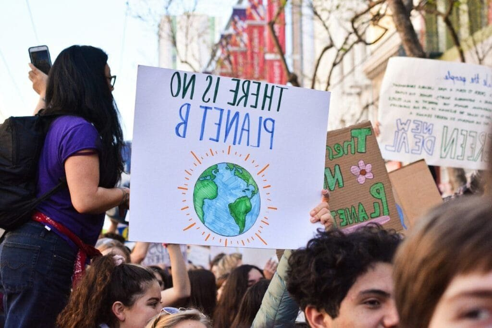

Have you ever pondered about how the fierce eruptions of volcanoes might be linked to the pressing climate crisis? This can seem like an intriguing topic, especially when you consider how the Earth’s changing surface, through volcanic activity, intertwines with the atmospheric alterations we understand as climate change. The topic holds a web of complex relations, and the bubbling curiosity around like hot lava often demands a deeper exploration.

<iframe width="560" height="315" src="https://www.youtube.com/embed/7zoycrMusK4" frameborder="0" allow="accelerometer; autoplay; encrypted-media; gyroscope; picture-in-picture" allowfullscreen></iframe>

  

## Understanding Volcanoes

### What Are Volcanoes and How Do They Work?

You might imagine a volcano as a towering, fiery mountain ready to explode at any whim. While there's some truth to this image, the inner workings of a volcano are more nuanced. They’re fascinating geological formations that act as vents for Earth's magma. Beneath them lies the Earth's mantle, composed of semi-molten rock and gases. When pressure builds up, magma rises through openings and results in an eruption, spewing out lava, ash, and gases.

### Types of Volcanoes

Volcanoes come in various shapes and sizes. Here are three primary types you might find interesting:

1. **Stratovolcanoes**: Known for their symmetrical, conical shape, these are the most explosive, like Mount St. Helens.
2. **Shield Volcanoes**: With gentle slopes formed by lava flow, they’re less explosive, like Mauna Loa in Hawaii.
3. **Cinder Cone Volcanoes**: Smaller with steep slopes, formed by particle accumulation around the vent, an example is Paricutin in Mexico.

Understanding these types is key to grasping their behavior and potential impact on the climate.

## Volcanic Eruptions and Their Immediate Impacts

### The Phenomena of Volcanic Eruptions

When a volcano erupts, the immediate outcome is spectacular but also perilous. The lava, however captivating, is just a part of the event. Ash clouds, volcanic bombs, and deadly pyroclastic flows unfold rapidly, often modifying landscapes dramatically.

### The Aftermath

The effects of eruptions aren't just local; they have a broader impact. Communities living nearby face threats not just from lava, but ash that can contaminate water, collapse roofs, and damage crops. It's a reminder of nature’s fierce power, leaving you with a sense of awe and respect, acknowledging the fragility of life along such potent natural phenomena.

## Climate Change: A Brief Overview

### What is Climate Change?

You hear about climate change all the time, but breaking it down—climate change is a long-term alteration in temperature, precipitation, and other atmospheric conditions. It can be natural, but the current accelerated form is largely attributed to human activities, chiefly the burning of fossil fuels leading to increased greenhouse gases.

### The Effects of Climate Change

The effects are profound: rising sea levels, changing weather patterns, intense storms, prolonged droughts, and more. It's an array of shifts that affect ecosystems, agriculture, and your everyday life. Understanding this context is vital when discussing natural influences like volcanoes and their potential mitigative effects.

## The Interactions Between Volcanoes and Climate

### The Cooling Effect of Volcanic Eruptions

Volcanic eruptions can paradoxically lead to global cooling. When [volcanoes emit large volumes of sulfur dioxide](https://magmamatters.com/the-art-and-science-of-volcano-monitoring/ "The Art and Science of Volcano Monitoring") (SO2) into the stratosphere, these gases transform into sulfate aerosols. These particles reflect sunlight away from the Earth, leading to temporary cooling.

#### Table 1: Historic Volcanic Eruptions and Climate Impact

| Year | Volcano | Effects on Climate |
| --- | --- | --- |
| 1815 | Mount Tambora | Caused the "Year Without a Summer" |
| 1991 | Mount Pinatubo | Dropped global temperatures by ~0.5ºC |
| Varied | Various smaller eruptions | Localized climatic effects |

### The Magnitude of Impact

However, not all eruptions have this effect. It's primarily the volcanic events that inject vast amounts of ash and gases high into the stratosphere that can cause noticeable cooling. These eruptions are rare; thus, while volcanoes can cool the planet slightly, they don’t offset long-term warming.

## Volcanic CO2 Emissions

### Contribution to Atmospheric CO2

Volcanoes also release CO2, a greenhouse gas contributing to warming. But here's where it gets interesting—on a global scale, volcanic CO2 emissions are minor compared to human-induced emissions. The geological imprints on the climate through volcanic outgassing are dwarfed by industrial activities over time.

### The Balance of CO2

To put it into perspective: annual human CO2 emissions vastly outsize the cumulative output from all volcanic eruptions. So, while they do contribute to the atmospheric carbon pool, it's not at a level that matches human activities.

## Past Climates and Natural Variations

### Geological Time Scales

Over eons, volcanic activity has played a role in shaping climate variations on Earth. In the distant past, massive volcanic eruptions have contributed to warming periods (carbon release) and cooling events (aerosol release). Understanding this geological timeline is crucial in appreciating the natural variations in climate before modern human impact.

### Learning from the Past

Studying these events helps you see the scale and impact of volcanic activity relative to today's changes. It provides a baseline to gauge the magnitude of contemporary climate change.

## The Future: Forecasting Volcanic Influence

### Volcanology and Climate Science Integration

Advances in science have enabled more accurate models and predictions about volcanic impacts on climate. By integrating data from multiple scientific fields, you gain an understanding of potential future scenarios that consider both natural volcanic activities and anthropogenic factors.

### Preparing for Future Events

While we can't prevent eruptions, knowing how to mitigate their effects is key. Improved monitoring and emergency preparations can save lives and minimize disruptions. Likewise, understanding volcanic impacts helps refine climate models, giving you, the concerned global citizen, deeper insights into managing future climate risks.

## Addressing Misconceptions

### Volcanoes as Climate Change Saviors?

A common misconception is that volcanic eruptions could undo the effects of human-induced warming. While they do have a temporary cooling effect, it's not a viable or safe solution to rely on. It's crucial to continue reducing carbon emissions and seeking sustainable solutions for enduring climate challenges.

### Balancing Natural and Human Contributions

Understanding the balance between [natural and anthropogenic contributions to climate change](https://magmamatters.com/the-environmental-impact-of-volcanic-eruptions-2/ "The Environmental Impact of Volcanic Eruptions") provides clarity. As engrossing as volcanoes are, the human footprint on the planet’s changing climate remains unprecedented, and our responsibility to address it persistently.

## Conclusion

In unwrapping the intricate relationship between [volcanoes and climate change](https://magmamatters.com/geothermal-energy-and-its-volcanic-origins/ "Geothermal Energy and Its Volcanic Origins"), you uncover a dance of natural processes and human influence. Volcanoes are formidable players on the Earth's stage, brandishing both destructive and cooling roles. Yet, their impact on the broader climate system is quite limited compared to the overwhelming effects of modern human activities. Recognizing this not only enriches your appreciation of natural phenomena but also underscores the need for concerted human effort in tackling the climate crisis. In this understanding, lies the path forward towards informed and responsible stewardship of our planet.
