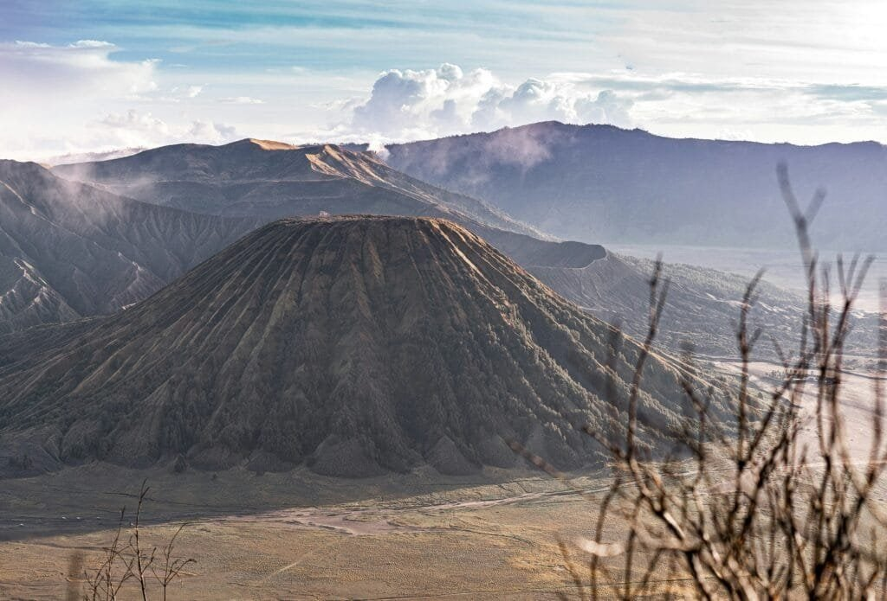

Have you ever wondered how volcanoes, those magnificent forces of nature, fit into the grand puzzle of climate change? It's a fascinating question because on the surface, they seem like two completely separate phenomena. You know that volcanoes erupt, spewing lava and ash in dramatic fashion, while climate change often feels like this slow, invisible process altering our weather patterns over decades. But when you look a little closer, you'll find that these two elements of Earth science are intricately linked in ways that are both surprising and compelling.

<iframe width="560" height="315" src="https://www.youtube.com/embed/7zoycrMusK4" frameborder="0" allow="accelerometer; autoplay; encrypted-media; gyroscope; picture-in-picture" allowfullscreen></iframe>

  

## Volcanoes: The Basics

So, let's kick things off by grounding ourselves in what a volcano really is. A volcano is essentially a rupture in the Earth's crust where molten lava, volcanic ash, and gases escape from a magma chamber below the surface. Sounds simple, right? But the impact of a volcanic eruption can range from local disruptions to significant global climate effects. There are different types of volcanoes, such as shield volcanoes, composite volcanoes, and cinder cones, each with their unique eruption styles and characteristics.

### Types of Eruptions

While we're at it, let's consider the types of volcanic eruptions, because not every eruption is explosive. Some can be rather quiet, with lava gently oozing out of the ground. However, the ones that capture the public imagination—and make headlines—are the explosive eruptions. When volcanoes erupt explosively, they can send ash and gases high into the atmosphere. This is where things begin to intersect with climate change.

## The Immediate Impact of Volcanic Eruptions

You might wonder: what happens right after a significant volcanic eruption? The immediate effects are usually quite chaotic. Local landscapes can be drastically changed, and in some cases, communities living near volcanoes may be disrupted or even suffer losses.

### Lava, Ash, and Tectonic Disruptions

Lava flows, seemingly slow-moving rivers of molten rock, can destroy everything in their path. Meanwhile, volcanic ash can blanket large areas, affecting everything from air quality to aviation safety. But beyond these immediate and visible effects, a less obvious chemical process begins to unfold high in the Earth's atmosphere.

## Volcanic Eruptions and the Atmosphere

Next, let's talk about the atmospheric fallout of volcanic eruptions. When a volcano erupts, it releases various gases, with [sulfur dioxide](https://magmamatters.com/the-art-and-science-of-volcano-monitoring/ "The Art and Science of Volcano Monitoring") (SO2) being one of the most significant in the context of climate change. Once sulfur dioxide gets into the atmosphere, it can lead to the formation of aerosols, which are tiny particles that reflect sunlight back into space.

### Aerosols and Climate Cooling

It's interesting how something as catastrophic as a volcanic eruption could potentially have a cooling effect on the Earth. These aerosols reflect sunlight, effectively reducing the amount of solar energy that reaches the Earth's surface. This can result in a temporary cooling of the Earth's climate, sometimes even leading to what are known as "volcanic winters."

Here's a bit of historical context for you: the eruption of Mount Tambora in 1815 led to what was dubbed "The Year Without a Summer" in 1816. Crop failures and food shortages were widespread, illustrating that what happens in the atmosphere doesn't just stay there; it influences the ground where we all live.

## The Long-Term Effects on Climate Change

You might think, cool, volcanoes can lower temperatures. Problem solved, right? Unfortunately, it's not that simple. The cooling effect from volcanic aerosols is usually temporary, lasting anywhere from a few months to a couple of years. This means that while volcanoes can influence the climate, they don't offer a permanent solution to the more persistent issue of global warming.

### Volcanic Carbon Dioxide Emissions

And here's the kicker: [volcanoes also emit carbon dioxide](https://magmamatters.com/geothermal-energy-and-its-volcanic-origins/ "Geothermal Energy and Its Volcanic Origins") (CO2), a well-known greenhouse gas. Though the annual amount of volcanic CO2 emissions is small compared to human activities like burning fossil fuels, it's still a part of the equation. While natural, these emissions contribute to the overall pool of greenhouse gases that are warming our planet.

## Human Activities Versus Volcanic Activities

So now you might be asking, how do volcanic emissions compare to human-generated emissions? The difference in scale is massive. Human activities pump out over 100 times more CO2 annually than all of the world's volcanoes combined. This makes it clear that while volcanic eruptions can have a temporary cooling effect, they can't compete with the long-term warming trend driven by human actions.

### Table: Human vs. Volcanic CO2 Emissions

| Source | Annual CO2 Emissions in Gigatons |
| --- | --- |
| Human Activities | ~35 |
| Volcanic Activities |  |
