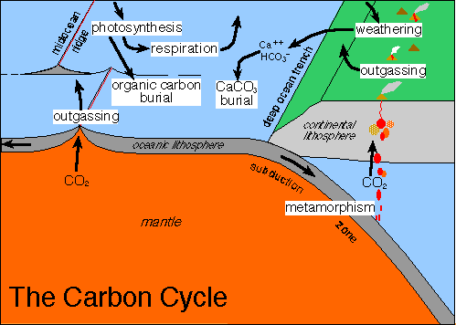
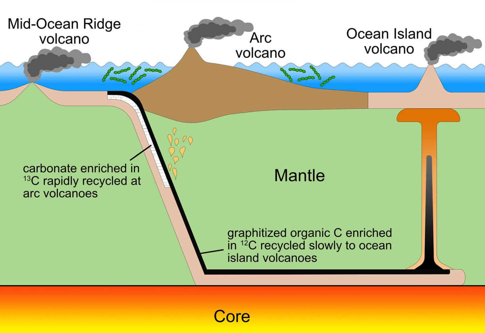
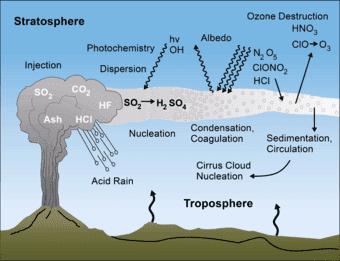
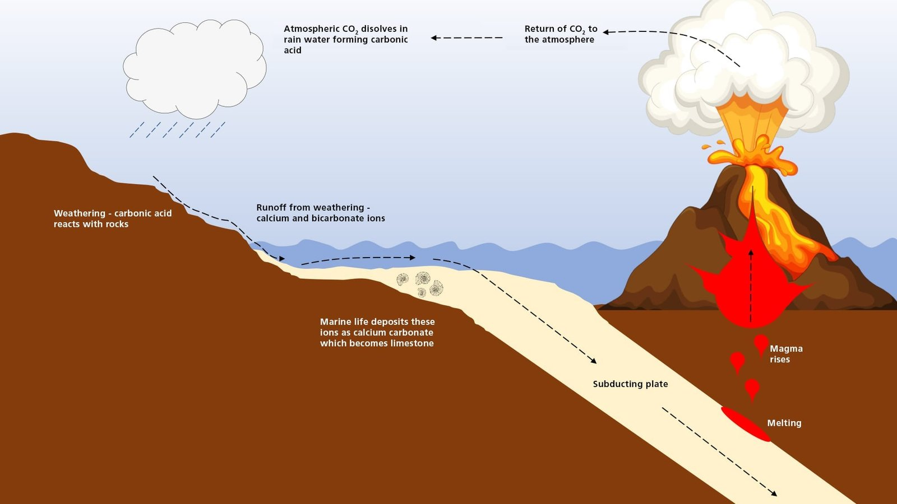

Have you ever paused to wonder about the mighty forces beneath your feet, shaping our world silently yet powerfully? Volcanoes are one of those enigmatic phenomena, magnificently tucked away in Earth's crust and playing a surprisingly pivotal role in balancing the planet's carbon cycle. Let's unravel the relationship between volcanoes and the carbon cycle to better appreciate our planet's intricate workings.

<iframe width="560" height="315" src="https://www.youtube.com/embed/twBbkPCyPG0" frameborder="0" allow="accelerometer; autoplay; encrypted-media; gyroscope; picture-in-picture" allowfullscreen></iframe>

  

## Understanding the Basics of the Earth's Carbon Cycle

Before jumping into the role of volcanoes, it's crucial to grasp the fundamental workings of Earth's carbon cycle. This cycle is essential for maintaining life, as it regulates the flow of carbon among the atmosphere, land, oceans, and the Earth's crust.

### What is the Carbon Cycle?

The carbon cycle, in simple terms, refers to the process through which carbon is exchanged between different Earth systems. It involves a series of steps that transform carbon from one form to another, enabling it to sustain life processes. The cycle is divided into two main components: the fast carbon cycle and the slow carbon cycle.

### Fast vs. Slow Carbon Cycles

The fast carbon cycle operates on a relatively short timescale, involving carbon exchanges between the atmosphere, oceans, and living organisms. Photosynthesis, respiration, and decomposition are key processes here, taking place over days to decades.

On the other hand, the slow carbon cycle unfolds over millions of years. This involves geological processes, including the weathering of rocks, sedimentation, and volcanic activity. It's these slower geological processes where volcanoes make their mark.

## Volcanoes: Mighty Giants of the Geological World

To understand how volcanoes fit into the carbon cycle, it's important to get a sense of what they are and how they function.

### What Exactly Are Volcanoes?

Volcanoes are openings in Earth's crust that allow molten rock, debris, and gases to escape from below the surface. This fiery spectacle is a direct result of tectonic activity and often signifies places where tectonic plates are either converging, diverging, or existing along faults.

### How Volcanoes Form

Volcanoes are usually found at tectonic plate boundaries, where plates either move apart or collide. When tectonic plates pull apart, magma rises to fill the gaps, often resulting in volcanic eruptions. Similarly, when plates collide, one may be pushed under another, leading to melting and magma formation, which eventually surfaces as volcanic activity.

## The Intricate Relationship Between Volcanoes and the Carbon Cycle

You might be wondering, "How do these fiery mountains interact with the carbon cycle?" The answer lies in their ability to release carbon dioxide (CO2) directly into the atmosphere, influencing climate and the carbon budget.

### Carbon Dioxide Emissions from Volcanoes

[Volcanic eruptions discharge carbon dioxide](https://magmamatters.com/geothermal-energy-and-its-volcanic-origins/ "Geothermal Energy and Its Volcanic Origins") into the atmosphere. While the amount may vary depending on the intensity and frequency of eruptions, this input is a critical component of the global carbon cycle. Over geological timescales, these emissions significantly influence the Earth's climate.

### Volcanism and Long-Term Climate Regulation

In the grand scheme of things, volcanism contributes to maintaining a balance in atmospheric carbon over millions of years. When volcanoes emit CO2, it can have a warming effect on the planet. However, these emissions are often counterbalanced by other carbon sinks, such as the ocean and vegetation, which absorb CO2, facilitating a climate equilibrium.

## The Role of Subduction Zones

Volcanoes associated with subduction zones deserve special attention due to their unique contribution to the carbon cycle. Let's explore how these features impact the global carbon budget.

### What Happens in Subduction Zones?

In these zones, one tectonic plate slides beneath another, descending into the Earth's mantle. This process is critical as it leads to the formation of volcanoes and the cycling of carbon-rich material.

### How Do Subduction Zones Affect Carbon Storage?

Subduction zones enable the burial of carbon-rich oceanic sediments into the mantle. Once in the mantle, these sediments can be partially melted and eventually surface again through volcanic eruptions, reintroducing carbon into the atmosphere. This continuous cycle plays a key role in regulating atmospheric carbon levels over millions of years.

## Volcanic Eruptions and Their Climate Impacts

Volcanoes have a formidable power to impact global climate, not just through CO2 emissions but also through other forms of volcanic activity.

### The Dual Effect of Volcanic Eruptions

Volcanic eruptions can have both warming and cooling effects on the climate. While the release of CO2 tends to have a warming influence, the massive expulsion of sulphur dioxide can lead to short-term cooling. This occurs because sulphur dioxide can form aerosols in the stratosphere, reflecting solar radiation and leading to a temporary decrease in global temperatures.

### Historic Examples of Volcanic Climate Effects

Throughout history, major volcanic eruptions have demonstrated these climate-changing phenomena. The eruption of Mount Pinatubo in 1991, for example, led to a temporary global cooling effect. Such events underscore the powerful yet intricate influence of volcanic activity on climate patterns.

## Oceanic Volcanoes and Carbon Cycling

Now, let’s shift our gaze to oceanic volcanoes, often overlooked yet significant players in the carbon cycle puzzle.

### What Are Oceanic Volcanoes?

Oceanic volcanoes, also known as submarine volcanoes, are found under the ocean surface. They are often located at mid-ocean ridges, where tectonic plates are diverging, allowing magma to rise and cool, forming new crust.

### The Role of Oceanic Volcanoes in Carbonate Formation

Underwater volcanic activity contributes to the formation of carbonate rocks, which are significant carbon sinks. As these rocks form, they lock away carbon, helping to regulate atmospheric CO2 levels over long timescales. This process highlights another way in which volcanoes are intertwined with the carbon cycle.

## Human Activity and Volcanic Influence

As we continue to explore, it’s important to understand the intersection of human activity and volcanic influences on the carbon cycle.

### Industrialization and Its Effects

Modern industry and [technology have disrupted natural](https://magmamatters.com/the-art-and-science-of-volcano-monitoring/ "The Art and Science of Volcano Monitoring") carbon cycles, significantly increasing atmospheric CO2. While volcanoes contribute CO2, their emissions are relatively minimal compared to human activities. Nevertheless, understanding their role is key in building comprehensive climate models.

### Learning from Nature's Systems

Examining volcanic influences helps us appreciate Earth's natural carbon cycle regulation. By studying geological and volcanic carbon pathways, we can gain insights into sustainable carbon management practices, ultimately aligning our actions with Earth's intrinsic systems.

## The Future of Volcanic Activity and Climate

Our journey through the fiery realm of volcanoes doesn't end here. Forecasting how volcanic activity might influence future climate conditions is both a challenge and a necessity.

### Predicting Volcanic Eruptions and Their Impact

Advancements in technology enable scientists to better predict volcanic eruptions, offering insights into their potential impacts on climate. While predicting precise eruption timelines remains complex, understanding the relation between volcanic eruptions and carbon cycling is crucial in anticipating their role in future climate scenarios.

### Adapting to Volcanic Impacts

Given the unpredictability of volcanic activity, it’s important to develop adaptation strategies. This includes recognizing the effects of potential eruptions on global temperatures and preparing for the short-term climate disruptions they might cause.

## A Global Perspective: How Different Regions are Affected

Let's take a broader look at how various regions across the globe experience the effects of volcanic carbon emissions and climate dynamics.

### Regional Differences in Volcanic Activity

Areas such as the Pacific Ring of Fire are hotspots for volcanic activity due to their tectonic setting. The proximity of populations to active volcanoes can amplify the immediate impact of eruptions and influence local climate conditions more noticeably than in inactive regions.

### Societal Implications of Volcanic Activity

Beyond atmospheric sciences, societal impacts are significant. Understanding the potential risks posed by volcanoes can aid in developing better preparedness plans, ensuring vulnerable communities can withstand both the direct and indirect effects of volcanic eruptions.

## The Interplay of Volcanoes, Extinction Events, and Carbon Cycling

Volcanic activity and its carbon impact have contributed to past extinction events, shaping Earth's biological and geological history.

### Ancient Extinction Events and Volcanism

Events like the Permian-Triassic extinction illustrate the catastrophic potential of prolonged volcanic activity. During this time, massive volcanic eruptions significantly altered atmospheric carbon levels, driving climate changes that led to widespread species extinctions.

### Lessons for Today's Climate Challenge

Studying past extinction events offers valuable lessons for current climate challenges. It underscores the importance of understanding natural carbon regulators such as volcanoes and highlights the necessity of balancing human-induced emissions in the present era.

## A Balanced View: Volcanoes as Natural Carbon Stewards

Finally, while volcanic activity can disrupt climates, it's essential to recognize their role in natural carbon stabilization.

### A Dual Role in Carbon Management

[Volcanoes exemplify nature’s inherent ability to balance carbon over geological](https://magmamatters.com/the-environmental-impact-of-volcanic-eruptions-2/ "The Environmental Impact of Volcanic Eruptions") timescales. While they release carbon into the atmosphere, they also contribute to [carbon sequestration](https://magmamatters.com/the-role-of-volcanoes-in-earths-carbon-cycle-5/ "The Role Of Volcanoes In Earth’s Carbon Cycle") through processes like sedimentation and rock formation.

### Embracing the Geological Carbon Cycle

As caretakers of the planet, leveraging the insights gained from observing volcanic processes can guide us toward more harmonious environmental management. By aligning our actions with geology's deep-time carbon cycles, we have the opportunity to foster a sustainable future.

## Conclusion

Volcanoes are, undoubtedly, a captivating feature of Earth that play a surprisingly crucial role in the planet's carbon cycle. Through their interactions with the Earth's geological framework, they help regulate carbon over long timescales, impacting climates in multifaceted ways. By understanding their role, we better our grasp of the interconnected systems that sustain life and climate balance on Earth. Whether it's deciphering the mysteries of past extinction events or predicting future climatic shifts, the study of volcanic activity provides invaluable insights into Earth's complex dynamics. And who knows? Perhaps this newfound understanding will inspire innovative solutions to the climate challenges we face today.
