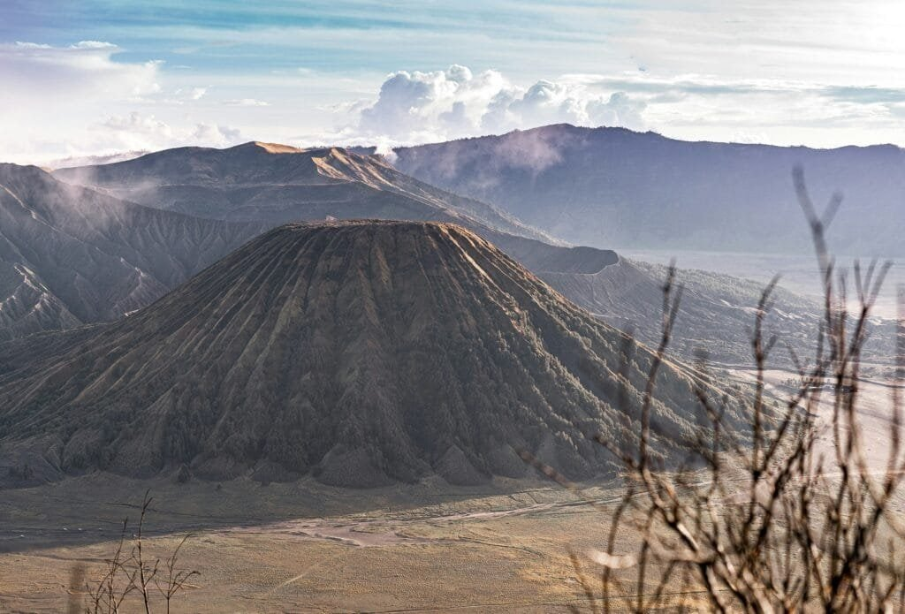

Have you ever wondered what lies beneath the surface of Hawaii’s enchanting landscape? The islands are more than just idyllic beaches and vibrant culture; they sit atop one of the most dynamic and fascinating geological formations on earth—volcanoes. Hawaii is a living museum of these awe-inspiring landforms, and understanding them offers a window into not only the planet’s fiery interior but also the story of the islands themselves.

<iframe width="560" height="315" src="https://www.youtube.com/embed/5-La04qa43o" frameborder="0" allow="accelerometer; autoplay; encrypted-media; gyroscope; picture-in-picture" allowfullscreen></iframe>

  

## The Formation of Hawaiian Volcanoes

### The Hawaiian Hotspot

At the heart of Hawaii's volcanic activity is the Hawaiian hotspot, a stationary plume of molten rock located beneath the Pacific Plate. As the plate moves northwest over this hotspot, magma rises through the crust, creating new volcanic islands. This geological process has been ongoing for millions of years, explaining why the islands form a chain.

### How Volcanic Islands Emerge

The birth of a Hawaiian island is a slow yet compelling spectacle, visible only over geological time scales. Magma escapes through cracks in the Earth's crust, building up over countless eruptions. As lava accumulates, it eventually breaks the ocean surface, forming landmasses. However, not every undersea eruption leads to the creation of an island; many never make it past the ocean's demands.

## The Types of Volcanoes in Hawaii

### Shield Volcanoes

Most of the Hawaiian Islands are formed by shield volcanoes, which are named for their broad, shield-like shape. These volcanoes are built almost entirely of fluid lava flows. Unlike their explosive counterparts, shield volcanoes produce gentle eruptions, allowing for the gradual buildup necessary to create large islands.

### The Mechanism of Flow

Lava from shield volcanoes is basaltic, which means it’s low in silica and very fluid. This fluidity allows lava to travel great distances, contributing to the expansive landforms these volcanoes create. The consistent, slow-moving nature of basaltic lava is why these volcanoes have such long, gentle slopes.

## Understanding Volcanic Activity

### Active Volcanoes and Eruption Patterns

Hawaiian volcanoes are classified as active, dormant, or extinct based on their eruption history. While extinct volcanoes have no volcanic activity, active ones are crucial for understanding ongoing geological processes. Certain volcanoes, like Kilauea and Mauna Loa, remain among the most active in the world.

### Monitoring Volcanic Activity

The US Geological Survey manages the Hawaiian Volcano Observatory (HVO), using a variety of instruments to monitor volcanic activity. These include seismographs to detect earthquakes, tiltmeters to measure the volcano’s structural deformations, and gas spectrometers that analyze emissions. This comprehensive monitoring system is essential for predicting eruptions and mitigating potential hazards.

## The Impact of Volcanoes on Hawaiian Culture and Ecology

### Cultural Significance

Volcanoes are deeply embedded in Hawaiian mythology and lore. Pele, the goddess of fire and volcanoes, plays a central role in Hawaiian tales, representing both creation and destruction. This dual nature is reflected in the way Hawaiians view the volcanoes—as both a source of life and a force to be reckoned with.

### Ecological Influences

The rich volcanic soil is a boon for Hawaii's diverse ecosystems. Volcanic ash breaks down into fertile soil, allowing a variety of plants to thrive. Rainwater interacting with volcanic rock creates unique freshwater ecosystems. However, eruptions can also devastate local flora and fauna, covering habitats with lava and ash.

## Famous Volcanic Features of Hawaii

### Kilauea Volcano

Kilauea is one of the most famous volcanoes on Earth, and it’s easy to see why. It’s one of the most active, with eruptions occurring regularly since 1983. Despite its frequent activity, Kilauea's eruptions are typically non-explosive, allowing people to view the lava flows at a relatively safe distance.

### Mauna Loa

Mauna Loa holds the title of the world's largest active volcano. Spanning a massive area, its eruptions can be more hazardous due to the larger volume of lava produced. Historical records highlight several significant eruptions that have reshaped the land and affected local communities.

### Haleakalā

Known as the "House of the Sun," Haleakalā on the island of Maui features one of the largest volcanic craters in the world. While it is currently dormant, its last eruption, occurring several centuries ago, left behind stunning landscapes that are a testament to its explosive past.

## The Science Behind Volcanic Eruptions

### Plate Tectonics

The movement of the Pacific Plate over the Hawaiian hotspot illustrates the principles of plate tectonics, a theory elucidating the movement of Earth's lithosphere. Understanding this helps explain not only volcanic activity but also earthquakes and continental drift happening globally.

### Volcanic Materials

Eruptions produce various materials, including lava, ash, and volcanic gases. The composition of these materials can influence the type of eruption and its impact. For instance, basaltic lava results in fluid lava flows, while eruptions with more viscous lava can be explosive, ejecting ash and debris.

## Risks and Safety Measures

### Volcanic Hazards

Living on a volcanic island comes with inherent risks. Lava flows can destroy property and landscapes, [volcanic ash can affect air quality and aviation, and volcanic gases such as sulfur dioxide](https://magmamatters.com/the-art-and-science-of-volcano-monitoring/ "The Art and Science of Volcano Monitoring") pose health risks. Understanding these hazards is essential for effective preparedness.

### Emergency Preparedness

Hawaiian authorities have detailed emergency protocols to safeguard residents and tourists during eruptions. These include evacuation plans and communication systems to disseminate information quickly. Community engagement and education also play crucial roles in emergency preparedness.

## Volcanism’s Role in Hawaii’s Future

### Land Formation

The creation of new land through volcanic activity is an ongoing process in Hawaii. Although it’s slow, this process will eventually lead to the formation of new islands or the enlargement of existing ones. This continual change underscores nature's balance of creation and destruction.

### Climate and Environmental Changes

Volcanoes also impact climate and environment. Large eruptions can inject aerosols into the atmosphere, potentially affecting global temperatures. Locally, volcanic activity influences weather patterns and the immediate environment by altering landscapes and forming new habitats.

## The Intrigue of Hawaii's Volcanic Future

### The Birth of Loihi

Below the ocean’s surface, the young seamount Loihi points to Hawaii's future. Currently too deep to be considered an island, it’s steadily moving upward and may eventually break the surface, adding a new chapter to Hawaii's geological narrative.

### Predicting Eruptions

Geologists are constantly refining their techniques to predict volcanic eruptions and mitigate their impact. While it remains a complex endeavor, advancements in technology and methods offer hope for more accurate predictions, further ensuring safety and preparedness.

## Conclusion

In unraveling the mysteries of Hawaii’s volcanoes, you gain more than knowledge of geological phenomena. It’s a journey through history, culture, and science, unveiling the profound connections between the land and its people. As you stand on the solidified surface of ancient lava flows or gaze into an active crater, you witness the forces that have shaped Hawaii’s past and will continue to sculpt its future. These voluminous stories of creation and destruction echo through time, an eternal reminder of the natural world's majestic complexity.
