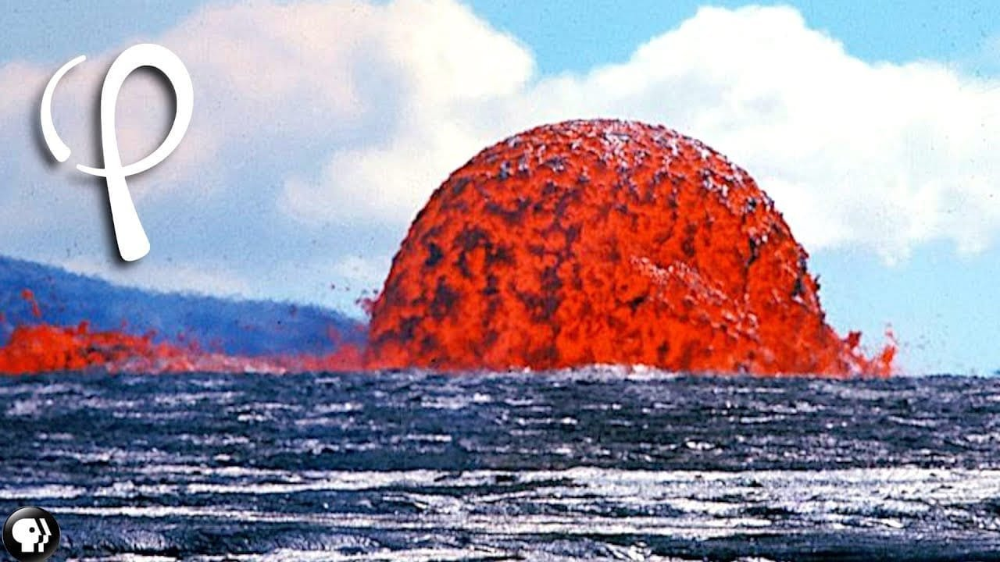
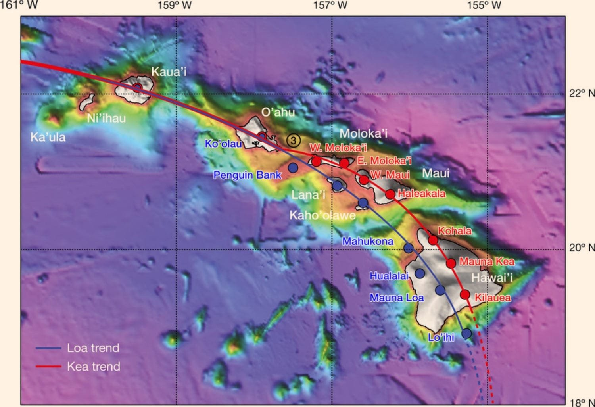
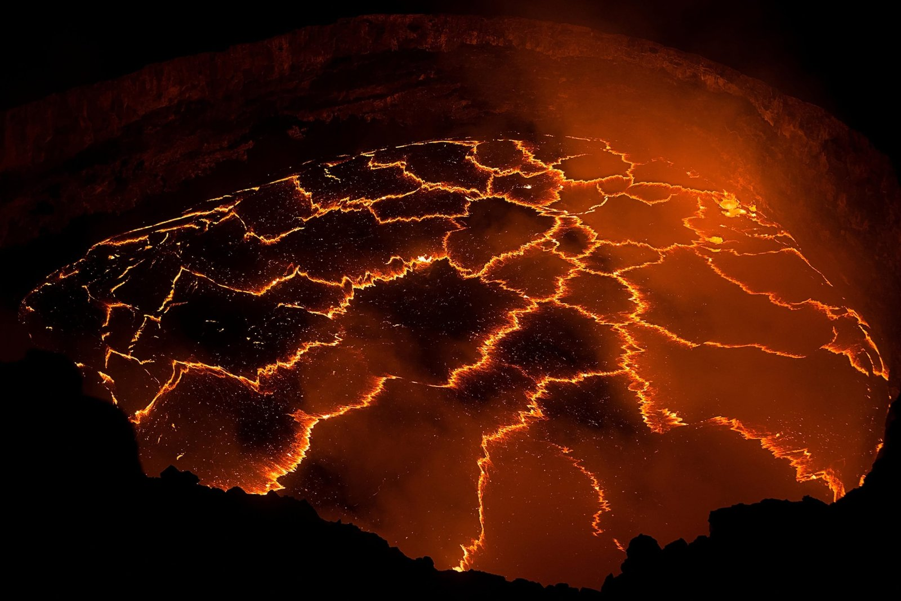
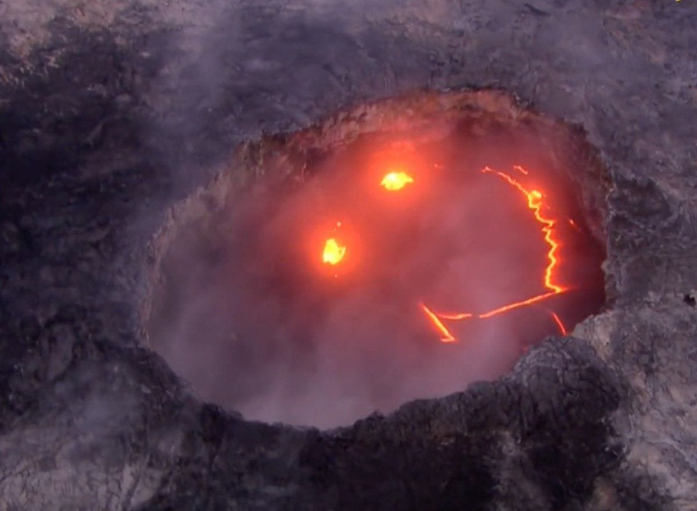

Have you ever wondered why Hawaii, a paradise of lush landscapes and pristine beaches, is also home to some of nature’s most dramatic forces—volcanoes? Hawaii's volcanoes are like nature’s open secret, yet there are layers of complexities to decipher when understanding how they shape the islands and impact life.

<iframe width="560" height="315" src="https://www.youtube.com/embed/5-La04qa43o" frameborder="0" allow="accelerometer; autoplay; encrypted-media; gyroscope; picture-in-picture" allowfullscreen></iframe>

  

## The Allure of Hawaii's Volcanoes

Before diving into the intricacies, let's set the stage by understanding why Hawaii’s volcanoes are such a captivating subject. These volcanic formations aren't just geological curiosities; they are pivotal to Hawaii’s existence and its unique ecosystems. They’re formidable, unpredictable, and incredible displays of Earth’s raw power.

### Why Volcanoes Matter in Hawaii

Volcanoes are fundamental to Hawaii’s identity. They have sculpted the islands' landscape, created fertile ground for diverse ecosystems, and maintained the ecological balance. But the role of volcanoes in Hawaiian culture is equally significant, often intertwined with myths and spiritual beliefs. The volcanoes are more than just physical structures; they have personalities and stories that make them integral to the Hawaiian ethos.

## The Dynamics of Volcanic Formation

The essence of Hawaii’s volcanoes lies beneath the Pacific Ocean. They didn’t just pop up overnight but emerged from a fascinating process called hotspot volcanism. Let’s uncover what that means.

### The Hotspot Theory

Hotspots are like conveyor belts for creating volcanic islands. Unlike most volcanoes forming at tectonic plate boundaries, Hawaiian volcanoes emerge from a stationary hotspot under the moving Pacific Plate. As the plate drifts, the hotspot melts the crust, leading to successive volcanic eruptions that build up new islands.

This process is ongoing, with new islands forming in the future as the Pacific Plate continues its slow journey over the hotspot. Sounds intriguing, right? Understanding this mechanism is crucial because it explains why the islands stretch in a chain across the ocean, each island representing an older volcanic formation than the one directly over the hotspot.

### A Closer Look at Shield Volcanoes

Hawaii’s landscape is primarily shaped by shield volcanoes—these are not your classic, steep-sided volcanoes. Instead, they gently slope, resembling a warrior’s shield laid down flat. They erupt fluid lava that travels great distances, shaping the island’s broad, sloping topography. Mauna Loa and Kīlauea are classic examples, both visible on the Big Island and among the most active in the world.

## Legendary Volcanic Eruptions

Volcanic eruptions can be both beautiful and terrifying. Their influence on Hawaii’s landscape and society is immense, and understanding historical eruptions provides insight into why these natural events hold such significance.

### The Kīlauea Eruptions

Kīlauea is one of the most continuously active volcanoes on Earth. Its eruptions have fascinated scientists and residents alike. Imagine living in a place where molten rock flows could become part of your reality at any moment! One extraordinary eruption occurred in 2018, dramatically altering the landscape and displacing many residents. Despite its destructive potential, Kīlauea’s activity is also vital for scientific research, offering clues about volcanic behaviors and forecasting techniques.

### Mauna Loa's Might

Mauna Loa is not just one of the most massive volcanoes in Hawaii; it’s one of the largest on Earth. Its eruptions tend to be fewer and less explosive than Kīlauea's, but the volume of lava it produces is staggering. Mauna Loa last erupted in 1984, and while its slumber brings a reprieve, it’s always under watch because of its potential impact.

## The Role of Volcanoes in Hawaiian Culture

In Hawaii, volcanoes aren’t simply geological features; they are part of a richly woven cultural tapestry. They embody divine and ancestral spirits, playing significant roles in Hawaiian lore and beliefs.

### Pele: The Hawaiian Volcano Goddess

Hawaiian mythology attributes volcanic eruptions to Pele, the goddess of fire and volcanoes. Her presence is felt across the islands, particularly on the Big Island, where Kīlauea is often described as her home. Stories of Pele are recounted through generations, explaining [natural phenomena](https://magmamatters.com/the-art-and-science-of-volcano-monitoring/ "The Art and Science of Volcano Monitoring") and providing moral lessons. Pele isn’t just a myth; for many Hawaiians, she represents the living force of the volcanoes.

### Cultural Practices and Volcanoes

Beyond Pele, volcanoes feature in various cultural practices and rituals. They hold sacred space in the indigenous Hawaiian worldview, where respecting and appeasing the volcanoes is crucial. Traditional ceremonies and offerings are ways Hawaiians have maintained harmony with these formidable elements of nature, seeking balance and prosperity while acknowledging their immense power.

## Environmental Impact of Volcanic Activity

Volcanoes are both creators and destroyers, shaping ecosystems and altering habitats. The environmental implications of volcanic activities in Hawaii are profound and multifaceted.

### Fertility of Volcanic Soil

Volcanic soil is incredibly fertile, nurturing diverse plant life that sustains the islands' unique ecosystems. After lava cools and breaks down, it enriches the soil with minerals, making it exceptionally productive for agriculture. This has been pivotal for cultivating traditional crops such as taro and sweet potatoes, which are integral to Hawaiian cuisine and culture.

### Impact on Flora and Fauna

The biodiversity in Hawaii owes much to volcanic activity. Lava flows can initially devastate ecosystems but eventually lead to succession and regeneration. Rare and unique species have adapted to these environments, creating ecosystems found nowhere else on Earth.

However, this makes them vulnerable to change. As lava flows destroy habitats, species must adapt or face extinction, influenced by both natural events and human activities.

## Modern-Day Monitoring and Precautionary Measures

Given their momentum, volcanic eruptions necessitate robust monitoring and preparedness strategies. Scientists and citizens alike keep a close watch on these colossal forces of nature to protect communities and the environment.

### Advanced Volcanic Monitoring Techniques

Today’s volcanic monitoring is a blend of traditional observation and cutting-edge technology. Seismographs, GPS instruments, and satellite imagery are crucial tools for tracking changes in activity and predicting potential eruptions. For example, by measuring ground deformation, experts can infer when magma is moving beneath a volcano—a key indicator of impending eruptions.

### Community Preparedness

For communities near active volcanoes, preparedness is vital. Education about evacuation routes and strategies is regularly updated. Drills ensure people know what to do when an eruption is imminent. The goal is to minimize harm and maintain resilience in the face of nature’s unpredictability. A constant dialogue between scientists, authorities, and residents fosters awareness and empowers community-based safety measures.

## Challenges and Future Outlook

Understanding and living with volcanoes comes with its set of challenges—scientific, environmental, and socio-cultural. How we navigate these issues can shape the future of Hawaii and its volcanic landscapes.

### Balancing Development and Conservation

As Hawaii grows both in population and as a tourist destination, balancing development with the conservation of its volcanic landscapes is an evolving challenge. Protecting these areas involves understanding not just the immediate risks of volcanic activity but also long-term impacts on the environment and communities. Sustainable land use planning and environmental stewardship become crucial in ensuring harmony between human activities and the natural world.

### Climate Change and Volcanic Activity

While the direct impact of [climate change on volcanic](https://magmamatters.com/geothermal-energy-and-its-volcanic-origins/ "Geothermal Energy and Its Volcanic Origins") activity is a subject of ongoing research, its broader implications are undeniable. Changes in rainfall patterns, temperature, and sea levels could influence volcanic landscapes and ecosystems. These shifts necessitate adaptive strategies to safeguard against new risks and ensure that Hawaii’s unique geology and biodiversity are preserved for future generations.

## Wrapping it all Together

Hawaii’s volcanoes continue to captivate our imaginations and scientific curiosity. They are windows into the Earth’s powerful processes and play an essential role in the cultural, environmental, and social fabric of Hawaii. By demystifying how these volcanic forces work, you gain not only an appreciation for their beauty and might but also an understanding of their critical importance to the planet.

The mysteries of Hawaii’s volcanoes might always hold some secrets, but each exploration brings us closer to comprehending them more fully. With ongoing research, cultural respect, and innovative technology, our ability to engage with these profound natural phenomena remains as vibrant as ever. They remind us of the dynamic interplay between earth, fire, and life—a dance that has shaped our world for eons and continues to do so today.

