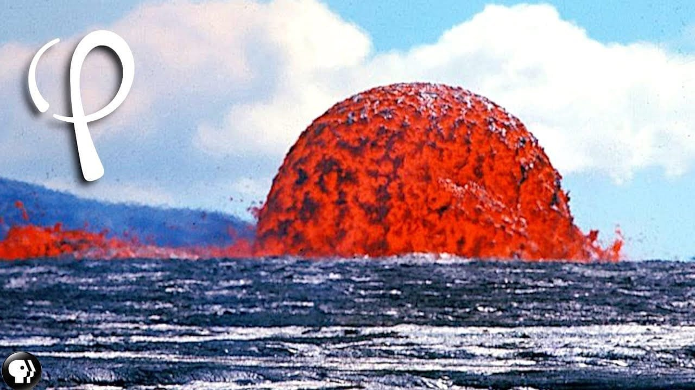
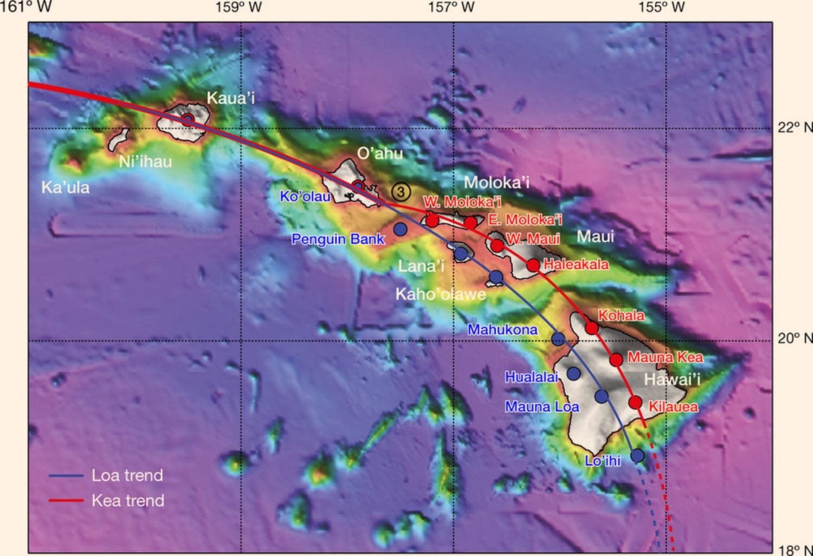
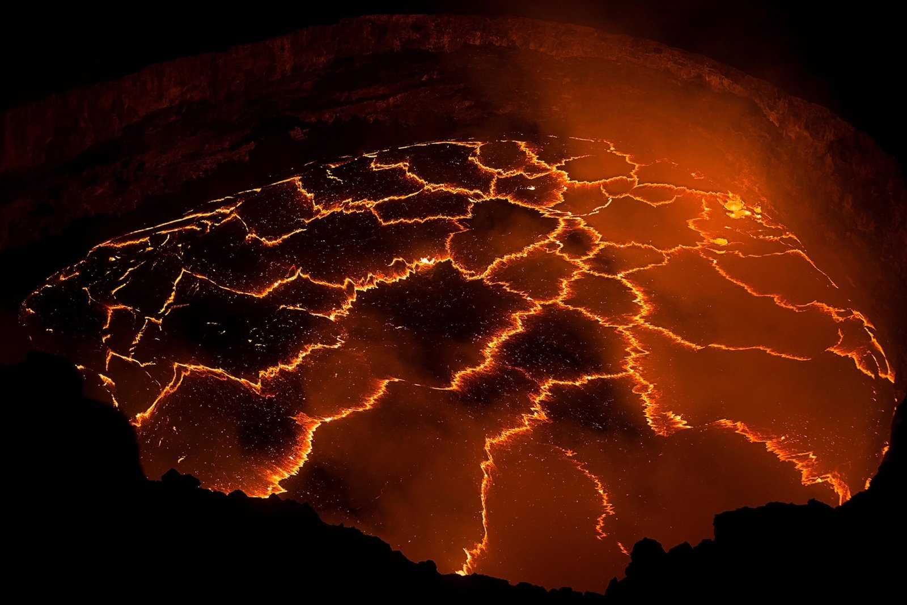
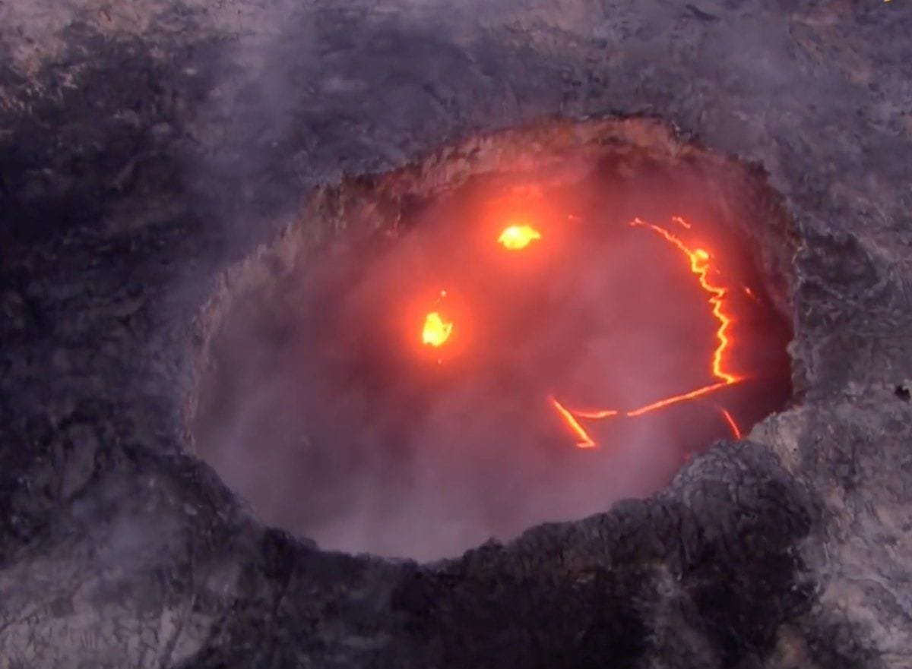

Have you ever found yourself curious about the fiery giants that form the backbone of Hawaii's stunning landscapes? Those fascinating volcanoes have been shaping the islands for millions of years, creating a landscape that feels both otherworldly and intimately connected to the powerful forces of nature. In this exploration, we'll unravel the mysteries of Hawaii's volcanoes, revealing the science, mythology, and intriguing stories that are woven into this dramatic geological tapestry.

<iframe width="560" height="315" src="https://www.youtube.com/embed/5-La04qa43o" frameborder="0" allow="accelerometer; autoplay; encrypted-media; gyroscope; picture-in-picture" allowfullscreen></iframe>

  

## The Basics of Hawaiian Volcanoes

When you think about Hawaii, the first images that likely come to mind are the beautiful sandy beaches, the vibrant culture, and yes, those astonishing volcanoes. But what exactly makes Hawaii's volcanoes so special?

### Understanding the Volcano Types

Hawaii is home to a particular [type of volcano known as a shield](https://magmamatters.com/understanding-volcanic-formation-a-comprehensive-guide/ "Understanding Volcanic Formation: A Comprehensive Guide") volcano. Unlike the more conical, explosive stratovolcanoes you might see elsewhere, shield volcanoes have gentle, broad slopes formed by the flow of highly fluid lava. This low viscosity allows the lava to travel great distances, creating the characteristic shield-like shape.

- **Example of Shield Volcanoes in Hawaii:**
    
    | Volcano Name | Key Features | Location |
    | --- | --- | --- |
    | Mauna Loa | Largest volcano; covers half of the Big Island | Big Island |
    | Kilauea | Most active; continuous eruptions since 1983 | Big Island |
    

### The Role of Plate Tectonics

You probably know that Hawaii is located far from any tectonic plate boundary, unlike most other volcanic activity locations. So what's the deal? The Hawaiian Islands are actually situated above a hot spot—an area where magma from deep within the Earth's mantle rises to the surface. As the Pacific Plate moves over this hot spot, the magma breaks through to form the islands.

Think of it as a conveyor belt, where new islands form as the plate shifts over time. Each island that makes up Hawaii was once directly above the hot spot and has since moved northwest, creating a fascinating trail of volcanic activity.

### Unusual Lava Compositions

Unlike some parts of the world where lava is full of silica and prone to explosive eruptions, Hawaiian lava is primarily basaltic. This means it's on the runnier side of the lava spectrum, allowing it to spread out over vast distances. The fluid nature of basaltic lava is part of what defines the graceful slopes of shield volcanoes.

So, when you stand before a Hawaiian volcano, you're looking at something both enormous and fundamentally composed of one of the most mesmerizing substances found on Earth!

## Geological Features and Wonders

As you explore Hawaii's volcanoes, it's impossible not to be awestruck by their sheer size and the geological wonders they harbor. But what exactly should you be looking out for when you set your sights on these geological giants?

### Craters and Calderas

One of the most incredible features you might encounter is a crater or a caldera. These circular depressions are formed after volcanic eruptions when the magma chamber empties and the ground above collapses.

- **Famous Craters in Hawaii:**
    
    - **Halemaʻumaʻu Crater:** Located within the caldera of Kilauea, this active crater has been a focal point for eruptions and ongoing volcanic activity.
    - **Pu‘u ʻŌʻō:** A cinder and spatter cone located on the eastern rift zone of Kilauea, known for its extensive lava flows.

### Lava Tubes

Have you heard about lava tubes before? These are fascinating tunnels formed by flowing lava that demarcate an empty pipeline once the lava has ceased. Think of them like nature's underground highways, often left behind to be explored later as wondrous geological structures.

- **Notable Lava Tubes:**
    
    - **Thurston Lava Tube:** Nestled within the lush rainforest of Hawaii Volcanoes National Park, it provides a glimpse of the power and beauty of volcanic activity.

### Black Sand Beaches and Lava Flows

The coasts of Hawaii sometimes flaunt gorgeous black sand beaches, a direct outcome of volcanic activity. When molten lava flows into the ocean, it shatters and cools rapidly forming the black sands you see. It's one of nature's most dramatic transformations, creating landscapes that are nothing short of breathtaking.

## The Legends and Myths Surrounding Hawaii's Volcanoes

It's difficult to separate the scientific curiosity of these giants from the stories and myths that surround them. Hawaii's volcanoes are not just a natural phenomenon; they're deeply rooted in Hawaiian culture and mythology, offering a lens into ancient beliefs and stories passed down through generations.

### Pelé, The Goddess of Volcanoes

One cannot speak of Hawaii's volcanoes without mentioning Pelé, the Hawaiian goddess of volcanoes and fire. According to legend, Pelé resides within the Halemaʻumaʻu Crater on Kilauea. Known for her fiery temper and passion, she is believed to control the volcanic activity on the islands.

The locals often share stories of Pelé appearing as a beautiful young woman or an elderly lady. She's said to be responsible for the lava flows and eruptions, embodying the fiery and unpredictable nature of the volcanoes themselves.

### Cultural Significance in Hawaiian Tradition

In Hawaiian culture, the volcanoes are more than just natural wonders; they're considered sacred. The eruptions and flows are seen as manifestations of the gods' presence, and respecting these areas is a vital part of Hawaiian tradition.

Cultural practices such as offerings to Pelé and storytelling around the campfire about her exploits help to keep the traditions alive and deepen the bond between the people and their land.

## The Science of Volcanic Eruptions

Understanding the science behind volcanic eruptions might seem like a daunting task at first, but breaking it down allows you to see the beauty of these natural events. So, what exactly happens beneath the surface when a volcano erupts?

### Magma Chambers and Pressure

Beneath a volcano, there exists a magma chamber—a reservoir of molten rock stored under immense pressure. Over time, gases in the magma increase pressure within the chamber. When the pressure becomes too great for the surrounding rock to contain, the magma seeks an escape route to the surface.

This pressure buildup is a fascinating interplay of forces deep within the earth, often leading to eruptions that shape landscapes in ways that have captivated human imagination for centuries.

### Types of Eruptions

Hawaii's volcanic eruptions are generally effusive, resulting in non-explosive, flowing lava. However, there's some variety in eruption types you might be interested in:

- **Effusive Eruptions:** These are common in Hawaii and involve the relatively gentle outpouring of lava.
    
- **Explosive Eruptions:** While not typical in Hawaii, there can be more violent eruptions driven by the rapid expansion of [volcanic gases](https://magmamatters.com/the-art-and-science-of-volcano-monitoring/ "The Art and Science of Volcano Monitoring").
    

Understanding these types helps us anticipate the potential impacts of eruptions and prepare accordingly, providing insight into one of the most dynamic aspects of our planet.

### Monitoring and Predicting Eruptions

With advances in technology, scientists can now predict volcanic eruptions with much greater accuracy than ever before. Seismic monitoring, aerial surveys, and satellite imagery all play crucial roles in assessing volcanic activity and potential risks.

In Hawaii, the United States Geological Survey (USGS) employs various techniques to monitor the active volcanoes, keeping residents informed and prepared, thereby weaving a safety net around the volcanic activity.

## Exploring the Active Volcanoes

For many visitors and locals alike, exploring Hawaii's active volcanoes is a once-in-a-lifetime experience. The sense of proximity to the raw elements of nature inspires awe and respect in equal measure.

### Kilauea: The Most Active

Kilauea is one of the world's most active volcanoes, with almost continuous activity since 1983. Its frequent eruptions are generally slow-moving, posing little to no threat to surrounding communities, but offering some of the most spectacular lava flows you'll likely see.

### Mauna Loa: The Behemoth

Mauna Loa is not only the world's largest active volcano but also features the highest volume of any volcano on Earth. While not erupting continuously like Kilauea, Mauna Loa's potential for explosive activity garners close monitoring.

### Visiting Hawaii Volcanoes National Park

For the curious explorer, Hawaii Volcanoes National Park is the place to be. The park offers hiking trails, scenic drives, and educational programs designed to immerse visitors in the incredible volcanic landscapes and the stories they hold.

Whether you're catching a glimpse of glowing lava flows or walking through ancient lava tubes, the park gives you a firsthand look at the marvels of volcanic formation.

### Safety Advisory

Before embarking on your adventure, do remember that volcanoes are unpredictable. It's important to stay informed about current conditions and adhere to all safety guidelines provided by park officials and the USGS.

## The Impact of Volcanoes on Local Life and Environment

Volcanoes are not just geological wonders; they have a profound impact on the local environment and life in Hawaii. Understanding how these fiery mountains affect everyday life can open your eyes to their dynamic role in the ecosystem.

### Soil Enrichment and Agriculture

Volcanic activity enriches the soil with minerals, leading to fertile lands that are ideal for agriculture. This enrichment is one reason why Hawaii is able to grow such diverse and nutritious crops, from macadamia nuts to coffee.

### Challenges and Adaptation

Living near active volcanoes isn't without its challenges—volcanic smog, or 'vog,' a byproduct of eruptions, can impact air quality, affecting both residents and the environment. However, adaptations and mitigation strategies, such as improved air monitoring and health advisories, help manage these challenges.

### The Resilience of Local Communities

Hawaiians have lived alongside these dynamic forces for centuries, developing a deep respect for nature's power and learning to adapt to the ever-changing landscape. Their resilience is a testament to human ingenuity and the enduring connection between people and their land.

## Future of Hawaii's Volcanoes

What does the future hold for Hawaii's volcanoes? As the Pacific Plate continues its march northwest, you might wonder about the timeline and implications for these dynamic constructs.

### Evolution of the Islands

Over millions of years, as the Pacific Plate moves, new islands will eventually form over the hot spot while existing islands slowly erode away. This cycle of creation and destruction is a reminder of nature's incredible ability to reshape the Earth's surface.

### Scientific Research and Opportunities

The unique nature of Hawaiian volcanoes makes them a rich ground for scientific research. Ongoing studies contribute to our understanding of volcanic activity while offering insights into geologic processes occurring on other planets, such as Mars.

As our technology and methods continue to advance, the mysteries of these volcanoes may slowly unravel, offering glimpses into the deep and dynamic inner workings of our planet.

## In Closing

The volcanoes of Hawaii are more than a natural phenomenon; they're vibrant symbols of creation and destruction, steeped in cultural significance and scientific wonder. As you untangle the mysteries of these fiery giants, you connect with an Earth story that's both ancient and current, a reminder of the wondrous complexities of our planet.

Remember, amid the awe and understanding, respect for these powerful wonders remains crucial. Whether you walk the trails of Hawaii Volcanoes National Park, admire a black sand beach, or feel the rumble of a distant eruption, you're engaging with a part of nature's grand narrative, one that will continue long into the future.

