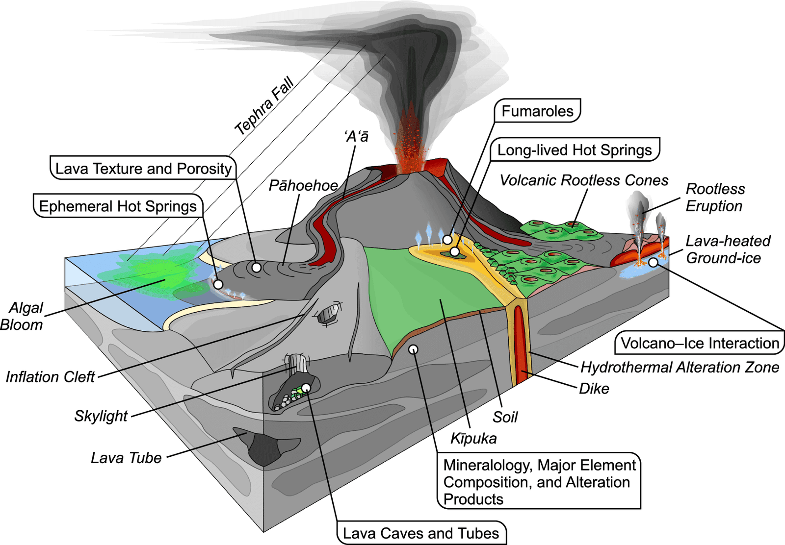
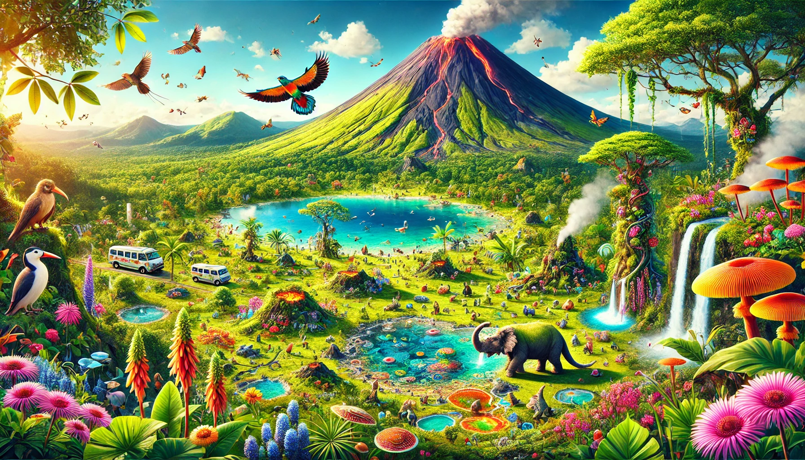
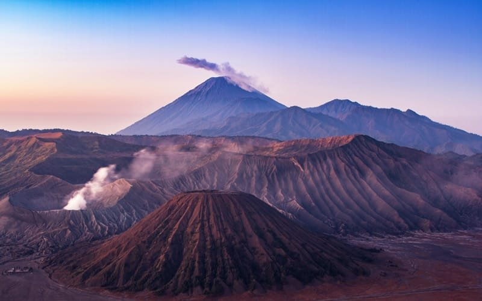

Have you ever wondered how volcanic eruptions, often seen as destructive forces, contribute to the rich tapestry of life found on our planet? It's fascinating to think that amidst the chaos and destruction, life often finds a way to thrive and diversify. Volcanic activity, with its fiery displays, not only reshapes landscapes but also plays a critical role in Earth's biodiversity.

<iframe width="560" height="315" src="https://www.youtube.com/embed/0SK-jYdEgfE" frameborder="0" allow="accelerometer; autoplay; encrypted-media; gyroscope; picture-in-picture" allowfullscreen></iframe>

  

## Discovering the Connection Between Volcanoes and Biodiversity

Understanding the link between volcanic eruptions and biodiversity might seem like a stretch. Still, when you delve into the processes occurring in and around these natural phenomena, the connections become strikingly clear. Volcanoes aren't just about spewing lava and ash; they’re dynamic systems that contribute significantly to the Earth's ecological balance.

### Volcanic Eruptions: More Than Just Lava

When you think of a volcanic eruption, your mind probably jumps straight to images of red-hot lava flowing down the slopes of a towering mountain. While this is certainly part of the picture, eruptions also involve the release of gases, ash, and other particles into the atmosphere. Each of these components has wide-ranging effects on the environment, influencing everything from the climate to soil fertility.

### How Lava Flows and Ash Contribute to Biodiversity

It might be hard to imagine at first, but lava flows and ash deposits can actually foster new growth. The initial impact might be devastating, wiping out existing vegetation and animal life. However, as the volcanic material breaks down over time, it enriches the soil with minerals that are essential for plant growth. This new, mineral-rich soil provides a fertile foundation for a diverse array of plant species to establish themselves.

### A Story of Renewal and Adaptation

Volcanoes have a unique way of resetting ecosystems, creating a blank slate where life can begin anew. In the aftermath of an eruption, pioneering species make their first appearance. These initial settlers are often plants capable of colonizing the barren volcanic soil, followed by insects and other small animals.

## The Role of Volcanoes in Shaping Ecosystems

Volcanic landscapes are often home to some of the Earth's most unique ecosystems. The distinctive flora and fauna found in these regions add to the planet's biodiversity, offering a glimpse into the adaptability and resilience of life.

### Islands of Biodiversity: The Galapagos Example

Perhaps the most famous example of volcanic activity contributing to biodiversity is the Galapagos Islands. These islands were formed entirely by volcanic activity, creating a unique environment where life has evolved in isolation. The isolation has allowed for the development of species that are found nowhere else on Earth, contributing significantly to global biodiversity.

### Unique Habitats and Endemic Species

Volcanic areas often support habitats and species that are perfectly adapted to withstand extreme conditions. The intense heat, acidic soils, and dynamic landscapes might deter most life forms, but those that have adapted to these conditions often thrive.

## The Long-Term Effects of Volcanic Eruptions on Climate and Biodiversity

The impact of volcanic activity extends beyond immediate geological changes. It can also influence global climate patterns, with knock-on effects for biodiversity.

### How Volcanic Gases Impact Climate

When volcanoes erupt, they release gases such as [sulfur dioxide](https://magmamatters.com/the-art-and-science-of-volcano-monitoring/ "The Art and Science of Volcano Monitoring") into the atmosphere. These gases can form aerosols that reflect sunlight, causing short-term cooling. In contrast to this cooling effect, the release of [carbon dioxide](https://magmamatters.com/geothermal-energy-and-its-volcanic-origins/ "Geothermal Energy and Its Volcanic Origins") contributes to long-term warming trends. Both effects can significantly alter habitats and influence which species are able to survive and thrive.

### Climate Change and Its Effects on Ecosystems

What happens when a volcanic eruption alters the climate? Changes in temperature and precipitation patterns can have profound effects on ecosystems, forcing species to adapt, migrate, or face extinction. This natural cycle of destruction and renewal continues to shape the diversity of life on our planet.

## The Role of Volcanic Hotspots in Generating Biodiversity

Volcanic hotspots are areas where magma plumes rise to the surface, creating new land and ecosystems in the process. These hotspots play a crucial part in pinpointing regions of high biodiversity.

### The Hawaiian Islands: A Case Study

Similar to the Galapagos, the Hawaiian Islands were formed by a volcanic hotspot. Their isolation and the variety of environments provided by the volcanic landscape have fostered the evolution of countless unique species. Each island offers a distinct ecosystem, contributing to both local and global biodiversity.

### Volcanic Soil Regeneration: A Key Driver

Volcanic soils tend to be rich in nutrients, which, over time, deplete as they are used by plants and leach into the environment. The continual renewal of these soils through ongoing volcanic activity ensures that ecosystems remain lush and productive, supporting diverse plant and animal communities.

## Understanding the Dual Nature of Volcanoes: Destruction and Creation

Volcanic eruptions present a dual nature, simultaneously destructive and creative. This concept might be paradoxical, yet it’s key to understanding the pivotal role that volcanoes play in fostering biodiversity.

### The Immediate Aftermath: Destruction

Initially, the violence of an eruption can decimate landscapes, eradicating habitats and the species they support. Yet, this destruction is accompanied by the fertile conditions created by ash and lava deposits, setting the stage for new ecological succession.

### Ecological Succession and Biodiversity Boost

As ecosystems recover from volcanic disturbances, they undergo a process known as ecological succession. In this process, species gradually colonize and transform the volcanic landscape, leading to increased complexity and biodiversity over time. This dynamic regeneration underscores the resilience and adaptability of life on Earth.

## Mysterious Microhabitats and Hidden Biodiversity in Volcanic Regions

Beyond the well-known examples of large volcanic islands and regions, there are more subtle ecological impacts of volcanic activity. Microhabitats formed by geothermal features such as hot springs and fumaroles provide niches for unique organisms.

### Geothermal Microhabitats: A Study of Extremophiles

In regions with active geothermal features, life often thrives in unlikely circumstances. These microhabitats are home to extremophiles—organisms that love extreme conditions—offering insights into life's adaptability and contributing to our understanding of biodiversity.

### Uncovering the Secrets of Hidden Ecosystems

These geothermal environments often harbor microbial life forms that play essential roles in nutrient cycles, which are crucial for broader ecosystems. The biodiversity found in these hidden ecosystems speaks to the intricacy and interconnectivity of life on Earth.

## Conclusion: Appreciating the Volcanic Forces Shaping Life on Earth

Volcanic activity, with all its might and ferocity, does much more than sculpt the Earth; it lays the groundwork for biodiversity and evolution. By understanding the profound impacts of volcanoes, both direct and indirect, you can appreciate the intricate balance of destruction and creation that sustains life. From nurturing unique species to impacting global climates, volcanoes are foundational in the grand scheme of Earth's biodiversity.

Ultimately, by recognizing the vital roles that volcanoes play, you gain insight into the dynamic processes that have shaped our planet and the diverse tapestry of life it supports. Could the very forces that seem most destructive also be among the greatest architects of biodiversity on Earth? It’s a thought worth pondering as you consider the extraordinary resilience and inventiveness of life in volcanic landscapes.
