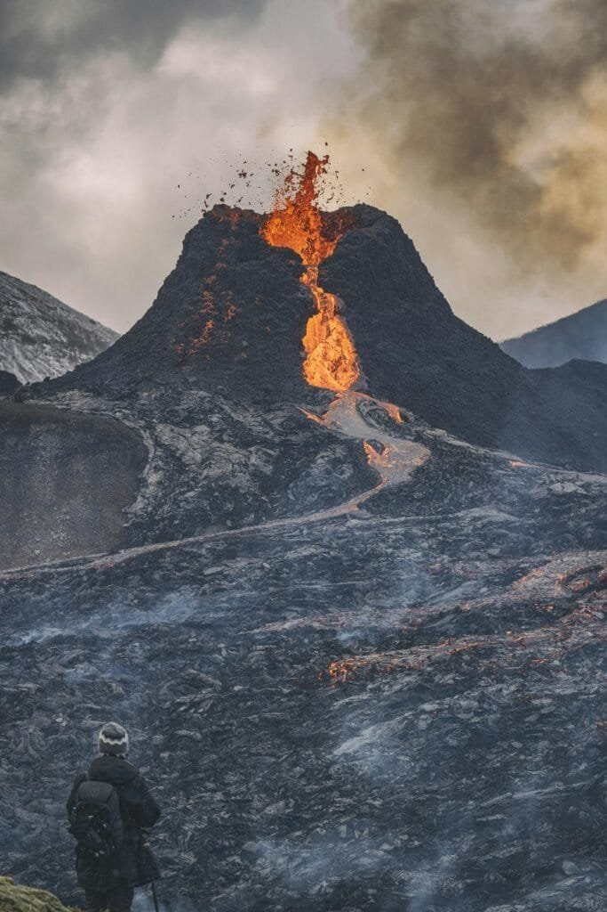

Have you ever wondered how something as seemingly innocuous as a speck of ash could have significant effects on your health? Volcanic ash, a natural phenomenon that commands both our awe and trepidation, possesses these latent powers. Rising from the depths of the Earth, it can ascend into the sky and travel miles, transforming from an awe-inspiring sight into a potential health hazard.

<iframe width="560" height="315" src="https://www.youtube.com/embed/VGEDVMjoKIk" frameborder="0" allow="accelerometer; autoplay; encrypted-media; gyroscope; picture-in-picture" allowfullscreen></iframe>

  

## The Nature of Volcanic Ash

Volcanic ash may sound like the residue left over from a cozy campfire, but it's far from that. Essentially, volcanic ash consists of tiny jagged fragments of pulverized rock, minerals, and volcanic glass, created during volcanic eruptions. The particles are less than 2mm in diameter, which is critical as this small size makes them easy to be carried long distances by the wind.

### How Volcanic Ash is Formed

Understanding how volcanic ash is formed brings us a step closer to appreciating its complexities. When a volcano erupts, the force can shatter rock and glass into fine particles that ascend into the atmosphere. This occurs alongside the release of various volcanic gases like water vapor, [carbon dioxide](https://magmamatters.com/geothermal-energy-and-its-volcanic-origins/ "Geothermal Energy and Its Volcanic Origins"), and sulfur dioxide. The high pressure and heat involved in an eruption play pivotal roles in ash formation.

### Composition

The composition of volcanic ash can vary depending on factors such as the [type of volcano](https://magmamatters.com/understanding-volcanic-formation-a-comprehensive-guide/ "Understanding Volcanic Formation: A Comprehensive Guide") and the specific magma involved. Common components include silicon dioxide, aluminum oxide, iron oxide, calcium oxide, and magnesium oxide. These elements contribute to its abrasive nature, impacting both the environment and anything caught in its path.

## How Volcanic Ash Impacts Air Quality

Air quality disturbances caused by volcanic ash often mirror those created by dust storms, albeit with a more complex chemical makeup. When a volcano erupts, its ash cloud can reach heights where it not only affects local air quality but can spread out over vast distances.

### Dispersal and Settlement

Think of volcanic ash much like pollen carried by the wind. The ash travels high into the atmosphere and is then carried by wind currents over potentially tens of thousands of kilometers. Depending on prevailing winds, weather patterns, and other atmospheric conditions, it can settle far from its point of origin, affecting regions that otherwise would not witness the violent eruption firsthand.

### Impact on Atmosphere

The particles suspended in the atmosphere can cause reduced visibility and contribute to the scattering of sunlight, leading to temporary cooling of the area or even globally if the eruption is large enough. This change may not be something you notice immediately, but it hints at how interconnected our planet's systems truly are.

## The Health Implications of Volcanic Ash

Right, so volcanic ash's journey from the Earth's belly to your backyard can have various health implications. While the spectacle of an eruption might seem distant or irrelevant, understanding the associated risks is crucial for preparedness.

### Respiratory Issues

The microscopic particles in volcanic ash can penetrate deep into your respiratory tract, potentially leading to several respiratory ailments. Inhaling ash may cause acute symptoms like wheezing, coughing, and throat irritation, and long-term exposure can exacerbate chronic conditions such as asthma or bronchitis.

#### Table: Respiratory Conditions Caused by Ash Inhalation

| Condition | Symptoms | Long-term Effects |
| --- | --- | --- |
| Asthma | Wheezing, coughing, shortness of breath | Chronic inflammation of airways |
| Bronchitis | Persistent cough, mucus production | Increased risk of lung infections |
| Silicosis | Cough, fatigue, chest tightness | Permanent lung damage |

### Eye and Skin Irritation

Who would think ash could get personal in this way? The abrasive nature of volcanic ash means that it can act like fine sandpaper against your eyes and skin. People often experience conjunctivitis or skin irritation after direct exposure to ash, especially when combined with wind or rain.

### Additional Health Risks

Sometimes, volcanic ash may come with more than just its abrasive components. If the eruption involves [sulfur dioxide](https://magmamatters.com/the-art-and-science-of-volcano-monitoring/ "The Art and Science of Volcano Monitoring"), for instance, then there might be acid rain involved, leading to further respiratory issues and, potentially, harmful interactions with drinking water sources.

## Safety Tips During and After a Volcanic Eruption

Preparing for the impact of volcanic ash can make all the difference in preserving health and well-being. Whether you live near a volcano or are fascinated by them from afar, awareness and action are key.

### Stay Informed

Having the latest information is vital. This means paying attention to alerts from volcanic observatories and other local authorities. These updates can guide decisions on when to evacuate or when to take additional precautions.

### Protect Your Respiratory System

Masks are your first line of defense against inhaling volcanic ash. Dust masks or even cloth masks can filter out a significant portion of ash particles, though specialized masks offer better protection, especially for those with pre-existing conditions.

### Shield Your Eyes and Skin

Wear goggles to protect your eyes from irritation, and consider long sleeves and pants to minimize skin contact with ash. Moisturizing lotions can also help counteract some of the drying effects ash particles may have on your skin.

### Limit Outdoor Activity

It's advisable to stay indoors as much as possible, especially during heavy ash fall. Ensure that windows and doors are closed to prevent ash from entering your living spaces. If you must venture outside, ensure you have appropriate protective gear.

### Clean Up Safely

Cleaning ash from your surroundings is not just a chore but also a preventive measure. Use water sprays to dampen ash before sweeping to minimize dust. Be mindful of roofs since accumulated ash can be heavier than snow, risking structural damage.

## The Broader Impact of Volcanic Ash

Beyond personal health, volcanic ash poses challenges to various aspects of society, from transportation disruptions to economic impacts.

### Transportation Disruptions

Volcanic ash is notorious for disrupting air travel. Its abrasive nature can damage aircraft engines, so flights often need to be rerouted or canceled if ash clouds pose safety threats. On land, thick ash layers can make roads slippery and hazardous, affecting ground transportation.

### Economic Consequences

The impact on agriculture can be significant, as ash can smother crops, disrupt photosynthesis, and lead to soil nutrient imbalances. The tourism industry often takes a hit, too, as travelers avoid regions affected by volcanic activity.

## Conclusion: Living with Volcanic Ash

So where does that leave us as inhabitants of a planet pulsating with geothermal energy? Volcanic ash, with all its complexities, teaches us something profound about resilience and adaptation. While it highlights the unpredictable forces of nature, it also calls on us to craft careful responses—balancing caution with the sheer fascination these geological phenomena inspire.

By understanding its potential health impacts and employing strategies to mitigate risks, we can coexist more safely with our planet’s fiery temperament. Dwelling in the shadow of a volcano needn't always lead to disaster; with preparation, we can admire the dance of molten earth, trusting in our ability to live wisely alongside its powerful rhythms.
