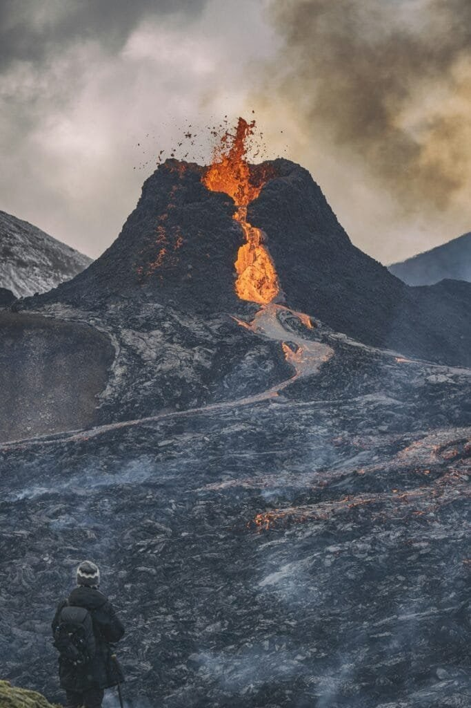

Have you ever wondered what you would do if you were caught in a volcanic eruption? Let's face it, while you might not live near an active volcano, volcanic eruptions are a force of nature that can still catch you by surprise in places you least expect. Understanding how to survive such an event can be crucial, especially if you're traveling or living in a susceptible area.

<iframe width="560" height="315" src="https://www.youtube.com/embed/Z-w_z9yobpE" frameborder="0" allow="accelerometer; autoplay; encrypted-media; gyroscope; picture-in-picture" allowfullscreen></iframe>

  

## Understanding Volcanic Eruptions

Volcanic eruptions are one of Earth's most dramatic and powerful displays of nature. They occur when magma, gas, and ash escape from an opening in the Earth's crust. Eruptions vary significantly in size and intensity, which makes each event distinct and, at times, unpredictable.

### The Science Behind It

Volcanoes are formed mainly at tectonic plate boundaries where plates are either colliding or moving apart. When magma from within the Earth's mantle makes its way to the surface, it results in an eruption. These fiery events can range from quiet lava flows to explosive detonations capable of altering weather patterns and, in historical instances, even climate.

### Types of Volcanic Eruptions

Understanding the types of eruptions can help you better anticipate their impact and prepare accordingly. There are generally four main types:

1. **Hawaiian:** These are relatively gentle eruptions characterized by the outpouring of very fluid lava.
2. **Strombolian:** Moderate eruptions with bursts of lava, ash, and gases. They're named after Stromboli, a volcano in Italy known for its frequent eruptions.
3. **Vulcanian:** These are more explosive and a bit more violent than Strombolian eruptions, with dense clouds of ash and volcanic fragments.
4. **Plinian:** Named after Pliny the Younger who witnessed the destruction of Pompeii, these are incredibly explosive, with massive columns of gas and ash.

## The Threats of a Volcanic Eruption

While many people picture lava as the primary threat, there are several dangers you need to be aware of:

### Lava Flows

Lava is molten rock that can level structures and reshape landscapes. Despite its dramatic appearance, lava flows are relatively slow, giving people time to evacuate, although they can cause devastating destruction to property.

### Ash Clouds

Volcanic ash is not just a nuisance but can be a serious health hazard. Inhaling ash can lead to respiratory issues and, when it accumulates, it can cause roofs to collapse and contaminate water supplies.

### Pyroclastic Flows and Surges

These are fast-moving currents of hot gas and volcanic matter that travel at incredibly high speeds and temperatures. They can incinerate everything in their path, making them one of the deadliest volcanic events.

### Lahars

Also known as volcanic mudflows, lahars are a mixture of water and volcanic ash that rush down the slopes of a volcano. They have the consistency of wet concrete and can crush and bury anything in their way.

### Volcanic Gas Emissions

Gases such as [carbon dioxide and sulfur dioxide can escape from a volcano](https://magmamatters.com/geothermal-energy-and-its-volcanic-origins/ "Geothermal Energy and Its Volcanic Origins") during an eruption. These gases can be deadly in high concentrations and can travel far from the eruption site, posing risks even to those not in immediate proximity.

## Preparing for a Volcanic Eruption

Preparation is key to surviving a volcanic eruption. Just as you would prepare for any other [natural](https://magmamatters.com/the-art-and-science-of-volcano-monitoring/ "The Art and Science of Volcano Monitoring") disaster, taking proactive steps can enhance your safety.

### Know Your Surroundings

If you live or are traveling near a known volcano, it's crucial to understand the volcano's history and its activity patterns. Local authorities often have resources and maps showing hazard zones, and staying informed can make all the difference.

### Have an Emergency Kit

Having an emergency kit on hand is essential. Here’s a basic list of what it should contain:

| Item | Purpose |
| --- | --- |
| Face masks and goggles | Protect from ash inhalation and eye irritation |
| Battery-powered radio | Stay updated on news and official instructions |
| Flashlight and extra batteries | Essential during power outages |
| First-aid kit | Address any injuries or health issues immediately |
| Bottled water | Ensure you have a clean drinking supply |
| Canned food and a can opener | Provide sustenance if you need to stay put |
| Important documents | Passport, insurance details, etc. |
| Sturdy shoes and clothing | Protect against rough and dangerous terrain |

### Have a Communication Plan

Establish a communication plan with family or traveling companions. Knowing how you’ll get in touch during and after an eruption can help ensure everyone’s safety.

## What to Do During a Volcanic Eruption

When a volcanic eruption begins, your immediate actions can affect your survival. Here’s a breakdown of what you should consider:

### Stay Informed

Keep listening to your battery-powered radio, as power outages might occur. Follow official advice and evacuation orders without delay.

### Avoid Declared Danger Zones

Never attempt to cross into areas marked as hazardous by authorities. Even if you feel safe, the unpredictability of an eruption can quickly change conditions.

### Protect Yourself from Ash

Wear a face mask and goggles to minimize the health impacts of ash. Indoors, keep windows and doors closed to avoid letting ash inside. If you need to be outside, try to limit your time there as much as possible.

### Evacuate If Ordered

Evacuation orders aren't made lightly; if instructed, leave the area immediately. Your safety is more valuable than any possessions left behind.

## Post-Eruption Safety Measures

The dangers don't end when the eruption does. What you do after an eruption is critical for your ongoing safety.

### Review Emergency Guidelines

Continue listening to local authorities for guidance and information. Do not return home until it's declared safe to do so.

### Clean Up Safely

If it's safe to return, wear protective clothing and masks during cleanup efforts. Volcanic ash can be irritating, and heavy accumulations may pose structural dangers.

### Check Your Home

Examine the integrity of your home’s structure. Volcanic eruptions can cause damage unseen to the naked eye, affecting foundations and other critical aspects of the building.

### Health Considerations

Seek medical attention for any unusual symptoms or prolonged exposure to ash and gases, especially if you feel short of breath or have persistent coughing.

### Report Damage

Inform local authorities of any damage to infrastructural elements, such as roads and bridges, to aid in recovery efforts.

## Final Thoughts on Volcanic Eruption Preparedness

While the power of nature can be intimidating, being well-prepared offers a peace of mind that allows you to face it more confidently. It's all about being informed, having a plan, and knowing you can rely on that plan when chaos might feel overwhelming. Keep these tips in mind, and remember: knowledge and preparation are your best defenses.
