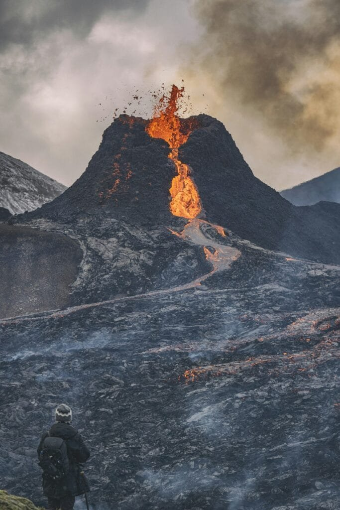

Have you ever wondered what you would do if you found yourself in the middle of a volcanic eruption? It's one of those unpredictable situations most of us don't imagine facing, yet knowing how to react can make all the difference. While the thought might seem far-fetched, understanding the basics of volcanic survival could prepare you for an unexpected encounter with nature’s powerful drama.

<iframe width="560" height="315" src="https://www.youtube.com/embed/Z-w_z9yobpE" frameborder="0" allow="accelerometer; autoplay; encrypted-media; gyroscope; picture-in-picture" allowfullscreen></iframe>

  

## Understanding Volcanic Eruptions

Before diving into survival tips, it's important to grasp what exactly a volcanic eruption involves. Volcanoes have fascinated humans for centuries because of their extraordinary beauty and power. A volcanic eruption happens when there is an explosion of lava and gas from a [volcano](https://magmamatters.com/geothermal-energy-and-its-volcanic-origins/ "Geothermal Energy and Its Volcanic Origins"). This is caused by a build-up of pressure beneath the Earth’s crust—imagine shaking a bottle of soda until it pops its top. Volcanoes are categorized based on their activity: active, dormant, or extinct.

### Types of Volcanoes

There are several types of volcanoes, each with unique characteristics. Knowing these can help you understand the severity of an eruption and what kind of risks it might pose to your health and safety.

- **Shield Volcanoes** are large, broad, and slightly domed structures formed from fluid lava flows. They have gentle slopes, making them less explosive.
- **Cinder Cone Volcanoes** are the smallest and have steeply angled sides. They are made from pyroclastic fragments ejected during eruptions.
- **Composite Volcanoes**, or stratovolcanoes, are characterized by a combination of explosive activity and lava flows. They are often symmetrical and pose significant eruption dangers.
- **Lava Domes** are formed by the slow eruption of viscous lava. They grow over time and can lead to explosive eruptions if they become overly pressurized.

Understanding the [type of volcano](https://magmamatters.com/understanding-volcanic-formation-a-comprehensive-guide/ "Understanding Volcanic Formation: A Comprehensive Guide") you're dealing with can help predict the volcanic activity and inform your response strategies.

### Signs of an Impending Eruption

Many volcanoes give off warning signs before they erupt. Being able to recognize these signals can provide you with precious time to enact a safety plan. Here are a few signs to watch for:

1. **Seismic Activity:** Small earthquakes often precede eruptions, indicating magma movement.
2. **Gas Emissions:** Increasing levels of [volcanic gases like sulfur dioxide](https://magmamatters.com/the-art-and-science-of-volcano-monitoring/ "The Art and Science of Volcano Monitoring") can signal an approaching eruption.
3. **Deformation:** Changes in the shape of the volcano, such as swelling or subsiding, suggest magma movement.
4. **Thermal Changes:** Rising ground temperatures can be a precursor to volcanic activity.

By monitoring these signs, volcanologists can offer predictions, but it’s always good to stay informed and aware if you live near or are visiting areas with active volcanoes.

## Preparing for a Volcanic Eruption

Preparation can significantly affect your ability to stay safe during a volcanic eruption. Whether you live near an active volcano or are simply on vacation, a proactive stance is always beneficial.

### Create an Emergency Plan

Developing a detailed emergency plan is an essential step in preparation. Your plan should include evacuation routes and communication strategies.

- **Evacuation Routes:** Identify the fastest and safest ways to exit your area. Ensure you have multiple options in case one route is blocked. Practice these routes regularly to ensure you can execute them without hesitation.
- **Communication Plan:** Establish how you will communicate with family or friends during an emergency. Keep a list of important contacts and consider using a designated out-of-town contact to help relay messages.

### Assemble an Emergency Kit

Preparing an emergency kit is critical in ensuring you have the necessary supplies if you must evacuate quickly. Your kit should be easy to carry and include:

- **Non-perishable Food and Water:** Aim for at least a three-day supply.
- **Protection Gear:** N95 respirator masks to protect against ash particles, sturdy footwear, and protective clothing.
- **First Aid Kit:** Include essential medications and basic first aid supplies.
- **Communication Devices:** A battery-powered or hand-crank radio, flashlight with extra batteries.
- **Multipurpose Tool and Personal Hygiene Items:** Such as baby wipes and hand sanitizer.

### Stay Informed

To stay ahead of potential volcanic eruptions, subscribe to alerts from local authorities or geological services. This way, you're informed of any changes that may affect your area. You should also be aware of the community's evacuation plans and shelters if needed.

## During a Volcanic Eruption

The moment a volcanic eruption begins is when preparedness meets action. What you do during an eruption can impact your survival and safety significantly.

### Immediate Actions to Take

Once an eruption begins, immediate protective measures should be your priority.

- **Seek Shelter:** If you're indoors, stay inside. Close doors and windows to prevent ash from entering. Place damp towels at the threshold of doors. If you are outside, seek shelter immediately.
- **Protect Airways:** Use a face mask or a cloth to cover your mouth and nose to avoid inhaling volcanic ash.
- **Evacuate if Advised:** If authorities instruct evacuation, do so promptly. Follow the simplest route to the pre-planned evacuation area.

Remember, volcanic ash is not just a nuisance—it’s an irritant and can cause respiratory problems and other health issues.

### Evacuate Safely

If evacuation becomes necessary, follow the plan you've set in advance. Take your emergency kit and avoid driving; roads might be impassable. Instead, walk or use bicycles if possible. Stick to evacuation routes and remain calm.

## After a Volcanic Eruption

Surviving the initial eruption is a relief, but post-eruption phases come with their own challenges. The aftermath involves dealing with ash fall, potential lahar flows, and disruptions to daily life.

### Assess and Clean Up

After the eruption subsides, you might be eager to return to your home. However, take a moment to assess your surroundings first.

- **Check for Damages:** Before entering buildings, look out for structural damage. Be cautious of weakened roofs due to heavy ash accumulation.
- **Cleanup:** Volcanic ash is abrasive and heavy. Use proper gear—goggles, masks, and gloves—and clean up the ash carefully. Avoid inhaling it and prevent dispersing it into the air again.

### Health and Safety

Ash from volcanic eruptions can cause both short and long-term health issues. Stay indoors as much as possible to avoid exposure.

- **Volcanic Ash Inhalation:** Long-term exposure can cause respiratory problems. Keep windows and doors closed, and use air filters if available.
- **Water and Food Safety:** Ensure that food and water are not contaminated by ash. Use boil advisories or bottled water if necessary.

### Psychological Impact

Experiencing a natural disaster can have significant psychological impacts. It’s completely normal to feel anxiety or stress afterward. Talk to friends, family, or professionals if you find yourself struggling with emotional aftereffects.

## Common Misconceptions About Volcano Safety

Like any disaster scenario, volcanic emergencies are ripe for myths and misunderstandings. Addressing these can help you respond more effectively.

### Myth 1: Volcanoes Erupt Without Warning

Many believe eruptions happen suddenly with no warning signs. While not entirely predictable, warning signs usually precede an eruption. Staying informed about these signs can greatly improve safety.

### Myth 2: Only Lava Flows Are Dangerous

Lava is one element of volcanic danger, but not the only one. Pyroclastic flows, ash fall, and lahar floods also pose significant risks. Each of these can cause damage and safety threats.

### Myth 3: If You’re Far From the Volcano, You’re Safe

Being miles away doesn’t guarantee safety from a volcanic eruption's effects. Ash clouds, for example, can spread over large distances and disrupt air travel and daily life miles away from the volcano.

## Conclusion

While volcanic eruptions are complex natural phenomena, preparing for them doesn’t have to be. By understanding the types of volcanoes, recognizing warning signs, and developing a personal emergency plan, you can increase your safety and readiness. Maintaining vigilance and staying informed through community and geological updates are practical steps you can take. Remember, having a plan is key — it’s your best tool to navigate the extraordinary challenge of surviving a volcanic event.
