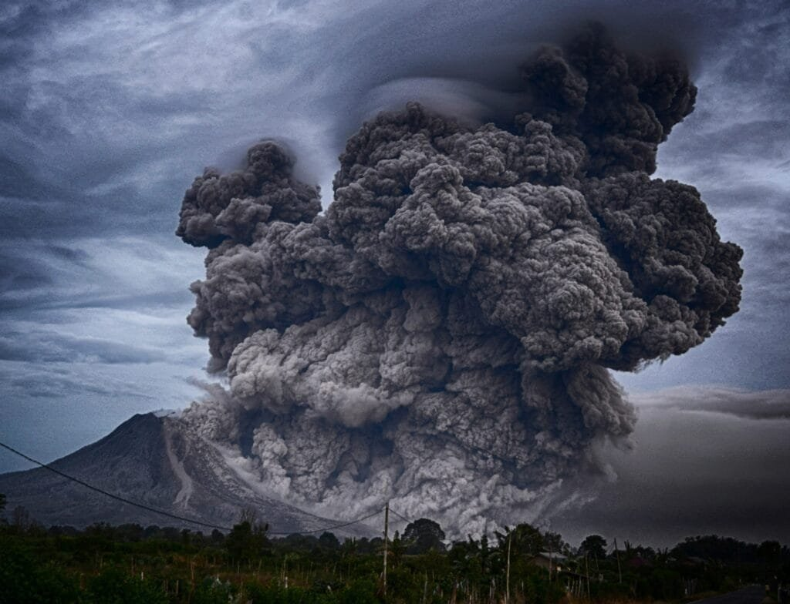

Have you ever wondered what you would do if a volcanic eruption suddenly threatened your area? It’s one of those scenarios that most people believe happens in far-off places until it happens closer to home. You might imagine that volcanoes are ancient behemoths, barely stirring in isolated regions, but in reality, volcanic activity is more common than we'd prefer to acknowledge. Understanding how to safeguard yourself and your loved ones during such an event is crucial, and knowing effective survival tips puts you one step ahead.

<iframe width="560" height="315" src="https://www.youtube.com/embed/Z-w_z9yobpE" frameborder="0" allow="accelerometer; autoplay; encrypted-media; gyroscope; picture-in-picture" allowfullscreen></iframe>

  

## Understanding Volcanic Eruptions

Let's start by taking a closer look at what a volcanic eruption actually entails. A volcano is essentially a vent in the Earth’s crust through which molten rock, ash, and gases escape. When pressure builds up, eruption occurs. These eruptions can be explosive, sending ash clouds high into the atmosphere, or effusive, with lava gently flowing out. Both types come with their own sets of hazards.

### Types of Volcanic Eruptions

There are different types of volcanic eruptions, each with distinct characteristics and associated risks. Understanding these can help you anticipate potential dangers.

- **Effusive Eruptions**: These involve the flow of lava. They're generally less deadly but can destroy anything in their path.
- **Explosive Eruptions**: These produce violent bursts of gas and ash. They’re potentially more dangerous due to pyroclastic flows and ashfall.
- **Mixed Eruptions**: A combination of explosive and effusive, where both lava flows and ash clouds are present.

Each type of eruption will require a different approach to safety and survival.

### The Anatomy of a Volcano

Appreciating the structure of a volcano helps in predicting potential hazards. A typical volcano consists of a magma chamber, a vent, and a crater. When an eruption occurs, magma from the chamber travels through the vent and exits at the crater. The eruptive material can include lava, volcanic ash, and various gases like sulfur dioxide.

### Signs of an Impending Eruption

No one likes surprises—especially not when it comes to volcanic eruptions. Here are some signs that may indicate an eruption is imminent:

- **Earthquakes**: Frequent tremors could signify magma movement.
- **Changes in Volcanic Gas Emissions**: Increases in sulfur [dioxide and carbon](https://magmamatters.com/geothermal-energy-and-its-volcanic-origins/ "Geothermal Energy and Its Volcanic Origins") dioxide emissions are telltale signs.
- **Ground Deformation**: Swelling or sudden changes in land surfaces can indicate magma buildup.
- **Volcanic Tremors**: These prolonged [seismic activities](https://magmamatters.com/the-art-and-science-of-volcano-monitoring/ "The Art and Science of Volcano Monitoring") are different from typical earthquakes and are often linked to volcanoes.

By staying attuned to these signs, you can better prepare for what's to come.

## Preparing for a Volcanic Eruption

Being well-prepared is half the battle won. Taking proactive steps before an eruption can make all the difference.

### Creating an Emergency Plan

Think of this as your roadmap in chaotic times. Your emergency plan should address:

1. **Evacuation Routes**: Know the safest paths out of your neighborhood.
2. **Meeting Points**: Arrange a rendezvous spot for family members away from the danger zone.
3. **Contact Lists**: Have emergency contacts, including local authorities, saved and accessible.

### Assembling an Emergency Kit

Your emergency kit is a lifeline during an eruption. Here's what you need to pack:

| Supplies | Purpose |
| --- | --- |
| Non-perishable food | Sustenance for several days |
| Water | At least one gallon per person per day |
| N95 Masks | Protects against inhaling volcanic ash |
| Battery-Powered Radio | Keeps you informed of the situation |
| Flashlight | In case of power outages |
| First Aid Kit | For treating injuries |
| Important Documents | ID, insurance papers, medical records |

The goal is to ensure you can survive independently for at least 72 hours.

### Protecting Your Home

While your safety comes first, protecting your home may help reduce damage.

- **Seal Windows and Doors**: Use duct tape or wet towels to prevent ash from entering.
- **Reinforce Roofs**: Ash is heavy and can cause roofs to collapse. Ensure your roof is sturdy.
- **Trim Trees and Clear Gutters**: This helps prevent damage from falling branches or ash buildup.

## During the Eruption

When an eruption begins, focus shifts from preparation to survival.

### Shelter In Place vs. Evacuation

Depending on the situation, authorities might advise sheltering in place or evacuating. Here's what each entails:

- **Sheltering in Place**: Stay indoors with windows and doors sealed. Use your emergency kit and listen for updates on the radio.
- **Evacuation**: Leave promptly and follow designated routes. Bring your emergency kit and be prepared for traffic delays.

### Navigating Ashfall

Volcanic ash is more than just a nuisance; it's a health hazard. Here’s how you can protect yourself:

- **Wear Protection**: N95 masks protect your lungs, and goggles shield your eyes.
- **Limit Exposure**: Stay indoors as much as possible.
- **Keep Vehicle Engines Off**: Ash can clog air filters and damage engines.

### Dealing with Lava Flows

While less common, understanding how to deal with lava flows could save your life.

- **Avoid Low-Lying Areas**: Lava will flow downhill, so higher ground is safer.
- **Follow Evacuation Orders**: Don't underestimate the speed at which the situation can change.

### Handling Landslides and Lahar

Lahar, a destructive volcanic mudflow, along with landslides, can occur even after the main eruption.

- **Know Your Terrain**: If you live near a river valley, be extra cautious.
- **Stay Alert**: Listen for unusual sounds of rushing water or landslides.

## After the Eruption

When the dust settles (literally), there's the aftermath to contend with. Re-entering the affected zone and dealing with damage requires careful navigation.

### Returning Home

Safety should remain your primary concern even as you return to your community.

- **Wait for Official Clearance**: Authorities will announce when it’s safe to return.
- **Check Your Home Structurally**: Look for visible damage and use caution entering.
- **Avoid Ash**: Clean ash from surfaces carefully to avoid health risks.

### Health Concerns

Ash and other pollutants can linger, posing health threats.

- **Respiratory Hazards**: Continue wearing masks outdoors.
- **Contaminated Water**: Wait for official confirmation that water is safe to drink. Boiling may not be sufficient if the water contains chemicals.

### Mental Health Support

Don't overlook the emotional toll such an event can take. Feeling overwhelmed is natural, and seeking support from professionals or community groups can be immensely beneficial.

## Long-term Preparedness

Volcanoes are unpredictable, so thinking about long-term preparedness is wise.

### Community Involvement

Working with your community can amplify your preparedness.

- **Organize Drills**: Practice evacuation routes and emergency reactions.
- **Share Resources**: Pool resources and knowledge to bolster community resilience.

### Staying Informed

Keeping updated on volcanic activity ensures you're not caught unaware.

- **Monitor Local Alerts**: Stay connected with your local geological agency.
- **Education**: Participate in workshops or training sessions about volcano safety.

### Revising Plans

Over time, circumstances change, and so should your plans.

- **Update Emergency Plans**: Regularly reassess your emergency plans and kits.
- **Upgrade Home Structures**: As possible, make structural upgrades to improve resistance against future eruptions.

Understanding the complex nature of volcanic eruptions and recognizing the smart steps to take during these events are your best allies. By being informed and prepared, you’re much better positioned to minimize risk and ensure the safety and well-being of yourself and those around you. You’ve learned comprehensive tips on preparation, immediate action, and post-eruption recovery. While you might not think about volcanoes daily, having this knowledge offers peace of mind and a clear course of action when it matters most.
