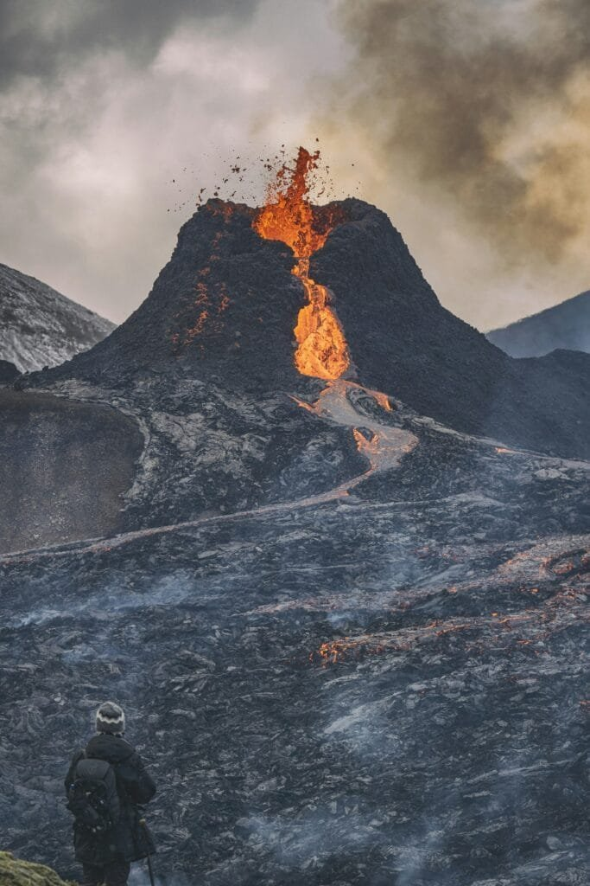

Have you ever paused to ponder why volcanic eruptions, despite their fierce and destructive nature, are considered vital to ecosystems? It sounds counterintuitive initially, but this volcanic activity plays an integral role in nurturing and transforming our planet in surprisingly positive ways. In our ever-changing world, understanding these powerful geological phenomena helps you appreciate their underlying importance. While volcanic eruptions often evoke images of molten lava and catastrophic events, they also weave intricate cycles of creation and renewal across diverse ecosystems.

<iframe width="560" height="315" src="https://www.youtube.com/embed/LQwZwKS9RPs" frameborder="0" allow="accelerometer; autoplay; encrypted-media; gyroscope; picture-in-picture" allowfullscreen></iframe>

  

## The Nature of Volcanic Eruptions

### What Happens During a Volcanic Eruption?

When a volcano erupts, it's essentially the earth's way of expressing intense geological pressure. Magma, the molten rock beneath the earth's surface, builds up and mingles with gases and minerals. As pressure mounts, the magma seeks an exit, resulting in an eruption. This event can range from explosive, sending ash clouds skyward, to a more gentle flow of lava. You may wonder how such a destructive event can foster life. It lies within the materials released.

### Types of Volcanic Eruptions

Different types of eruptions offer unique contributions and challenges:

| Type | Characteristics | Consequences |
| --- | --- | --- |
| **Effusive** | Gentle lava flow, fewer explosions | Creates new landforms and habitats |
| **Explosive** | Violent ejection of ash and debris | Alters climate, but enriches soil |
| **Phreatomagmatic** | Interaction of water and magma | Creates ash, steam, and new landforms |

Understanding these types helps you see the diverse impacts and benefits each carries.

## Soil Fertility and Volcanic Ash

### Enrichment of Soil Through Minerals

Volcanic soil is often considered among the most fertile once the initial devastation subsides. This fertility arises because volcanic ash is rich in minerals like potassium, phosphorus, and magnesium. These elements deeply enrich the soil, providing essential nutrients that many plants and agricultural crops rely upon for vigorous growth.

If you’re curious about why some of the world’s most famous wine regions, like those around Mount Etna in Italy, thrive, volcanic ash holds the answer. Grapevines growing in these volcanic soils often yield grapes with unique flavors, contributing to the distinct characteristics of the wines.

### Formation of New Land

Additionally, new land formed by lava flows offers a fresh slate for ecosystems. Over time, weather processes break down hardened lava into mineral-rich soil. This soil, rich with the nutrients once locked beneath the earth, becomes a fertile ground for pioneering plant species, beginning a new ecological tapestry.

## Ecological Succession: The Birth of New Ecosystems

### What is Ecological Succession?

If you’re imagining a barren lava terrain slowly blooming into vibrant greenery, then you're picturing ecological succession. This gradual process unfolds as organisms colonize and transform a barren landscape into a thriving ecosystem. Succession can happen surprisingly quickly in volcanic areas.

For example, consider Hawai’i, where new land continually forms from volcanic activity. Hardy plants start the process, creating a hospitable environment for other species. As vegetation establishes, a canopy develops, creating habitats for diverse wildlife.

### Stages of Succession in Volcanic Context

1. **Pioneer Stage**: Initial colonizers, like lichens and mosses, break down rocks, forming the first thin layer of soil.
2. **Intermediate Stage**: Grasses and small shrubs follow, building the soil layer further and setting the stage for more complex plants.
3. **Mature Stage**: Eventually, these areas can support lush forests or grasslands, home to diverse animal species.

It’s fascinating to witness how life can persist and flourish, suggesting resilience and adaptability inherent in nature itself.

## Volcanic Landscapes and Biodiversity

### Creating Unique Habitats

The dramatic landscapes formed by volcanic activity often support unique ecosystems that vary starkly from surrounding areas. These distinct habitats can house endemic species — creatures found nowhere else on Earth. Take the Galápagos Islands, born from volcanic activity, where you find species like the marine iguana that evolved to fit this unparalleled environment.

### Promoting Genetic Diversity

Volcanic islands present isolated pockets where species evolve rapidly due to distinct environmental pressures. This rapid evolution fosters genetic diversity crucial for species adaptation and survival, ultimately enriching global biodiversity.

## Climatic Influence of Volcanic Eruptions

### Short-Term Cooling

Volcanic eruptions can temporarily cool the planet. When explosive eruptions disperse aerosols and ash particles high into the atmosphere, they reflect sunlight, lowering global temperatures. While this effect is brief, it provides insight into Earth's complex climatic systems. For you, this underscores the delicate balance between geological events and global climate patterns.

### Long-Term Contributions to Greenhouse Gases

Conversely, eruptions also release [carbon dioxide](https://magmamatters.com/geothermal-energy-and-its-volcanic-origins/ "Geothermal Energy and Its Volcanic Origins") and water vapor, contributors to greenhouse effects in the long term. Yet, these emissions are substantially less than those from human activities. Understanding these dynamics can help you grasp the broader conversations about [climate changes and the natural](https://magmamatters.com/the-environmental-impact-of-volcanic-eruptions-2/ "The Environmental Impact of Volcanic Eruptions") influences amid human-induced factors.

## Volcanic Eruptions and Human Civilization

### Cultural and Historical Significance

Throughout history, volcanoes have shaped civilizations. Some ancient societies venerated them as gods or harbingers of doom. A reminder of nature’s immense power, these erupts often forced communities to innovate or adapt, fostering resilience still evident today.

### Natural Laboratories and Economic Benefits

Modern society benefits economically and scientifically from volcanoes. Geothermal energy, sourced from volcanic activity, offers renewable energy solutions. Meanwhile, volcanic regions serve as powerful natural laboratories for geologists, ecologists, and researchers studying climate change and natural resource management.

## Living in Harmony with Volcanoes

### Risk Management and Preparedness

While volcanic activity will always pose risks, communities continue to develop sophisticated [monitoring technologies](https://magmamatters.com/the-art-and-science-of-volcano-monitoring/ "The Art and Science of Volcano Monitoring") and preparedness strategies. These measures minimize loss of life and property, highlighting our capability to coexist cautiously yet harmoniously with geological phenomena.

### Thriving Amid Challenges

Communities in volcanic regions often boast resilience and adaptability. Living near a volcano isn’t just about survival; it can also mean thriving due to the fertile lands and unique resources these environments offer. For those who choose to dwell in such settings, it’s about drawing strength and opportunity from what might otherwise seem a constant threat.

## Final Thoughts

So, you see, volcanic eruptions, far from being mere destructive forces, are cyclical events that contribute significantly to Earth’s ecosystems. Whether through creating fertile grounds, fostering unique habitats, or influencing climate, these breathtaking phenomena are intrinsic to life’s rich tapestry. Each eruption tells a story of destruction and rebirth, reminding us of Earth’s enduring capacity for renewal and wonder. By understanding the vital roles eruptions play, you begin to see them not as enemies but as agents of change, helping sustain the planet's ecological balance.
