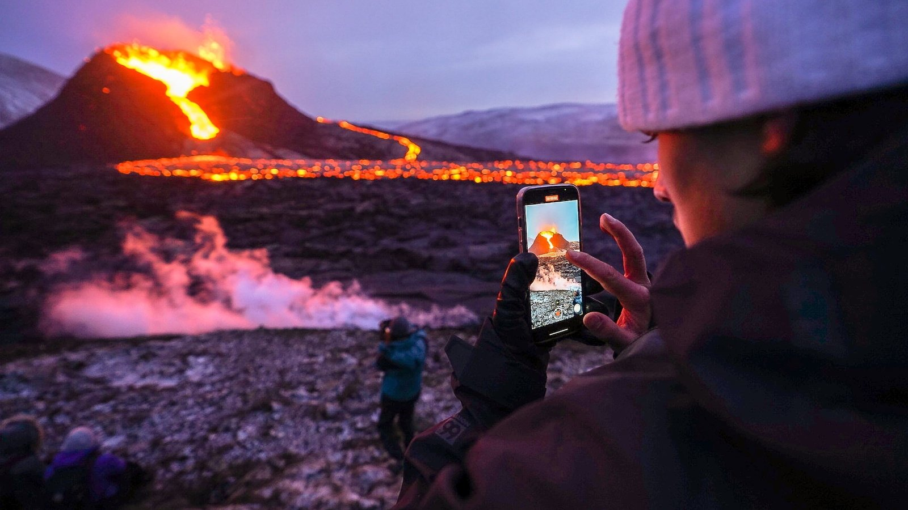
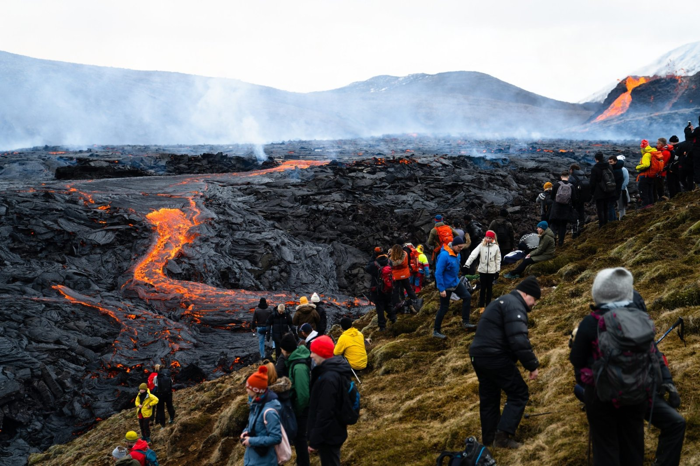
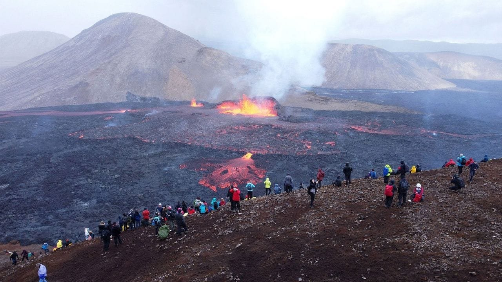
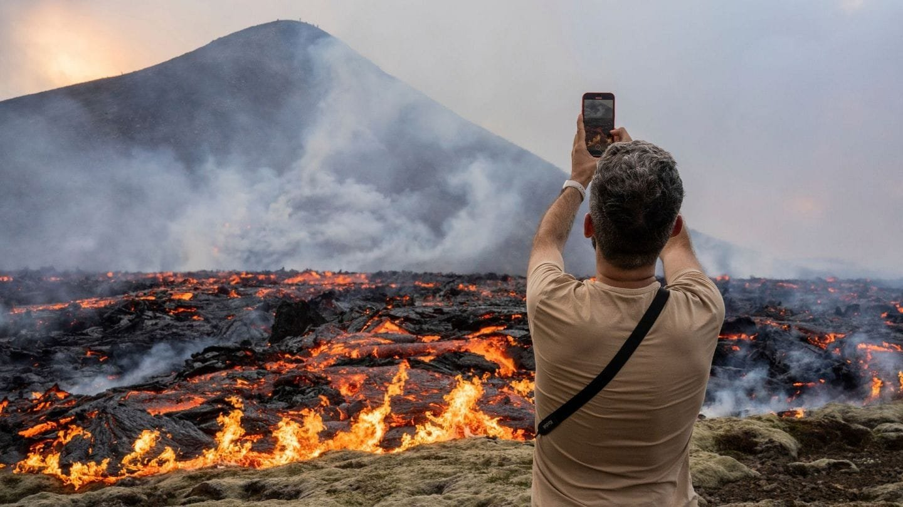

Have you ever wondered what draws tourists to the dramatic spectacle of volcanic eruptions? It's a curious phenomenon—one that blends the awe of witnessing nature's raw power with the thrill of unpredictable beauty. You might think it counterintuitive for people to deliberately seek out potentially dangerous events, yet volcanic tourism is flourishing around the globe. Let’s explore why this is the case and what it is about these fiery mountains that captivate our imaginations.

<iframe width="560" height="315" src="https://www.youtube.com/embed/sdCOz_oWvvc" frameborder="0" allow="accelerometer; autoplay; encrypted-media; gyroscope; picture-in-picture" allowfullscreen></iframe>

  

## The Allure of Mother Nature's Fury

Imagine standing on the edge of a landscape transformed by rumbling forces beneath the earth's crust. The sheer power and majesty of a volcanic eruption can evoke a profound sense of respect and wonder. It's this interplay between danger and beauty that attracts you—and countless others—to volcanic hotspots around the world.

### A Dance of Danger and Beauty

[Volcanoes are not only natural](https://magmamatters.com/the-environmental-impact-of-volcanic-eruptions-2/ "The Environmental Impact of Volcanic Eruptions") wonders but also grand performers in nature’s theater. They provide a rare glimpse into the workings of our planet. When you see molten lava flowing like a river of fire or witness the sky painted with volcanic ash, you're experiencing something extraordinary. These are moments that remind you of nature’s untamed spirit and its unparalleled ability to awe and humble us.

### The Unpredictable Allure

What could be more spellbinding than the unpredictability of an erupting volcano? You never quite know when the next eruption will occur or what form it might take. This unpredictability feeds into the human attraction to thrilling experiences. While safety is always a concern, modern technology often allows us to safely study and visit these [natural phenomena](https://magmamatters.com/the-art-and-science-of-volcano-monitoring/ "The Art and Science of Volcano Monitoring") from a calculated distance, drawing tourists who crave a taste of adventure.

## The Science Behind the Eruptions: Education and Understanding

Part of the fascination with [volcanic eruptions is rooted in science](https://magmamatters.com/geothermal-energy-and-its-volcanic-origins/ "Geothermal Energy and Its Volcanic Origins"). Volcanoes are windows into the Earth’s interior, and the study of these geological giants can offer insights into the natural processes that shape our world. When you visit a volcanic site, you're not just seeing a natural spectacle; you're also engaging with scientific exploration.

### Interactive Learning

Many volcanic sites offer more than just visual experiences. You can participate in guided tours led by geologists who explain the complex processes behind eruptions. These tours often include exhibits and educational centers that provide you with a deeper understanding of volcanic activity and its impact on our planet. It's a chance to feed your curiosity and leave with a richer appreciation of Earth's geological wonders.

### Citizen Science Opportunities

This interaction with science isn't just passive. Some locations encourage you to engage in citizen science projects. Imagine collecting rock samples, participating in seismic measurements, or even documenting wildlife patterns affected by eruptions. This active participation can not only satisfy your curiosity but also aid researchers in gathering valuable data.

## A Cultural Perspective: Myths, Legends, and Traditions

Volcanoes have held a place of significance in many cultures throughout history. They are often seen as sacred and are deeply embedded in local myths and legends. If you delve into these narratives during your visit, you'll gain insight into how people have tried to explain and personify the powerful forces of nature that govern their lives.

### Myths and Legends

Across different cultures, volcanoes have been attributed with divine powers and are often depicted in folklore as manifestations of the gods. For example, Hawaii's volcanoes are closely tied to Pele, the goddess of fire. Her stories, encompassing themes of creation and destruction, add layers of meaning to the landscape. As you hear these tales, you might gain a unique perspective on the human attempt to understand and rationalize the unfathomable.

### Local Traditions and Practices

Volcanic regions often have long-standing traditions and practices that reveal how communities adapt to living in proximity to such unpredictable forces. You might witness ceremonies or rituals aimed at appeasing the volcano or ensuring the safety of the community. These cultural elements can enrich your volcanic exploration, adding depth and context to what might otherwise be a simple visit to a geological site.

## The Tourism Impact: Economic and Environmental Considerations

Volcanic tourism is not just about thrill and exploration. It also has significant economic and environmental implications for the regions surrounding these natural giants. As an informed traveler, it's helpful to consider how your visit can positively impact the local economy while minding the environmental footprint you leave behind.

### Economic Boon

For many communities, volcano-related tourism provides a crucial economic boost. Visiting these regions helps support local businesses, from hotels and restaurants to artisan shops and tour guides. It offers employment opportunities and can lead to improved infrastructure and living conditions. Your visit can contribute to sustenance and growth in these areas, transforming natural wonder into a source of livelihood.

### Balancing Sustainability

With the influx of tourists comes the challenge of managing environmental impacts. Preserving the natural beauty and ecological balance of volcanic areas is paramount. Many tour operators and local governments now implement sustainable tourism practices. As a visitor, you can support these by following guidelines, participating in eco-friendly tours, and minimizing waste. Ensuring that future generations have the same opportunities to experience these wonders is a collective responsibility.

## Famous Volcanic Destinations and Their Unique Appeals

From the glowing fjords of Iceland to the lush slopes of Hawaii, famous volcanic destinations offer varied and unique experiences. Each location has its own set of attractions, blending natural beauty with cultural and scientific vibrancy that can cater to different interests.

### Mt. Etna, Italy

Located on the island of Sicily, Mt. Etna is one of the most active volcanoes in the world. It offers a dramatic landscape of stark, ashy expanses interspersed with verdant green vineyards. Here, you can explore hiking trails around the craters and taste local wines produced with the help of mineral-rich volcanic soil. The city of Catania at its base provides historical and cultural experiences that round out your visit.

### Kilauea, Hawaii

Home to the legendary volcano goddess Pele, Kilauea is a must-see for those seeking a blend of natural spectacle and ancient lore. The nearby Hawaii Volcanoes National Park offers hiking and observation points, where you can safely witness lava flows while pondering the cultural stories tied to this mighty volcano. By night, the glow of the caldera is a magical sight that stays with you long after your journey ends.

### Iceland's Volcanic Landscape

In Iceland, the land of fire and ice, you'll find some of the most stunning volcanic landscapes on Earth. Here, volcanic activity dramatically shapes the terrain, creating geothermal hot springs, geysers, and fields of barren lava rock. This unique landscape offers a wealth of outdoor adventures, from hiking to hot spring bathing. Iceland’s dense folklore related to its volcanic features enriches the experience, offering you a glimpse into how islanders have historically lived with and revered these fiery mountains.

## Safety First: Mitigating Risks for Tourists

While the allure of volcanic sites is undeniable, safety must remain a top priority. As a traveler seeking the awe of active volcanoes, understanding potential risks and adhering to safety guidelines ensures a rewarding and secure experience.

### Risk Awareness

With any natural phenomenon, there are inherent risks. It's crucial to stay informed about the current activity status of any volcano you plan to visit. Many sites provide real-time updates and alerts on volcanic activity, allowing you to adjust your plans accordingly.

### Safety Protocols

Tour operators and national parks following rigorous safety measures ensure visitor safety. Always heed advice concerning restricted areas, maintain a safe distance from active sites, and be aware of possible evacuation routes. Preparing for your trip by packing essential safety gear, like sturdy footwear and protective masks, can also enhance your readiness.

### Role of Technology

Modern technology plays a pivotal role in ensuring safe volcanic tourism. Seismographs, satellite observations, and early warning systems contribute to safer visits, offering timely alerts that prevent potential hazards. Staying updated through technological means—like mobile alerts—adds a layer of security to your exciting adventure.

## The Emotional Resonance of Volcanic Adventures

Perhaps one of the most lasting impacts of a volcanic tour is the emotional resonance it leaves with you. There's something deeply moving about standing in front of Earth’s raw power, feeling both infinitesimal and deeply connected to the broader tapestry of life and natural forces.

### Personal Reflection and Growth

When you witness such raw natural energy, it often prompts profound personal reflection. You might find yourself contemplating your place within this vast universe. Such experiences can foster a sense of humility and reverence, reminding you of nature’s grandeur and the lessons it holds about resilience, transformation, and renewal.

### Forming Human Connections

Sharing the adventure with fellow travelers can forge deep connections. When you’re collectively experiencing the grandeur of a volcanic eruption, these moments create a sense of camaraderie. The memories formed during these shared experiences often lead to rich conversations and friendships grounded in mutual amazement and respect for nature.

## Conclusion: Why You Can't Help But Be Drawn In

Volcanic tourism, with its miraculous mix of awe-inspiring danger, educational opportunities, and cultural insights, beckons with an irresistible lure. As you weigh the risks, rewards, and responsibilities, it’s easy to see why so many are drawn to these enigmatic landscapes. Whether it’s the raw beauty or the whisper of ancient lore, volcanoes hold a timeless attraction. They offer an exploration at the intersection of natural wonder and human curiosity—a dance of unpredictability and adventure that continues to draw you in, time and time again.

