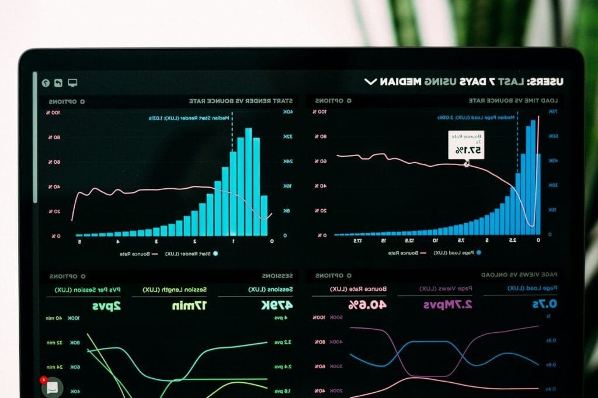

What is it about volcanoes that captures human imagination and attention? Is it their awe-inspiring power or the mysterious way they emerge from the earth’s core? For centuries, these fiery mountains have both fascinated and threatened us, leading to the development of sophisticated techniques to monitor their behavior. As much a blend of art as it is a science, volcano monitoring is an essential field that focuses on predicting eruptions and understanding the immense forces at work beneath our feet.

## Understanding Volcano Monitoring

Volcano monitoring is the systematic observation and analysis of volcanic activity. Professionals in this field dedicate their efforts to gathering, interpreting, and synthesizing data to predict volcanic eruptions and mitigate associated risks. This process is pivotal for the safety of populations living near active volcanoes and for advancing our scientific understanding of volcano dynamics.

### The Importance of Monitoring Volcanoes

Why is it crucial to monitor volcanoes? Primarily, it's about safety. Capturing early warning signs of volcanic eruptions can save lives, reduce economic damage, and guide emergency responses. Beyond safety, monitoring offers insights into geological processes on Earth, contributing to our broader understanding of planetary science.

### Components of Volcano Monitoring

From observing small seismic tremors to analyzing gas emissions, a range of methods is employed. These components include seismology, ground deformation measurements, gas emissions monitoring, thermal imaging, and more. Each technique provides a unique perspective on volcanic behavior, and together, they form a comprehensive picture of a volcano's state.

## Seismology in Volcanology

Seismology plays a critical role in volcano monitoring. By studying the seismic waves produced by volcanic activity, scientists can infer changes and potential hazards.

### How Seismic Activity Indicates Eruption

Increased seismic activity can signal that magma is moving toward the surface, suggesting an impending eruption. Seismographs are deployed around volcanoes to record and analyze these movements, offering vital clues.

### Types of Seismic Signals

Different kinds of seismic signals are indicators of various volcanic behaviors. High-frequency earthquakes, low-frequency tremors, and volcanic tremor all provide different information about the magma movement and pressure changes within a volcano.

### Using Seismic Data for Early Warning

Interpreting seismic data accurately can help provide early warnings of eruptions. By coupling seismic observations with other monitoring methods, scientists can enhance prediction accuracy and issue timely alerts to affected communities.

## Ground Deformation: Reading Earth’s Movements

Volcanoes can subtly modify the ground they reside on, and monitoring these changes is essential for understanding volcanic activity.

### Techniques for Measuring Ground Deformation

Instruments like GPS, InSAR (Interferometric Synthetic Aperture Radar), and tiltmeters are employed to detect and measure ground deformation. These technologies help scientists observe the swelling or sinking of a volcano, indicating magma movement.

### Real-World Application of Ground Deformation Data

Ground deformation data can reveal the ongoing processes beneath a volcano's surface. For instance, the inflation of a volcanic dome is often a precursor to an eruption, providing critical time for preparedness and evacuation.

## Gas Emissions: The Breath of a Volcano

Volcanic gases, although unseen, offer significant insights into a volcano's behavior and potential for eruption.

### Types of Emissions and What They Indicate

Volcanoes emit several gases, including water vapor, carbon dioxide, sulfur dioxide, and more. Variations in these emissions can signal changes in a volcano's activity, aiding prediction efforts.

### Monitoring Gas Levels

Analyzing gas emissions involves using instruments like spectrometers and gas sensors to capture and study the quantities and types of gases being released. Remote sensing from satellites can also monitor these emissions on a large scale.

## Thermal Imaging: Seeing Volcanoes in a New Light

Observing the thermal signatures of volcanoes can provide important information about their activity.

### How Thermal Imaging Works

Using infrared cameras and sensors, scientists can detect thermal anomalies that suggest active lava or changes in geothermal activity.

### Applications in Eruption Prediction

Thermal imaging can indicate rising magma levels or increased geothermal activity, both of which might suggest an upcoming eruption. This tool is especially useful for monitoring volcanoes in remote or inaccessible areas.

## Advanced Techniques: The Future of Volcano Monitoring

As technology advances, so too do the methods employed in volcano monitoring, offering new ways to enhance accuracy and reliability.

### Satellite Monitoring

Satellites equipped with various sensors can observe volcanoes from space, providing data on atmospheric gas levels, surface temperatures, and even small ground deformations.

### Drones and Unmanned Aerial Vehicles (UAVs)

Drones are increasingly utilized to observe volcanoes from closer vantage points without risking human life. They can capture high-resolution images, conduct thermal surveys, and collect gas samples.

### Machine Learning and Data Analysis

Computational techniques and artificial intelligence are revolutionizing how data is analyzed and interpreted, allowing for more precise eruption forecasts by identifying patterns and correlations that might not be obvious to the human eye.

## The Art of Interpretation: Combining Data for Comprehensive Insights

With multiple data streams, the role of the volcanologist is to interpret this information cohesively and accurately.

### Integrating Data Sources

By integrating seismology, deformation, gas emissions, and thermal data, scientists can construct a multi-faceted view of a volcano's behavior, much like putting together pieces of a complex puzzle.

### Challenges Faced

Despite technological advancements, interpreting volcano data remains challenging due to the complex, dynamic nature of volcanic systems. Continued research and the development of more refined models are essential.

### The Role of Volcanologists

These experts play a crucial role in synthesizing data and making informed decisions. Their work often involves collaboration with local authorities and communities to implement safety procedures and evacuation plans when necessary.

## Real-World Impact: Case Studies of Successful Monitoring

Examining past examples of effective volcano monitoring showcases the importance and impact of this work.

### Mount St. Helens, USA

In 1980, seismic data and ground deformation observations were critical in understanding the volcano’s activity, allowing scientists to predict its catastrophic eruption, though with limited accuracy at the time.

### Eyjafjallajökull, Iceland

In 2010, advanced monitoring techniques enabled scientists to study the interactions between magma and glacial ice. Despite the eruption causing significant disruption, the information gathered provided valuable insights for future events.

### Merapi, Indonesia

Regular seismic and deformation monitoring at Mount Merapi has been crucial for issuing timely warnings, helping to manage risks effectively for the surrounding densely populated regions.

## Moving Forward: The Future of Volcano Monitoring

As we look to the future, the continuous evolution of techniques and technologies promises to improve our understanding and management of volcanic risks.

### Promising Research Areas

Future research is likely to focus on refining prediction models, enhancing remote sensing capabilities, and developing cost-effective monitoring tools for volcanoes worldwide.

### Global Collaboration and Knowledge Sharing

International cooperation will be vital in advancing volcano monitoring practices. Sharing data and expertise across borders can enhance global preparedness and response strategies.

## Conclusion

[Volcano monitoring represents a fascinating interplay between art and science](https://magmamatters.com/geothermal-energy-and-its-volcanic-origins/ "Geothermal Energy and Its Volcanic Origins"). By embracing both cutting-edge technology and profound expertise, we can better predict eruptions and protect those living in their shadow. As we continue to refine our techniques and broaden our understanding, the future holds promise for even more accurate forecasts and safer communities.

## Related Resources

For further exploration of the intriguing world of volcanoes, consider the following resources:

- Academic journals on geophysics and volcanology
- Online courses and lectures offered by universities
- Volcano observatories and their publications
- Documentaries and educational channels focused on Earth sciences

Through these resources, immerse yourself deeper into understanding one of Earth's most powerful natural phenomena: volcanoes. You might find that the art and science of volcano monitoring is an ever-evolving field, rich with discovery and innovation. Through dedicated study and exploration, the potential to unlock the mysteries that lie beneath our feet is limitless.
